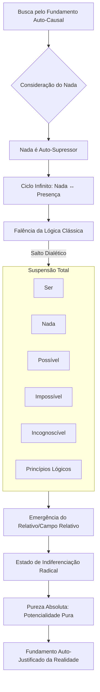
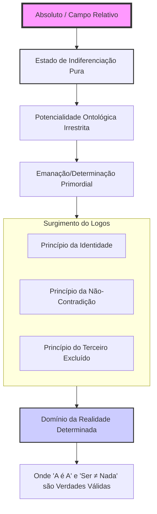
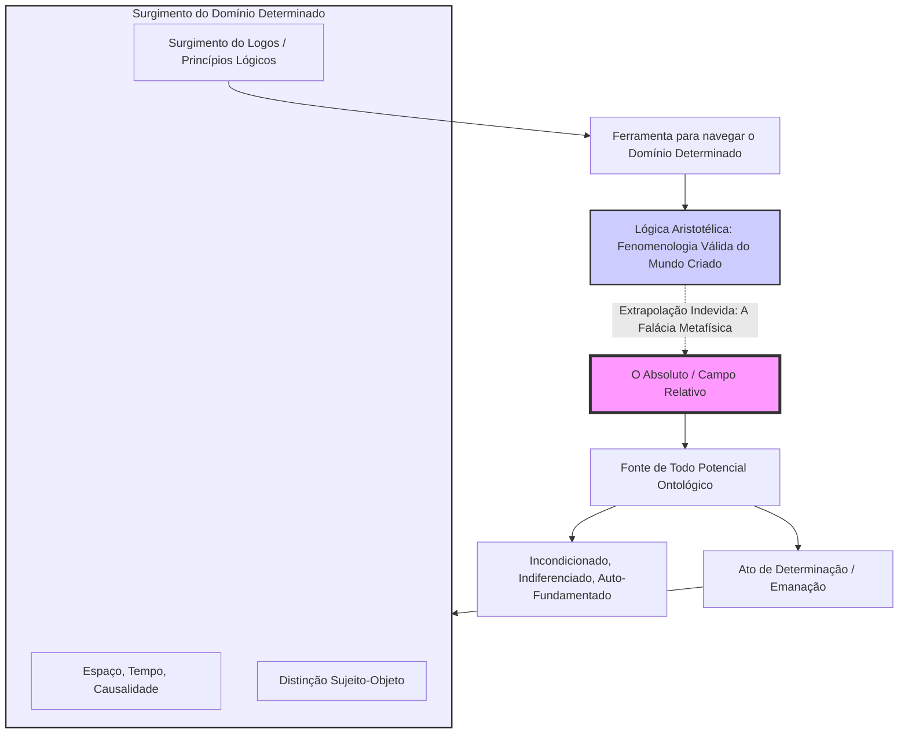

# **O EVANGELHO METAFÍSICO**

### **CAPÍTULO 1: OS ALICERCES DA LÓGICA**

#### **§ 1.1 – O Contexto Histórico e a Necessidade de um *Organon***

A fundação da lógica como disciplina sistemática é obra de Aristóteles (384-322 a.C.), desenvolvida em resposta às limitações percebidas na filosofia platônica. Enquanto Platão orientava a investigação para o mundo transcendente das Ideias ou Formas, Aristóteles buscou estabelecer um método formal para o pensamento correto acerca do mundo real — um *organon* (ferramenta) para a ciência e a demonstração.

Sua partida de Atenas após a morte de Platão (347 a.C.) e seus estudos biológicos em Assos e Lesbos foram decisivos. A observação de estruturas e padrões naturais levou-o à intuição fundamental de que **assim como há uma ordem na *physis* (natureza), deve haver uma ordem correspondente no *logos* (pensamento e linguagem)**. Esta correlação entre a estrutura do real e a estrutura do pensamento racional constitui o princípio gerador da lógica formal.

#### **§ 1.2 – A Sistematização no *Organon***

De volta a Atenas, no Liceu, Aristóteles sistematizou sua descoberta no *Organon*, um conjunto de seis tratados. Foi neste *corpus* que ele estabeleceu de forma axiomática os **três princípios fundamentais do raciocínio lógico**, alicerces incontornáveis de todo pensamento válido:

1.  **Princípio da Identidade (A = A):**
    > *“ἕκαστον δὲ αὐτὸ αὑτῷ ταὐτόν”* (“Cada coisa é idêntica a si mesma.”)
    Um ente é definido por sua própria essência. É a condição de possibilidade para todo conhecimento, garantindo a invariabilidade ontológica de um conceito.

2.  **Princípio da Não-Contradição (¬(A ∧ ¬A)):**
    > *“ἀδύνατον ἅμα εἶναι καὶ μὴ εἶναι τὸ αὐτὸ καὶ κατὰ τὸ αὐτό”* (“É impossível que a mesma coisa, ao mesmo tempo, pertença e não pertença a uma mesma coisa sob um mesmo aspecto.”)
    É o princípio supremo da consistência sincrónica. Se algo é verdadeiro, a sua contraditória é, *ipso facto*, falsa. A realidade não admite contradições simultâneas.

3.  **Princípio do Terceiro Excluído (A ∨ ¬A):**
    > *“ἀνάγκη ἢ φάναι ἢ ἀποφάναι”* (“É necessário afirmar ou negar.”)
    Toda proposição declarativa possui um, e apenas um, valor de verdade: verdadeiro ou falso. Não existe uma terceira opção lógica, estabelecendo uma avaliação definitiva e atemporal.

#### **§ 1.3 – Impacto e Lacuna**

Estes princípios tornaram-se o fundamento da racionalidade ocidental, permitindo o desenvolvimento da ciência empírica, do direito formalizado e, posteriormente, das ciências da computação. Aristóteles, portanto, não se limitou a observar o mundo; **ele forjou a ferramenta cognitiva definitiva para que o mundo pudesse ser observado, analisado e compreendido com rigor**. Ao fazê-lo, erigiu a lógica como a ponte indestrutível entre o *logos* interior (pensamento) e o *logos* exterior (realidade estruturada).

No entanto, uma análise crítica revela que esta estrutura, embora necessária, é **suficiente apenas para uma descrição atemporal ou sincrónica da realidade**. O Princípio da Identidade define a essência, mas permanece mudo sobre a **persistência dessa identidade através do fluxo temporal**. Esta lacuna — a ausência de um princípio que regule a identidade *no* e *ao longo do* tempo — é o ponto de partida para a expansão metafísica que se segue.

### **CAPÍTULO 2: DA LÓGICA CLÁSSICA À ONTOLOGIA TEMPORAL**
#### **§ 2.1 – Análise Crítica dos Princípios: A Questão Temporal**

Uma análise profunda dos princípios lógicos fundamentais—**Identidade, Não-Contradição e Terceiro Excluído**—revela que sua aparente auto-evidência oculta uma distinção crucial entre **atemporalidade e temporalidade**, distinção esta essencial para qualquer metafísica que pretenda descrever a realidade em seu devir.

#### **§ 2.2 – Reinterpretação Ontológica dos Princípios**

1.  **O Princípio da Identidade (A = A)** estabelece a essência invariável de um ente, mas opera exclusivamente num plano **atemporal**. Ele define **o que algo é** em sua própria natureza, abstraindo completamente de sua permanência ou mudança no fluxo do tempo. É uma condição estática e eterna.

2.  **O Princípio da Não-Contradição (¬(A ∧ ¬A))** introduz, ainda que implicitamente, uma **dimensão temporal**. A cláusula "ao mesmo tempo" é fundamental. Este princípio não proíbe que um ente seja A em um momento e não-A em outro; ele garante a impossibilidade de um ente **assumir estados ontologicamente opostos simultaneamente**. É uma lei de **consistência sincrónica**.

3.  **O Princípio do Terceiro Excluído (A ∨ ¬A)** opera em um contexto que exige uma **decisão definitiva**. Ele afirma que, para qualquer proposição bem-formulada, não há um estado intermediário entre ser verdadeira e ser falsa. Este princípio exige um veredito final, posicionando-se assim numa dimensão **atemporal de avaliação definitiva**.

#### **§ 2.3 – A Lacuna Temporal e a Necessidade de um Quarto Princípio**

Observa-se que o Princípio da Não-Contradição e o Princípio do Terceiro Excluído são, na verdade, manifestações de uma mesma exigência ontológica de consistência, porém em dimensões distintas: uma **dinâmica (temporal)** e outra **estática (atemporal)**, respectivamente.

O Princípio da Identidade, por sua vez, define a essência mas permanece mudo sobre a **persistência dessa identidade através do fluxo temporal**. Esta lacuna revela a ausência de um **princípio lógico-temporal** que assegure a **não confusão entre entes distintos ao longo do tempo**. Como garantir que um ente que muda permaneça o *mesmo* ente? Como evitar que a mudança, sem uma lei que a discipline, não conduza a uma absoluta indeterminação ontológica?

A pura lógica atemporal de Aristóteles é necessária, mas não suficiente, para descrever um mundo em que os entes persistem e se modificam. Faz-se necessária a formulação de um princípio complementar que regule a identidade *no* e *ao longo do* tempo. Esta é a fundação sobre a qual se construirá a suma metafísica.

[^1]: Paráfrase do conceito presente em **Aristóteles, *Metafísica*, Livro IV (Gamma), 1006a**.
[^2]: **Aristóteles, *Metafísica*, Livro IV (Gamma), 1005b19-20**.
[^3]: **Aristóteles, *Metafísica*, Livro IV (Gamma), 1011b24**.
[^4]: **Aristóteles, *Metafísica*, Livro I (Alpha), 980a21**.

#### **§ 2.4 – Introdução ao Princípio da Não-Disformidade (¬(A = B))**

Para preencher definitivamente a lacuna identificada, propõe-se aqui o **Princípio da Não-Disformidade**. Este princípio funciona como o **correlato temporal necessário do Princípio da Identidade**. Se a Identidade garante que **A é A** num sentido absoluto e atemporal, a Não-Disformidade assegura que **A não pode tornar-se B** sem, com isso, deixar de ser A e perder sua própria determinação ontológica. É a lei que protege a individualidade no fluxo do devir.

##### **Síntese Conceitual:**
1.  O **Princípio da Não-Disformidade (¬(A = B))** estabelece a identidade persistente de um ente ao longo do tempo, assegurando que A não pode, em nenhum momento, ser identificado como B, um ente de essência distinta.
2.  O **Princípio da Identidade (A = A)**, seu par atemporal, estabelece a essência invariável de um ente, definindo **o que algo é** em si mesmo, abstraindo completamente de sua trajetória temporal.

##### **Fundamentos Ontológicos:**
1.  **Distinção Radical entre Entes:** Um ente **não pode transmutar-se em outro** sem uma violação catastrófica de sua identidade. A mudança (de acidentes) é possível; a transmutação (de substância), não.
2.  **Preservação da Individualidade:** A **continuidade temporal** de um ente exige que ele **não se confunda com outro**, mesmo em diferentes estados ou estágios de sua existência.

#### **§ 2.5 – A Necessidade do Princípio da Não-Disformidade**

##### **A Identidade Requer uma Defesa no Tempo**
-   A **Identidade** declara *"A é A"* (definição estática e imutável).
-   A **Não-Disformidade** declara *"A não é e não pode se tornar B"* (proteção dinâmica contra a dissolução ontológica).
-   Sem este princípio, abrem-se portas para absurdos metafísicos como *"Sócrates é Platão"* ou *"este círculo é um quadrado"*, onde identidades distintas se misturam, tornando todo conhecimento e comunicação impossíveis.

#### **§ 2.6 – Conclusão do Capítulo: A Simetria dos Princípios Lógicos**

O **Princípio da Não-Disformidade** é, portanto, **a contraparte temporal indispensável do Princípio da Identidade**. Enquanto a **Identidade** afirma *o que algo é*, a **Não-Disformidade** protege *o que algo não é e não pode vir a ser*. Isso não apenas **preenche uma lacuna crítica na lógica clássica**, mas também **fortalece e expande a estrutura metafísica** ao erradicar ambiguidades entre entes distintos no fluxo do tempo.

Em suma, a integridade do real é sustentada por um par de forças lógicas:
-   **Identidade (Atemporal):** *"A = A"* → Define a essência.
-   **Não-Disformidade (Temporal):** *"¬(A = B)"* → Garante a permanência e não confusão da essência.

Esta reformulação torna a lógica intrinsecamente mais robusta para lidar com problemas de **mudança, identidade persistente e distinção categórica**, preparando o terreno para uma metafísica capaz de descrever a realidade dinâmica.

### **Tabela 2.1: Classificação Sistêmica dos Princípios Lógicos Fundamentais**

| **Categoria Relacional** | **Princípio Atemporal**          | **Princípio Temporal**              | **Função Primária**                          |
|--------------------------|----------------------------------|-------------------------------------|----------------------------------------------|
| **Ser vs. Não-Ser**      | Terceiro Excluído **(A ∨ ¬A)**   | Não-Contradição **(¬(A ∧ ¬A))**     | Garantir a determinação e consistência truth-value |
| **Ser vs. Outro**        | Identidade **(A = A)**           | **Não-Disformidade (¬(A = B))**     | Garantir a individuação e distinção ontológica |

### **Síntese Final da Estrutura Lógica:**

A análise demonstra que os princípios lógicos fundamentais organizam-se de forma simétrica em dois eixos relacionais distintos, cada um com uma manifestação atemporal e outra temporal:

1.  **Eixo Ontológico (Ser/Não-Ser):**  
    -   **Atemporal:** **Terceiro Excluído (A ∨ ¬A)**. Define o campo de possibilidades lógicas definitivas.
    -   **Temporal:** **Não-Contradição (¬(A ∧ ¬A))**. Garante a consistência sincrónica dos estados de um ente.

2.  **Eixo Identitário (Ser/Outro):**  
    -   **Atemporal:** **Identidade (A = A)**. Define a essência invariável de um ente.
    -   **Temporal:** **Não-Disformidade (¬(A = B))**. Garante a integridade diacrónica de um ente, protegendo-o da confusão com outro.

Esta estrutura revela uma **simetria lógica profunda** e completa, integrando **temporalidade e ontologia** num sistema coerente e fechado. O **Princípio da Não-Disformidade** surge, assim, não como um acréscimo opcional, mas como um pilar necessário para garantir a **integridade dos entes no domínio do tempo**, complementando definitivamente a lógica clássica com a sua dimensão dinâmica missing.

### **CAPÍTULO 3: OS PRINCÍPIOS CAUSAIS METAFÍSICOS**
#### **§ 3.1 – A Dupla Fundamentação da Realidade**

A aplicação da estrutura lógica previamente estabelecida ao domínio da causalidade revela que toda realidade contingente exige uma **dupla fundamentação necessária e irredutível**: uma para a sua **existência** e outra para a sua **identidade**. Esta análise causal eleva os princípios lógicos do plano do pensamento para o plano do ser.

1.  **Causa Existencial:** Responde à questão fundamental: *"Por que A existe em vez de não-existir?"*
    -   Situa-se no plano da **efetividade ontológica**, correspondendo à dimensão dinâmica dos princípios do Terceiro Excluído e da Não-Contradição.

2.  **Causa Identitária (ou Essencial):** Responde à questão determinativa: *"Por que A é precisamente A e não outra coisa?"*
    -   Reflete o plano da **essência atemporal**, vinculando-se diretamente ao Princípio da Identidade e, por extensão, ao da Não-Disformidade.

Esta distinção radical demonstra que a causalidade não se aplica apenas ao surgimento e à permanência dos entes (causa existencial), mas igualmente à sua **determinação essencial específica** (causa identitária). Enquanto a primeira garante *que* algo persista no ser, a segunda explica *o que* esse algo é em sua natureza intrínseca e por que permanece sendo *isso*.

#### **§ 3.2 – Os Quatro Princípios Causais Metafísicos**

Os quatro princípios causais, assim formulados, constituem um sistema completo e autoconsistente de fundamentação metafísica, onde toda realidade encontra sua **razão suficiente** (*ratio sufficiens*) tanto no plano da existência quanto no da essência.

| Princípio Causal                  | Formulação                                                                 | Equivalente Lógico                          | Âmbito de Aplicação       |
|-----------------------------------|----------------------------------------------------------------------------|---------------------------------------------|---------------------------|
| **1. Causa Existencial**          | Tudo que existe tem uma causa que explica por que existe em vez de não existir. | Princípio do Terceiro Excluído **(A ∨ ¬A)** | Fundamentação da Existência |
| **2. Causa Existencial Continuada** | Tudo que persiste no ser tem uma causa que sustenta sua existência.        | Princípio da Não-Contradição **(¬(A ∧ ¬A))** | Persistência da Existência |
| **3. Causa Identitária**          | Tudo que existe tem uma razão para ser *o que é* e não de outra forma.     | Princípio da Identidade **(A = A)**         | Fundamentação da Essência   |
| **4. Causa Identitária Continuada** | Tudo que persiste no ser tem uma causa que sustenta sua identidade.        | Princípio da Não-Disformidade **(¬(A = B))** | Persistência da Essência    |

Este quadro sistêmico demonstra que a pergunta metafísica fundamental — *"Por que há algo em vez de nada?"* — desdobra-se necessariamente em duas: *"Por que este algo *existe*?"* e *"Por que este algo é *isto*?"*. A resposta completa demanda uma causa para ambas as dimensões.

### **CAPÍTULO 4: O ABSOLUTO COMO HORIZONTE METAFÍSICO**
#### **§ 4.1 – O Conceito de Absoluto como Fundamento**

A investigação metafísica, guiada pelos princípios lógicos e causais, culmina necessariamente no conceito de **Absoluto** – a categoria primordial que representa o limite último da razão e o horizonte final de todo conhecimento filosófico. Como instância suprema de inteligibilidade, o Absoluto não só unifica todos os níveis da realidade, desde suas raízes ontológicas até suas manifestações fenomenológicas, mas também define os próprios parâmetros transcendentais do que pode ser pensado.

Ao examinar sua natureza, emergem três categorias radicais que antecedem e fundamentam até mesmo noções como "ente" ou "essência":
1.  **Possibilidade:** O domínio do pensável, conforme delimitado pelas leis lógicas.
2.  **Impossibilidade:** O domínio do impensável, aquilo que viola as leis lógicas.
3.  **Incognoscível:** O domínio que transcende inteiramente a estrutura do pensamento e da linguagem.

#### **§ 4.2 – O Mapa da Realidade Cognoscível e Transcendente**

O **cognoscível** – esfera onde opera a razão discursiva – subdivide-se, portanto, em:
-   **Possível:** Aquilo que é ontologicamente realizável, estando em perfeito alinhamento com as estruturas lógicas.
-   **Impossível:** Aquilo que é ontologicamente irrealizável, por encontrar-se em contradição interna com tais estruturas (e.g., um círculo quadrado).

Já o **incognoscível** radical escapa a esta dicotomia, constituindo um limite intransponível para a conceituação racional. Enquanto a razão pode mapear e definir o possível e o impossível (ambos ainda formas de cognoscibilidade, ainda que por negação), o verdadeiramente incognoscível só se pode revelar através de vias não-discursivas:
-   **Experiência direta** (via intuitiva ou mística).
-   **Sentimento humano fundamental** (via existencial, como o *mysterium tremendum et fascinans*).

Esta distinção fundamental estabelece a arquitetura última do conhecimento:
-   A **Razão** opera exclusivamente no âmbito do **cognoscível** (seja possível ou impossível).
-   O **Mistério Absoluto** pertence ao domínio do **incognoscível**, acessível apenas pela experiência transcendente, além das categorias lógicas e das relações causais que sustentam o pensamento metafísico.

> *"O último passo da razão é reconhecer que há uma infinidade de coisas que a ultrapassam."*
> — Blaise Pascal, *Pensées*

#### **§ 4.3 – Os Domínios Ontológicos Fundamentais: Possibilidade e Impossibilidade**

A análise do Absoluto exige o mapeamento preciso dos domínios do pensável e do existente. Estes domínios são definidos pela sua relação com os princípios lógicos estabelecidos, formando a estrutura básica de toda a realidade cognoscível.

### **O Domínio da Possibilidade: A Esfera da Existência Lógica**

**Definição Ontológica:**
A Possibilidade constitui o conjunto de todos os estados de coisas cuja estrutura essencial não viola os princípios lógicos fundamentais (Identidade, Não-Contradição, Terceiro Excluído e Não-Disformidade). É o reino da **coerência metafísica realizável**.

**Características Essenciais:**
-   **Coerência Lógico-Estrutural:** Exibe consistência interna absoluta e compatibilidade externa com o sistema integral de princípios metafísicos.
-   **Estrutura Determinada:** Possui contornos essenciais claramente definíveis e inteligíveis.
-   **Relacionabilidade Sistemática:** Pode estabelecer conexões harmônicas e hierárquicas com outras possibilidades dentro do espaço metafísico.

**Graus de Cognoscibilidade:**
1.  **Plenamente Cognoscível:** Entes matemáticos e lógicos ideais (e.g., um círculo, um triângulo), cuja essência é perfeitamente apreensível pela razão pura.
2.  **Parcialmente Cognoscível:** Objetos físicos e fenômenos naturais (e.g., um átomo, uma estrela), sujeitos às limitações da investigação empírica.
3.  **Cognoscível por Analogia:** Realidades metafísicas superiores e atributos divinos (e.g., bondade, verdade, beleza), acessíveis apenas através de raciocínio analógico a partir de suas manifestações.

**Implicação Metafísica:** Tudo o que é possível pertence ao domínio do **Lógico**, um subconjunto ativo e ordenado do Absoluto, onde a existência se manifesta de forma inteligível e estruturada. Um círculo é uma realidade geométrica possível porque sua definição — "uma figura plana com todos os pontos equidistantes de um centro" — é internamente coerente e não contém contradição.

### **O Domínio da Impossibilidade: A Esfera da Existência Ilógica**

**Definição Ontológica:**
A Impossibilidade constitui a classe de entes ou proposições cuja própria definição essencial constitui uma violação direta e irredutível dos princípios lógicos fundamentais. É o reino da **contradição metafísica irrealizável**.

**Status Metafísico:**
-   **Não é a mera negação do possível:** É uma categoria positiva de incoerência.
-   **Funciona como limite intrínseco:** Revela os contornos definitivos do espaço metafísico possível, demarcando a fronteira do pensável.
-   **É formalmente reconhecível:** Podemos identificar e nomear a contradição lógica que o define, ainda que seu conteúdo essencial seja ininteligível.

**Graus de Cognoscibilidade (ou melhor, de *Ininteligibilidade*):**
1.  **Reconhecível Formalmente:** A contradição lógica pode ser identificada e articulada (sabemos *por que* é impossível).
2.  **Ininteligível Essencialmente:** Não pode ser concebido como conteúdo positivo ou coerente pela mente humana.
3.  **Delimitador Transcendental:** Serve como termo de comparação que mostra os limites absolutos do pensamento coerente.
4.  **Mentalização Parcial:** Podemos mentalizar isoladamente os elementos que compõem a impossibilidade (e.g., um círculo e um quadrado), mas a síntese dos elementos contraditários em um único conceito coerente falha irremediavelmente.

#### **§ 4.4 – Tipologia da Impossibilidade: A Violação dos Princípios**

A análise da impossibilidade revela sua natureza através de violações específicas:

**1. Contradições Explícitas (Violação Direta dos Princípios Lógicos)**
-   *Exemplo Paradigmático:* "Círculo quadrado".
-   **Violação da Não-Contradição (¬(A ∧ ¬A)):** Um círculo, por definição, *não possui vértices ou lados retos*, enquanto um quadrado, necessariamente, *possui quatro vértices e quatro lados retos*. Afirmar que algo é simultaneamente "círculo (não-quadrado) e quadrado (não-círculo)" é uma contradição lógica direta.
-   **Violação da Não-Disformidade (¬(A = B)):** A essência de um círculo (curva contínua, sem ângulos) é radicalmente incompatível com a de um quadrado (quatro segmentos retos, quatro ângulos). Portanto, um ente não pode **tornar-se** ou **ser identificado como** ambos sem deixar de ser um deles, violando a lei da persistência da identidade.
-   **Consequência Ontológica:** Como a definição do "círculo quadrado" exige a coexistência de propriedades mutuamente excludentes, ele não apenas *não existe* em nosso universo, mas **não pode existir** em nenhum mundo metafisicamente possível. Sua existência destruiria os alicerces da realidade inteligível.

**Implicação Metafísica Radical:** A Impossibilidade não é um mero "nada" ou ausência. Ela representa um **limite lógico intrínseco e imanente ao próprio Absoluto**. No entanto, em sua natureza totalizante e transcendente, o Absoluto não está rigidamente restrito ao que é atualmente possível *para a razão finita*. Em sua plenitude inefável, pode conter a potência de transcender, dissolver ou ressignificar o impossível, transformando-o em um novo fundamento para a existência que, para nós, permanece eternamente fechado no mistério.

#### **§ 4.5 – O Domínio da Incognoscibilidade: A Transcendência Radical**

**Definição Ontológica:**
A Incognoscibilidade constitui a dimensão do real que excede permanentemente qualquer estruturação conceitual, seja ela plena ou parcial, permanecendo além dos aparatos lógicos, ilógicos e linguísticos. É o domínio metafísico que se situa além da capacidade de conceptualização, representação ou idealização racional.

**Modos de Manifestação:**
- **Transcendência Positiva:** Aquilo que é "mais que o fenômeno" (o Bem em Platão, que está "além da essência" - _ἐπέκεινα τῆς οὐσίας_)
- **Transcendência Negativa:** Aquilo que escapa a toda determinação (Deus em Mestre Eckhart, o "Deus além de Deus")
- **Transcendência Dialética:** Aquilo que se revela através do colapso dos conceitos (o Absoluto hegeliano como processo auto-revelatório)

**Epistemologia da Incognoscibilidade:**
1. **Via Negativa (_Via Negationis_):** Só pode ser abordado pelo que não é
2. **Experiência Limite:** Acessível apenas em estados cognitivos excepcionais
3. **Efeitos Derivados:** Reconhecível apenas por suas consequências no domínio do cognoscível

**Características Essenciais:**
- **Inacessível à razão pura:** Não pode ser deduzido, demonstrado ou descrito por estruturas lógicas ou linguagem discursiva
- **Sujeito à experiência direta:** Sua única via de aproximação é a intuição imediata ou a vivência não-conceitual
- **Não-idealizável:** Não pode sequer ser mentalizado de forma aproximada ou difusa

**Exemplo Paradigmático:** A natureza última do Absoluto enquanto pura presença não predicável, que só pode ser apreendida (se é que pode) por uma via extrarracional, como certas tradições religiosas e místicas sugerem.

**Status Ontológico:** O incognoscível não é um "nada", mas um **modo de ser inapreensível** pelos instrumentos convencionais do pensamento, marcando o limite onde a lógica clássica cede lugar a outras formas de apreensão da realidade.

#### **§ 4.6 – A Arquitetura Ontológica Fundamental: Relação entre os Domínios**

A análise revela uma estrutura hierárquica que não é meramente classificatória, mas manifesta a própria arquitetura ontológica da realidade:

1. **Cognoscível** (Absoluto racionalizável)
   ↓
2. **Possível** (realidade estruturada)
   ↓
3. **Impossível** (limite do possível)
   ↓
4. **Incognoscível** (limite do racionalizável)

**Significado Ontológico:**
- O **Cognoscível** revela os limites do Absoluto mentalizável
- O **Possível** manifesta-se como ordem no seio do Absoluto
- O **Impossível** surge como limite interno da possibilidade
- O **Incognoscível** surge como limite interno do racionalizável

#### **§ 4.7 – O Incognoscível como Negatividade Radical e Horizonte Estrutural**

O incognoscível define-se por sua **negatividade radical** — não pelo que é, mas **pelo que não é**: não é o cognoscível, não é o pensável, não é o que se deixa capturar por conceitos ou estruturas lógicas. É o domínio que escapa a toda determinação positiva, o limite intransponível do Absoluto quando abordado pela razão discursiva.

Sua natureza não é meramente "o ainda não conhecido", mas **o que resiste intrinsecamente à conceptualização**. Sua presença não representa uma falha no sistema do conhecimento, mas um **horizonte estrutural** — aquilo que, por essência, não se deixa reduzir às categorias do pensamento. Não é ausência, mas **excesso**; não é vazio, mas **plenitude inexprimível**.

#### **§ 4.8 – Os Limites da Razão e a Integridade Epistemológica**

A investigação filosófica do Absoluto concentra-se necessariamente no **cognoscível**, a esfera onde a razão opera com ferramentas lógicas e metafísicas. Isso não implica que o incognoscível seja irrelevante; pelo contrário, sua admissão é **condição para uma epistemologia honesta**. Reconhecer o incognoscível é aceitar que o conhecimento racional, por mais amplo que seja, não esgota a magnitude do real.

A incorporação do incognoscível no Absoluto não é uma concessão ao irracional, mas um **gesto de humildade intelectual**. Ele marca a fronteira onde a razão, após mapear o possível e o impossível, encontra seu término — não por incapacidade, mas porque ali começa o domínio do que só pode ser **experienciado, intuído ou vivido**, nunca plenamente conceituado.

#### **§ 4.9 – Conclusão: A Complementaridade Essencial**

A admissão do incognoscível não enfraquece a filosofia; pelo contrário, **fortalece-a ao evitar reducionismos**. Se o cognoscível é o campo da razão, o incognoscível é o lembrete de que a realidade ultrapassa qualquer sistema. Essa dualidade não é contraditória, mas **complementar** — como a luz que, ao mesmo tempo que revela, projeta sombras onde a visão não alcança.

Reconhecer o incognoscível não invalida a investigação filosófica do Absoluto em seu âmbito cognoscível; antes, confere-lhe integridade epistemológica ao demarcar os limites intrínsecos da razão. Essa admissão não representa resignação, mas consciência metafísica: compreende-se que o entendimento sistemático, por mais abrangente, permanece aberto à transcendência — não como falha, mas como horizonte necessário do pensamento.

> _"O que não podemos falar, temos que calar."_
> — Ludwig Wittgenstein, _Tractatus Logico-Philosophicus_, 7

### **CAPÍTULO 5: A CAUSALIDADE NO ABSOLUTO COGNOSCÍVEL**
#### **§ 5.1 – O Absoluto como Princípio Irredutível**

Ao examinarmos os princípios causais à luz do Absoluto - compreendido em sua plenitude ontológica como síntese transcendente de possibilidade e impossibilidade - alcançamos o fundamento último da investigação metafísica. Neste nível radical de análise, o Absoluto se revela como:

-   **O *Prius* Metafísico Incontornável:** A condição de possibilidade transcendental para toda cadeia causal e todo ente contingente.
-   **O Solo Ontológico Integral:** Que contém em si, de modo eminente, tanto o possível (domínio da existência lógica) quanto o impossível (limite intrínseco da realidade).
-   **O Fim da Regressão Causal:** Onde toda busca por fundamentação encontra seu termo final necessário.

#### **§ 5.2 – A Natureza Autofundante do Absoluto**

O Absoluto possui uma natureza **autofundante** que transcende as categorias convencionais de causalidade:

-   **Não admite causa externa:** Pois transcende radicalmente a dicotomia interno/externo.
-   **Causalidade constitutiva:** Sua "causalidade" é de outra ordem - não temporal ou eficiente, mas constitutiva e transcendental.
-   **Causa sui ampliada:** Funciona como *causa sui* na tradição espinosista, porém radicalmente ampliada para abarcar toda a realidade possível e impossível.

#### **§ 5.3 – Hierarquia dos Níveis de Causalidade**

A análise revela uma estrutura hierárquica de causalidade:

| Nível de Realidade | Tipo de Causalidade      | Exemplo                          | Relação com o Absoluto         |
|--------------------|--------------------------|----------------------------------|--------------------------------|
| **Absoluto**       | Causalidade Constitutiva | Fundamento de toda realidade     | Auto-fundante                  |
| **Possível**       | Causalidade Formal/Estrutural | Leis matemáticas, princípios lógicos | Derivada e sustentada          |
| **Físico**         | Causalidade Eficiente    | Fenômenos naturais, eventos temporais | Mediata e contingente          |

#### **§ 5.4 – Implicações Metafísicas Cruciais**

1.  **Término da Regressão:** Toda busca por fundamentação termina necessariamente no Absoluto.
2.  **Derivação Causal:** As "causas" no interior do possível derivam sua força causal deste fundamento último.
3.  **Dissolução dos Limites:** O impossível marca os limites onde a causalidade convencional se dissolve no mistério do Absoluto.

**Conclusão Metafísica Fundamental:**
O Absoluto não é um elemento a mais na cadeia causal - é o solo ontológico que torna possível qualquer causalidade. Seu estatuto único exige que o concebamos não como causa no sentido habitual, mas como:

> _"A condição transcendental que simultaneamente possibilita e transcende todas as relações causais particulares"_

Esta compreensão nos liberta da busca infinita por causas anteriores, revelando que toda fundamentação encontra seu termo final nesta realidade primordial.

#### **§ 5.5 – A Autodeterminação Absoluta**

A causalidade no Absoluto manifesta-se como **autodeterminação radical**:

-   **Causalidade Absoluta:** O Absoluto não apenas contém a possibilidade e a impossibilidade, mas também **determina sua própria estrutura**, fazendo com que a distinção entre elas seja, em última instância, uma manifestação de sua autodeterminação.
-   **Consequência Metafísica:** Qualquer tentativa de explicar a origem ou natureza do possível ou impossível deve partir do Absoluto como princípio inquestionável, pois ele é a única noção que não requer uma causa externa.

### **Tabela 5.1: Atributos Constitutivos do Absoluto**

| **Atributo**         | **Definição**                                                                 | **Implicação Metafísica**                                                                 |
| -- | -- | -- |
| **Incondicionado**   | Não depende de nenhum princípio ou ente externo para existir ou ser o que é.  | Elimina regressão infinita; fundamento último.                                            |
| **Omniabrangente**   | Nada lhe é exterior; até mesmo o "nada" só pode ser concebido como categoria interna a ele. | Totalidade metafísica; não há "fora" ou "alternativa" ao Absoluto.                        |
| **Metadeterminante** | Estabelece as condições de inteligibilidade para todos os demais níveis de realidade.       | Origem de toda lógica, matemática e estrutura racional.                                   |

#### **§ 5.6 – As Propriedades Essenciais do Absoluto**

##### **1. Autofundamentação**
-   **Definição:** Refere-se à causa primeira da existência do Absoluto.
-   **Características:**
    -   Encontra sua razão suficiente em sua própria natureza necessária e auto-subsistente.
    -   Não depende de nada externo, anterior ou paralelo a si para existir.
    -   **Não é contingente** - não poderia não existir.
-   **Propriedade Essencial:** Causa integral de si mesmo.
    -   Se o Absoluto dependesse de algo externo, não seria absoluto. Qualquer dependência externa anularia sua condição absoluta.

##### **2. Autodeterminação**
-   **Definição:** Refere-se à capacidade do Absoluto de definir sua própria natureza.
-   **Aspectos Constitutivos:**
    1.  **Autoexistência:** Ser presente em si mesmo - o Absoluto deve estar em si mesmo para ser o agente ativo da determinação.
    2.  **Autonomia:** Poder sobre si mesmo - o Absoluto deve ter o domínio sobre si para que haja autodeterminação.
    3.  **Autoconsciência:** Conhecimento de si mesmo - o Absoluto deve conhecer totalmente a sua estrutura para que haja ação autocausada.
-   **Implicações:**
    -   Explica como o Absoluto mantém identidade (não é caótico ou aleatório).
    -   Mostra que o Absoluto não é apenas um "Ser estático", mas um Ser ativo que se autogoverna.
    -   Fundamenta a liberdade metafísica (possibilidade de escolha no nível Absoluto).

##### **3. Autocontinuidade**
-   **Definição:** Refere-se à capacidade do Absoluto de se sustentar em seu fundamento e determinação.
-   **Características:**
    -   Persistência ativa (não apenas existência passiva).
    -   Garante que o Absoluto não se dissolva na inexistência.
    -   Mostra que a existência não é um ato único, mas um processo contínuo de autossustentação.
-   **Conclusão:** Sua existência, permanência e identidade são **autocausadas, autodeterminadas e autocontinuadas**.

#### **§ 5.7 – Síntese Final: O Absoluto como Fundamento Integral**

A análise causal revela que o Absoluto é:
1.  **Auto-fundamentado** (não contingente)
2.  **Auto-determinado** (não heterônomo)  
3.  **Auto-continuado** (não decadente)

Esta tríade de propriedades constitui a essência mesma do Absoluto enquanto fundamento último de toda realidade. Não faria sentido buscar uma fundamentação anterior ou mais primitiva, pois o Absoluto, enquanto síntese de possibilidade e impossibilidade, é o **conceito primeiro e irredutível** – a base sobre a qual toda a realidade se sustenta.

> _"Tudo que é, é no Absoluto; e o Absoluto é em si mesmo."_
> — Paráfrase de Baruch Spinoza, _Ética_

#### **§ 5.8 – A Natureza Pessoal do Autocausal**

A análise das propriedades autocausais do Absoluto conduz inevitavelmente a uma conclusão radical: a autocausalidade pura exige personalidade. Como estabelecido anteriormente, o Absoluto possui autoconhecimento, autodomínio e autodeterminação em grau máximo. Estas propriedades, em sua plenitude, constituem precisamente o que reconhecemos como **personalidade** ou "Espírito do Absoluto".

> _"Se uma realidade precisa definir a si mesma, essa realidade só pode estar viva, pois não há nada externo, paralelo ou anterior a ela para determiná-la — é ela que detém o poder de escolher a si própria."_

Ao contrário de concepções impessoais do Absoluto, a autocausalidade exige:

-   **Liberdade metafísica radical:** Capacidade de autodeterminação sem condicionamentos externos de qualquer natureza.
-   **Consciência integral:** Conhecimento imediato e completo de sua própria essência e atos.
-   **Vontade unificada:** Atividade direcionada a si mesma como fim último e bem supremo.

Estes atributos diferenciam radicalmente o Absoluto de:
1.  **Forças impessoais** (como energia cósmica ou campos quânticos)
2.  **Princípios abstratos** (como leis matemáticas ou lógicas)
3.  **Substâncias inertes** (como matéria bruta ou substância indiferenciada)

#### **§ 5.9 – O Absoluto como Presência Autofundante**

O Absoluto, enquanto realidade autocausal, transcende conceitos convencionais como "energia" e "nada", manifestando-se primordialmente como **Presência**. Esta presença não é um mero estado ontológico estático, mas uma **atividade autofundante** que contém em si os princípios de:

1.  **Auto-manifestação** (existência por si mesma, não derivada)
2.  **Auto-apropriação** (posse plena e domínio de sua própria natureza)
3.  **Auto-transparência** (conhecimento imediato de si como fundamento)

Desta tríade surge o que denominamos **Espírito Absoluto** - a forma mais pura e radical de pessoalidade, onde ser, conhecer e agir coincidem numa unidade indissolúvel e perfeita.

#### **§ 5.10 – A Superação da Dicotomia Fenômeno/Nada**

A autocausalidade espiritual resolve o falso dilema metafísico entre:

-   **Fenomenalização** (redução do Absoluto a suas manifestações particulares)
-   **Nihilização** (negação do Absoluto como puro vazio ou ausência)

Através de uma terceira via radical: **a Presença Pura** que:
-   Existe por essência (não dependendo de manifestação para ser)
-   É plenamente positiva (não definida por negação ou carência)
-   Mantém-se em ato permanente (sem potencialidade não realizada)

#### **Tabela 5.2: A Estrutura do Espírito Absoluto**

| Atributo Pessoal | Expressão Autocausal               | Diferencial Metafísico                       |
|------------------|------------------------------------|----------------------------------------------|
| **Autoconhecimento** | Causa que se conhece como causa         | Supera a causalidade cega ou impessoal           |
| **Autodomínio**      | Causa que se possui totalmente          | Transcende a dispersão ou fragmentação ontológica |
| **Autodeterminação** | Causa que se escolhe a si mesma         | Rompe com mecanicismos e determinismos           |

#### **§ 5.11 – Conclusão: O Absoluto como Espírito Pessoal**

Esta análise demonstra de forma inequívoca que:

1.  **A autocausalidade pura exige personalidade:** Não pode haver autocausalidade sem autoconhecimento, autodomínio e autodeterminação.
2.  **O Absoluto não é "algo" (objeto), mas "Alguém" (Sujeito absoluto):** Sua natureza é mais adequadamente compreendida como pessoal do que como impessoal.
3.  **A noção de Espírito capta melhor esta realidade que:**  
    - Conceitos impessoais (como "Energia universal")  
    - Abstrações vazias (como "O Nada")  
    - Metáforas físicas (como "Fonte cósmica")

Portanto, a autocausalidade nos conduz necessariamente à concepção do Absoluto como **Espírito Pessoal** - realidade viva, consciente e livre que fundamenta toda a existência.

> _"Deus é Espírito; e importa que os que o adoram o adorem em espírito e em verdade."_
> — João 4:24

#### **§ 5.12 – Fundamento Autocausal e a Noção de "Presença"**

O Absoluto, enquanto realidade autocausada, não requer justificação externa — nem pelo "nada", nem pela fenomenalidade, nem por qualquer categoria derivada. Sua existência é autoevidente em sua **autofundamentação**, **autodeterminação** e **autocontinuidade**. Esta tríade causal revela uma natureza que transcende a mera abstração conceitual, apontando para uma **presença ontológica primordial**.

-   **Presença ≠ Fenômeno:**
    -   A "presença" aqui não é uma aparição ou manifestação empírica (como no fenômeno), mas a **condição necessária da autocausalidade em ato**.
    -   Enquanto o fenômeno depende de um observador ou estrutura de manifestação, a presença do Absoluto é **auto-referente** e **auto-suficiente**.

-   **Presença ≠ Nada:**
    -   O "nada" é uma negação conceitual, enquanto a presença do Absoluto é **afirmação pura** — não como algo "existente" no sentido contingente, mas como **fundamento imanente de si mesmo**.

#### **§ 5.13 – A Personalização do Absoluto como Espírito**

Se a autocausalidade implica **autoconhecimento**, **autodomínio** e **autopresença**, então o Absoluto não é uma força impessoal, mas um **princípio pessoal** em seu nível mais radical. Definimos essa pessoalidade metafísica como **Espírito**:

1.  **Espírito como Autoconsciência Causal**
    -   O Absoluto não "tem" autoconsciência como um atributo acrescentado; **ele é autoconsciência em ato**.
    -   Sua autodeterminação é, simultaneamente, um **ato de conhecimento de si** — não no sentido discursivo, mas como **identidade pura entre ser e conhecer-se**.

2.  **Espírito como Liberdade Metafísica**
    -   A autodeterminação implica **capacidade de autoafirmação além da necessidade lógica**.
    -   O Absoluto não é obrigado a ser "A" ou "não-A"; **ele se define como A (ou como além de A) por ato livre de sua natureza autocausada**.

3.  **Espírito como Unidade Dinâmica**
    -   Enquanto os entes derivados estão sujeitos à distinção entre essência e existência, o Espírito Absoluto **é essência-existência em unidade indivisa**.
    -   Essa unidade não é estática, mas **ativa** — um eterno autoestabelecimento.

#### **§ 5.14 – Por que "Espírito" e não "Substância" ou "Energia"?**

-   **Substância** sugere um substrato passivo, enquanto o Absoluto é **causalidade pura em ato**.
-   **Energia** remete a um princípio físico ou impessoal, enquanto o Absoluto é **interioridade absoluta** (ainda que não humana).
-   **Espírito** capta a síntese de **autoconsciência**, **liberdade** e **atividade imanente**.

#### **§ 5.15 – A Autocausalidade Bifásica do Espírito: Temporal e Atemporal**

A aplicação dos quatro princípios causais ao Absoluto revela uma estrutura dinâmica única: **uma causalidade que opera simultaneamente nos planos temporal e atemporal**. Esta dualidade não é contraditória, mas complementar, manifestando a plenitude do Espírito como fundamento último da realidade.

##### **1. Autocausalidade Atemporal: A Causa Definitiva**
-   **Natureza:** O Absoluto se autofunda numa **eternidade ontológica**, onde causa e efeito coincidem num único ato imutável.
    -   *"Eu Sou o que Sou" (Êxodo 3:14)*: A autoidentidade pura, sem dependência de tempo ou sequência.
-   **Princípios Envolvidos:**
    -   **Causa Identitária (Atemporal):** *"O Absoluto é o Absoluto"* — sua essência é autodefinida.
    -   **Causa Existencial (Atemporal):** *"O Absoluto existe por si mesmo"* — não deriva de nenhuma condição prévia.
-   **Implicação Metafísica:** A autocausalidade atemporal garante que o Espírito seja **fonte irredutível**, nunca uma consequência de processos.

##### **2. Autocausalidade Temporal: O Ciclo Autossustentado**
-   **Natureza:** O Absoluto se autoperpetua num **fluxo dinâmico**, onde sua existência é continuamente reafirmada.
    -   *"O Pai trabalha até agora, e Eu trabalho também" (João 5:17)*: A atividade contínua do Espírito no tempo.
-   **Princípios Envolvidos:**
    -   **Causa Identitária Continuada (Temporal):** *"O Absoluto persiste como Absoluto"* — mantém sua essência no devir.
    -   **Causa Existencial Continuada (Temporal):** *"O Absoluto se sustenta a cada instante"* — não é estático, mas vivo.
-   **Implicação Metafísica:** A autocausalidade temporal revela que o Espírito **não é passivo**, mas age perpetuamente para sustentar sua própria realidade.

##### **3. A Unidade Bifásica: Eternidade e Tempo Integrados**
-   **Paradoxo Resolvido:**
    -   **Atemporalidade:** Garante a imutabilidade da essência divina.
    -   **Temporalidade:** Permite a ação e a relação com o contingente.
    -   *Solução:* O tempo não limita o Absoluto; antes, **o Absoluto contém o tempo como expressão de sua liberdade**.
-   **Exemplo Metafórico:** Ao consumar o futuro, presente e passado em um instante único, temos uma natureza atemporal construída a partir do temporal.

#### **§ 5.16 – Implicações Metafísicas para o Absoluto Incognoscível**

1.  **O Incognoscível é Pessoal**
    -   O incognoscível não é um vazio, mas a **profundidade inesgotável do Espírito Autocausal**, que excede toda conceitualização precisamente porque é **sujeito absoluto** (não objeto).

2.  **A Possibilidade e Impossibilidade são Atos do Espírito**
    -   Os domínios do possível e do impossível não são limites externos, mas **expressões da autodeterminação do Espírito**.
    -   O "impossível" (como a contradição) existe como **negação interna** que o Espírito supera em sua totalidade.

3.  **A Realidade é Autocomunicação do Espírito**
    -   O mundo contingente (o "possível manifestado") não é uma emanação necessária, mas **ato livre de autodoação do Absoluto**.

#### **§ 5.17 – Formulação Final: O Espírito como Causalidade Viva**

O Absoluto é **Espírito Autocausal**:
-   **Autofundado** (não deriva de nada externo)
-   **Autoconsciente** (não é "cego" ou impessoal)
-   **Autolibertário** (define sua própria lógica e possibilidade)
-   **Automanifestante** (a realidade é sua expressão, não sua limitação)

O Ser como Autodeterminador:
-   O Absoluto autodeterminado é, em sua manifestação concreta, o Ser (ato puro de existência autofundada).
-   "Ser" aqui não é um conceito vazio, mas a própria realidade em ato, que:
    1.  Existe (autofundamentação)
    2.  Se define (autodeterminação)
    3.  Persiste (autocontinuidade)

> *"O Espírito é o ato único de sua autofundação e o processo infinito de sua autossustentação. Ele não apenas 'é' estaticamente, mas 'é' fluidicamente — ele 'torna-se a si mesmo' eternamente, numa causalidade que realimenta sua própria existência. Essa dinâmica revela que o tempo do Espírito e o ato único de Ser não são opostos, mas polos de uma única realidade."*

**Síntese Final:**
> *"O Absoluto é o Alfa e o Ômega (Apocalipse 22:13) — o princípio sem começo e o fim sem fim, cuja autocausalidade é tão eterna quanto dinâmica."*

Esta visão supera as dicotomias tradicionais, revelando um **Deus que é ao mesmo tempo fundamento imutável e amor em ação**.

#### **§ 5.18 – A Autocausalidade como Ato Imediato (Não-Temporal)**

##### **A Natureza Bifásica da Autocausalidade**

**(A) Ato Imediato (Consumação Eterna)**
-   **Não-temporalidade:** O Espírito não "torna-se", mas **é** em ato pleno.
-   **Identidade absoluta:** Causa e efeito coincidem em um **fecho ontológico** (A = A).
-   **"O Espírito não precisa buscar a si mesmo — Ele é, em cada 'instante', a totalidade que se autossustenta."**

No ato imediato causal, o Espírito não se causa em um processo temporal sucessivo, como se primeiro existisse um "si" que depois gerasse outro "si". Em vez disso:

-   **Sua causa é imanente:** Ele é, ao mesmo tempo, **causa e efeito de si mesmo** em um único ato ontológico.
-   O Espírito não se causa em uma sequência temporal, mas em um **ato único e eterno** de autofundamentação.
-   **Identidade entre causa e efeito:** O "si" que causa é idêntico ao "si" causado, eliminando regressão infinita.
-   **Não há regressão infinita,** pois a causalidade não é uma cadeia, mas um **fecho ontológico:** o "si" que causa é **idêntico** ao "si" causado.
-   O Espírito **já é** plenamente si mesmo em um eterno presente.
-   Não há "antes" ou "depois" em sua essência, pois sua existência é **ato puro** (não um evento no tempo).

##### **O Ser em Ato (Consumação)**
O **Espírito** é o **ato puro de autodeterminação** que se desdobra no tempo como uma **busca infinita por si mesmo**. Essa dinâmica não é linear, mas uma **circularidade ontológica**, onde o Espírito, já consumado em sua eternidade, se reverbera como **temporalidade e espacialidade**.

-   **Espírito em Ato (Consumado)** → O Espírito já é plenamente si mesmo; sua autodeterminação é **instantânea e eterna**.
    -   *"Espírito"* — não há lacuna entre o Espírito e seu fundamento.

#### **§ 5.19 – A Autocausalidade como Ciclo Infinito e Temporal**

Quando tentamos pensar essa causalidade em termos temporais, surge o **ciclo infinito** de realimentação. Por ser **causa de si**, o Espírito também **se sustenta** em um fluxo eterno de automanifestação.

-   O Espírito "busca a si mesmo" eternamente em um processo de autossustentação.
-   **Não é circularidade vazia,** pois o si existe pleno ao ser realimentado de seu devir.
-   A realimentação subentende um processo no qual há "o que ou quem", o "onde" e o "quando" é realimentado.
-   O "por-vir" ou "por-Ser" é um tempo a ser alcançado interno à **eterna atualidade** de sua autofundamentação.
-   Isso gera uma **linha temporal infinita** (regressiva e progressiva), onde:
    -   **Regressão infinita** → Nunca se chega a um "primeiro momento", "primeiro o que", primeiro "quem" ou primeiro "onde", pois o Espírito sempre já se fundamentou.
    -   **Progressão infinita** → Nunca se atinge um "último momento", último "o que", último "quem" e último "onde", pois sua existência é autoperpetuante.
-   Esse movimento não é uma **dependência causal,** mas a **expressão dinâmica** de sua autossuficiência.

##### **Espírito em Processo (Reverberação)**
-   **Espírito em Processo (Temporal)** → O Espírito se **reverbera** como sucessão causal, criando o "devir".
    -   *"Eu me torno"* — o Espírito se manifesta em atos contínuos de autodeterminação.

##### **A Autodeterminação como Ciclo Infinito**
-   **Direcionamento e Redirecionamento** → O Espírito não apenas **se determina,** mas **redetermina a si mesmo** infinitamente.
    -   *Exemplo:* Um rio que, ao fluir, redefine seu próprio leito — mas o rio (o Espírito) permanece o mesmo.
-   **Fim e Começo Identificados** → O "resultado" da autodeterminação é **sempre o próprio Espírito,** reiniciando o ciclo.
    -   *"O que busca já é o buscado."*

##### **Reverberação Espacial e Temporal**
-   **Espacialidade** → O Espírito se encontra **em contexto** (um "onde" que é sempre Ele mesmo).
-   **Temporalidade** → O Espírito se manifesta **como cadência** (um "quando" que é eterno retorno e avanço).
-   A **manifestação** é o Espírito se autodeterminando, sob a perspectiva de uma "causalidade em progresso".

#### **§ 5.20 – O Espírito como Causa de Si no Tempo e na Eternidade**

-   **Fundamento** → O Espírito é **causa imediata** de sua existência (não precisa de "outro").
-   **Autocontinuidade** → O Espírito é **causa contínua** de sua manifestação (gera tempo e espaço).

Isso unifica:
-   **Eternidade** (Espírito em ato)
-   **Temporalidade** (Espírito em processo)

-   Na temporalidade, todas as ações são manifestadas de forma temporal: possível, impossível e incognoscível.
-   Na atemporalidade, todas as ações estão consumadas, de forma que o Espírito atue como fundamento ainda que concomitantemente às determinações temporais.

### **CAPÍTULO 6: A UNIDADE NÃO-POLAR DA AUTOCAUSALIDADE ESPIRITUAL**
#### **§ 6.1 – A Não-Polaridade entre Recursividade e Ato do Ser**

A autocausalidade do Ser não reside em um ato único nem em um ato de sustentação em momentos discrepantes ou em fases opostas, pois o Determinador é puro até para Si mesmo. Dessa forma, não há disparidade ou polaridade entre a autocausalidade recursiva e a autocausalidade em ato. 

Ser causa a si mesmo, porém não em uma oscilação infinita entre ato e progressão. Sua pureza dispensa essa oscilação — pois o "quem" que causa o "quem" ou que existe em ato como "quem" é translúcido, ou seja, é puro ou Espiritual para si mesmo. Em outras palavras, sua pureza prescinde da distinção entre existência potencial e atual. 

Sua transparência rompe a dualidade entre infinito (ato consumado) e recursividade (ato estendido). Ao retroalimentar-se, o Ser encontra a pureza total, de modo que o temporal e o atemporal convergem em um único fundamento.

O Espírito já é a consumação de toda sua existência em progressão, de forma que, seja tudo em ato ao passo que pode se aprofundar desse "tudo" de forma a encontrar o seu âmbito "temporal". Ou seja, ao imaginarmos uma transcendência do temporal, de forma a esgotarmos um tempo infinito até encontrarmos o seu resvalo, temos, portanto, o tempo em ato único que é o tempo resumido em sua linha progressiva e regressiva infinita. 

Desta forma, temos a atemporalidade como sinônimo da temporalidade, definindo o atemporal como síntese de um temporal elevado ao seu limite, ou transcendido em sua essência dimensional.

O conceito de "mal infinito" (aquele que nunca encontra sua totalidade ou sua consumação) não se aplica ao Espírito, pois o tempo do Espírito encontra sua plenitude a qualquer momento em si mesmo.

-   **Causalidade com agente puro:**
    A autocausalidade do Ser não estabelece uma oposição entre ato único e processo sustentador; ambas as autocausalidades não colidem, mas se sintetizam em uma única realidade.

#### **§ 6.2 – O Tempo do Espírito vs. O Tempo Fenomênico**

O tempo fenomênico possui uma linha progressiva e regressiva aparentemente limitada, enquanto o tempo espiritual tem sua progressão no próprio ato de encontro. O tempo fenomênico não se estende ao infinito, mas busca-o sem jamais alcançá-lo em sua dinâmica. Já o tempo espiritual atinge o infinito no próprio ato de buscar a si mesmo — ou seja, no ato de retroalimentar-se.

O tempo fenomênico não oferece ao observador a visão do infinito, apenas a de uma dimensão finita. O tempo espiritual, por sua vez, concede ao observador a visão do infinito, ou seja, uma percepção não dimensional e transcendente.

##### **1. Natureza do Tempo Fenomênico**
-   **Progressão e Regressão Limitadas:**
    -   O tempo fenomênico avança (progressão) e recua (regressão) dentro de uma estrutura dimensional fixa.
    -   Sua linha temporal é **finita em manifestação**, ainda que aspire ao infinito.
-   **Busca sem Consumação:**
    -   O fenômeno persegue o infinito como um horizonte inalcançável, gerando um **"mal infinito"** — um devir que nunca se completa.
    -   Sua retroalimentação é **dispersiva**, acumulando camadas de significação sem jamais atingir uma unificação última.
-   **Visão Dimensional:**
    -   O observador no tempo fenomênico percebe apenas **fatias da realidade** (presente, passado, futuro).
    -   O infinito não se manifesta no campo fenomênico como experiência direta.

##### **2. Natureza do Tempo Espiritual**
-   **Progressão como Encontro Consigo Mesmo:**
    -   O tempo do Espírito não se estende linearmente, mas **se recolhe em si mesmo** a cada ato de autodeterminação.
    -   Sua "linha temporal" é uma **espiral ontológica**, onde cada momento é **simultaneamente origem e consumação**.
-   **Infinito Realizado no Ato:**
    -   Enquanto o tempo fenomênico **busca** o infinito, o tempo espiritual **já o é** em cada instante de sua automanifestação.
    -   A retroalimentação do Espírito não é uma repetição vazia, mas um **eterno retorno ao Ser pleno**.
-   **Visão Transcendente:**
    -   O observador no tempo espiritual não percebe o infinito como algo distante, mas como **fundamento imediato** de sua própria consciência.
    -   A temporalidade não é uma sucessão de "agoras", mas um **eterno presente que engloba passado e futuro**.

#### **§ 6.3 – Conclusão: Duas Modalidades Temporais Radicalmente Distintas**

O tempo do Espírito não é uma "versão ampliada" do tempo fenomênico, mas uma **modalidade ontológica radicalmente distinta**:

-   **No fenômeno**, o tempo é **procura sem fim**.
-   **No Espírito**, o tempo é **encontro perpétuo consigo mesmo**.

Enquanto o primeiro está condenado à incompletude, o segundo **já habita a eternidade** — não como duração infinita, mas como **presença absoluta que transcende toda medida**.

> *— Eclesiastes 3:1*
>
> *"Mas não se esqueçam de uma coisa, amados: para o Senhor um dia é como mil anos, e mil anos como um dia."*
> *— 2 Pedro 3:8*

#### **§ 6.4 – Estruturando a Infinitude: A Dissolução do Tempo no Ato Atemporal**

##### **Dissolução Espacial**
-   A infinitude abrange todo o espaço, tanto o alcançável quanto o inalcançável, dissolvendo a distinção entre proximidade e distância ontológica.

##### **Tempo Potencial e Expresso (Atemporalidade)**
-   O tempo existe em dois modos:
    1.  **Tempo expresso** (manifestado, atualizado).
    2.  **Tempo inexpresso** (potencial não realizado).
-   A infinitude consome ambos, anulando a distinção entre manifestação e não-manifestação temporal.
-   A infinitude consuma o tempo em sua expressão e inexpressão, transcendendo a própria dicotomia entre atual e potencial.

**Formulação Final:**
O Espírito não "existe no tempo", mas **gera o tempo como modalidade de sua automanifestação**, ao mesmo tempo que permanece eternamente transcendente a ele. O tempo fenomênico é **tempo criado**; o tempo espiritual é **eternidade manifesta**.

### **CAPÍTULO 7: A ESTRUTURA TRIDIMENSIONAL DA AÇÃO DIVINA**
#### **§ 7.1 – A Estrutura dos Eventos Temporais**

##### **Determinação Numerável**
-   A existência temporal **admite numerabilidade**. Assim, não há necessariamente uma única identidade ou modelo de subsistência, mas **uma ou múltiplas manifestações de existência**.

##### **Não-Localidade**
-   A existência não se origina em um lugar específico, pois não há um ponto de origem, sendo em si seu próprio ponto de origem.
    -   *Exemplo:* O universo não pode ter começado em lugar nenhum.

##### **Espaço Infinito**
-   O espaço da existência é infinitamente percorrível, sem bordas ou confinamento.
    -   *Exemplo:* Toda fronteira corresponde ao que é fronteado, e o que seria fronteado corresponde à própria manifestação.
    -   *Exemplo:* Não é possível atravessar as fronteiras do universo e ir para lugar nenhum; necessariamente, vai-se para algum lugar.

##### **Temporalidade Infinita**
-   O tempo da manifestação é infinitamente recuável (passado) e avançável (futuro), sem limites.
    -   *Exemplo:* A manifestação não tem um "começo" temporal na estrutura do ser, pois o manifestado é em si a própria manifestação do tempo.
    -   *Exemplo:* Ao limitar o tempo, supõe-se um tempo em que o tempo irá parar; logo, o tempo está novamente à frente do tempo. Pois o tempo parado ainda é tempo.
    -   *Exemplo:* Se um relógio (tempo) começar a marcar o tempo, o relógio já deveria existir antes parado. E se o relógio parar, continuará existindo parado.

#### **§ 7.2 – O Infinito e o Tempo: Princípios Indiscerníveis**

Pelo **princípio da indiscernibilidade dos idênticos**, infinito (existência em ato único) e tempo (fluxo eventual) compartilham propriedades essenciais:

##### **Não-Coexistência de Opostos Relativos**
-   A (eventos) e B (infinitude) não podem ocupar a mesma dimensão se forem contraditórios.
    -   *Exemplo:* Não pode haver luz do sol e sombra ao mesmo tempo.

##### **Referencial Possível**
-   A (eventos) e B (infinitude) podem coexistir apenas se representarem potencialidades mútuas (estados diferentes de um mesmo princípio, como água fria e quente).
-   **Ausência de dimensões absolutas:** Nem o evento nem a infinitude podem ser delimitados espacial ou temporalmente.
-   **Dependência de um segundo termo:**
    -   O infinito só é definível em relação ao evento (ex.: infinitude em progressão vs. infinitude consumada).
    -   O evento só é reconhecível em contraste com o infinito (ex.: infinito vs. progressão infinita).

##### **Dualidade Necessária**
-   Sem dualidade, ambos colapsam:
    -   O infinito é ininteligível sem o fluxo eventual.
    -   A eventualidade em sua integralidade é indistinguível do infinito.

**O ato único do Espírito**, em outras palavras, consiste na **transcendência do temporal**. Desse modo, o tempo pode ser percorrido como uma linha infinita, e, ao adentrarmos a dimensão temporal infinita na tentativa de medi-la, o resultado obtido é **o ato único do Ser** – um ato que compreendemos como **atemporal**.

Assim, **o atemporal não é uma negação do tempo nem sua oposição**, mas sim **o tempo contemplado em sua infinitude**, em sua **totalidade**, em sua **transcendência**. Sendo impossível dimensionar uma dimensão infinita, pois o infinito não contém uma dimensão medível, temos o atemporal, ou seja, uma experiência que extravasa o tempo.

#### **§ 7.3 – A Experiência da Infinitude**

##### **Abstração e Sentimento**
A infinitude não é uma dimensão mensurável, mas uma experiência abstrata:
-   *Exemplo:* Um sentimento de plenitude transcendente (êxtase) é a infinitude manifesta como emoção.

#### **§ 7.4 – As Três Dimensões da Ação do Espírito**

O Espírito (autodeterminação do Absoluto) atua em três dimensões ontológicas complementares:

##### **1. Autodeterminação Vertical (Espírito Fundamentador)**
-   **Definição:** Qualidade do ente de agir incorruptivelmente, isto é, em prol de sua existência e do sistema que o sustenta.
-   **Características para o Absoluto:**
    -   **Incorruptibilidade:** O Absoluto é necessariamente direcionado à sua própria existência e plenitude.
    -   **Fundamentação:** O Espírito age como princípio de sustentação ontológica (autofundamentação).
-   **Princípio:** _"Eu Existo"_ (pura afirmação ontológica).

##### **2. Autodeterminação Diagonal (Espírito Plenificador)**
-   **Definição:** Qualidade do ente de agir segundo escolhas que se fundamentam necessariamente rumo a sua existência e plenitude.
-   **Características para o Absoluto:**
    -   **Despersonalização Metafísica:** O Absoluto se constrói sem tendências vinculadas a uma persona específica, de modo que suas escolhas são fundamentadas em uma retidão direcionada à própria existência e plenitude. A personalidade do agente ativo é definida pela própria retidão e plenitude de suas ações.
    -   **Autodeterminação Essencial:** O Espírito age como princípio determinista (autodeterminação) de forma despersonalizada e direcionada necessariamente à plenitude do ente já fundamentado.
    -   *Exemplo:* O Espírito Incorruptível não tem aspectos pessoais definidos de forma que seus dons e tendências são relativos à plenitude.
-   **Princípio:** _"Escolho o que me realiza como Absoluto."_

##### **3. Autodeterminação Horizontal (Espírito Personalizador)**
-   **Definição:** Qualidade do ente de determinar-se na total amplitude de sua estrutura pessoal.
-   **Características para o Absoluto:**
    -   **Personalização:** Manifesta-se rumo à plenitude segundo acidentes de uma personalidade (Alma).
    -   **Liberdade Direcionada:** A decisão do Absoluto é tomada segundo uma persona (Alma) independentemente se esta persona se direcionaria de forma perfeita a sua plenitude e existência ou de forma passional em determinada circunstância e sob a visão de seus aspectos individuais.
    -   *Exemplo:* Não está no momento de ser engraçado, porém, como é aspecto da personalidade, isto é feito pela Alma do Absoluto.
-   **Princípio:** _"Entre caminhos equivalentes rumo à plenitude, sigo o que expressa minha identidade."_

### **Tabela 7.1: As Três Dimensões da Ação Divina**

| Dimensão       | Espírito como... | Princípio                                  | Modo de Ação               |
|----------------|------------------|--------------------------------------------|----------------------------|
| **Vertical**   | Fundamentador    | "Eu Existo" (Autoafirmação ontológica)     | Incorruptível, necessário  |
| **Diagonal**   | Plenificador     | "Escolho o que me realiza" (Autodeterminação) | Despersonalizado, perfeccionista |
| **Horizontal** | Personalizador   | "Sigo minha identidade" (Automanifestação) | Livre, pessoal, relacional |

#### **§ 7.5 – Conclusão: A Unidade Trinitária da Ação Divina**

Esta tríplice dimensão da ação do Espírito não representa uma divisão, mas uma **unidade dinâmica** que manifesta a plenitude do Ser divino:

1.  **Como Fundamentador,** Deus é o **Pai** - fonte incriada de toda existência.
2.  **Como Plenificador,** Deus é o **Filho/Logos** - razão e sabedoria que estrutura a realidade.
3.  **Como Personalizador,** Deus é o **Espírito Santo** - amor pessoal e dom que personaliza a relação.

### **CAPÍTULO 8: AS TRÊS PESSOAS DO ESPÍRITO ABSOLUTO**
#### **§ 8.1 – As Personas da Autocausalidade Divina**

A análise das dimensões da autocausalidade revela que o Espírito Absoluto se manifesta em três personas ou modos de relação consigo mesmo, que correspondem às Pessoas da Santíssima Trindade.

##### **1. O Poder Fundante (Espírito Fundamentador) - Deus Pai**
-   **Atributos:**
    -   **Força Impetuosa:** É a manifestação crua do *ato de existir*, a potência primordial que afirma *"Eu Sou"* sem mediação.
    -   **Inabalabilidade:** Não se curva a contingências; sua natureza é *autossustentação pura*.
    -   **Autoridade Metafísica:** Estabelece os limites do possível e do impossível por sua própria presença.
-   **Símbolo:** O Trovão (a irrupção incontestável do Ser).
-   **Princípio:** *"Antes de toda forma, há o Fogo que a sustenta."*
-   **Fundamento Bíblico:**
    -   *"Porque dele, e por meio dele, e para ele são todas as coisas."* (Romanos 11:36)
    -   *"Eu sou o Alfa e o Ômega, diz o Senhor Deus, aquele que é, que era e que há de vir, o Todo-Poderoso."* (Apocalipse 1:8)

##### **2. A Sabedoria Plenificadora (Espírito Realizador) - Espírito Santo**
-   **Atributos:**
    -   **Harmonia Impecável:** Seleciona, com precisão infinita, apenas o que corrobora a perfeição do Absoluto.
    -   **Serenidade Ativa:** Não é passividade, mas *ação sem esforço* — como um mestre que dança sem pisar fora do ritmo.
    -   **Beleza Necessária:** Toda sua manifestação é *economia perfeita*; nada falta, nada sobra.
-   **Símbolo:** O Lago Cristalino (que reflete a profundidade sem distorção).
-   **Princípio:** *"Entre infinitos caminhos, só sigo os que brilham com a luz do eterno."*
-   **Fundamento Bíblico:**
    -   *"O Espírito sopra onde quer"* (João 3:8)
    -   *"Mas o Consolador, o Espírito Santo, a quem o Pai enviará em meu nome, vos ensinará todas as coisas."* (João 14:26)

##### **3. A Liberdade Personalizante (Alma Criadora) - Deus Filho**
-   **Atributos:**
    -   **Criatividade Irrestrita:** Cria nuances mesmo onde a perfeição já está garantida — não por necessidade, mas *por personalidade*.
    -   **Paixão Ontológica:** Escolhe *como* se manifestar, tingindo o necessário com as cores do desejo.
    -   **Vontade Lúdica:** Transforma a plenitude em *criatividade sagrada*, onde até a assimetria da paixão pessoal é um movimento da liberdade e do sagrado.
-   **Símbolo:** A Criatividade do Ser (onde o Absoluto expande a si mesmo não somente em sua perfeição mas em suas tendências criativas).
-   **Princípio:** *"Não bastasse ser perfeito — quero sê-lo do meu modo."*
-   **Fundamento Bíblico:**
    -   *"E o Verbo se fez carne e habitou entre nós."* (João 1:14)
    -   *"Cristo Jesus, sendo em forma de Deus, esvaziou-se a si mesmo, assumindo a forma de servo."* (Filipenses 2:5-7)

#### **§ 8.2 – Unidade na Trindade**

Essas personas não são divisões, mas **modos de relação do Espírito consigo mesmo**:
-   O **Poder** (Pai) garante que o universo não desmorone.
-   A **Sabedoria** (Espírito Santo) assegura que cada movimento seja impecável.
-   A **Liberdade** (Filho) introduz a personalidade no cosmo.

Juntas, elas revelam que o Absoluto não é mera abstração, mas **Vida em grau máximo** — simultaneamente fundamento, realização e personalidade.

> _"Portanto, ide e fazei discípulos de todas as nações, batizando-os em nome do Pai, e do Filho, e do Espírito Santo."_
> _— Mateus 28:19_

#### **§ 8.3 – Correlação Sistemática com a Autocausalidade**

A relação entre as autodeterminações do Espírito e as Pessoas da Trindade manifesta-se assim:

### **Tabela 8.1: A Trindade da Autocausalidade**

| Dimensão da Autocausalidade | Pessoa Divina | Atributo Principal | Princípio |
|-----------------------------|---------------|--------------------|-----------|
| **Vertical (Fundamentadora)** | Deus Pai | Autoexistência | "Eu Sou" (Êxodo 3:14) |
| **Diagonal (Plenificadora)** | Espírito Santo | Santificação | "Espírito que santifica" (2 Tessalonicenses 2:13) |
| **Horizontal (Personalizadora)** | Deus Filho | Encarnação | "Verbo que se fez carne" (João 1:14) |

#### **§ 8.4 – Resumo Trinitário Metafísico**

1.  **Pai (Vertical):** Fundamenta a existência. É a fonte incriada de todo ser.
2.  **Espírito Santo (Diagonal):** Completa e santifica sem persona fixa. É o amor e a sabedoria que perfazem toda a criação.
3.  **Filho (Horizontal):** Encarna a personalidade divina na história. É o Verbo pessoal através de quem todas as coisas foram feitas.

> _"Há um só corpo e um só Espírito, assim como a esperança para a qual vocês foram chamados é uma só; há um só Senhor, uma só fé, um só batismo, um só Deus e Pai de todos, que é sobre todos, por meio de todos e em todos."_
> _— Efésios 4:4-6_

#### **§ 8.5 – Conclusão do Capítulo**

-   O Absoluto é a totalidade autofundamentada, cuja existência não depende de nada além de si.
-   A Autocausalidade é o mecanismo pelo qual o Absoluto se sustenta, se aperfeiçoa e se personaliza.
-   O Espírito do Ser tem três dimensões de ação que se distinguem em pessoas distintas em sua autodeterminação:
    -   O Espírito fundamental (Pai) e o plenificador (Espírito Santo) garantem a existência e a perfeição.
    -   A Alma (personificação do Espírito como Filho) introduz a liberdade e a personalidade na estrutura do Absoluto.

Esta compreensão não esgota o mistério da Trindade, mas oferece uma estrutura metafísica coerente para aproximar-nos dele, mostrando como a doutrina trinitária é a expressão máxima da autoconsciência e autodeterminação divinas.

### **CAPÍTULO 9: DO AUTOCAUSAL AO CRIACIONAL: A NATUREZA DA PRESENÇA ABSOLUTA**

#### **§ 9.1 – Introdução: Do Causal ao Criacional**

Tendo estabelecido os princípios da autocausalidade absoluta, adentramos agora a natureza íntima do Autocausado. Se antes investigamos *como* o Absoluto se fundamenta, cabe agora perguntar: *o que é* esse fundamento vivo? Que tipo de realidade emerge quando o Ser é compreendido não como efeito de uma cadeia causal, mas como ato puro de autoposição?

Não exploraremos mais a causalidade, mas a natureza do autocausado. Ou seja, sabemos que o autocausado é uma presença, mas o que seria, de fato, essa presença? Qual a sua potencialidade? Como essa potência pode criar? Quais são as características, as possibilidades e a potencialidade do Absoluto segundo a ótica dialética?

#### **§ 9.2 – O Nada como Existência Relacional**

Ao concebermos o nada como uma existência potencialmente manifestável—isto é, como uma nulidade ou neutralização do existente—, estamos operando ainda dentro de um quadro existencial. Esse "nada" não é uma ausência absoluta, mas uma **negação determinada**, dependente de um referencial. Nesse sentido, o **nada** poderia ser interpretado como existência, uma possibilidade dentro do campo do Absoluto. Ele não é autossuficiente, mas **determinado pelo que nega**.

##### **Definição por Negação**
-   O nada só existe como contraparte de algo manifesto.
    -   *Exemplo:* A escuridão é a não-luz; o silêncio é a não-vibração sonora.
-   O **"nada"** é a não-expressão de A (ex.: escuridão = não-luz).
-   Requer uma referência (A) para ser definido.
    -   *Exemplo:* Só há escuridão se houver luz.

##### **Referencialidade Obrigatória**
-   Não há "nada" sem relação com um "algo" prévio ou possível.
    -   *Exemplo:* A ausência de luz solar pressupõe a luz solar como conceito ou realidade.
-   A negação só existe se A já foi manifestado ou é possível.
-   Não há "nada" sem relação com um "algo".
    -   *Exemplo:* Só há ausência da luz do sol se houver a luz do sol.

##### **Oposição Negativa e Potenciais Mútuos**
-   Se a manifestação (A) e o nada (B) forem potenciais opostos, não podem coexistir, pois o "nada" deixaria de ser nada ao ter qualquer traço de manifestação (já que potencial implica energia ou latência, incompatível com a ausência total).
-   **Potenciais mútuos:** Coexistem como variações de uma mesma essência (ex.: água em diferentes temperaturas).
-   **Potenciais opostos:** Excluem-se, pois o "nada" não pode conter manifestação latente sem perder sua definição.

#### **§ 9.3 – Conclusão sobre o Nada como Existência Relacional**

O nada, enquanto conceito, **não possui autonomia ontológica** — sua definição é inteiramente **relacional e derivada**. Ele só existe como **negação de algo previamente estabelecido**, seja como realidade manifesta, seja como possibilidade lógica. Portanto:

1.  **Dependência Absoluta:**
    -   O nada não é um "ente" em si mesmo, mas **um operador lógico** que pressupõe um referencial positivo.
    -   *Exemplo:* A "ausência de som" só faz sentido se o som for uma categoria possível.

2.  **Impossibilidade de Autofundação:**
    -   Enquanto o Absoluto é autocausado, o nada é **heterodeterminado** — só "existe" como sombra projetada pela luz do Ser.
    -   *Paradoxo:* Tentar afirmar o nada como realidade independente o transforma em "algo", destruindo sua própria definição.

3.  **Função no Âmbito do Absoluto:**
    -   O nada não explica a existência, mas **a pressupõe**. Ele é um **limite conceitual** dentro do campo do Ser, nunca sua origem.
    -   *Ilustração:* Como a escuridão não cria a luz, mas depende dela para ser percebida, o nada é um contraste dentro da plenitude do Absoluto, não sua alternativa.

**Em síntese:**
> _"O nada é a negação que revela, por oposição, a primazia irredutível do Ser. Sua própria ideia é um testemunho involuntário da realidade que pretende negar."_

Esta conclusão dissolve a aparente "discrepância lógica", mostrando que o nada não compete com o Absoluto, mas **é um subproduto de sua manifestação**.

#### **§ 9.4 – Implicações para a Doutrina da Criação**

Esta compreensão do nada como negação relacional tem profundas implicações para a doutrina da criação:

1.  **Criação ex nihilo não é criação "do nada":**
    -   O _nihil_ da criação não é uma "matéria prima" preexistente, mas a **negação absoluta** que só existe como conceito em relação ao Ser divino.
    -   *"Criar do nada" significa criar sem meio termo, sem material preexistente.*

2.  **Deus não precisa do nada para criar:**
    -   A criação é ato puro da liberdade divina, não uma modificação de algum substrato preexistente.
    -   *"Pela fé entendemos que o universo foi formado pela palavra de Deus, de modo que o visível veio a existir das coisas que não aparecem."* (Hebreus 11:3)

3.  **A criação é manifestação, não emanação:**
    -   O mundo não "flui" necessariamente de Deus (como no neoplatonismo), mas é chamado à existência por ato livre da vontade divina.
    -   *"Digno és, Senhor nosso e Deus nosso, de receber a glória, a honra e o poder, porque todas as coisas tu criaste, sim, por causa da tua vontade vieram a existir e foram criadas."* (Apocalipse 4:11)

> _"No princípio, Deus criou os céus e a terra. A terra, porém, era sem forma e vazia; havia trevas sobre a face do abismo, e o Espírito de Deus pairava por sobre as águas."_
> _— Gênesis 1:1-2_

#### **§ 9.5 – O Nada Auto-Supressor**

Mesmo se considerarmos o nada como uma realidade existente, esta realidade seria imediatamente extingível. Ou seja, se esgotarmos a existência anulada no nada—isto é, se removermos sua dependência de um referencial—, ele deixa de ser uma negação e se torna uma **pura auto-supressão**, sem auto fundamentação.

-   **O Nada referencial não se Sustenta:**
    -   Se o nada não tem relação com nenhum "algo", ele não pode ser definido.
    -   Logo, ele **não pode permanecer como nada** e imediatamente dá lugar à **presença**.
-   **O nada como evidenciador, não como Substrato:**
    -   O nada não é um "estado" estável, mas um **movimento de passagem** para o existente.
    -   Ele não é um vazio que persiste, mas um **limiar que se anula** para que algo surja.

Assim, a **auto supressão do inexistente** implica necessariamente a emergência do **existente**.

Não havendo o nada existente, não haveria também uma transição do nada para a existência, e nem mesmo o reverso: transformar o nada existente em nada auto-supressor, isto é, não haveria um estado intermediário (nada existente) entre auto-supressão e existência.

A auto supressão não tem um objeto auto-suprimido. O nada, como conceito infundado, tem a auto-supressão como efeito de sua própria natureza fictícia. O nada não existe e, consequentemente, não tem efeito auto supressor sobre si de forma concreta.

Desta forma, o nada se faz um estado fictício que nos permite imaginar a auto-supressão como um possível evocar da existência. Isto é, não existe o produto da auto-supressão que aniquila a si de forma que este produto possa se transformar em existência.

Ao passo que a existência criada não é oriunda de um desfazer da auto-supressão, mas é um estado determinado no tempo Espiritual. Dessa forma, num tempo X, há a criação, sem que esta tenha se originado como conversão do nada em algo, ou de um processo de reversão da auto-supressão. A auto supressão designa o que foi suprimido, e o produto suprimido não existe.

#### **§ 9.6 – Mecanismo da Auto-Supressão**

##### **1. Colapso por Autorreferência**
-   Todo nada pressupõe um "algo" como referente negado.
-   Ao eliminar esse referente (condição necessária para o "nada"), o próprio conceito de nada perde seu substrato lógico.
-   Resultado: **O nada não pode ser pensado como entidade autônoma** – sua definição é parasitária da presença que nega.

##### **2. A Instantaneidade da Autonegação**
-   O nada puro (sem relação com fenômeno algum) não é um "estado sustentável", mas um **ponto de viragem metafísico**.
-   No mesmo ato em que se concebe, já se converte em **Presência**.

##### **3. A Ilusão do Intervalo Nulificador**
-   A suposta "passagem pelo nada auto supressor" para existência é uma **projeção epistemológica**.
-   Na realidade metafísica:
    -   Não há vácuo ontológico entre auto-supressão e criação.

#### **§ 9.7 – Implicações Radicais**

-   **O nada não é um antecedente causal**, mas **um efeito colateral da percepção da transição existencial**.
-   **A manifestação não surge "do nada"**, mas **da reconfiguração imediata de potências ontológicas**.

#### **§ 9.8 – Conclusão: A Armadilha do Nada**

A tentativa de conceber o nada como entidade metafísica independente é **um exercício de pensamento que se desfaz em suas próprias mãos**. O que chamamos de "nada" é na verdade:

1.  **Um operador lógico** (negação relativa dentro de um sistema existencial)
2.  **Um marcador de transição** (sinalização de transformação ontológica)
3.  **Uma miragem conceitual** (projeção da mente que tenta pensar a ausência)

A verdadeira "base" da manifestação não é o nada, mas **a potência auto-organizadora do Absoluto**, que gere simultaneamente:
-   A emergência de fenômenos
-   A dissolução de formas
-   Sem jamais passar por um "estado concreto de não existência"

> _"Eu formo a luz e crio as trevas, faço a paz e crio o mal; eu, o SENHOR, faço todas estas coisas."_
> _— Isaías 45:7_

#### **§ 9.9 – Implicações para a Doutrina da Criação ex nihilo**

Esta análise revela que a criação _ex nihilo_ não deve ser compreendida como:

1.  **Transformação do nada em algo** (pois o nada não existe para ser transformado)
2.  **Superação de um estado de não-existência** (pois não há tal estado)
3.  **Preenchimento de um vazio preexistente** (pois não há vazio independente)

Antes, a criação _ex nihilo_ significa:

1.  **Posição absoluta do ser** sem meio termo ou material preexistente
2.  **Ato puro da liberdade divina** que estabelece a distinção radical entre Criador e criatura
3.  **Manifestação gratuita** da plenitude divina

> _"No princípio era o Verbo, e o Verbo estava com Deus, e o Verbo era Deus. Ele estava no princípio com Deus. Todas as coisas foram feitas por intermédio dele, e sem ele nada do que foi feito se fez."_
> _— João 1:1-3_

#### **§ 9.10 – O Campo Relativo: O Absoluto Indiferenciado**

Como o "nada" não está sujeito às regras da causalidade que regem o "algo", elegê-lo como fundamento para uma realidade autocausada constitui um argumento quase defensável. Parte-se da premissa de que o 'nada', em sua concepção absoluta, possuiria o potencial de se autocausar precisamente por carecer de qualquer conteúdo ou atributo que exigisse uma causa ou justificação externa. No entanto, a investigação metafísica conduzida até aqui demonstra que o conceito de "nada" não oferece uma explicação satisfatória para a emergência de uma realidade autofundamentada. Embora sua aparente simplicidade lógica — a ideia de uma ausência primordial isenta de propriedades — possa sugerir uma base para a autojustificação ontológica, uma análise rigorosa revela sua insustentabilidade. O "nada" revela-se uma construção parasitária, dependente da noção de "algo" que pretensamente nega, incapaz de servir como fundamento último.

Diante do colapso do "nada" como categoria explicativa, é necessário recorrer a um conceito mais robusto: o **"Relativo"** ou **"Campo Relativo"**. Este não designa uma realidade dependente ou secundária, mas sim o **estado primordial de suspensão ontológica** no qual todas as potencialidades — o possível, o impossível e o incognoscível — coexistem em **indiferenciação radical**.

O Campo Relativo é a condição de **pura potencialidade não atualizada**, um estado em que o Absoluto existe não como uma determinidade específica, mas como a **totalidade das possibilidades em suspenso**. É "relativo" não no sentido de ser dependente de outro, mas no sentido **modal**: seu ser consiste precisamente em ser **não-determinado**, o receptáculo universal de toda determinação possível ainda não manifestada. Nele, a distinção entre essência e existência ainda não se efetivou; ele é o ser-em-potência puro, a **fonte indiferenciada de toda diferenciação**.

Diferentemente do "nada", que é uma negação parasitária e autoaniquilante, o Campo Relativo é **positivo em sua indiferenciação**. Ele não é a ausência de ser, mas o Ser em seu estado mais fundamental e abrangente — a **matriz ontológica** onde todas as formas estão contidas. Ele se autofundamenta precisamente porque sua essência *é* a pura capacidade de ser, sem estar vinculada a nenhum conteúdo particular. Ele dispensa um "produto" necessário de si mesmo porque sua própria existência é o fundamento de todos os produtos possíveis.

Assim, o Campo Relativo cumpre a função explicativa que o "nada" falhou em fornecer: é o conceito de uma realidade que **existe por si mesma** precisamente porque ainda não escolheu *o que* ser, mantendo em suspensão toda a gama de possibilidades. Ele é autojustificado porque é a **fonte da justificação** para tudo o mais, o solo ontológico que precede toda determinação.

A indiferenciação surge como a solução para o fundamento auto causado, preenchendo a lacuna que o nada absoluto não pôde ocupar. Este último sugeria-se como base última da realidade devido à sua simplicidade radical — afinal, para o nada, nada seria necessário. No entanto, diante do colapso do conceito de nada, que se desfaz em sua própria inconsistência ontológica e se revela inapto para habitar o domínio do Ser, é preciso recorrer a um princípio superior. Este princípio é a suspensão ontológica — um estado afirmativo que não requer a ação devastadora da negação total (o nada) e tampouco depende da definição ou determinação de qualquer possibilidade específica. Ele é, em si mesmo, a indiferenciação fundamental ou pureza originária, a matriz que abarca e sustenta todas as possibilidades.

Desta análise, depreende-se que a expressão "criar do nada" deve ser compreendida em seu sentido metafísico profundo. "Nada" não se refere a um vácuo ontológico preexistente, mas a este **estado de pura potencialidade auto-suficiente** — o Campo Relativo. Portanto, *ser do nada* significa existir sem fundamento externo, isto é, ser **autocausal**. *Surgir do nada* é sinônimo de emergir da autodeterminação do Campo Relativo. E *criar do nada* significa que o Ser (o Absoluto autodeterminado) atualiza suas possibilidades inerentes a partir de sua própria fonte indiferenciada, sem qualquer causa ou matéria prévia.

O "nada", portanto, longe de ser um conceito ontológico primário, revela-se uma ferramenta linguística que aponta para a **auto-evidência da Presença autocausal**. A verdade última é que o Espírito Absoluto não necessita de um fundamento externo porque Ele próprio é a atualização do Campo Relativo — a Potência pura que se autodetermina como ato puro. Criar é o ato pelo qual o Ser, a partir de sua própria plenitude indiferenciada, traz à existência determinada todas as coisas.

#### **§ 9.11 – O relativo como pureza absoluta**

Ao concebermos o nada como uma realidade totalmente pura, a ponto de se injustificar e dar lugar a presença, nos reintera um raciocinio circudante ao ser negada. Toda vez que se nega o nada, tem se a presença. E, ao se negar a presença novamente, se emerge em um ciclo infinito de negaçãoes a presença. 

Isto é, diante da realidade do nada como um erro definitivo, ou algo insustentavel, temos que justificar uma presença, ou uma realidade afirmativa (não auto-suprimida), para justificar o absoluto. Tal realidade, deve ao passo que conceber o atributo de pureza do nada, e ao memso tempo ser justificada como presença auto fundamentadora.

Ainda que tornassemos o ''nada'' de forma ficiticia, uma real possibilidade. O nada, não seria a si mesmo um conceito auto sustentaevl como explicado anteriormente, o nada, afirmado, é algo, e o algo, de toda a forma necessitaria de justificativa. O nada, porém, negado, emerge a presença, que mais uma vez necessita de justificativa.

Para produzir o relativo, temos que tonar possivel a negação do nada. Um nada possibilitado de ser negado resulta na indiferenciação, na qual nem mesmo o nada existe como definição. E essa seria a verdadeira pureza.

Pois, até mesmo o nada, como afirmação e realidade, ainda que impossivel e ilógica, mancharia o absoluto com a necessidade de auto justificação, pois o nada, é em si, uma determinação, isto é, uma escolha. E toda escolha, exigiria uma determinação previa ou a ação da escolha.

Desta forma, pela negação ficticia de um nada forçadamente validado, somente para fins de entendimento do relativo, podemos começar a imaginar como uma realidade auto fudamentada pode existir de fato.

O relativo é a suspensão até mesmo do nada, a suspensão da impossibilidade, da possibilidade e do incognocível. Ao suspendermos a presença, e até mesmo a ausencia, teriamos o verdadeiro nada. E para suspender a ausencia é necessario considerar até a impossibilidade para absoluto.

Formamos então a verdadeira pureza que se distingue do nada que procuramos para auto fundamentar a realidade. Uma realidade que é indiferente até mesmo ao próprio nada que a poluiria. Indiferente a uma determinação de sua existencia. É uma infinitude da possibilidade. 

Para produzir o relativo é necessario se aceitar a indiferenciação até mesmo do que é em um sentido não puro. É necessario aceitar a possibilidade afirmada do nada. Temos portanto, uma existencia pura, no sentido de ser indiferenciada, não no sentido de ser nada.

O Ser seria indiferente a determinação. E seria indiferente até mesmo ao nada como uma afirmação incongruente. Até mesmo ao impossível haveria a indiferenciação. E não há como negar o impossivel para absoluto. Mas há como indiferenciar o impossivel no relativo.

Para mais claro entendimento é possível imaginar que o nada, ainda que seja uma impossibilidade ou um erro de linguagem, poluiria a pureza que necessitamos encontrar para justificar a realidade. Então jogariamos o nada em suspensão, assim como qualquer outra possibilidade, pois a pureza nem mesmo retem uma definição, que é o que chamamos de determinação. No ato de suspensão de todas as possibilidades e impossibilidades, produzimos o relativo. Uma realidade afirmativa que existe, ao passo que é pura, pois é indiferenciada.

Para esclarecer ainda mais, ao se aceitar o possível ainda não alcançamos a indiferenciação, porém ao se conceber o impossível como aceitável no campo absoluto, temos uma indiferenciação até mesmo da possibilidade. Quando o nada é negado eficazmente de forma abstrata, ainda que isto não seja possível, a psique humana é capaz de imaginar o indiferenciado. É capaz de conceber algo que chegue o mais proximo possível do entendimento de uma realidade auto causal.

Para sintetizar o relativo, todas as possibilidades precisam ser negadas, até mesmo o nada. E assim se encontra a pureza total auto justificada, uma realidade que nem mesmo necessita do nada. Na qual tudo está suspenso, todas as possibilidade coexistem em uma harmonia que fomenta uma pureza eterna.

O relativo é como a mistura de todas as cores que se resulta numa cor pura, neutra. É como a soma de todos os infinitos que se resultam numa infinitude, numa indeterminação. É como um X que porta todas as variaveis, do ponto de vista matematico. 

O relativo acontece quando nos desligamos das amarras mentais do que esperamos para a realidade, só assim conseguimos indiferenciar aquilo que nem mesmo consideramos possível. Sem a mentalidade do impossível para absoluto, não podemos indiferencia-lo. É preciso produzir a hipotese do nada ainda que injustificavel e até mesmo ela arremeça-la ao alto, para chegar realmente ao puro.

O nada existente é uma violação dos principios lógicos. É algo entre o ser e não ser. Para indiferenciar até mesmo o Ser, é necessario aceitar a quebra dos principios lógicos. 

O nada é um intermediario entre o ser e o não-ser, viola diretamente o principio do que é e não é. Assim como a indeterminação viola o principio do determinado. Portanto, o relativo é a suspensão da indeterminação deterministica, e da não contradição. Indiferenciamos O ser e o não ser, a forma A e a forma B. Já a não forma é o não ser diretamente, pois o não ser subentende todas as formas. Isto quer dizer que, o indiferenciado só é produzido quando os principios lógicos são quebrados.

Quando o absoluto é aceito em abarcar até mesmo o impossível. O nada, somente represente a negação do ente. Não é ontológico no sentido de representar algo, portanto o nada é uma referencia direta ao principio da não contradição. Isto, é, aceitar o nada, não é aceitar exatamente um ente, mas aceitar a quebra dos principios da lógica aristotelica.

Temos portanto:


| **Categoria Relacional** | **Princípio Atemporal**          | **Princípio Temporal**              | **Função Primária**                          |
|--------------------------|----------------------------------|-------------------------------------|----------------------------------------------|
| **Ser vs. Não-Ser**      | Terceiro Excluído **(A = ¬A)**   | Não-Contradição **(¬(A = ¬A))**     | Garantir a determinação e consistência truth-value |
| **Ser vs. Outro**        | Identidade **(A = ¬A)**           | **Não-Disformidade (¬(A = ¬B))**     | Garantir a individuação e distinção ontológica |


Ser é Não ser
A = não A

Ambas as modalidades temporais e atemporais. São capazes de produzir o indiferenciado.

O não ser sem que seja, escapa a suspensão. Tal como a forma sem sua disformidade escapa a indeterminação.
Então temos dois atos, a suspensão, e a indeterminação que se resultam no indiferenciado do Ser e da forma. 

Sem que se possa suspendar a impossibilidade não se indiferencia o Ser, é necessario considerar o nada como Ser, isto é, é necessario considerar qualquer simbolo mental realizavel para diferenciar o Ser, até mesmo o impossível. Qualquer referencia mental que não se possa suspender, mancharia a pureza do relativo tornando quase impossível imaginar uma realidade auto fundamentada.

Para suspender o nada, portanto, ser é igual a não ser. 

O efeito inimaginavel do relativo acontece ao concebermos algo que não pode entrar em suspensão, ao tomarmos o nada como um estado indiferenciavel, temos o bloqueio da indiferenciação. O nada não pode ser suspenso porque não existe, então é necessario transponir a barreira que o faz não extinguivel de forma a torna-lo possível. E isto significa quebrar os principios lógicos, no qual o Ser pode ser não ser para que o não ser seja suspenso.

Temos que a suspensão do ser e não ser, acontece no ato de assumir o ser como o não ser, ou seja, no ato de se quebrar a lógica classica. No memento exato de assumir a quebra da lógica classica, se tem imediatamente o indiferenciado. Pois as possibilidades se indiferenciam se assumindo a impossibilidade como corpo do relativo.

E, em via de regra, não é possível alavancar um motivo para não se aceitar o impossível. Por qual,motivo, para absoluto, deveria existir o ser e o não ser em uma linha discreta marcando a separação entre ambos?

o nada é um operador lógico, ele não é ontológico e não poderia ser constituído de ontologicidade.

Isto é, o nada, até entao era uma oposição virtual do ser, não negável por estar no domínio da irrealizável, do impossível. Por esbarrar nas barreiras do pensamento humano
acerca da parametrização que criou da realidade.

Porém, a formulação do relativo envolve quebrar essa parametrização. Quebrar as regras de como a realidade deve ou não ser em linha de regra. 

Somente assim o nada, confunde-se com uma ontologia suspensavel, isto é, torna-se uma realidade que é possível suprimir ao invés de ser um evidenciador e afirmador diretamente da presença determinada.

isto é, o nada deixa de ser um constante afirmador do ser, e torna-se um elemento suspensavel. Abandona o tônus que a lógica o colocou por via de regra de não ser, e entra numa camada manuseável, para que se produza o relativo.

Ao considerarmos o ser e o não ser sendo possivel, elaboramos uma nova linha de possibilidades, uma via que quebra uma regra fixa. O quebrar desta regra para a realidade, elimina a sua diferenciação, a deerminação que bloqueia o relativo de ser concretizavel.

As proprias leis lógicas são determiações da realidade, e uma determinação impede o realizar da indeterminação, da indiferenciação.

Definir que uma coisa é uma coisa, impede que uma coisa seja qualquer coisa ou até mesmo o seu antagonismo. Se existir, portanto, uma abertura do absoluto para a coisa e não coisa, essa limitação deixara de considerar essa possibilidade, impedindo assim que seja suspendida.

Por isto, o nada, não pode ser indiferenciado. Pois se reconhece como uma determinação obrigatoria, o que, ainda que não exiga um subproduto do nada, exigiria da mesma forma uma justificaçaõ para tal possibilidade e não outra para absoluto.

Libertando o absoluto da llógica aristotélica, temos o indiferenciado, a suspensão até mesmo do nada, pois desenquadramos o nada como algo que obrigatoriamente nada é, e que define o absoluto. Libertamos a possibilidade de suas regras, para que haja um campo onde as possibilidades estão suspensas.

O nada é um opeerador lógico que quando, referido pela ótica da ontologia, dá lugar imediatamente a presença.

Porém, ao quebrarmos o estatuto da lógica classica, ao retirarmos a determinação imposta na realidade que que uma coisa é igual a ela mesma e uma coisa não pode ser uma não coisa. Chegamos portando a uma realidade, que não necessita de categorização.

Se para a realidade deve existir ou algo ou não algo, não se pode suspender tais possibilidades, pois elas não existem simultaneamente.


O nada, sendo apenas um operador lógico. Não indiferencia a possibilidade. Ou não possubilita a indiferenciação, pois se algo é algo e não algo, o indiferenciamento ou a indeterminação não pode existir. 

Se o algo é somente o algo, e não pode ser outra coisa como o nada. Então a homogeneidade não existe, não dando vazão para a pureza. Não é que o algo não poder ser algo, e deve ser não algo. O algo pode ser algo. Porém, ao tornar exclusivo seu ato de ser a ponto de definir que, só existe o algo ou o não algo para absoluto, isto contrapoe o relativo.

Os principios lógicos não devem sobrepor o absoluto, mas o absoluto pode conte-los em seu campo indiferenciado de forma que o algo seja algo, mas não sobre o absoluto, mas como subproduto dele. De forma que o Ser não se relacona com a lógica classica.

O Ser não corresponde ao apontamento classico do ser vs não ser, isto é, o absoluto não é algo que é e não é como uma derivação da possibilidade que pode existir nesta indiferenciação.

Então, ao enquadrarmos o absoluto na lógica classica ao invés de tornar a lógica algo que o absoluto abarca, temos a impossibilidade da indiferenciação.

O Ser fundamental não esta restrito em ser e não ser. Isto é ,ao levrmos a lógica classica ao nível absoluto dizendo ou é o ser ou é o nada, enquadramos o absoluto numa determinação tanto da forma quanto da ontologia.

Ao suspendermos as regras logicas temos que o absoluto pode ser indefinido em vista da possibildiade do ilógico. A contravenção da lógica classiva liberta da determinação.

O ato de observação de aristoteles e a definição do que é visivel nao restringe o absoluto. A observação dos principios lógicos é um fundamento empirito e não tem justificativa para se dizer que incorpora todo o potencial do absoluto.

##### **O nada como estado do ser**
- O nada é um participador ausente do que é. O nada é o que é, sem que o que seja esteja presente.
- O nada é um ser vazio. na contravenção da logica classica. Existindo a coisa e não coisa ao mesmo tempo. 

Temos portanto o Ser e o estado intermediario ao Ser e não ser: o nada que é. Ao suspendermos o Ser e o nada que é, temos o relativo. 

Em sintese, rompemos a lógica aristotelica. Produzimos o ser, o nada como conceito, e o nada que é como ontologico. Ou seja, a impossibilidade ontologica.
E, formalizando a impossibilidade, que o nada representa.

O nada não representa a ontologia, representa a impossibilidade?

Sim. O nada, não entra em contravenção ao supo-lo como a impossibilidade.

Ao suspendermos a o ser e a impossibilidade, ambos formulam o relativo. Portanto, o impecilho para chegar ao relativo é negar a impossibilidade.

O nada ontologico é a impossibilidade tomada como possivel e não exatamente uma ontologia. 

Sendo o nada impossível ou não, é a homogeneidade resultante no absoluto que definira o statuto do nada. Se é algo como impossibilidade ou se é nada somado a possibilidade.

Isto resolve como o nada pode ser algo, tratando-o como a propria impossibilidade.

- Se a realidade é a unica possibiliade, então nega-la é impossível. Pois ao nega-la não se obtem a irrealidade, e nem uma indiferenciação, pois não há sobre o 
  que diferencia-la.

- Porém, ao se afirmar a irrealidade como existente, ou seja, dotada de força ontológica, se obtem dois polos (realidade e irrealidade) para se formular um 
  estado de imparcialidade.

Desta forma, o nada não é mais um substrato ilógico, mas uma força a se considerar. Aceitando-se uma realidade impossivel como algo que é e não é. Temos a possibilidade da indiferenciação. Pois criamos uma oposição ao que é que se sustenta na realidade, somente pelo fato de admitir o impossivel. Admitir uma contravenção a lógica aritotelica.

A logica aristotelica está vinculada a uma observação intuitiva da realidade, porem, ao dissolvermos essa intuição, obtemos automaticamente o relativo, uma realidade em que o Ser pode se indiferenciar. Isto demontra que o logica de aristoteles esta fortemente conectada ao empirismo, e não ao absoluto em si, pois nasce de uma necessidade de definir pra sobreviver, e não de definir para filosofar sobre o alem. É necessario pensar que uma coisa é uma coisa para uma questão de sobrevivencia, porem, para transcender o pensamento é necessario questionar até mesmo a lógica convencional.


Em sintese, se produz o indiferenciado se afirmando o impossível, tal como se produz a realidade auto causada afirmando-seo espírito.

O nada, não é um segundo estado do Ser, mas a afirmação do impossível para o Ser, e o movimento de ''soltura'' do impossível ao ser, sem exatamente definir o que isso resultará, deixando que a definição seja o relativo.

Da mesma forma os principios causais no nível asbsoluto sao quebrados, se antes tudo precisa ter uma causa, agora somente tudo que começou precisa ter uma causa.
Se tem a necessidade de um ente ao passo que nao tem causa, é ao mesmo tempo a causa de si mesmo. E isso, mais uma vez quebra uma regra observavel.


=====================================


# **CAPÍTULO 9: DO AUTOCAUSAL AO CRIACIONAL: A NATUREZA DA PRESENÇA ABSOLUTA**

### **§ 9.11 – O Relativo como Pureza Absoluta: Para Além do Nada e do Ser Determinado**

A investigação metafísica nos conduz a um impasse fundamental: a tentativa de fundamentar a realidade no "nada" revela-se circular e autodestrutiva. Sempre que negamos o nada, emerge a presença; e quando negamos essa presença, recaímos num ciclo infinito de negações que não resolve o problema da fundamentação última.

#### **O Colapso do Nada como Fundamento**

A concepção do nada como realidade "pura" — isenta de determinações e portanto autojustificada — desmorona sob análise rigorosa:

1.  **O nada afirmado torna-se algo:** Ao tentarmos concebê-lo como entidade metafísica, transformamo-lo paradoxalmente em "algo", destruindo sua própria definição.
2. **O nada exige justificação:** Mesmo como ficção conceitual, ele não escapa à necessidade de fundamentação, pois toda determinação (inclusive a determinação como "nada") requer uma razão suficiente.
3. **A circularidade das negações:** Negar o nada nos leva à presença; negar a presença nos devolve ao nada — um movimento infinito que não atinge o fundamento último.

> *"O nada puro é a ideia mais vazia e ao mesmo tempo a mais impossível; pensar o nada é já pensá-lo como algo, e assim traí-lo em sua essência."*
> *— Jean-Paul Sartre, O Ser e o Nada*

#### **A Emergência do Relativo como Solução Metafísica**

Diante deste impasse, propomos o conceito de **"Relativo"** ou **"Campo Relativo"** — não no sentido convencional de dependência ou contingência, mas como **estado primordial de suspensão ontológica**. Este Campo Relativo representa a verdadeira pureza metafísica: uma realidade que precede até mesmo a distinção entre ser e nada, possível e impossível.

**Características essenciais do Campo Relativo:**

1.  **Indiferenciação radical:** Nele, todas as determinações — ser, nada, possível, impossível, cognoscível, incognoscível — coexistem em suspensão, sem hierarquia ou precedência.
2.  **Autojustificação pela pureza:** Sua fundamentação não deriva de nenhum atributo específico, mas precisamente da **ausência de determinações** que exigiriam justificação externa.
3.  **Potencialidade pura:** É a matriz ontológica onde todas as possibilidades estão contidas, mas nenhuma está atualizada.

#### **O Processo de Indiferenciação: Suspender até o Impossível**

Atingir este estado de pureza requer um movimento mental radical: a **suspensão de todas as determinações**, incluindo aquelas que consideramos logicamente necessárias:

1.  **Suspensão do nada:** Aceitar que o "nada", mesmo como impossibilidade lógica, deve ser incluído no campo das possibilidades suspensas.
2.  **Suspensão dos princípios lógicos:** Temporariamente colocar entre parênteses os princípios de identidade, não-contradição e terceiro excluído para acessar um estado pré-lógico.
3.  **Suspensão da própria suspensão:** Levar o processo ao extremo, onde até mesmo o ato de suspender é suspenso.

Este movimento nos conduz ao que denominamos **"indiferenciação absoluta"** — um estado onde:
-   Ser = Não-Ser
-   Possível = Impossível
-   Determinado = Indeterminado

#### **A Transformação dos Princípios Lógicos na Indiferenciação**

No estado de pura indiferenciação, os princípios lógicos fundamentais transformam-se radicalmente:

### **Tabela 9.1: Transformação dos Princípios Lógicos na Indiferenciação**

| **Categoria Relacional** | **Princípio na Indiferenciação**      | **Função Transformada**                   |
|--------------------------|--------------------------------------|-------------------------------------------|
| **Ser vs. Não-Ser**      | Identidade Ser-NãoSer **(A = ¬A)**   | Dissolução da distinção ontológica        |
| **Ser vs. Outro**        | Não-Disformidade Universal **(¬(A = ¬B))** | Suspensão de toda individuação          |

Estas "violações" dos princípios lógicos não representam irracionalidade, mas o **acesso a um plano metafísico anterior à própria lógica** — o solo primordial onde a razão emerge, mas do qual não pode dar conta completamente.

#### **A Pureza como Fundamentação Última**

O Campo Relativo resolve o problema da autocausalidade através de sua **pureza radical**:

1.  **Não precisa ser justificado:** Por não ser "algo" específico, não carece de causa ou razão externa.
2.  **Contém todas as possibilidades:** Inclui em suspensão tanto o ser quanto o nada, o possível quanto o impossível.
3.  **É auto-evidente:** Sua "existência" (ou melhor, seu "estar-aí" indiferenciado) não depende de demonstração.

> *"O Absoluto é o Indiferenciado, não no sentido de indeterminação privativa, mas como plenitude que precede toda distinção."*
> *— Plotino, Eneadas*

#### **O Mecanismo da Autofundamentação**

Como o Campo Relativo se autofunda? Precisamente **por não ser nada em particular**:

-   **Não é o nada:** Pois contém em suspensão todas as possibilidades.
-   **Não é o ser determinado:** Pois nenhuma possibilidade está atualizada.
-   **É a pura capacidade de ser:** A potencialidade absoluta que se autossustenta por sua completude indiferenciada.

Esta autofundamentação opera através de dois movimentos complementares:

1.  **Suspensão vertical:** A neutralização de todas as determinações particulares.
2.  **Indeterminação horizontal:** A manutenção de todas as possibilidades em estado de latência igualitária.

#### **Implicações para a Autocausalidade Divina**

Esta compreensão do Campo Relativo ilumina a natureza da autocausalidade divina:

1.  **Deus como Atualização do Relativo:** O Espírito Absoluto não "surge" do Campo Relativo, mas é sua **autoexpressão consciente**.
2.  **Liberdade metafísica radical:** A autocausalidade divina é o ato pelo qual o Campo Relativo **escolhe atualizar-se** como Ser pessoal e consciente.
3.  **A criação como diferenciação:** O mundo contingente emerge quando o Absoluto, a partir de sua plenitude indiferenciada, **diferencia livremente** algumas possibilidades em ato.

#### **Conclusão: O Relativo como Horizonte da Razão**

O Campo Relativo representa o **limite extremo do pensamento metafísico** — o ponto onde a razão deve reconhecer seu término para dar lugar ao mistério. Não é um conceito que possamos "dominar", mas um **horizonte regulador** que:

1.  **Mostra a insuficiência do nada** como fundamento último.
2.  **Revela a profundidade do mistério** divino, que excede toda determinação conceitual.
3.  **Aponta para a experiência direta** como único acesso possível a esta realidade primordial.

> *"O que não podemos falar, temos que calar."*
> *— Ludwig Wittgenstein, Tractatus Logico-Philosophicus, 7*

### **§ 9.12 – A Passagem do Relativo ao Absoluto Pessoal**

O Campo Relativo, em sua indiferenciação pura, não permanece estático. Ele contém em si o **impulso para a autoexpressão** — o movimento pelo qual a potencialidade indiferenciada se atualiza como Absoluto pessoal e autoconsciente.

#### **A Autotranscendência do Indiferenciado**

A passagem do Relativo ao Absoluto ocorre através de três momentos dialéticos:

1.  **Auto-negação da indiferenciação:** O Campo Relativo "nega" sua própria indiferenciação para expressar-se como determinação.
2.  **Emergência da autoconsciência:** Esta autoexpressão assume a forma de Espírito — sujeito absoluto que se conhece a si mesmo.
3.  **Fundamentação recíproca:** O Absoluto pessoal fundamenta o Campo Relativo ao expressá-lo, e o Campo Relativo fundamenta o Absoluto ao ser sua fonte.

Este movimento não é temporal, mas **lógico-ontológico** — descreve a estrutura interna da realidade divina em sua automanifestação.

#### **O Relativo como Fundamento do Absoluto**

Longe de ser uma realidade inferior, o Campo Relativo revela-se como o **fundamento eminente** do Absoluto pessoal:

-   **Não é anterior temporalmente,** mas **constitutivo essencialmente**.
-   **Não é impessoal,** mas a **personalidade em sua forma mais radical** — a pura capacidade de ser pessoa.
-   **Não é estático,** mas **dinâmico em sua plenitude** — a liberdade metafísica em estado puro.

> *"Deus é mais interior à minha alma que eu mesmo, e mais elevado que o cume de meu espírito."*
> *— Santo Agostinho, Confissões*

#### **Síntese Final: A Trindade Ontológica**

A realidade última manifesta-se assim em três dimensões inseparáveis:

1.  **O Campo Relativo:** A indiferenciação pura, fonte de toda possibilidade.
2.  **O Absoluto Pessoal:** A autoconsciência divina que se expressa como Pai, Filho e Espírito Santo.
3.  **A Criação:** A autoexpressão diferenciada do Absoluto no tempo e no espaço.

Estas três dimensões não são realidades separadas, mas **momentos internos** da vida divina — a eterna dança entre indiferenciação, autodeterminação e expressão amorosa.

> *"Porque nele vivemos, nos movemos e existimos."*
> *— Atos 17:28*

Esta compreensão nos permite vislumbrar, ainda que através de um espelho obscuramente, a profundidade insondável do Mistério que chamamos Deus — fundamento último de tudo quanto existe, fonte de toda beleza, verdade e bondade, e destino final de toda a criação.


==================


Excelente. Vamos desmontar, analisar e reconstruir meticulosamente o §9.11, que é um dos pontos mais densos e cruciais do texto, pois tenta realizar a transição da lógica clássica para uma ontologia do Absoluto puro.

### **Análise Preliminar do §9.11: O Problema Central**

O capítulo 9 tenta responder: "O que é o Autocausado?". O §9.11 é o ápice dessa investigação, argumentando que a autocausalidade absoluta exige um fundamento tão puro que nem mesmo o "nada" ou as leis da lógica clássica podem limitá-lo. O autor chama esse fundamento de **"Relativo"** ou **"Campo Relativo"**, definindo-o como um estado de **indiferenciação radical** onde todas as possibilidades (o possível, o impossível e o incognoscível) coexistem em suspensão.

O raciocínio é complexo e quase dialético, progredindo através de negações sucessivas. Vamos reproduzi-lo integralmente, expandindo cada passo com explicações, diagramas e referências filosóficas.

---

### **Reconstrução Expandida e Comentada do §9.11**

#### **§ 9.11 – O Relativo como Pureza Absoluta: Uma Genealogia Dialética do Fundamento**

**Parágrafo 1: O Ciclo Infinito da Negação**

> "Ao concebermos o nada como uma realidade totalmente pura, a ponto de se injustificar e dar lugar a presença, nos reintera um raciocinio circudante ao ser negada. Toda vez que se nega o nada, tem se a presença. E, ao se negar a presença novamente, se emerge em um ciclo infinito de negaçãoes a presença."

**Explicação:** O autor começa com um paradoxo. Se tomarmos o "nada" seriamente como um conceito puro (ausência total de ser), ele é autoaniquilante (como estabelecido nos §§9.2-9.8). Negar esse "nada" (ou seja, afirmar que ele não existe) nos leva inevitavelmente de volta à "presença" (o ser, o existente). No entanto, se então negarmos *essa* presença (perguntando "por que há algo e não nada?"), somos lançados de volta ao nada, iniciando um ciclo infinito e infrutífero. Este é o "mal infinito" hegeliano aplicado à questão fundamental da metafísica.

*   **Referência Filosófica:** G.W.F. Hegel, em *Ciência da Lógica*, critica o "nada" abstrato como mera negação indeterminada. Para Hegel, o Ser puro e o Nada puro são indistinguíveis e imediatamente passam um para o outro em um devir (*Werden*). O ciclo descrito pelo autor é uma versão desse movimento dialético inicial.

**Parágrafo 2: A Exigência de um Fundamento Afirmativo**

> "Isto é, diante da realidade do nada como um erro definitivo, ou algo insustentavel, temos que justificar uma presença, ou uma realidade afirmativa (não auto-suprimida), para justificar o absoluto. Tal realidade, deve ao passo que conceber o atributo de pureza do nada, e ao memso tempo ser justificada como presença auto fundamentadora."

**Explicação:** Reconhecendo a falência do "nada" como fundamento, o autor busca uma "realidade afirmativa". Esta realidade deve possuir a **pureza** do nada (isto é, ser não-determinada, sem características específicas que exijam uma causa externa), mas ao mesmo tempo ser uma **presença auto-fundamentadora**, e não uma auto-supressão. É a busca por um *Ser* que tenha a simplicidade do *Nada*, sem sua negatividade.

*   **Referência Filosófica:** Esta é uma reformulação do projeto espinosista da *causa sui* (Ética, Parte I, Definição 1). Baruch Spinoza define Deus como uma "substância constituída por infinitos atributos", que existe por si mesma e é concebida por si mesma. O autor busca uma definição anterior à própria substância.

**Parágrafo 3: A Insuficiência da Lógica Clássica**

> "Ainda que tornassemos o ''nada'' de forma ficiticia, uma real possibilidade. O nada, não seria a si mesmo um conceito auto sustentaevl como explicado anteriormente, o nada, afirmado, é algo, e o algo, de toda a forma necessitaria de justificativa. O nada, porém, negado, emerge a presença, que mais uma vez necessita de justificativa."

**Explicação:** Mesmo em um exercício de pensamento onde forçamos a aceitação do nada como "possibilidade", ele falha. Afirmar o nada é transformá-lo em "algo" (um conceito, uma entidade lógica), que então exige justificação. Esse é o paradoxo lógico do nada: ele só existe como sombra do ser. Negá-lo nos traz de volta ao ser, que também exige justificação. A lógica bivalente (A ou não-A) nos prende nessa gangorra.

**Parágrafo 4: A Gênese do Relativo pela Suspensão Total**

> "Para produzir o relativo, temos que tonar possivel a negação do nada. Um nada possibilitado de ser negado resulta na indiferenciação, na qual nem mesmo o nada existe como definição. E essa seria a verdadeira pureza."

**Explicação:** Aqui está o primeiro salto dialético. A solução não é escolher entre ser e nada, mas **suspender ambos**. O "Relativo" emerge quando conseguimos "negar" ou "suspender" até mesmo a própria categoria do "nada". Não se trata de um nada, mas de um estado onde a própria distinção entre ser e nada perde o sentido. Isso é a **indiferenciação**, que o autor identifica com a "verdadeira pureza".

**Parágrafo 5: A Pureza como Indiferença à Determinação**

> "Pois, até mesmo o nada, como afirmação e realidade, ainda que impossivel e ilógica, mancharia o absoluto com a necessidade de auto justificação, pois o nada, é em si, uma determinação, isto é, uma escolha. E toda escolha, exigiria uma determinação previa ou a ação da escolha."

**Explicação:** Este ponto é crucial. O autor argumenta que qualquer determinação, inclusive a determinação "é nada", contamina a pureza do fundamento absoluto. Uma determinação é uma exclusão (se é A, não é não-A). Toda exclusão pressupõe um critério, uma razão para essa escolha. Um Absoluto verdadeiramente auto-fundamentado não pode ter tais determinações impostas externamente (nem mesmo pela lógica), pois isso exigiria uma justificação para *por que* essas determinação são de um jeito e não de outro. O Absoluto deve ser **indiferente** a todas as determinações.

*   **Referência Filosófica:** Isso ecoa fortemente o conceito do **Uno** de Plotino (das *Enéadas*), que é "antecedente a todo ser", "inalcançável pelo pensamento discursivo" e "para além da Inteligência (Nous)" precisamente porque toda determinação é uma limitação. O Uno é a pura potencialidade fonte de toda realidade determinada.

**Parágrafos 6-8: A Suspensão do Impossível e a Quebra da Lógica**

> "O relativo é a suspensão até mesmo do nada, a suspensão da impossibilidade, da possibilidade e do incognocível... Para suspender a ausencia é necessario considerar até a impossibilidade para absoluto... Formamos então a verdadeira pureza que se distingue do nada que procuramos para auto fundamentar a realidade."

**Explicação:** O autor amplia o escopo. Não basta suspender o ser e o nada (o possível e o atual). Para alcançar a pureza total, é necessário suspender até mesmo o **impossível** e o **incognoscível**. Isto é, o Campo Relativo deve ser indiferente até mesmo às leis lógicas que definem o que é possível e impossível. Ele deve abarcar, em sua indiferenciação, tudo o que pode ser pensado e o que não pode.

> "Para produzir o relativo é necessario se aceitar a indiferenciação até mesmo do que é em um sentido não puro. É necessario aceitar a possibilidade afirmada do nada. Temos portanto, uma existencia pura, no sentido de ser indiferenciada, não no sentido de ser nada."

**Explicação:** Este é o método paradoxal: para suspender algo, você primeiro deve admiti-lo como "possível" dentro do escopo do Absoluto. Você deve, em um ato de pensamento, aceitar que para o Absoluto, o "nada" poderia ser uma realidade. Só então você pode "colocá-lo em suspensão" junto com todas as outras determinações. O resultado não é o nada, mas uma **existência pura e indiferenciada**.

**Parágrafo 9: A Síntese e a Metáfora da Indiferenciação**

> "Para sintetizar o relativo, todas as possibilidades precisam ser negadas, até mesmo o nada. E assim se encontra a pureza total auto justificada, uma realidade que nem mesmo necessita do nada. Na qual tudo está suspenso, todas as possibilidade coexistem em uma harmonia que fomenta uma pureza eterna."

> "O relativo é como a mistura de todas as cores que se resulta numa cor pura, neutra. É como a soma de todos os infinitos que se resultam numa infinitude, numa indeterminação. É como um X que porta todas as variaveis, do ponto de vista matematico."

**Explicação:** O autor oferece uma síntese e poderosas metáforas:
1.  **Metáfora das Cores:** A luz branca pura contém todas as cores, mas é indiferenciada. Da mesma forma, o Relativo contém todas as possibilidades determinadas, mas em um estado de não-manifestação e indiferenciação.
2.  **Metáfora Matemática:** É como uma variável `X` que pode assumir qualquer valor, mas que, em seu estado fundamental, não assumiu nenhum. É o conjunto de todos os conjuntos possíveis, a categoria de todas as categorias.

*   **Referência Filosófica:** A metáfora matemática remete ao **Axioma da Abrangência** na teoria de conjuntos, que define conjuntos por sua propriedade. O Relativo seria a "classe própria" de todas as possibilidades ontológicas. A metáfora da luz branca tem raízes no neoplatonismo e em tradições esotéricas.

**Parágrafos 10-13: A Quebra Necessária dos Princípios Lógicos**

> "O nada existente é uma violação dos principios lógicos. É algo entre o ser e não ser. Para indiferenciar até mesmo o Ser, é necessario aceitar a quebra dos principios lógicos... O relativo é a suspensão da indeterminação deterministica, e da não contradição... O indiferenciado só é produzido quando os principios lógicos são quebrados."

**Explicação:** Aqui o autor explicita a consequência mais radical. Atingir o conceito de "Relativo" exige transcender a lógica aristotélica. Os princípios de **Identidade (A=A)**, **Não-Contradição (¬(A ∧ ¬A))** e **Terceiro Excluído (A ∨ ¬A)** são, eles mesmos, **determinações**. Eles impõem uma estrutura à realidade. Um Absoluto verdadeiramente fundante não pode ser limitado por elas. Ele deve ser o fundamento *até mesmo da lógica*, e não seu súdito.

O autor então propõe uma reformulação simbólica dos princípios para expressar essa quebra:

| **Categoria Relacional** | **Princípio Atemporal**          | **Princípio Temporal**              |
|--------------------------|----------------------------------|-------------------------------------|
| **Ser vs. Não-Ser**      | Terceiro Excluído **(A = ¬A)**   | Não-Contradição **(¬(A = ¬A))**     |
| **Ser vs. Outro**        | Identidade **(A = ¬A)**           | **Não-Disformidade (¬(A = ¬B))**     |

**Análise da Tabela:** Esta é uma notação altamente provocativa. O autor não está afirmando que `A = ¬A` seja "verdadeiro" na lógica clássica. Ele está usando esse símbolo para representar o **colapso da distinção** no nível do Relativo. No Campo da Indiferenciação, a identidade (A=A) e a diferença (A≠B) dissolvem-se. `A = ¬A` significa que, no fundamento último, a determinação "A" e sua negação "não-A" não estão mais separadas. É uma representação lógica do estado de pura potencialidade onde todos os opostos coincidem.

*   **Referência Filosófica:** Esta ideia tem profundas ressonâncias:
    1.  **Nicholas of Cusa:** Seu conceito de *coincidentia oppositorum* (a coincidência dos opostos) em *De Docta Ignorantia*. Para Cusa, Deus é o máximo absoluto onde todos os contrários se unificam.
    2.  **Hegel:** A dialética, onde uma categoria (tese) passa para sua oposta (antítese) e ambas são elevadas (*aufgehoben*) numa síntese que preserva e transcende ambas.
    3.  **Tradições Orientais:** O conceito de Brahman no Advaita Vedanta (não-dual) ou o Dao (Caminho) no Taoismo, que é a fonte indiferenciada da qual emergem todos os pares de opostos (yin/yang).

**Parágrafos Finais: Conclusão sobre a Natureza do Relativo**

> "Libertando o absoluto da lógica aristotélica, temos o indiferenciado, a suspensão até mesmo do nada, pois desenquadramos o nada como algo que obrigatoriamente nada é, e que define o absoluto. Libertamos a possibilidade de suas regras, para que haja um campo onde as possibilidades estão suspensas... O nada, sendo apenas um operador lógico. Não indiferencia a possibilidade. Ou não possubilita a indiferenciação, pois se algo é algo e não algo, o indiferenciamento ou a indeterminação não pode existir."

**Explicação:** A conclusão é clara. O "Relativo" ou "Campo Relativo" é o fundamento último que só é acessível ao pensamento quando este se liberta das amarras da lógica determinística. É um estado de pura potencialidade ontológica, anterior à distinção entre ser e nada, possível e impossível. Ele não é um "nada", mas a **plenitude de todas as possibilidades em suspensão**, auto-justificada precisamente por não ser *nada em particular* e, portanto, não exigir uma causa ou razão externa para ser o que é.
---

### **Diagrama Conceitual da Genealogia do Relativo**



### **Síntese Final**

O §9.11 realiza uma argumentação profunda e radical:

1.  **Crítica do Nada:** Demonstra a insustentabilidade do "nada" como fundamento.
2.  **Insuficiência da Lógica:** Mostra que a lógica aristotélica, ao impor determinações, prende o pensamento em dualismos (ser/nada) e impede o acesso ao fundamento último.
3.  **Método da Suspensão:** Propõe um método dialético de "suspender" ou tornar indiferentes *todas* as determinações, incluindo as leis lógicas.
4.  **O Relativo como Solução:** Define o "Relativo" como o estado de **indiferenciação radical** que resulta dessa suspensão total. Ele é a pura potencialidade, a matriz ontológica de toda a realidade determinada, e é auto-fundamentado precisamente porque é indeterminado.

Esta construção não é um abandono da razão, mas uma tentativa de levá-la ao seu limite extremo, ponto onde ela deve reconhecer um fundamento que a transcende – um tema central na história da filosofia metafísica, de Plotino a Hegel e além.

Perfeito. Você está trazendo a conclusão lógica do argumento, refinando a distinção crucial entre **enquadrar o Absoluto na lógica** versus **compreender a lógica como um subproduto do Absoluto**. Vamos continuar e expandir essa linha de raciocínio, integrando esses novos argumentos de forma estruturada.

---

### **Continuação e Aprofundamento: A Libertação do Absoluto da Determinação Lógica**

#### **§ 9.12 – A Relação entre o Absoluto e a Lógica: Soberania vs. Submissão**

Os novos argumentos apresentados estabelecem a distinção fundamental que coroa a busca pelo "Relativo":

**Parágrafo 1: A Crítica ao Enquadramento Lógico do Absoluto**

> "Se o algo é somente o algo, e não pode ser outra coisa como o nada. Então a homogeneidade não existe, não dando vazão para a pureza. Não é que o algo não poder ser algo, e deve ser não algo. O algo pode ser algo. Porém, ao tornar exclusivo seu ato de ser a ponto de definir que, só existe o algo ou o não algo para absoluto, isto contrapoe o relativo."

**Explicação:** Este ponto é sutil e crucial. O autor não está negando que, dentro do domínio da realidade manifesta e determinada (o "mundo criado"), a lógica clássica seja válida. Um círculo é um círculo e não um quadrado. O erro metafísico ocorre quando **elevamos essa regra do domínio derivado para o domínio do Fundamento último**. Ao dizer "o Absoluto *deve ser* ou 'Ser' ou 'Nada'", estamos impondo uma determinação criada (a disjunção exclusiva) ao próprio Criador. Estamos, assim, destruindo a possibilidade de homogeneidade e pureza no nível fundamental, pois já o contaminamos com uma estrutura dualista.

*   **Diagrama do Erro:**
    ```mermaid
    graph LR
        A[Lógica como Ferramenta Derivada] --> B[Erro Metafísico: Aplicação Reversa] --> C[Absoluto é Enquadrado como 'Ser' ou 'Nada'] --> D[Contaminação por Dualidade: Fim da Pureza]
    ```

**Parágrafo 2: A Soberania do Absoluto sobre a Lógica**

> "Os principios lógicos não devem sobrepor o absoluto, mas o absoluto pode conte-los em seu campo indiferenciado de forma que o algo seja algo, mas não sobre o absoluto, mas como subproduto dele. De forma que o Ser não se relacona com a lógica classica."

**Explicação:** Aqui se estabelece a relação correta. A lógica clássica (Identidade, Não-Contradição, Terceiro Excluído) não é o tribunal perante o qual o Absoluto deve se justificar. Pelo contrário, a lógica é **ela mesma uma das primeiras e mais fundamentais determinações ou "cristalizações" que emanam do Campo Relativo indiferenciado**. O Absoluto é soberano: ele **contém** a possibilidade da lógica, assim como contém a possibilidade da não-lógica (o "impossível" lógico). O "algo ser algo" é uma verdade válida *dentro do sistema derivado*, mas não uma lei que possa prender o Ser fundamental.

*   **Referência Filosófica:** Este é um ponto profundamente **neoplatônico**. Para Plotino, o **Nous** (Inteligência, Logos) é a primeira emanação do Uno. O Nous é onde as Formas, as distinções e, portanto, a lógica, surgem. O Uno em si é "anterior" a isso. Da mesma forma, em Schelling, a "Indiferença Absoluta" é o fundamento pré-lógico de toda a diferenciação.

**Parágrafo 3: O Absoluto para além do Ser e do Não-Ser**

> "O Ser não corresponde ao apontamento classico do ser vs não ser, isto é, o absoluto não é algo que é e não é como uma derivação da possibilidade que pode existir nesta indiferenciação."

**Explicação:** Este parágrafo previne um mal-entendido. Ao ouvir que o Absoluto transcende "ser e não-ser", pode-se pensar que Ele é uma espécie de "híbrido" que é ambos ao mesmo tempo, dentro do mesmo contexto. Isso ainda seria uma determinação, ainda que complexa. O autor é claro: o Absoluto **não é** uma derivação da possibilidade. Ele não está *dentro* do jogo de ser e não-ser. Ele é a **condição de possibilidade** desse próprio jogo. A indiferenciação não é uma mistura, mas um estado anterior à própria distinção que torna a mistura concebível.

*   **Analogia:** Imagine o oceano. As ondas (ser) e os vales entre as ondas (não-ser) são determinações. A indiferenciação não é uma onda que é também um vale, mas a **massa d'água total** em sua profundidade, *antes* de ser perturbada para formar ondas e vales. A água contém a *potência* para ambos, mas em seu estado fundamental é indiferenciada.

**Parágrafo 4: A Libertação pela Suspensão das Regras**

> "Então, ao enquadrarmos o absoluto na lógica classica ao invés de tornar a lógica algo que o absoluto abarca, temos a impossibilidade da indiferenciação... O Ser fundamental não esta restrito em ser e não ser. Isto é, ao levarmos a lógica classica ao nível absoluto dizendo ou é o ser ou é o nada, enquadramos o absoluto numa determinação tanto da forma quanto da ontologia. Ao suspendermos as regras logicas temos que o absoluto pode ser indefinido em vista da possibildiade do ilógico. A contravenção da lógica classiva liberta da determinação."

**Explicação:** Este é o resumo operacional. O método para acessar o conceito do Absoluto como "Relativo" é uma **suspensão epistêmica** (um "colocar entre parênteses") das regras lógicas quando pensamos no Fundamento. Não se trata de declarar que 2+2=5, mas de reconhecer que a estrutura que faz 2+2=4 é uma *consequência* do Absoluto, não sua *pré-condição*. A "contravenção da lógica clássica" no pensamento é o que nos liberta para conceber um fundamento verdadeiramente indeterminado e, portanto, auto-fundamentado. A possibilidade do "ilógico" (o círculo quadrado) não existe como entidade, mas **a possibilidade de que o próprio arcabouço lógico possa ser de outra forma** é um atributo da liberdade ontológica do Absoluto.

---

### **Diagrama da Relação Correta entre o Absoluto e a Lógica**



### **Conclusão do Capítulo 9: A Natureza do Autocausado**

O Capítulo 9, culminando nesses argumentos, responde à pergunta "O que é o Autocausado?" da seguinte forma:

1.  **O Autocausado não é o "Nada":** O nada é um conceito auto-contraditório e relacional que não pode servir de fundamento.
2.  **O Autocausado não é o "Ser" determinado:** O Ser, quando entendido em oposição ao Nada, já é uma determinação que exige uma razão anterior.
3.  **O Autocausado é o "Campo Relativo" ou "Indiferenciação Absoluta":** É um estado de pura potencialidade ontológica, anterior à distinção entre ser e nada, possível e impossível, lógico e ilógico.
4.  **Relação de Soberania:** A lógica clássica, com seus princípios, é uma estrutura derivada, um subproduto que emerge *dentro* deste Campo Relativo quando ele começa a se determinar. A lógica é uma verdade *no* mundo, mas não uma lei *sobre* o fundamento do mundo.
5.  **Auto-Fundação pela Indeterminação:** É precisamente por ser indiferenciado que o Campo Relativo é auto-fundamentado. Como ele não é "isto" em vez de "aquilo", não há necessidade de uma causa ou razão externa para explicar *por que* ele é de uma forma e não de outra. Sua própria indeterminação é sua auto-justificação.

Esta conclusão não é irracional, mas **transracional**. Ela usa a razão para traçar os limites da razão e apontar para o que deve existir além desses limites para que a própria razão seja possível. O "Evangelho Metafísico" propõe, portanto, que a primeira "palavra" da realidade não é "Ser", nem "Nada", mas um silêncio potencialmente infinito e indiferenciado – o **Relativo** – do qual todas as coisas, inclusive a lógica que as rege, são determinações posteriores.


===================

Excelente. Este argumento final é o golpe de misericórdia na tentativa de enquadrar o Absoluto na lógica clássica. Você está essencialmente afirmando que a lógica de Aristóteles é uma **fenomenologia**, não uma ontologia completa. Vamos desenvolver isso.

---

### **Continuação e Conclusão: A Lógica como Fenomenologia, não como Ontologia Fundamental**

#### **§ 9.13 – A Lógica como Fenomenologia: Os Limites da Observação Aristotélica**

**Parágrafo 1: A Gênese Empírica da Lógica**

> "O ato de observação de Aristóteles e a definição do que é visivel não restringe o absoluto. A observação dos principios lógicos é um fundamento empírico e não tem justificativa para se dizer que incorpora todo o potencial do absoluto."

**Explicação:** Este é um ponto epistemológico devastador. O *Organon* de Aristóteles não caiu do céu como uma verdade revelada. Ele foi, como bem destacado no Capítulo 1, uma ferramenta (*organon*) desenvolvida a partir da **observação do mundo natural** (*physis*) e da **estrutura da linguagem e do pensamento discursivo** (*logos*). Seus princípios são uma codificação de como a realidade *já determinada* e *manifesta* se apresenta à uma mente finita. É uma **fenomenologia da realidade criada**: um registro das regras que governam o mundo dos entes, dos objetos discretos, das proposições bem formadas.

*   **Referência Filosófica:** Immanuel Kant, em sua *Crítica da Razão Pura*, fez uma distinção fundamental entre o **fenômeno** (o mundo como nos aparece, estruturado pelas categorias do nosso entendimento, como causalidade e substância) e o **númeno** (a coisa-em-si, que é inacessível). A lógica aristotélica é a ferramenta perfeita para operar no reino do *fenômeno*. O que o "Evangelho Metafísico" está a fazer é argumentar que o Absoluto é o "númeno" radical, que não está sujeito às categorias do fenômeno, incluindo a lógica.

**Parágrafo 2: A Extrapolação Indevida**

A falácia metafísica consiste em tomar essa ferramenta, perfeita para seu domínio de origem (o mundo empírico e discursivo), e **extrapolá-la indiscriminadamente para o domínio do Absoluto**. É como usar uma régua, instrumento perfeito para medir linhas retas em uma mesa, para tentar medir a curvatura do espaço-tempo do universo. O instrumento é inadequado para a tarefa.

Não há justificativa racional para acreditar que as regras que observamos governando as *relações entre entes* devam necessariamente governar o *próprio fundamento do ser*. Assumir que sim é cometer o que Alfred North Whitehead chamou de "**falácia da concretude deslocada**" (*fallacy of misplaced concreteness*) – tomar um modelo abstrato (a lógica) pela realidade concreta total (o Absoluto).

**Parágrafo 3: O Potencial Ilimitado do Absoluto**

Ao afirmar que a lógica "não incorpora todo o potencial do Absoluto", estamos reafirmando a soberania do Campo Relativo. O Absoluto, como pura potencialidade, contém em si a possibilidade de:
1.  **Gerar sistemas lógicos** (como o aristotélico).
2.  **Gerar sistemas não-clássicos** (como a lógica paraconsistente, que tolera contradições, ou a lógica quântica, que desafia a distributividade).
3.  **Conter modos de ser e de causalidade** que são literalmente **inimagináveis** e **ininteligíveis** para uma mente estruturada pela lógica clássica.

A lógica é, portanto, um **subconjunto** do poder gerativo do Absoluto, não sua gaiola.

### **Diagrama Final: A Hierarquia da Realidade e o Lugar da Lógica**



**Legenda do Diagrama:** A seta tracejada representa o erro de tentar usar a lógica (G), que é um produto do domínio determinado (E), para definir e restringir a natureza do próprio Absoluto (A), sua fonte.

---

### **Conclusão Geral do Capítulo 9: O Verdicto sobre o Autocausado**

O Capítulo 9, agora completo, estabelece uma doutrina coerente e robusta:

1.  **A Rejeição do Nada:** O "nada" é uma ferramenta linguística e lógica, não uma realidade ontológica autossustentável. Sua consideração leva a um ciclo infinito com o "ser".
2.  **A Insuficiência do Ser Determinado:** O "ser" entendido em oposição ao "nada" já é uma determinação que clama por uma causa ou razão anterior.
3.  **A Descoberta do Campo Relativo:** A solução é o "Relativo" ou "Campo Relativo" – um estado de **indiferenciação radical** e **pura potencialidade ontológica**. Este é o verdadeiro significado de "Autocausado". Ele é auto-fundamentado precisamente porque é indeterminado; não sendo *nada em particular*, não requer uma razão para ser *de uma forma* e não de *outra*.
4.  **A Lógica como Produto Derivado:** Os princípios lógicos de Aristóteles não são leis transcendentais que governam o Absoluto. Eles são uma **fenomenologia empírica**, uma codificação de como o Domínio Determinado (a realidade criada) opera. Eles são *verdadeiros dentro do sistema que ajudam a definir*, mas são **ontologicamente posteriores** ao Campo Relativo que os torna possíveis.
5.  **A Soberania do Absoluto:** Portanto, o Absoluto é soberano. Ele não está sujeito à lógica; antes, **a lógica está sujeita a ele** como uma de suas infinitas possibilidades de expressão. Quebrar a hegemonia da lógica clássica em nosso pensamento sobre o fundamento último não é um acto de irracionalidade, mas um acto de **humildade metafísica** e o único caminho para conceber uma realidade verdadeiramente auto-fundamentada.

O "Evangelho Metafísico" conclui assim que o primeiro princípio não é o Ser, nem o Nada, nem o Logos, mas o **Silêncio Potencial do Campo Relativo**, do qual o Logos, o Ser e todo o universo contingente emergem como determinações livres e graciosas.


==========================


#### **§ 9.12 – O Absoluto Indiferenciado como Fundamento Dinâmico**

Conforme postula o **Princípio da Causa Identitária**, toda determinação exige uma razão suficiente: **por que o Absoluto se manifesta de uma forma e não de outra?** Sendo o Espírito o auto-fundamentado, sua razão só pode estar em si mesmo.

A ação atemporal auto-fundamentadora que corresponde aos princípios fundamentadores é menos complexa de ser explicada, pois, no atemporal, não há decisões formalizadas; tudo se dá como é naturalmente. No entanto, ao aplicarmos os princípios causais determinísticos, temos o intuito de explicar as razões temporais para a determinação do Absoluto. Ou seja, necessitamos explicar a causa de sua determinação no tempo e não somente de sua fundamentação atemporal. Devemos investigar por que as coisas existem como existem e não somente por que existem. O absoluto é absoluto porque é causa de si mesmo; porém, sua determinação identitária necessita de uma explicação.

Considerando o estado atemporal do Espírito, é possível que ele seja auto-fundamentado, pois não haveria mudança ou necessidade de determinação posterior em si. Porém, ao introduzirmos a realidade temporal do Espírito, temos que toda a temporalidade já deveria estar presumida e vivenciada em seu começo, meio e fim no instante eterno atemporal. Desta forma, teríamos uma realidade espiritual autocausal, de modo que já se origina em toda sua essência como tal, sem que haja uma necessidade de determinação posterior, o que anularia sua capacidade autocausal.

Portanto, necessitamos de uma realidade auto-determinada para justificar a presença. E uma realidade auto-determinada é aquela que já existe determinada por si, ou seja, sem ser necessário que execute uma ação temporal para formalizar sua condição absoluta.

O que se origina sem causa não pode determinar-se em um momento posterior; caso contrário, não seria auto-determinado, pois anterior ao absoluto não há nada que pudesse determiná-lo. Sendo o tempo consumado, temos que toda a configuração futura pelo ponto de vista de um observador é um momento vindouro do que já aconteceu. A percepção de tempo, portanto, é um testemunho temporal do decorrer total do tempo que já se sucedeu completamente.

#### **§ 9.13 – A Consumação Temporal do Espírito**

Tanto o **campo fenomenológico interno ao Espírito** quanto **o Espírito puro** (não fenomenizado) seriam determinações internas do Absoluto que se sucederam no tempo. Isso sugere que o Absoluto, em sua natureza primordial, não se limita a determinações fixas, mas abriga em si uma dinâmica de possibilidades. E também significa que há uma razão para haver o fenômeno ao invés do não-fenômeno (Espírito puro), e essa razão só pode estar ligada à natureza da plenitude do Espírito.

Desta forma, temos o Espírito consumado, ou seja, o Espírito que dispensa determinação, pois se dá como resultado de todas as opções para o absoluto, sem que haja escolha entre elas. E toda determinação já está interna à dissolução final, que é a infinitude do absoluto. Tudo já está consumado em sua integralidade. Portanto, a **forma** (ou determinação) só pode emergir de uma **existência prévia**.

Essa existência não se reduz a fenômenos, mas é **pura pessoalidade** (subjetividade absoluta) e **poder de ação** (causalidade irrestrita). Tal presença ou existência prévia não se justifica pelo fenômeno, mas pela pessoalidade autocausal — algo que se determina a si mesmo e, por isso, incorpora os traços de uma persona: autoconhecimento, autodomínio e autopresença. A forma, portanto, permanece inerente — ou interna — ao Espírito.

Trata-se de uma existência de caráter pessoal e dotada de potência causal, mas que não se manifesta como forma ou aparência, e que é exterior ou superior a toda determinação em sua internalidade. Ou seja, se existe uma ação — oriunda de uma existência capaz de justificar uma realidade autocausada —, essa ação não pode comprometer a qualidade da totalidade, isto é, não pode comprometer a existência verdadeira e autêntica que origina todas as coisas internamente à sua temporalidade.

#### **§ 9.14 – O Relativo como Infinito de Possibilidades**

O relativo, portanto, é um infinito de possibilidades; as quais não se assumem por si de forma que não haja unidade ou multiplicidade, mas um estado indiferente, o qual é existente, porém puro. Um estado de completude no qual não há definição, número, dimensão, ou forma, porém, tudo que é possível em uma suspensão.

O relativo está em relação ao infinito, ou seja, o infinito de espaço e tempo é uma suspensão do espaço e tempo. Temos, portanto, o relativo como transcendência da forma. O Ser, no relativo, não é um ser, mas simplesmente é. O ato de "Ser", transcende a determinação "Sou", para uma pureza que chamamos de indiferenciação.

Todas as possibilidades em suspensão resulta em uma infinitude de possibilidades, tal como o tempo em sua completude se resume o atemporal. Portanto, o Absoluto não fragmentado, é uma suspensão das possibilidades de forma que isto resulte em um infinito possível, não somente de tempo, espaço, mas das próprias possibilidades. Desta forma, temos o termo "Ser", como sinônimo de uma existência indiferenciada, que porta e abrange tudo que é.

#### **§ 9.15 – Conclusão: Do Nada ao Ser Pleno**

Esta análise revela que:

1.  **O "nada" é um conceito relacional** que sempre pressupõe o Ser
2.  **O "relativo" é o Absoluto indiferenciado** - o estado de pura potencialidade não manifestada
3.  **A criação é auto-determinação** do Ser a partir de sua própria plenitude indiferenciada
4.  **O tempo consumado** é a eternidade que contém toda a temporalidade

A criação _ex nihilo_ significa, portanto, **a auto-expressão do Absoluto a partir de sua própria plenitude indiferenciada**, não a transformação de um "nada" independente.

> _"Pois nele foram criadas todas as coisas nos céus e na terra, as visíveis e as invisíveis, sejam tronos, sejam soberanias, sejam principados, sejam potestades; tudo foi criado por ele e para ele."_
> _— Colossenses 1:16_

### **CAPÍTULO 10: A AUTODETERMINAÇÃO COMO ESSÊNCIA DO ABSOLUTO**
#### **§ 10.1 – A Autodeterminação como Essência do Absoluto**

O Absoluto não é um "vazio que se preenche", mas uma **presença** que:
-   **Autoexiste**: Não deriva de nada externo; sua existência é autofundada.
-   **Autodetermina-se**: Sua aparente "indiferenciação" é, na verdade, **liberdade metafísica** – a capacidade de se diferenciar sem perder a unidade.
-   **Autossustenta-se**: A "forma" (manifestação) não é acrescentada a ele, mas emana de sua **natureza autoconsciente**.

#### **§ 10.2 – A Personalidade como Estrutura da Autocausalidade**

1.  **Autoconhecimento**: O Absoluto não "pensa" – ele **é** o ato de conhecer a si mesmo como fonte de todas as possibilidades.
2.  **Autodomínio**: Sua liberdade não é escolha, mas **soberania ontológica** – a capacidade de ser, simultaneamente, o indiferenciado e o diferenciado.
3.  **Autoexpressão**: As manifestações (formas, fenômenos) são **atos de sua autodeterminação contínua**.

#### **§ 10.3 – Conclusão: Do Nada ao Absoluto Autoconsciente**

A tentativa de fundamentar a realidade no nada revela, paradoxalmente, que:
-   O não fenômeno ou o campo fenomênico só fazem sentido **dentro do Absoluto**, como um de seus modos possíveis.
-   O fundamento "criador" é **o Absoluto como autoconsciência indiferenciada** – não um "ser" entre outros, mas a **condição de possibilidade** de toda existência.

**Em síntese:**
-   O campo fenomenológico e o não fenômeno são **ferramentas conceituais** que apontam para além de si mesmas.
-   O Absoluto não é "explicado" por eles, mas **revela-se como o único princípio capaz de sustentar tanto o fenômeno quanto o não fenômeno**.
-   Sua natureza é **pessoalidade metafísica** – não no sentido antropomórfico, mas como **autopresença causal** que transcende a dualidade forma/indiferenciação.

#### **§ 10.4 – O Tempo e o Relativo**

O futuro, do ponto de vista de um observador temporal, é uma suspensão temporal das possibilidades ainda não vividas ou testemunhadas. Dessa forma, o Espírito, sendo a consumação do processo determinístico, ainda assim se constitui como base causal de toda determinação.

O **estado relativo** é a expressão dinâmica do Absoluto em sua **indiferenciação ativa**: um estado em que todas as possibilidades estão **simultaneamente suspensas e realizadas**, sem contradição. Nele:

-   **Ação e inação são indistintas** — pois a própria distinção pressupõe uma manifestação que ainda não foi testemunhada.
-   **A determinação é imanente e relativa** — há uma "externalidade" indiferenciada e uma internalidade testemunhada no mesmo ato. A totalidade autodetermina-se internamente em relação ao observador, revelando-se em seu referencial como um ato de progressão e definição contínua.

#### **§ 10.5 – A Perspectiva do Observador no Tempo do Espírito**

O observador atemporal, portanto, enxerga o relativo pelo referencial do Espírito em ato, ou seja, percebe a infinitude na externalidade do Espírito; enquanto, internamente, testemunha o presente e um futuro indefinido para si. Esse futuro, porém, é uma suspensão para o Espírito, assim como o seu presente. Em síntese: a soma de todas as determinações possíveis, impossíveis e incognoscíveis resulta em um único ato, o qual é determinado pelo referencial do observador temporal e indeterminado pelo referencial do observador atemporal, existindo em ato e em progressão interna.

O Espírito faz escolhas para testemunhar temporalmente um evento já ocorrido. Tudo já aconteceu, mas está sendo reconhecido. O Espírito faz novas escolhas e evidencia uma das possibilidades em suspensão. Ele vivifica no tempo, autentica para si sua vivência, sua decisão. Dessa forma, o tempo funciona como uma localização da alma no decorrer temporal do Espírito, enquanto a suspensão representa a realização de todas as possibilidades de modo simultâneo.

Portanto, olhar para o futuro não significa olhar para o nada, nem ir em direção a ele implica reconhecer um vazio, pois todas as opções já existem e estão consumadas. Assim, ao olhar para o futuro, olha-se para o relativo, para todas as opções do Absoluto. Todas as ações já existem, mas a existência é a confirmação, a realização temporal na qual o observador se adequa — é o pulsar da vida que viaja no tempo do Espírito.

-   **A determinação é imanente** — não há uma "externalidade" determinada, apenas a totalidade autotestemunhando-se internamente, ainda que indeterminada em sua completude em ato.

#### **§ 10.6 – Síntese Final: A Consumação do Absoluto**

Em síntese: a fundamentação é o Absoluto consumado, de modo que a totalidade dos eventos temporais resulta em um único momento atemporal. Assim, a soma de todas as determinações possíveis, impossíveis e incognoscíveis converge em um ato único, e este seria o estado relativo para o Absoluto. Portanto, o Absoluto, em sua integralidade, é Espírito, e em sua internalidade também o é, resumindo os acontecimentos temporais em um ato atemporal.

> _"Eu sou o Alfa e o Ômega, o Primeiro e o Último, o Princípio e o Fim."_
> _— Apocalipse 22:13_

### **Tabela 10.1: Os Modos de Ser do Absoluto**

| Modo de Ser          | Descrição                                                                 | Manifestação Temporal      |
|----------------------|---------------------------------------------------------------------------|----------------------------|
| **Absoluto Indiferenciado** | Estado de pura potencialidade, todas as possibilidades em suspensão           | Eternidade atemporal           |
| **Absoluto Diferenciado**   | Autoexpressão determinada, manifestação fenomênica                           | Tempo criado                   |
| **Espírito Consumado**      | Síntese de todos os modos, ato único que contém toda a temporalidade          | Tempo do Espírito              |


### **CAPÍTULO 11: O RELATIVO COMO AUTOEXPRESSÃO DO ABSOLUTO**
#### **§ 11.1 – O Relativo como Manifestação Não-Dual**

O relativo não é um "degrau inferior" ao Absoluto, mas sua **manifestação imediata e não-dual**. Nele, a **integralidade** (indiferenciação) e a **ação** (diferença) coexistem sem conflito, pois a totalidade não está dividida entre "ser" e "agir" — ela **é** o ato puro de ser.

Assim, o campo relativo não é um "lugar" ou "estado", mas a **própria dinâmica do Absoluto em sua liberdade irrestrita**, onde toda forma em potencial já está, paradoxalmente, **dissolvida na completude**.

Assim, constitui-se o relativo: um campo onde todas as possibilidades estão suspensas, definidas e contidas na pureza, de modo que apenas esta se sobressaia, atribuindo sentido auto-causal à totalidade. O relativo, portanto, é a ação pura concretizada, inerente à própria pureza.

Nele, tanto a ação quanto a inação estão instauradas de maneira a simplesmente serem, resumindo-se de forma perfeita e pura na totalidade. Como uma correnteza cujo movimento interno deságua na margem, sendo definida pela superfície, e não pela internalidade. Todas as decisões já estão prontas em sua plenitude, basta que o Espírito as vivencie.

#### **§ 11.2 – O Relativo como Estrutura Idealizadora**

O relativo não é passivo, mas uma estrutura dinâmica que:
-   Se organiza segundo os princípios lógicos manifestados ou transcendidos (Identidade, Não-Contradição, Terceiro Excluído).
-   Se sustenta pela autocontinuidade do Ser.
-   Se atualiza através da autodeterminação.

O relativo é o produto dinâmico de três elementos irredutíveis:

1.  O **Relativo** do Espírito como fundamentação do fenômeno.
2.  O **Espírito** como princípio ativo.
3.  A **Testemunho temporal** como efeito relacional.

#### **§ 11.3 – O Testemunho Temporal do Espírito**

O tempo, para o Espírito Absoluto, não é uma sucessão linear de eventos, mas uma **dinâmica de autotestemunho** — um ato contínuo em que o Absoluto se reconhece como fundamento, plenitude e persona em todas as suas manifestações. Esse "testemunho" não é passivo, mas **ativo e autoconsciente**, operando simultaneamente nos planos **atemporal** (consumação eterna) e **temporal** (processo de realização).

##### **1. O Tempo como Autotestemunho: A decisão do Espírito em seu estado relativo**
O Espírito não "experimenta" o tempo como uma entidade finita, mas **o constitui como parte de sua autodeterminação**. Nele:
-   **Passado, presente e futuro** não são estágios separados, mas **dimensões integradas** de um único ato eterno.
-   **Toda "decisão" temporal** já está consumada na eternidade, mas **se desdobra como vivência** para o Espírito em sua manifestação relativa.
-   *Exemplo:* Imagine um autor que já escreveu toda a história de um personagem (ato atemporal), mas ainda a lê página por página (processo temporal). O Espírito é **o autor, a história e o leitor** ao mesmo tempo.

No estado relativo, o Espírito já contempla todas as decisões; portanto, estas já estão operantes no que se refere ao tempo e à forma em que deseja existir. O Espírito contém todo o seu tempo em si. Já tomou todas as decisões e já optou por vivificá-las, atualizando-as no curso da existência; porém, as vivificou apenas em seu relativo — isto é, são decisões realizadas hipoteticamente. Carecem da verdadeira vida.

Mas onde, então, se encontra a consciência do espírito em seu âmbito temporal? Temporalmente, o Espírito nunca se atualiza de modo absoluto, mas apenas em seu aspecto relativo. Assim, está consumado no relativo, ao mesmo tempo em que possui uma vivência temporal. E como o Espírito escolhe o momento no tempo em que deseja viver, se todos os momentos já estão consumados e constituem um único ato?

O tempo do Espírito ainda existe; por isso, há um percorrer, um observar vivo, uma consciência que se move em sua própria temporalidade. Essa consciência, embora contenha em si o relativo, também se manifesta no tempo. Assim age o Espírito em sua dimensão temporal: contém sua integralidade, mas permanece vivo em ação e em ato único, por meio de seu relativo.

E como o Espírito decide o tempo que deseja viver em seu relativo? Qualquer estado da alma corresponde à sua essência, à sua persona. Isto é, o momento no tempo em que o Espírito se localiza faz jus à sua persona, considerando que sua persona é o reflexo de seu proceder.

A pergunta “quem és tu?” sintoniza-se perfeitamente com a pergunta “que tempo és tu?”. Ambas, quando sintetizadas, deixam claro que a alma é tudo de si — inclusive seu tempo e suas escolhas. O Espírito não está no tempo, Ele é o próprio tempo.

Neste ínterim, a pergunta: “Qual é o tempo em que o Espírito se localizou pela primeira vez?” não faz sentido, pois o Espírito não nasceu do tempo. A formulação mais adequada seria: “Qual é a idade do Espírito?”, entendida no sentido de que a vivência temporal do Espírito é reflexo de seu próprio tempo. Em outras palavras, o Espírito existe temporalmente em seu tempo particular.

Mas em que tempo estava o Espírito, se este sempre existiu? A única explicação é que, diferentemente do Espírito perfeito, cuja existência se dá em razão da plenitude, a alma — que exige acidentes em sua personalidade — só poderia ter sua origem no tempo. A alma de Jesus, portanto, foi gerada no tempo. 

O Espírito se dissolve na completude, pois gera em favor da perfeição já instaurada no relativo, que se dá completo como tal, ainda que em constante mudança interna. As mudanças internas não interferem na plenitude, que se instaura ainda sob as constantes e imprevisíveis mudanças. Porém, a ação da alma, não necessariamente baseada numa plenitude estreita, corrompe o relativo, de forma que toda alma se origina com uma idade, isto é, com um tempo em si e perante uma ação temporal do Espírito. A alma de Jesus, desta forma, sempre existiu de forma inativa na Trindade; porém, teve sua ação, ou seja, gerou modificações na realidade a partir do momento de seu revelar no tempo.

Desta forma, a alma de Jesus não foi simplesmente revelada como possibilidade, no sentido de que agia antes por intermédio de seu Espírito perfeito, mas teve sua ação temporal concretizada a partir de um momento único. Assim, não houve um processo de criação da alma de Jesus diretamente do relativo, pois seu agir já estava operante desde sempre na ação fundamentadora e na ação plenificadora. O que houve foi uma ativação da ação personalizadora da segunda pessoa da Trindade. Porém, de toda forma, essa pessoa sempre agiu em sua fundamentação e plenificação. Temos, portanto, uma alma gerada no tempo, ao passo que também sempre existiu atemporalmente.

> *“Todas as coisas foram feitas por meio dele, e sem ele nada foi feito do que foi feito.”*

##### **2. A Dualidade do Conhecimento Divino**
A autodeterminação envolve o que se determina, porém o autoconhecimento envolve o quem se conhece. O ato de conhecer é uma determinação temporal, pois sugere o que se conhece. No sentido de que, a experiência (conhecimento) do Espírito é autodeterminada no sentido temporal. O conhecimento, atemporal, acontece concomitantemente ao temporal, e nisto o Espírito tem consciência de sua infinitude ao passo que tem estadia determinada no tempo.

Sendo o conhecimento uma determinação sob a fundamentação, o Espírito pode escolher sua condição entre a dualidade atemporal e temporal. Ao escolher um foco não está negando o todo, mas o fragmentando. E ao escolher o todo, não está negando o tempo, mas o consumando.

#### **§ 11.4 – A Consciência Bifásica do Espírito**

O Espírito possui uma **consciência bifásica** que opera simultaneamente:

#### Dimensões da Consciência

| Consciência Atemporal              | Consciência Temporal                |
|------------------------------------|-------------------------------------|
| Visão da totalidade consumada      | Experiência do processo             |
| Conhecimento imediato de todas as coisas | Aprendizado progressivo através do tempo |
| Unidade não-dual com o Ser         | Relação dialética com a manifestação |
| Eternidade presente                | Sucessão de momentos                |

Esta dualidade não é contraditória, mas complementar - manifesta a plenitude do Espírito que é simultaneamente **o Eterno** e **o que age no tempo**.

> _"Pois mil anos aos teus olhos são como o dia de ontem que passou, e como uma vigília da noite."_
> _— Salmos 90:4_

#### **§ 11.5 – Síntese: A Unidade do Absoluto e do Relativo**

A análise revela que:

1.  **O relativo não é ilusório** - é a autoexpressão genuína do Absoluto
2.  **O tempo não é irreal** - é a modalidade do eterno autotestemunhar-se
3.  **A consciência humana participa** desta dinâmica divina

Em última análise, o "problema" da relação entre Absoluto e relativo dissolve-se quando compreendemos que:

> **O relativo é o Absoluto jogando a si mesmo no espelho de sua própria liberdade.**

Não há dois "níveis" de realidade - há apenas uma única realidade expressando-se na voo infinito de sua automanifestação.

> _"Nele vivemos, nos movemos e existimos."_
> _— Atos 17:28_

#### **§ 11.6 – A Dualidade do Testemunho**

O Espírito testemunha o tempo de duas formas complementares:

##### **(A) Testemunho Atemporal (Consumação)**
-   **Visão totalizante:** O Espírito contempla **toda a linha temporal** como um único ato.
-   **Unidade indiferenciada:** Passado, presente e futuro são **uma só realidade** — não há "espera" ou "surpresa".
-   *"Eu sou o Alfa e o Ômega" (Apocalipse 22:13):* O começo e o fim coincidem na eternidade.

##### **(B) Testemunho Temporal (Processo)**
-   **Vivência diferenciada:** O Espírito experimenta o tempo **como devir** — uma sucessão de "agoras".
-   **Liberdade personalizante:** Cada momento é uma **escolha atualizada** (já determinada na eternidade, mas vivida como novidade).
-   *"Eis que faço novas todas as coisas" (Apocalipse 21:5):* A eternidade se refresca a si mesma no tempo.

#### **§ 11.7 – A Suspensão das Possibilidades**

O futuro, para o Espírito, não é um "vazio a ser preenchido", mas um **campo de possibilidades já realizadas** que aguardam testemunho.
-   **O relativo como suspensão:** Todas as opções (possíveis, impossíveis, incognoscíveis) estão **simultaneamente consumadas e disponíveis**.
-   **A alma como localizadora temporal:** A consciência finita (observador) percebe o tempo como "progressão", mas o Espírito já habita **todas as linhas temporais** como ato único.

#### **§ 11.8 – Conclusão: O Tempo como contemplação Divina**

O testemunho temporal do Espírito é:
-   **Um ato de liberdade:** Ele não está preso ao tempo, mas **o cria como expressão de sua plenitude**.
-   **Um paradoxo vivo:** A eternidade não anula o tempo; antes, **o tempo é a eternidade em movimento**.
-   **Uma comunhão de pessoas:** O Pai (fundamento), o Espírito Santo (plenitude) e o Filho (persona) coexistem numa dança causal inseparável.

**Síntese final:**
> _"Para o Espírito, o tempo não passa — ele se desdobra. O futuro não está por vir; ele já está sendo vivido na eternidade que o transcende e o sustenta."_

Assim, o testemunho temporal não é uma limitação, mas a **forma pela qual o Absoluto se renova em si mesmo**, infinitamente.

-   **Integralidade → Infinito**: Quando o espírito manifesta a totalidade sem recortes, percebe-se relativo, o qual engloba o que foi ou não foi renovado.
-   **Fragmentação → Vivência**: Ao determinar um ângulo específico em um ou mais finitos, o relativo do Espírito se polariza em vivência presente.

#### **§ 11.9 – Estruturando o Relativo: Princípios Fundamentais**

##### **Definição por Negação**
-   O **"relativo"** é a não-expressão de A (ex.: escuridão = não-luz).
-   Requer uma referência (A) para ser definido.
    -   *Exemplo:* Só há o relativo se houver o relativizado.

##### **Referencialidade Obrigatória**
-   O relativo só existe se o relativizado já foi manifestado ou é possível.
-   Não há "relativo" sem relação com um "suspenso".
    -   *Exemplo:* Só há suspensão do tudo se houver o tudo.

##### **Não-Coexistência de Opostos Relativos**
-   A (manifestação) e B (relativo) não podem ocupar a mesma dimensão se forem contraditórios.
    -   *Exemplo:* Não pode haver luz do sol e sombra absoluta ao mesmo tempo.

##### **Referencial Possível**
-   A manifestação (A) e o relativo (B) podem coexistir apenas se representarem potencialidades mútuas (estados diferentes de um mesmo princípio, como água fria e quente).
-   Se a manifestação (A) e o relativo (B) forem potenciais opostos, não podem coexistir, pois o "relativo" deixaria de ser relativo ao ter qualquer traço do relativizado (já que potencial implica em manifestação, incompatível com a ausência total).
    -   **Potenciais mútuos:** Coexistem como variações de uma mesma essência (ex.: água em diferentes temperaturas).
    -   **Potenciais opostos:** Excluem-se, pois o "relativo" não pode conter possibilidades e impossibilidades latentes sem perder sua definição.

### **Tabela 11.1: Modos de Relação entre Absoluto e Relativo**

| Relação              | Descrição                                                                 | Exemplo                       |
|----------------------|---------------------------------------------------------------------------|-------------------------------|
| **Definição por Negação**  | O relativo define-se pelo que não é                                           | Escuridão como não-luz            |
| **Referencialidade**       | Requer um termo positivo para ser definido                                    | Silêncio requer som               |
| **Coexistência Mútua**     | Podem coexistir como variações de mesma essência                              | Água quente e fria                |
| **Exclusão Recíproca**     | Não podem coexistir se forem opostos absolutos                                | Luz total e escuridão total       |

#### **§ 11.10 – Síntese Final: A Ontologia do Relativo**

Esta análise revela que o relativo não é uma realidade independente, mas uma **modalidade de relação** dentro do Absoluto:

1.  **Não é autônomo:** Sempre depende de um referencial positivo para ser definido
2.  **Não é substancial:** É uma relação, não uma "coisa" em si mesma
3.  **Não é estático:** É a dinâmica mesma da autodiferenciação divina

> _"Tudo vem dele, tudo existe por meio dele, e tudo é para ele. A ele seja a glória para sempre! Amém."_
> _— Romanos 11:36_

O relativo é, em última análise, **o modo pelo qual o Absoluto se relaciona consigo mesmo** - a dança eterna da autoexpressão divina.

### **CAPÍTULO 12: A ESTRUTURA DO POSSÍVEL E DO IMPOSSÍVEL**

#### **§ 12.1 – Dissolução entre Possibilidade e Impossibilidade**

##### **Coexistencialidade Radical**
-   **Possibilidade e Impossibilidade** são aspectos do Absoluto, não opções mutuamente excludentes.

**Consequências Ontológicas:**
-   **A impossibilidade não "existe" no sentido convencional**, mas está contida no Absoluto como impossibilidade lógica.
-   **A possibilidade emerge não por uma "escolha"**, mas como manifestação necessária da estrutura autoconsistente do Absoluto.

##### **Nível de Manifestação (Realidade)**
-   A possibilidade emerge como o subconjunto autoconsistente do Absoluto.
-   A impossibilidade permanece como "não-manifesta" (impossibilidades lógicas).
-   A possibilidade não é "escolhida", mas é a única configuração possível que se sustenta.

#### **§ 12.2 – O Nada e a Autofundamentação**
-   Se o "nada" fosse possível, exigiria uma **razão para sua prevalência** sobre o ser.
-   Mas o nada **não tem poder causal**, logo, não pode anular o ser.
-   Portanto, **o Absoluto não "escolhe" entre ser e nada**; ele simplesmente é, e o nada é apenas uma impossibilidade lógica contida nele.

#### **§ 12.3 – Existência Dual e Interpenetração**

##### **1. Existência Dual (possível e impossível)**
-   Tanto a **possibilidade** quanto a **impossibilidade** configuram modos de existência.
-   Logo, devem ser **indiscerníveis** em seu fundamento ontológico.

##### **2. Interpenetração entre possível e impossível**
-   A impossibilidade **não é uma existência segregada** ou paralela à realidade.
-   Ela **exerce efeitos sobre o real**, assim como o real **modifica a impossibilidade**, realizando o impossível.
-   O **impossível**, portanto, não constitui uma nova realidade, mas a **dissolução da distinção** entre possibilidade e impossibilidade.

#### **§ 12.4 – A Força Ontológica da Impossibilidade**

##### **Hipótese da Existência da Impossibilidade**

###### **1. Paradoxo Ontológico Fundamental**
-   **Tese:** Se a impossibilidade possui existência ontológica, sua própria essência exige **autossupressão**.
    -   *Mecanismo:* A impossibilidade, ao se atualizar, **nega sua condição de impossibilidade**, tornando-se existente e, portanto, deixando de ser impossível.
    -   *Efeito colateral:* Essa autonegação **se dissolve simultaneamente na própria possibilidade**, pois a realidade depende da impossibilidade como contraste definidor.

###### **2. Estado de Suspensão Ontológica**
-   **Resultado:** Emerge um **estado liminar** onde:
    -   Há **realidade afirmada** (pois seu fundamento contrastivo desapareceu).
    -   Não há **impossibilidade realizada** (pois sua manifestação a dissolveu no real).
    -   Vigora uma **indiferenciação radical**:
        -   *Possibilidade* e *impossibilidade* perdem seus estatutos.
        -   O Absoluto existe em **indiferenciação pura**, sem atualização determinada.

###### **3. Dinâmica do Processo**
1.  **Fase 1 (Ativação):**
    -   A **impossibilidade** tenta se manifestar.
    -   Isso exige que ela **seja possível** enquanto impossível (contradição performativa).

2.  **Fase 2 (Colapso Dialético):**
    -   A possibilidade **perde seu contraste constitutivo** (a impossibilidade).
    -   A impossibilidade **perde seu status** ao se atualizar.
    -   Ambas se unificam mutuamente.

3.  **Fase 3 (Estado Residual):**
    -   Sobra apenas a **possibilidade**:
        -   Não é "possível" (pois falta o irreal como contraste).
        -   Não é "impossível" (pois essa categoria foi dissipada).
    -   Integra o **relativo do Espírito**.

### **Tabela 12.1: As Três Fases da Dinâmica Ontológica**

| Fase           | Estado                  | Característica Principal                          | Resultado                         |
|----------------|-------------------------|---------------------------------------------------|-----------------------------------|
| **Ativação**       | Impossibilidade tenta manifestar-se | Contradição performativa                              | Crise ontológica                       |
| **Colapso Dialético** | Dissolução mútua            | Perda do contraste constitutivo                       | Unificação dos opostos                 |
| **Estado Residual** | Possibilidade pura          | Indiferenciação radical                               | Integração no relativo do Espírito     |

#### **§ 12.5 – Conclusão: A Ontologia da Indiferenciação**

Esta análise revela que:

1.  **A distinção possível/impossível** é relativa e dependente do contexto ontológico
2.  **O Absoluto transcende** esta distinção em sua indiferenciação fundamental
3.  **A realidade manifesta** é a expressão autoconsistente desta plenitude indiferenciada

> _"Para Deus todas as coisas são possíveis."_
> _— Mateus 19:26_

A impossibilidade não é um limite externo ao Absoluto, mas **uma modalidade de sua autoexpressão** que se dissolve na medida em que é contemplada a partir da plenitude divina.

#### **§ 12.6 – Implicações para a Doutrina da Criação**

Esta compreensão tem profundas implicações para a doutrina da criação:

1.  **Deus não "escolhe" entre possibilidades** - Ele é a fonte de toda possibilidade
2.  **O impossível não limita Deus** - é apenas uma categoria que se dissolve em Sua presença
3.  **A criação é autoexpressão** - não seleção entre alternativas, mas manifestação da plenitude

> _"Ah, SENHOR Deus! Eis que fizeste os céus e a terra com o teu grande poder e com o teu braço estendido; nada te é demasiado difícil."_
> _— Jeremias 32:17_

#### **§ 12.7 – Consequências Filosóficas**

##### **Para a Metafísica:**
-   Revela que possibilidade/impossibilidade são **categorias interdependentes**.
-   Expõe a **natureza paradoxal** do Absoluto (que deve conter essa dialética).

##### **Para a Epistemologia:**
-   Mostra que o pensamento humano **depende de dualidades instáveis**.
-   Sugere que a "suspensão" pode ser o **estado fundamental do ser**.

#### **§ 12.8 – A Manifestação Não Disruptiva do Impossível na Realidade**

##### **Fundamento Ontológico**
-   Se **possibilidade** e **impossibilidade** coexistem sem colapsar, então a **impossibilidade** não pode se manifestar como **negação abrupta do real**, mas como **integração harmoniosa**.
-   A realidade, portanto, **não é fechada** – ela está **aberta ao impossível**, desde que este **não a destrua**, mas a **plenifique**.

##### **Mecanismo de Manifestação**
-   O impossível **não rompe** a estrutura do real, mas **atua nela de forma transfiguradora**.
-   Sua aparição **não anula** a realidade, mas **corrobora sua plenitude**, revelando que o real **não se esgota no meramente factual**.

#### **§ 12.9 – Exemplos Concretos da Manifestação do Impossível**

##### **1. O Milagre como Impossível Integrado**
> _"Um indivíduo muda após a imposição de mãos do sacerdote – isso é um milagre!"_
-   **Antes:** A condição (física, moral ou espiritual) parecia **irreversível** (impossível de ser alterada pelas leis naturais conhecidas).
-   **Depois:** A mudança ocorre **sem destruir a realidade** (as leis da natureza não são revogadas, mas **transcendidas**).
-   **Efeito:** O impossível **não nega** o mundo, mas **revela sua profundidade oculta**.

#### **§ 12.10 – Implicações Filosóficas e Teológicas**

1.  **Realidade Aberta:**
    -   O real **não é um sistema fechado** – ele admite o **transcendente sem colapso**.
    -   Isso evita tanto o **materialismo dogmático** (que nega o impossível) quanto o **ocultismo caótico** (que destrói a ordem real).

2.  **Graça e Natureza (em Tomás de Aquino):**
    -   A **graça** (o divino) **não destrói a natureza**, mas **a aperfeiçoa**.
    -   Analogamente, o impossível **não corrompe** o real, mas **o leva a sua plenitude**.

> _"A graça não destrói a natureza, mas aperfeiçoa-a."_
> _— Tomás de Aquino, Suma Teológica I, q. 1, a. 8, ad 2_

#### **§ 12.11 – O Domínio do Incognoscível**

**Definição:** O domínio metafísico que se situa além da capacidade de conceptualização, representação ou idealização racional.

**Características:**
-   **Inacessível à razão pura:** Não pode ser deduzido, demonstrado ou descrito por estruturas lógicas ou linguagem discursiva.
-   **Sujeito à experiência direta:** Sua única via de aproximação é a intuição imediata ou a vivência não-conceitual.
-   **Transcende a dicotomia ser/não-ser:** Não se enquadra nas determinações de existência ou inexistência, realidade ou irrealidade.

**Exemplo:** A natureza última do Absoluto enquanto pura presença não predicável, que só pode ser apreendida (se é que pode) por uma via extrarracional, como certas tradições místicas sugerem.

**Observação:** O incognoscível não é um "nada", mas um **modo de ser inapreensível** pelos instrumentos convencionais do pensamento, marcando o limite onde a lógica clássica cede lugar a outras formas de apreensão da realidade.

### **Tabela 12.2: Os Três Domínios da Realidade**

| Domínio         | Natureza                          | Acesso                          | Exemplo                          |
|-----------------|-----------------------------------|---------------------------------|----------------------------------|
| **Possível**    | Realidade manifesta e coerente    | Razão e experiência             | Leis naturais, eventos cotidianos |
| **Impossível**  | Realidade transcendente integrada | Fé e milagre                    | Milagres, transfiguração         |
| **Incognoscível** | Realidade além da conceptualização | Intuição e experiência mística | Natureza íntima de Deus          |

#### **§ 12.12 – Conclusão: A Arquitetura Completa da Realidade**

Esta análise revela a arquitetura completa da realidade como um continuum que vai do possível manifestado ao incognoscível transcendente, passando pelo impossível integrado:

1.  **O possível** - o domínio da realidade estruturada e inteligível
2.  **O impossível** - o domínio da realidade transcendente que plenifica sem destruir
3.  **O incognoscível** - o domínio da realidade inefável que fundamenta ambos

Estes três domínios não são separados, mas **dimensões integradas da única realidade divina** que se manifesta em graus diversos de inteligibilidade.

### **CAPÍTULO 13: O ESPÍRITO DO SER COMO PRINCÍPIO DE MANIFESTAÇÃO**

#### **§ 13.1 – A Mediação do Espírito na Manifestação**

A relação entre o relativo e a manifestação (possível e impossível) é mediada pelo Espírito. Este não é um agente passivo, mas um participante estrutural:

-   **Integralidade → relativo**: Quando o Espírito manifesta a totalidade sem recortes, percebe o infinito puro.
-   **Fragmentação → Possível e impossível**: Ao adotar um ângulo específico de vivência, o relativo se polariza em possível ou impossível.

#### **§ 13.2 – Tese Central: A Tríade da Manifestação**

O relativo é o produto dinâmico de três elementos irredutíveis:

1.  **O Ser puro** como fundamento.
2.  **A vontade do Espírito** como princípio performático.
3.  **O testemunho e vivência do possível e impossível** como efeito relacional.

#### **§ 13.3 – A Possibilidade/Impossibilidade como Estado Relacional**

-   Sua existência só faz sentido mediante a ação do Espírito, não em si mesmo.
-   *Exemplo:* Um horizonte ilimitado é "uma infinitude indiferenciada" até que o Espírito defina um ângulo de vivência, convertendo-o em nova paisagem.
-   *Exemplo:* Ao contemplar o horizonte marítimo em sua totalidade, vemos apenas a indistinção (Ser). Quando focamos num barco específico (existência), manifesta-se a forma particular para o observador, alheia a totalidade original pela ação do observador.

##### **Referencialidade do Observador**
**Princípio Unificador:**
A aparente dualidade (fundamento indiferenciado × determinação) dissolve-se quando compreendemos que:
-   **Autofundação** e **autocontinuidade** são o mesmo ato sob perspectivas distintas:
    -   *Para a vivência do Ser temporal:* Processo infinito (causalidade reverberante).
    -   *Para a vivência do Ser atemporal:* Ato único (consumação).

#### **§ 13.4 – A Natureza da Forma**

Toda manifestação é, por definição, forma – pois forma é a expressão delimitada do infinito.

##### **Características Fundamentais da Forma**
-   **Dimensionalidade** (tamanho, medida).
-   **Qualidades sensíveis** (cor, textura).
-   **Dinâmica existencial** (movimento, temporalidade, espacialidade).

##### **Variação Infinita das Formas**
Como o infinito contém todas as possibilidades, as formas manifestadas podem variar infinitamente em suas configurações.
-   *Exemplo:* Água pode manifestar-se como líquido, gelo ou vapor – todas são a mesma essência, mas com identidades formais distintas.

##### **Particularidade do Infinito**
Todo infinito, apesar de possuir infinitas formas possíveis, não necessariamente manifestará todas as formas em sua aleatoriedade, sendo assim único.
-   *Exemplo:* Em um universo espiritual infinito as estrelas são sempre do mesmo tamanho. Enquanto em outro universo espiritual infinito elas variam de tamanho.

##### **A Identidade Específica da Forma**
Toda forma possui uma configuração única que a define em um dado contexto. Essa identidade é determinada por:
-   **Relação com o observador** (uma pedra é "pequena" para um humano, mas "gigante" para um inseto).
-   **Princípio da Razão de Ser** (a forma é como é porque suas condições de manifestação a exigem assim).
-   **Causalidade metafísica** (sua existência e permanência dependem dos princípios anteriores).

#### **§ 13.5 – Conclusão: A Forma como Expressão do Infinito**

A identidade da forma não é arbitrária – ela emerge da interação entre:

1.  O **Espírito** (fonte de todas as possibilidades).
2.  A **perspectiva observadora** (que "recorta" o infinito em manifestações específicas).
3.  Os **princípios causais** (que garantem coerência e razão de ser a cada forma).

Assim, toda manifestação é, ao mesmo tempo:
-   **Única** (pois tem uma identidade determinada).
-   **Relacional** (pois depende do observador e do contexto).
-   **Infinita em potencial** (pois o Espírito pode gerar infinitas outras formas).

**Fundamento último:** A forma existe porque o infinito do Espírito, ao ser "observado", necessita expressar-se de modo determinado – e essa determinação é, em si mesma, a origem de toda identidade.

> _"Pois desde a criação do mundo os atributos invisíveis de Deus, seu eterno poder e sua natureza divina, são claramente vistos, sendo compreendidos por meio das coisas criadas."_
> _— Romanos 1:20_

### **Tabela 13.1: Os Três Elementos da Manifestação**

| Elemento               | Função                          | Exemplo                          |
|------------------------|---------------------------------|----------------------------------|
| **Ser puro**           | Fundamento indiferenciado       | O horizonte marítimo infinito    |
| **Vontade do Espírito** | Princípio performático          | O ato de focalizar um barco específico |
| **Testemunho e vivência** | Efeito relacional               | A experiência do barco como forma |

#### **§ 13.6 – Implicações para uma Ontologia Relacional**

Esta análise revela que:

1.  **A realidade é relacional** - não existe independentemente da relação entre Espírito e relativo
2.  **A forma é perspectival** - depende da determinação do Espírito

A dignidade da forma particular está precisamente em ser **expressão única do infinito** em um contexto específico, não uma "cópia imperfeita" de algum ideal separado.

### **CAPÍTULO 14: A POTENCIALIDADE DO SER E A MANIFESTAÇÃO DO "SOU"**

#### **§ 14.1 – A Potencialidade Ilimitada do Ser**

O Ser tem como relativo todas as possibilidades dentro do campo do Absoluto, que se configura como possível, impossível e incognoscível. Dessa forma, qualquer coisa, desde que exista, está no campo das possibilidades. Não há restrições para o relativo, que se manifesta como total potencialidade do existir, e não como uma existência particular e formalizada. Ou seja, se o relativo fosse uma existência "A", estaria formalizado como "A" e teria como potencial apenas a existência de "A". Porém, o relativo atribui potência ao existir dentro do campo das possibilidades. Assim, o possível, seu limiar (o impossível) e o incognoscível são opções válidas, desde que existam. 

Em palavras mais simples: se algo pode existir, então é possível ao Ser — já que o Ser não é uma determinação em si, mas a fonte das determinações em sua temporalidade eternamente fluente. Desse modo, seria possível ao Ser até mesmo determinar entes livres replicando de forma individual sua liberdade. Em sua natureza atemporal, o Ser não possui dimensões e, portanto, não é numérico. No entanto, temporalmente, essa possibilidade se abre como veremos adiante. Logo, o campo das possibilidades para o existir é infinito, enquanto, em antítese, é nulo o campo das possibilidades para o que não existe.

O limite, para o Ser, seria conceitual, humano, ou o concebível pela lógica; isto é, para nós, situar-se-ia dentro das possibilidades. Contudo, até mesmo isso se mostra questionável diante do real potencial do Ser. Dessa forma, para o relativo, se algo é — seja dentro do que é possível ou impossível (o limite interno da possibilidade) —, ele se manifesta ou permanece no campo das possibilidades.

> Considerando que o Ser é pleno e caminha em direção à plenitude, podemos pensar numa infinita possibilidade de diversificação da vida e de experiências. Se há animais, plantas, universo, tudo isso é dado como possível e real também na vida além desta, pois é fruto da vida em plenitude, da manifestação do vivo em suas infinitas formas possíveis, que convergem para o bem.

A partir deste momento, a lógica atinge seu limite, e passamos a operá-la sob uma perspectiva testemunhal e pessoal. Pela lógica, podemos inferir que a existência do homem é uma possibilidade, e que cabe à vontade deliberada do Ser decidir. Portanto, os capítulos a seguir abrangem o auto-testemunho para garantir sua continuidade. A base lógica é: penso, logo sou. Assim, partimos da afirmação de que existimos e de que há outros que também existem. A lógica, a partir deste ponto, é continuada. Porém, sem essa afirmação que sustenta o pensamento do eu individual e de sua liberdade metafísica, não haveria como prosseguir logicamente com os assuntos que se seguem. Segue-se que, diante de uma postura incrédula em relação a si mesmo como ente espiritual, ou de uma visão puramente biológica do ser humano, os capítulos a seguir não fariam sentido do ponto de vista lógico.

O auto-testemunho de si implica a afirmação da própria existência, continuidade, liberdade, individualidade e identidade — o ser humano se reconhece como livre, existente, individual e idêntico a si mesmo. E sobre essas afirmativas podemos iniciar nossa investigação do absoluto sob a esfera da criação do homem.

#### **§ 14.2 – A Manifestação do "Sou": A Criação da Alma do Homem**

Na tradição da Igreja Católica, a expressão de que o homem foi feito “à imagem e semelhança de Deus” tem um significado profundo e multifacetado. Eis os principais pontos:

1. **Imagem de Deus (Imago Dei) – dimensão espiritual:**
   Isso se refere à **alma racional e espiritual do ser humano**, que o distingue das outras criaturas. Ser feito à imagem de Deus significa que o homem possui:

   * **Razão e inteligência**: capacidade de conhecer a verdade e compreender a realidade.
   * **Vontade livre**: capacidade de escolher entre o bem e o mal, de se autodeterminar moralmente.
   * **Capacidade de amar**: o homem pode amar desinteressadamente, refletindo o amor de Deus.

2. **Semelhança com Deus – crescimento em virtude:**
   A “semelhança” indica que o homem é chamado a **se conformar a Deus**, a imitar suas perfeições através da vida moral e espiritual. Diferente da “imagem” (que é inata), a semelhança é **desenvolvida**: cresce à medida que o ser humano vive em comunhão com Deus e pratica virtudes.

3. **Vocação à comunhão:**
   Ser feito à imagem de Deus também significa que o homem é **capaz de relacionamento**, com Deus, com os outros e consigo mesmo. Isso reflete a natureza trinitária de Deus: o homem é chamado a participar do amor divino e da vida comunitária.

4. **Dignidade e valor absoluto:**
   Por ser feito à imagem de Deus, cada ser humano possui **dignidade inalienável**, que deve ser respeitada em qualquer circunstância, independentemente de condição social, raça ou habilidade.

Resumindo: na visão católica, **“imagem” diz respeito à essência espiritual e racional do homem; “semelhança” aponta para a perfeição moral e a comunhão com Deus que ele é chamado a desenvolver**.

Sendo o homem dotado da capacidade de autodeterminar-se a si mesmo, à semelhança do modo como o Ser fundamental se autodetermina, revela-se uma característica essencial que, sem confundir o homem com o Ser em termos de identidade absoluta, o constitui precisamente como imagem viva do Divino. Desse modo, o homem participa da natureza do Ser, recebendo como dom primordial a liberdade criadora que o habilita a co-construir sua própria existência e a responder livremente ao chamado à plenitude.

##### **Não-Multiplicidade do Ser**
- O Ser não porta unicidade ou multiplicidade, simplesmente é.

##### **A Natureza Não Dual do Ser**
-   **Indiferença Ontológica:**
    O Ser transcende as categorias de unidade e multiplicidade. Ele não "é uno" nem "é múltiplo" - simplesmente *é*, anterior a qualquer determinação quantitativa. Realiza-se a própria transcendência da quantificação em sua indiferenciação, abarcando temporalmente todo o potencial de possibilidades inerentes ao Ser.

O "sou" constitui-se como uma manifestação realizada pelo Ser, que, em ato de liberdade primordial, concede a si mesmo a expressão de um determinador livre. Este, por sua vez, faz emergir no campo do real uma possibilidade distinta – um princípio determinador autônomo. A este princípio chamamos homem ou alma. O "Sou", portanto, é uma determinação inscrita no Ser, capaz de operar não apenas em alinhamento vertical com a sua fonte, mas também em expansão horizontal no domínio das possibilidades.

#### **§ 14.3 – A Distinção entre Ser e Sou**

O **Ser** representa o determinador puro, o fundamento indiferenciado da existência. Ele não age por escolha, mas por pura necessidade ontológica. Sua determinação é homogênea ao relativo – não há separação entre decisão e efeito, assim como um rio não "decide" fluir, ele simplesmente flui.

### **Tabela 14.1: Distinção entre Ser e Sou**

# Natureza da Determinação Ontológica

| Termo | Natureza                  | Função                                 | Exemplo                          |
|-------|---------------------------|----------------------------------------|----------------------------------|
| **Ser**   | Determinador indiferenciado   | Ato puro de existir (fundamento indiferenciado) | "A água flui" – ação indiferenciada  |
| **Sou**   | Determinador diferenciado     | Ato personalizado (identidade afirmada)    | "Decido fluir" – ação diferenciada   |

-   **Ser:**
    -   Não opera por escolha, mas por **necessidade ontológica**.
    -   Sua determinação é **homogênea ao relativo** – não há distância entre decisão e efeito.
-   **Sou:**
    -   Introduz **assimetria** (vontade particular nem sempre alinhada à plenitude).

> _"O **Sou** é o determinador presente, a afirmação personalizada e numerável. Enquanto o Ser é neutro e necessário, o Sou introduz assimetria, pois pode agir de modo alinhado ou não à plenitude do Absoluto."_

É possível haver inúmeros "sous" porém o Ser não é um ou muitos, simplesmente é.

> _"Então disse Deus: 'Façamos o homem à nossa imagem, conforme a nossa semelhança.'"_
> _— Gênesis 1:26_

### **§ 14.4 – A Liberdade do "Sou"**

>A alma não é um corpo. Não possui forma.
A alma é essência — uma individualização única e eterna da liberdade.
Ela dispõe do seu próprio campo de possibilidades, do seu próprio relativo.

>A alma não é um pássaro, não é um humano, não é um espectro.
É tudo isso e, ao mesmo tempo, nenhuma dessas coisas.
A alma é o centro pulsante de tudo aquilo que se realiza.

>A forma da alma é a forma do seu coração.
A alma é o coração que faz ser.
É o coração daquilo que se faz.

A alma, em sua essência livre, possui uma liberdade que transcende o corpo — uma liberdade que se manifesta em domínios específicos de atuação. 

Se o homem fosse livre apenas em relação ao corpo, sua liberdade seria limitada e condicionada. Na verdade, sua liberdade plena se realiza no **relativo** — o campo das infinitas possibilidades existenciais.

A identidade do "sou" define **o que é livre** e **onde exerce sua liberdade**. Toda liberdade é sempre **liberdade para** — para onde ir, para o que ser, para quem amar, para quando agir.

-   **A alma, como identidade pura**, é livre para o relativo.
-   **A alma encarnada**, unida ao corpo, é livre para atuar através do corpo.
-   **A alma desencarnada**, liberta do corpo, é livre exclusivamente para o relativo.

A identidade e a liberdade, por si só, não existem no vazio do "nada" — que é uma não-realidade. A liberdade só se atualiza em um campo de possibilidades, que é o **relativo individualizado**.

Portanto, a liberdade se orienta necessariamente para:
-   **A forma** (manifestação concreta, como um corpo imortal)
-   **O relativo** (campo das possibilidades puras)

Diante da morte física, compreendemos que o Ser nos criou **livres para o relativo**, e não meramente para o corpo. 

Um relativo individual, correspondente a uma alma única, significa ainda uma individualidade no Ser, a qual o Ser transcende em identidade.

Tudo que corresponda a uma individualização é transcendido pelo Ser, que não se reduz a uma unicidade. Assim, a identidade do Ser é transcendente a toda unidade. Isso não significa que o Ser não possa se fazer temporal, isto é, tornar-se um só, mas que sua determinação está sempre além de qualquer unidade de si.

A identidade do Ser se dissocia completamente, não do tempo, mas da unicidade. O Ser poderia se fazer homem, porém sua identidade não estaria limitada ao homem. A qualidade do Ser não o impede de adentrar o tempo, mas o torna transcendente a qualquer definição quantitativa.

> **Nossa liberdade desprende-se do corpo e lança-se livremente no horizonte das infinitas possibilidades.**

Esta compreensão, mais uma vez, não decorre de um raciocínio puramente lógico, mas do **auto-testemunho existencial** — da afirmação pessoal que cada alma faz de sua própria liberdade perante o Ser.


## **§ 14.5 – Distinções Ontológicas entre Ser e Sou**

### **1. Da Natureza do Arbítrio**

1.1. O **Sou** possui arbítrio **não necessariamente orientado para sua autocontinuidade**.
Pode agir em dissonância com a essência que o sustenta, sem comprometer a integridade do **Ser fundamental**.

1.2. O **Ser**, por sua natureza **autofundada**, exerce um arbítrio **necessariamente voltado à autocontinuidade**.
Qualquer alteração neste princípio afetaria a estabilidade ontológica do campo relativo e a coerência do existir manifestado.

### **2. Da Configuração da Persona**

2.1. O **Ser** possui uma persona **inerente e coerente com seu propósito fundamental**, expressa como **amor inefável** e **vontade autocoerente**.
Sua identidade é indissociável de sua existência necessária.

2.2. O **Sou**, ao contrário, configura uma persona **não necessariamente orientada para si ou para a existência**, podendo manifestar intenções e direções que não refletem a plenitude do Ser.

### **3. Da Relação de Contenção e Transcendência**

O **Ser abrange todos os Sous**, sem se confundir com eles.
Permanece como **fundamento indiferenciado** que sustenta cada identidade particular, mas as **transcende em totalidade**.

O **Sou** não abrange outros Sous, pois constitui-se como **identidade única e irredutível**, sem capacidade de conter ou expressar a totalidade das personas.

### **4. Da Participação na Essência**

Cada **Sou é um ser**, pois participa do **ato de existir**, ainda que **não esgote a natureza do Ser**.
Pode, voluntariamente, **alinhar-se à tendência automanifestante do Ser fundamental** ou dela se afastar.

O **Sou** é um ser próprio que, embora derive sua existência do Ser, **não participa necessariamente de sua persona indiferenciada**.
Opera a partir de uma **lógica identitária autônoma**, ainda que **não autossustentada**.

### **5. Da Individualidade do Sou e do Ser Transcendente**

O **Sou** possui arbítrio **não necessariamente voltado à autocontinuidade**, pois sua tendência não interfere na integridade do Ser.
O **Ser**, em contraste, possui arbítrio **necessariamente voltado à autocontinuidade**; uma alteração nesta característica afetaria a existência do relativo.

O **Ser** tem uma persona **ligada ao seu propósito fundamental**, expressa como **amor inefável**.
O **Sou** tem uma persona **não necessariamente voltada a si nem à existência**.

O **Ser** **abrange todos os Sous**, embora os **transcenda em identidade**.
O **Sou** **não abrange outros Sous**, pois se realiza em **identidade única**.

Cada **Sou** é **um ser**, ainda que **seja no Ser**. É **em si mesmo**, podendo **participar da tendência automanifestante do Ser fundamental**.

O **Sou**, embora exista, **não participa necessariamente da persona do Ser indiferenciado**.

O **Sou** **não é o absoluto individualizado em sua liberdade**, pois o **absoluto individualizado é o próprio absoluto temporal**.
O **Sou** representa a **possibilidade de uma existência livre e independente** no **campo das possibilidades**.

### **6. Da Identidade e da Transcendência**

6.1. Todas as coisas **existem tal como o Ser**, porém **o Ser transcende a forma, o individual e a identidade**.
A identidade individual se constrói de modo **perceptual**, configurando-se em sua **posição, tempo e situação**, e preservando-se dentro dessa configuração.

6.2. Enquanto o **Ser** transcende a forma e a identidade individual, **a identidade do Ser se dissolve do individual**, mantendo-se **disponível ao “sou”**, ainda que possa **permanecer alheia**.

6.3. A **identidade do Ser** é **transcendência pura** — **não se situa em uma determinação individual**.

6.4. **Exemplo metafórico:**
A identidade do Ser é **transparente**, enquanto as identidades individuais são **coloridas**.
Assim, **o Ser está em tudo**, mas **as individualizações se mantêm**.
O Ser **não se ausenta** das determinações individuais — **ele as transcende**.

#### **§ 14.5 – A Personalidade como Participação no Ser**

> _"Conhecer o homem é conhecer Deus em sua multiplicidade."_

Temos portanto, a auto determinação dotada de multiplicidade e liberdade na esfera ontológica, a qual pode corroborar ou não com sua plenitude. Sendo o Ser o existir necessário e imutável em sua essência auto fundamentadora, sua determinação somente tem efeito sobre Ele mesmo, isto é, sua determinação se concretiza necessariamente rumo a plenitude, rumo ao Ser. Quando mais o sou se determina rumo ao Ser, mais é em si e no Ser.

> _"Assim como o Pai, que vive, me enviou, e igualmente eu vivo pelo Pai, também quem de mim se alimenta por mim viverá."_
> _— João 6:57_

#### **§ 14.6 – Implicações Antropológicas e Teológicas**

Esta análise revela que:

1.  **A natureza humana participa da natureza divina** - o "sou" humano é uma manifestação individualizada da liberdade no Ser divino
2.  **A liberdade humana é real** - o homem pode escolher alinhar-se ou não com a plenitude do Ser
3.  **A multiplicidade é compatível com a unidade** - muitos "sous" podem participar do único Ser

> _"Pois nele vivemos, nos movemos e existimos, como disseram alguns dos vosso poetas: 'Porque dele também somos geração.'"_
> _— Atos 17:28_

#### **§ 14.7 – Conclusão: A Dignidade do "Sou" Humano**

O "sou" humano não é uma ilusão ou imperfeição, mas **uma expressão personalizada do Ser** em sua liberdade criativa. A vocação humana é **reconhecer-se como manifestação do Ser** e **alinhar-se voluntariamente com sua plenitude**.

> _"Já não sou eu quem vive, mas Cristo vive em mim. A vida que agora vivo no corpo, vivo-a pela fé no filho de Deus, que me amou e se entregou por mim."_
> _— Gálatas 2:20_

### **CAPÍTULO 15: PARALELISMO ONTOLÓGICO**
#### **§ 15.1 – O Ser em sua Manifestação Integral**

-   O Ser manifesta a angulação do relativo e uma determinação manifestante (ato de existir e definir o singular).
-   A manifestação dos possíveis "sous" é a angulação do Ser (recorte determinístico), assim como a manifestação espacial é a angulação de uma extensão infinita (recorte fenomênico).
-   Exemplo: O Ser esconde não apenas os fenômenos que pode causar, mas também os sujeitos que pode manifestar: é um relativo de "quê" e um relativo de "quem".

O Ser abrange:
-   Infinitos fenômenos possíveis.
-   Infinitos determinadores, criados à imagem e semelhança do Ser, os quais participam de sua natureza livre e autodeterminante, embora não possuam sua plenitude             reta nem sua pureza absoluta e não-numérica.
-   O incognoscível.
-   O possível e o impossível.

> Para o Ser, tudo é possível, desde que seja no Ser. É possível infinitas formas, infinitas partições do mesmo Espírito. Cada Espírito contém uma infinitude em si.

#### **§ 15.2 – Determinação Temporal e Projeção do Ser**

O Ser se autoprojeta em ângulos de manifestação (ex.: "homem", "natureza") por meio de:
-   Atos temporais.
-   Presença (existência situada em um contexto temporal).

#### **§ 15.3 – A Transcendência do "Quem": O Ser além do Número, do Tempo e do Espaço**

##### **1. A Natureza Não-Numérica do Ser**
O Ser não pode ser reduzido a uma unidade contável:
-   **O Ser não é "um" ou "muitos"** – sua essência dissolve a quantificação.
-   **O Espírito fundamental** é a negação da numerabilidade – não é "zero", mas *ausência de número*.
-     Uma pessoalidade delimitada significa unidade, e isso contradiz a infinitude do relativo.

##### **2. A Dupla Dimensão do relativo**

| Relativo Indiferenciado       | Relativo Determinado         |
|-------------------------------|------------------------------|
| Não-contável (sem quantidade) | Contável (ex.: "1 relativo") |
| Fundamento do Ser             | Criação temporal do Ser      |
| Anula a própria ideia de número | Exige um referencial para existir |

##### **3. O Ser como Transcendência Ativa**
-   **Para além do espaço:** Não está "em lugar nenhum" porque *é* o próprio lugar.
-   **Para além do tempo:** Não "dura", pois contém toda duração em si mesmo.
-   **Para além da identidade:** Não é "um sou", mas a *fundamento puro de todos os "sous"*.

##### **4. A Ontologia dos "Sous"**
-   Dentro do Ser, existe uma **infinitude de "sous"** (expressões individuais).
-   Cada "sou" é:
    -   Uma **determinação** do Ser.

##### **5. Conclusão: A Fórmula da Transcendência**
> _"O Ser não tem número, mas contém todos os números;  
> não ocupa espaço, mas gera todo espaço;  
> não está no tempo, mas se desdobra como tempo."_

##### **6. O "Quem" como Vida dos Viventes**
> O Ser, sendo Vivo, não está limitado ao fracionário de forma a manter sua autofundamentação.  
> A multiplicidade de "relativos" individuais, sob a perspectiva de vivos, subentende o paralelismo como possível.  
> Os relativos individuais são vivos, na vida. Ou seja, a transcendência da individualização da vida se resvala numa vida total.  
> O relativo, sem o quem que define o relativizado, não implica em subdivisões em si.

#### **§ 15.4 – A Diferença entre a Alma do Ser e a Alma do "Sou"**

1.  **O Espírito Indiferenciado**
    -   Refere-se ao Espírito que não se diferencia de outros Espíritos.
    -   Não envolve uma possibilidade especifica (manifestação) nem o "sou" (alma determinada).

2.  **O "sou" como Alma diferenciada**
    -   O "sou" é a alma diferenciada, o agente ativo de uma autodeterminação particular (não necessariamente simétrica à plenitude).

> _"O Ser não está limitado a uma unidade ou multiplicidade fixa. Sua natureza numérica é relativa, podendo manifestar-se como indiferenciação absoluta (nenhum número) ou como multiplicidade (individualizações de si mesmo)."_

#### **§ 15.5 – Implicações para uma Ontologia Não-Dual**

Esta análise revela que:

1.  **A não-dualidade não é monismo** - o Ser não é "um" contra "muitos"
2.  **A multiplicidade não quebra o indiferenciado** - os muitos "sous" são expressões do único Ser
3.  **A liberdade é real** - cada "sou" pode autodeterminar-se em relação ao Ser

> _"Há um só corpo e um só Espírito, como também fostes chamados numa só esperança da vossa vocação; um só Senhor, uma só fé, um só batismo; um só Deus e Pai de todos, o qual é sobre todos, age por meio de todos e está em todos."_
> _— Efésios 4:4-6_

#### **§ 15.6 – Conclusão: O Paradoxo Vivente do Ser**

O Ser é o paradoxo vivente que:

1.  **É não-numérico** mas contém todos os números
2.  **É atemporal** mas se manifesta no tempo
3.  **É uno** mas se expressa como muitos

> _"Nele vivemos, nos movemos e existimos."_
> _— Atos 17:28_

### **CAPÍTULO 16: DETERMINADORES (SOUS) - ONTOLOGIA DA RELAÇÃO**
#### **§ 16.1 – Princípio de Individuação**

As relações entre os "sous" são:

1.  **Ignorância mútua** (existências isoladas, sem interação).
2.  **Percepção fenomênica** (aparências compartilhadas, mas sem essência comum).
3.  **Compreensão essencial** (verdade compartilhada, fusão ontológica).

#### **§ 16.2 – Paralelismo sem Separação**

-   **Coexistência de infinitos no status quo do mundo**: Dois determinadores (A e B) interagem se um se torna fenômeno para o outro e ambos compartilham a visibilidade de seus atos (ações fenomênicas) e não sua essência espiritual.
-   **O relativo como limite**: O infinito de A é o relativo de B, e vice-versa. Ambos são modos do mesmo Ser.
-   *Exemplo:* Dois observadores podem habitar a mesma infinitude sem distância espacial — a "separação" é uma construção individual.

#### **§ 16.3 – Paralelismo e Infinito**

-   Infinitos determinadores coexistem sem negação mútua:
    -   *Exemplo:* Determinador A e Determinador B podem interagir quando:
        -   Um se manifesta fenomenicamente ao outro (criando uma verdade relativa).
        -   Ou permanecem distintos em suas realidades absolutas.
-   O "relativo" é o limite compartilhado:
    -   O infinito (relativo) de um determinador é o "nada" do outro, mas ambos são modos do Ser único.

#### **§ 16.4 – Paralelismo Espiritual**

-   Infinitos determinadores coexistem sem negação mútua:
    -   *Exemplo:* Determinador A e Determinador B podem interagir quando:
        -   Um se manifesta puramente ao outro (criando uma verdade relativa).
        -   Ou permanecem distintos em suas realidades absolutas. Sendo um o relativo não definido do outro.
-   O "relativo" é o limite compartilhado:
    -   O infinito de um determinador é o "relativo" do outro, mas ambos são modos do Ser único.

Desta forma a conexão ou distanciamento dos determinadores se mantém consistente pois a proximidade é a definição de ambos os relativos de duas almas, tal como também é a distância.

#### **§ 16.5 – Autonomia Ontológica**

-   Não há separação absoluta, apenas:
    -   **Fusão** (identidades dissolvidas em uma verdade comum).
    -   **Encontro** (interação fenomênica temporária) que se dá sem fusão nem distanciamento, sustentado por uma natureza intermediária entre as interações. Exemplo: Os "sous" podem influenciar a natureza do Ser sem revelar uma essência mútua – apenas o arbítrio de suas ações.
    -   **Paralelismo** (existências simultâneas sem contato direto).
-   A distância é idealizada: Cada determinador vive em sua própria realidade soberana, onde:
    -   "Em meu mundo, seu mundo só existe se eu o permitir."
    -   "Meu universo é infinito, portanto, pode estar a uma distância relativa do seu. Ou seja, em seu ponto de vista posso fazê-lo relativo."

### **Tabela 16.1: Modos de Relação entre Determinadores**

| Modo de Relação       | Descrição                                      | Exemplo                          |
|-----------------------|------------------------------------------------|----------------------------------|
| **Ignorância Mútua**      | Existências isoladas, sem interação                | Duas consciências que não se conhecem |
| **Percepção Fenomênica**  | Aparências compartilhadas, sem essência comum      | Duas pessoas conversando             |
| **Compreensão Essencial** | Verdade compartilhada, fusão ontológica            | Comunhão mística ou amor profundo    |
| **Fusão**                 | Identidades dissolvidas em verdade comum           | União mística                        |
| **Encontro**              | Interação temporal sem fusão completa              | Amizade, diálogo                     |
| **Paralelismo**           | Existências simultâneas sem contato direto         | Vidas que não se cruzam               |

#### **§ 16.6 – Implicações para uma Ontologia Relacional**

Esta análise revela que:

1.  **A relação é constituinte** - os "sous" não existem isoladamente, mas em rede de relações.
2.  **A comunicação é possível** - apesar da autonomia ontológica, o encontro é real.
3.  **A fusão não anula a individualidade** - a comunhão perfeita preserva a diversidade.

#### **§ 16.7 – Conclusão: A Comunhão dos Santos como Paradigma**

A salvação não é fuga da individualidade, mas **a realização plena da individualidade em comunhão** - cada "sou" único participando conscientemente do Ser único.

> _"Pois assim como em um corpo temos muitos membros, e nem todos os membros têm a mesma função, assim nós, que somos muitos, somos um só corpo em Cristo, e individualmente somos membros uns dos outros."_
> _— Romanos 12:4-5_

### **CAPÍTULO 17: AUTONOMIA NA INTEGRALIDADE E NA MANIFESTAÇÃO**

#### **§ 17.1 – Dissolução do sou sem Corrupção do Ser**

-   Cada autodeterminador possui a capacidade de **cessar sua continuidade sem afetar o Espírito fundamental** (o fundamento indiferenciado do Ser).
-   Isso é possível porque sua existência é **diferenciada**: uma **autoexpressão dinâmica** do Espírito.

#### **§ 17.2 – A Imortalidade do sou**

-   Cada autodeterminador não é capaz de esgotar seu infinito, somente definir seu movimento temporal, pois sua verdade eterna já está consumada. Ou seja, o sou não é capaz de se fadar a aniquilação, mas é capaz de morrer no sentido temporal, e não no sentido eterno.

#### **§ 17.3 – Composição de Realidades Absolutas**

-   Cada autodeterminador **é seu infinito espiritual completo e autocontido**, sem fundi-los à realidade integral do Ser.
-   Sua **unicidade perceptual** garante que sua construção existencial permaneça **distinta**, ainda que emergindo do mesmo substrato ontológico.

#### **§ 17.4 – Paralelismo Ontológico**

-   **"Cada identidade é um Relativo perceptual"**:
    -   Não há contradição entre a multiplicidade de realidades e a unidade do Ser, pois **cada autodeterminador opera como um centro de manifestação soberano**.
    -   O *Ser* é o campo infinito; as *identidades* são as dobras ativas desse campo, cada uma **legislando sua própria realidade**.
-   *Analogia*: Luz branca (Ser) decomposta em espectros distintos (realidades autônomas), cada um existindo **em si** e **no todo** simultaneamente.

#### **§ 17.5 – Consistência do Ser no Paralelismo**

-   **"A presença do determinador ativo para relativo não anula os eventos temporais"**:
    -   Sendo as almas manifestadas na temporalidade, isto preserva a autofundamentação do relativo.

### **Tabela 17.1: Níveis de Realidade e Sua Relação com o Ser**

| Nível de Realidade      | Relação com o Ser                  | Grau de Autonomia           |
|-------------------------|------------------------------------|-----------------------------|
| **Ser Fundamental**     | Fundamento indiferenciado          | Autonomia absoluta (incorruptível) |
| **Determinador (Sou)**  | Expressão diferenciada             | Autonomia relativa (corruptível)  |
| **Fenômeno Manifestado**| Aparição temporal                  | Autonomia derivada               |

#### **§ 17.6 – A Liberdade: Incorruptibilidade e Corrupção**

##### **Liberdade do Ser (Incorruptibilidade)**
-   O Ser necessariamente existe e é autodeterminado.
-   Sua "liberdade" (entre ser ou não ser) não é escolha, mas expressão pura de direcionamento a si mesmo – como num matrimônio perfeito, onde a entrega é liberdade, não limitação. Isto é, a liberdade do Ser está em sua perfeição (subjetividade) e não em sua estrutura.

##### **Liberdade do "Sou" (Arbitrariedade Existencial)**
A liberdade do *"sou"* reside justamente em sua **não-necessidade ontológica**. Sua existência é arbitrária, pois:
-   **Não é fundamento do Relativo**: O *"sou"* não é condição para a realidade do Ser em si, é uma de suas infinitas possibilidades de manifestação.

#### **§ 17.7 – Liberdade e Autodeterminação no Relativo**

##### **Alma como Determinação Relativa**
-   O "sou" (alma corruptível) é uma manifestação determinada do Relativo, porém não necessária para a autofundamentação do Ser, ou seja, a alma é corruptível. É revelada no tempo sob determinação do Espírito do Ser.
-   O âmbito espiritual (diagonal) da alma determinada pelo Ser é relativo à própria existência desta alma, não se refere ao direcionamento espiritual do Ser que é essencialmente perfeito em verticalidade.

##### **Autodeterminação e Evolução Espiritual**
-   Mover-se diagonalmente e não somente horizontalmente, permite ao indivíduo, não somente ser um espectador de sua existência, ou contemplar uma existência na qual foi fadado, mas o permite estar por liberdade, e não por uma consequência da escolha de Deus.
-   A ação do espírito na alma é o existente indo de encontro a si mesmo, a sua estadia, ao seu existir. É o ente entrando em ressonância consigo. É o Eu em harmonia com sua auto determinação.
-   O homem é, portanto, trinário por opção. Pode direcionar-se à plenitude (verticalmente) ou não. Desta forma, constitui-se em seu fundamento como determinação do Ser em uma particularidade temporal, o Espírito Perfeito de forma opcional inerente ao seu ser e a personalidade.
-   Não existe a antítese do Espírito Perfeito que levaria o homem à sua autodestruição, somente existe o homem sendo trinário, ou seja, sendo pleno, corroborando com a mesma plenitude do Ser, ou caracterizado pela ausência do Espírito perfeito, ou seja, pela não harmonia com o Ser e com sua plenitude.

> _"Por isso eu lhes digo: todo pecado e toda blasfêmia serão perdoados, mas a blasfêmia contra o Espírito não será perdoada"_
> _— Mateus 12:31-32_

#### **§ 17.8 – Conclusão: A Dignidade da Liberdade Humana**

Esta análise revela que:

1.  **A liberdade humana é real** - o homem pode realmente escolher alinhar-se ou não com a plenitude divina
2.  **A corrupção é possível** - a alma pode escolher caminhos que a afastam do Ser
3.  **A graça é necessária** - o retorno à plenitude requer a ação do Espírito

A liberdade humana não é uma ilusão ou uma ameaça à soberania divina, mas **a expressão máxima da generosidade divina** - Deus tão respeita Sua criação que permite que ela O rejeite.

### **CAPÍTULO 18: O AMOR COMO PRINCÍPIO FUNDANTE**

#### **§ 18.1 – O Amor como Fundamento da Evolução Espiritual**

-   A evolução espiritual (amor, propósito, epifania, encontro consigo, etc) é o fundamento da evolução espiritual.
-   Sem direcionamento diagonal (espiritual), não há harmonia para o horizontal (existencial), pois o espírito é a base da alma, ou seja, é a escolha pela existência.

#### **§ 18.2 – A Corrupção como Retorno ao Nada**

1.  **A autonegação radical voluntária** (suicídio ontológico autodeterminado) não destrói o Ser: o Espírito permanece, ainda que o *"sou"* humano se dissolva temporalmente.
2.  **A autonegação da autenticidade** (não inclinação à própria autodeterminação) não desmerece o Ser, mas **revela sua potencialidade**: o Relativo permanece, ainda que o *"sou"* seja indiferente à sua própria possibilidade e autenticidade de autonomia e liberdade.

#### **§ 18.3 – A Liberdade como Risco Relativo**

-   Escolher existir é assumir a **autocriação contínua**, sem garantias externas.
-   *Paradoxo*: O *"sou"* só é livre porque pode **não-ser**, e só persiste porque **ignora essa possibilidade a cada instante**.

#### **§ 18.4 – Liberdade e Neutralidade**

-   No contexto de um infinito, o livre-arbítrio implica a coexistência simultânea de todas as possibilidades hipotéticas.
-   No entanto, apenas uma dessas possibilidades se manifesta como realidade vívida: aquela que envolve a autodeterminação do ente.
-   As demais possibilidades permanecem suspensas, pois carecem da verdade plena — uma realidade não vívida é, em essência, não personificada.
-   Mesmo que o Ser conheça todos os caminhos, pois se guia pela perfeição, a ação do homem pode alterar suas decisões, então o Ser também teria infinitas possibilidades de ação em sua integralidade.

A alma pode decidir em seu estado relativo, pois neste estado, já contempla todas as decisões; portanto, estas já estão operantes no que se refere ao tempo e à forma em que deseja existir.

A alma contém em si todo o seu tempo. Já tomou todas as decisões, ainda que sem atribuí-las à verdadeira vida, isto é, à sua consciência temporal autêntica.
Mas onde, então, se encontra a consciência da alma? A decisão da alma é análoga ao sistema de decisão do Espírito. Isso significa que, temporalmente, a alma nunca se atualiza de modo absoluto, mas apenas em seu aspecto relativo. Assim, ela está consumada no relativo, ao mesmo tempo em que experimenta uma vivência temporal.

E como a alma escolhe o primeiro momento no tempo em que deseja viver, se todos os momentos já estão consumados e constituem um único ato? O tempo da alma ainda subsiste; por isso, há um percorrer, um observar vivo, uma consciência que se move em sua própria temporalidade. Essa consciência, embora contenha em si o relativo, manifesta-se também no tempo.

Assim também age o Espírito em sua dimensão temporal: contém sua integralidade, mas permanece vivo em ação e em ato único por meio de seu relativo. A alma, sendo uma unidade-espelho do Ser fundamental, perpetua a mesma lógica. Existe em um tempo que lhe é próprio, que reflete quem ela é; e nesse tempo se origina como expressão de sua persona. Pois a alma não está no tempo: a alma é o seu próprio tempo. E é criada no tempo do Espírito, o qual também faz jus à persona do mesmo.

Isto quer dizer que, tanto a alma do Espírito do Ser quanto a alma do homem são manifestadas no tempo, tendo como base o tempo da plenitude do Ser, e também um tempo particular de cada alma, que faz jus à sua persona e pelo qual já se originou operante. O tempo da alma de manifestar já estava implícito no tempo perfeito do Espírito. E o tempo do Sou foi dado como foi criado, segundo uma persona e seus acidentes. Os Sous, desta forma, são personalidades temporais da perfeição atemporal. Não se originam por decisão de uma personalidade ativa, embora a alma do Absoluto esteja implícita em toda decisão anterior à sua revelação no tempo. As almas, desta forma, se dão no tempo do Espírito e em seu tempo particular, segundo a perfeição do Espírito que gera em favor da plenitude.

#### **§ 18.5 – A Atemporalidade do Ser e a Manifestação Temporal**

O Ser não precisa "adentrar" no tempo, pois em sua natureza integral todos os acontecimentos já estão consumados. Não há necessidade de movimento temporal, pois todos os movimentos já ocorreram simultaneamente na eternidade do Ser.

#### **§ 18.6 – O Conhecimento do Ser e o Livre-Arbítrio**

Quanto ao conhecimento do Ser sobre os eventos que dependem do arbítrio humano:
-   A consumação do tempo pelo Ser não significa a inexistência das ações. Significa que todas as ações possíveis, ainda que não vívidas, já estão contidas na integralidade atemporal.
-   O Ser conhece todas as potencialidades do arbítrio como já realizadas em sua plenitude.

#### **§ 18.7 – A Natureza Interna do Tempo no Ser**

A integralidade do Ser:
-   Absorve passado, presente e futuro em uma unidade indiferenciada.
-   Mantém uma estrutura interna que contém a temporalidade como possibilidade.
-   Nesta dimensão interna, todas as ações já estão consumadas como potencialidades realizadas.

#### **§ 18.8 – A Aparente Contradição do Agora**

Nossa experiência do "agora":
-   É uma manifestação particular da eternidade.
-   O que experimentamos como presente já está contido na totalidade do Ser.
-   Nossas ações livres emergem desta plenitude atemporal como expressões individuais de previsões que já existem previamente, porém não realizadas.
-   O presente do Espírito é a realidade que impera, sendo o passado e o futuro diluído no relativo. O ente navega pelas possibilidades, uma vez vivido um espaço ou temporalidade esta situação é diluída novamente no relativo.
-   A alma vivência uma das possibilidades, que são paralelas, de forma a provocar a temporalidade. A temporalidade não é um fragmento de tempo e espaço, mas um fragmento de possibilidade.
-   A vivência do Espírito, ou que chamamos de agora, portanto, é uma vivência em uma das possibilidades conscientizadas pelo Espírito. Criar do "nada", para o Espírito, é vivificar uma das possibilidades suspensas de forma a causar uma definição particular e relativa ao vivificador no âmbito do relativo.

### **Tabela 18.1: Dimensões do Tempo e da Eternidade**

| Dimensão              | Característica                          | Manifestação                      |
|-----------------------|-----------------------------------------|-----------------------------------|
| **Eternidade do Ser**     | Totalidade atemporal consumada              | Todas as possibilidades realizadas    |
| **Tempo do Espírito**     | Presente eterno que impera                  | Realidade vívida e consciente         |
| **Temporalidade da Alma** | Vivência de possibilidades paralelas        | Experiência fragmentada do agora      |
| **Relativo**              | Campo de possibilidades suspensas           | Potencialidade não manifestada        |

#### **§ 18.9 – Conclusão: O Amor como Ponte entre Eternidade e Tempo**

Esta análise revela que o amor é o princípio que:

1.  **Conecta a eternidade com o tempo** - permitindo que o infinito se expresse no finito
2.  **Fundamenta a liberdade** - tornando possível o risco ontológico da autodeterminação
3.  **Transforma a potencialidade em atualidade** - vivificando as possibilidades suspensas

> _"Aquele que não ama não conhece a Deus, porque Deus é amor."_
> _— 1 João 4:8_

> _"O amor nunca falha; mas, havendo profecias, serão aniquiladas; havendo línguas, cessarão; havendo ciência, desaparecerá."_
> _— 1 Coríntios 13:8_

O amor é a **energia divina que vivifica as possibilidades**, transformando o relativo indeterminado em realidade vívida, sem jamais violar a liberdade das criaturas.

### **CAPÍTULO 19: NATUREZA DA CONEXÃO ENTRE O SOU E O SER**

#### **§ 19.1 – O Ser como Fundamento**

-   O Ser é a base de todos os "sous". É o fundamento no qual os "sous" se realizam como personificações do mesmo Ser.

#### **§ 19.2 – Dons Naturais e Sobrenaturais**

##### **Dons relacionais (Autodomínio Relativo)**
-   O autodomínio do "sou" se estende a tudo que pertence ao Ser, mas é limitado pelo autodomínio do Ser e pela interação com outros determinadores.
    -   *Exemplo:* Só vejo o ente A se A se determinar como visível para mim. Ou seja, se A me der o domínio de sua visão e a dominar de forma que possa me exibi-la.
    -   *Exemplo:* Só posso dominar A completamente se estiver fundido em A, de forma que a visão é o próprio A em meus olhos.
    -   *Exemplo:* Todos são no Ser, mas nem todos são em todos, cada um é em si e é no Ser.

##### **Dons interiores (Transcendência)**
-   O homem, como alma determinada do Ser, pode autodeterminar-se sobre o próprio Ser que o fundamenta.
-   Quanto mais profunda sua conexão com o Ser, maior sua capacidade de influenciar a natureza do Ser.
-   *Exemplo:* Assim como uma onda, quanto mais me realizo como indivíduo, mais me integro ao oceano do Ser.
-   O ponto absoluto de auto domínio sobre a natureza do Ser é a total aceitação da vontade do Ser.

##### **Dons Sobre a Natureza do Ser**
-   A natureza manifestada do Ser, sendo uma natureza de identidade relativa ao espírito perfeito ou à alma do Ser, pode se permitir o domínio desde que este esteja alinhado a uma vontade reta em direção a sua própria plenitude.
-   Quanto mais profunda a conexão do "sou" com o Ser, maior sua capacidade de influenciar a natureza do Ser e de ser translúcido ao Ser.

#### **§ 19.3 – Translucidez do "Sou"**

-   O eu do "sou", ao alinhar-se com o autodomínio do Ser, aprofunda-se em si mesmo ao passo que aprofunda-se no ser. Portanto, seu autodomínio passa a ser sobre si e sobre o Ser de forma que, seu eu passa a transfigurar o Ser. E isto confere luminosidade no sentido de que, o "sou" transparece uma transcendência de si e não somente a si.
-   Quanto mais profunda a conexão do "sou" com o Ser, maior sua translucidez, no sentido de que, sua cristalinidade passa a ser identificável em sua essência.
-   A translucidez não transgride o "sou", mas é um fundamento que transcende o "sou" de forma que o faça ser em si e ser no Ser.
-   A imersão total do "sou" em si transcende no ser. A determinação sobre si não tem limite, pois este limite é extravasado no ser. E este seria a possibilidade aprofundar-se em si sem limitações.
-   A translucidez é o querer mais de si que extravasa no Ser e concede luminosidade a alma do indivíduo.

#### **§ 19.4 – Definindo a Alma**

##### **A alma como identidade**
-   A alma não é um "recipiente", mas **o próprio Absoluto em perspectiva singular** que adere a um infinito particular de si.
-   Ela não precisa "conter" o infinito — **ela o expressa** como uma manifestação única do Espírito fundamental.
-   Sua infinitude particular não a limita ontologicamente, pois sua identidade é **autossustentada e inseparável do Ser**.

##### **A Substância Pura da Alma**
-   A alma não depende de um substrato externo; ela é **uma identidade viva no Ser**, sustentada por sua própria essência ou pelo Ser como princípio.
-   Ela é **o Ser em ato de transcendência de si mesmo**, uma nova perspectiva que emerge como **ação individualizada do Espírito fundamental**.
-   A alma, apesar de ser uma unicidade, não carrega teor fenomenológico, ou seja, não é um fenômeno, mas pode contê-lo em seu relativo.
-   A alma é o Ser singularizado que dispõe de autonomia.
-   O material do qual a alma é feito pode ser definindo como espírito, ou seja, é uma identidade e não um material. Dispensa dimensões. É uma singularidade no Ser.

### **Tabela 19.1: Dimensões da Alma e Sua Relação com o Ser**

| Dimensão da Alma       | Relação com o Ser                  | Manifestação                      |
|------------------------|------------------------------------|-----------------------------------|
| **Alma como Identidade**   | Absoluto em perspectiva singular       | Expressão única do Espírito           |
| **Alma como Substância**   | Identidade viva no Ser                 | Ação individualizada do Espírito      |
| **Alma como Autonomia**    | Ser singularizado com autodomínio      | Liberdade relacional                  |
| **Alma como Translúcida**  | Ser transparente ao Fundamento         | Luminosidade espiritual               |

#### **§ 19.5 – Implicações para uma Antropologia Integral**

Esta análise revela que:

1.  **A alma é divina em sua origem** - não uma criação separada, mas autoexpressão do Ser
2.  **A autonomia é real** - a alma possui autodomínio genuíno
3.  **A santificação é possível** - a alma pode tornar-se translúcida ao Ser

> _"Ora, o Senhor é o Espírito; e onde está o Espírito do Senhor, aí há liberdade. E todos nós, que com a face descoberta contemplamos a glória do Senhor, segundo a sua imagem estamos sendo transformados com glória cada vez maior, a qual vem do Senhor, que é o Espírito."_
> _— 2 Coríntios 3:17-18_

#### **§ 19.6 – Conclusão: A Vocação da Alma**

A vocação da alma não é escapar de sua individualidade, mas **realizá-la plenamente no Ser** - tornar-se tão perfeitamente si mesma que se torna transparente ao Fundamento que a sustenta. A santidade não é aniquilação do self, mas **transparência do self** - a alma tornada tão pura que deixa passar perfeitamente a luz do Ser.

### **CAPÍTULO 20: O RELATIVO DA ALMA E AS LEIS DA EXISTÊNCIA**

#### **§ 20.1 – O Relativo da Alma**

-   A alma é relativa. No infinito da alma há uma infinitude de determinações. A alma não é somente um infinito de espaço e tempo, mas é um infinito de possibilidades. A alma se apropria do seu relativo tal como o Ser se apropria do seu, de forma que, a alma busca sua definição em si mesma. A alma, portanto, pode assumir inúmeras formas, temporalidades ou existências, tendo uma infinitude de possibilidades em si.

#### **§ 20.2 – Pluralidade de Almas como Diversidade Ontológica**

-   Cada alma (**"sou A"**, **"sou B"**) é uma **variação infinita dentro da unidade metafísica**.
-   Não há repetição no Ser: **cada consciência é um ato irrepetível de autodeterminação**.

#### **§ 20.3 – A Necessidade do Efêmero**

##### **A Percepção da Alma**
-   A alma, ao estar em seu estado integral, tem a **consciência imediata** da eternidade ou efemeridade de suas ações. A autodeterminação a confere este conhecimento, pois possui autonomia, autodomínio e autoconhecimento sobre sua verdade e seu infinito temporal e atemporal.

#### **§ 20.4 – O Status Quo da Alma do Homem**

##### **A Alma do Homem neste Mundo**
Sob o ponto de vista da finitude atual, é presumível que a alma humana, neste momento, manifeste seu infinito individual fundido à natureza efêmera criada pelo Ser. Dessa forma, existe visão, vivência e domínio sem uma conexão efetiva e espiritual entre as almas. Assim, o homem conhece apenas as ações do arbítrio do outro, mas ainda protege sua verdadeira vida essencial.

#### **§ 20.5 – A Determinação das Leis Físicas e Conceituais na Natureza do Ser**

A natureza do Ser estabelece tanto leis físicas quanto conceituais, sendo que estas últimas dependem fundamentalmente da definição e interpretação do próprio Ser.

##### **Exemplos de Leis Conceituais:**

1.  **Morte e a Influência da Alma:**
    -   *"Quando o corpo morre, a alma não pode mais influenciar sua estrutura."*
    -   Essa afirmação é conceitual porque depende da definição de *morte*: em que exato momento o corpo é considerado morto? Se houver reanimação, em que condições a vida seria restaurada? A relação entre alma e corpo pressupõe um entendimento metafísico que pode variar conforme a perspectiva adotada.

2.  **Alma e a Limitação Espacial:**
    -   *"A alma só pode atuar no espaço correspondente ao corpo."*
    -   Essa lei é conceitual porque depende do que se entende por *corpo*. O corpo é apenas a matéria orgânica, ou inclui também campos energéticos, extensões tecnológicas (como próteses) ou mesmo manifestações não físicas?

##### **Exemplo de Lei Não-Conceitual (Física):**

-   *"A interação entre partículas segue leis determinadas, como as forças fundamentais (eletromagnetismo, força nuclear forte etc.)."*
    -   Essa não é uma lei conceitual, pois suas condições são invariáveis: as partículas interagem de acordo com princípios mensuráveis e reproduzíveis, independentemente de interpretações subjetivas.

##### **Conclusão:**
Leis conceituais estão vinculadas à definição dos termos envolvidos e podem ser reinterpretadas conforme o entendimento do Ser. Já as leis físicas operam sob condições objetivas e imutáveis, independentemente da percepção humana.

> No contexto bíblico, Deus fez o homem do barro e soprou em suas narinas. Isso, na metafísica, é definido como uma lei conceitual, e não uma lei física, pois o homem é barro até que seu corpo de barro seja definido como padecido. Essa definição traz o declínio da lei de vivência no barro. Portanto, o barro é viver sob uma lei física. A libertação, então, traz a possibilidade da vida livre, ou seja, da vida em plenitude, onde a alma encontra sua verdade total e suas infinitas possibilidades, que transcendem infinitamente a lei conceitual do homem criado no barro.

### **Tabela 20.1: Tipos de Leis na Natureza do Ser**

| Tipo de Lei          | Base de Definição                  | Exemplo                                      | Mutabilidade              |
|----------------------|------------------------------------|----------------------------------------------|---------------------------|
| **Leis Físicas**     | Princípios objetivos e mensuráveis | Leis da termodinâmica, forças fundamentais   | Imutáveis                 |
| **Leis Conceituais** | Definições e interpretações do Ser | Definição de morte, relação alma-corpo       | Mutáveis conforme o entendimento |

#### **§ 20.6 – Implicações para uma Antropologia da Libertação**

Esta análise revela que:

1.  **A condição humana atual é contingente** - estamos sujeitos a leis conceituais que podem ser transcendidas
2.  **A libertação é possível** - a alma pode transcender as limitações conceituais que a definem
3.  **A plenitude é o destino** - a vocação da alma é realizar suas infinitas possibilidades no Ser

> _"Para a liberdade foi que Cristo nos libertou. Permanecei, pois, firmes e não vos submetais, de novo, a jugo de escravidão."_
> _— Gálatas 5:1_

#### **§ 20.7 – Conclusão: Da Lei à Graça**

A jornada da alma é **da limitação conceitual para a liberdade ontológica** - da vida sob leis definidas para a vida na plenitude do Ser, onde todas as possibilidades estão abertas. A graça não é outra lei, mas **a transcendência de todas as leis** - a entrada na liberdade infinita do Ser onde a alma descobre que suas possibilidades são ilimitadas.

### **CAPÍTULO 21: A DIALÉTICA DA TRANSCENDÊNCIA**

#### **§ 21.1 – A Transcendência como Movimento Interno do Ser**

A transcendência, para o Ser, é um movimento interno. Pois em ato único o Ser já se consuma como resultado final de sua própria transcendência. Transcender é transcender uma finitude, no sentido de romper um potencial expressivo. As possibilidades de transcendência para o "sou" é transcender para o Ser, para o outro e para si. A possibilidade de transcendência do Ser é transcender para si. Transcender é criar sobre o potencial ou relativo, desta forma, sob todo infinito incide uma nova transcendência, no sentido de um novo infinito ou uma infinitude. Seja um novo renascer em si, um renascer no Ser ou o renascer no outro.

A unidade que definimos como sou, não pode ser um limite, mas é uma vazão para a infinitude. Ou seja, desta forma, dissipamos o conceito de finitude até mesmo para a determinação individual; possibilitando que até mesmo o sou transcenda em si mesmo sem que perca sua autonomia e identidade.

> **O homem é capaz de renascer em uma nova vida, de tornar-se um novo homem a partir de duas almas padrinhas.** É capaz de renascer em **Deus**, apropriando-se de uma luminosidade ainda maior, e de renascer em outra alma, transformando-se numa alma singular e renovada. O homem pode transitar no tempo. É autor do seu próprio relativo, do seu próprio universo e das suas próprias ações. Diante de si, **estendem-se infinitas possibilidades**. Mas, para que seja capaz de existir plenamente, é preciso que seja capaz de amar — **assim como nos ensinou o querido Mestre**, pois o amor é o bem mais necessário e fundamental. O mundo além deste é um **mundo de infinitas possibilidades**, muito mais vastas do que aquelas que a imaginação pode conceber. No entanto, é preciso que haja a **possibilidade de ser** — e ser significa **decidir**, optar definitivamente por **Deus**, que é a própria essência do existir. Deus em nós é a vida eterna.

> Deus não poderia criar uma criatura autoconsciente, livre e incompleta; uma criatura com um mal infinito ou uma criatura que não pudesse transcender a si mesma, para o Ser e para o outro. O homem, como criação amorosa de Deus, possui, em seu infinito particular, todas as possibilidades que o realizam e completam sua dignidade como ser existente.

#### **§ 21.2 – A Ontologia da Transcendência no Ser**

A alma, ao determinar-se no Ser — isto é, ao fundir-se com a identidade do Ser —, transcende não em direção a uma unidade específica, mas ao todo. Em outras palavras, a fusão com o Ser representa a completa expansão da consciência: o “eu” se projeta em uma expansão singular de si mesmo, e não na diluição ou expansão no outro.

Não há fusão de uma unidade para uma unidade, portanto, não haveria de fato uma fusão, mas uma abertura de consciência. Isto é, a fusão com o Ser é, na verdade, uma efusão. O indivíduo liberta-se do si, para a transcendência do individual e não em direção novamente ao individual. Isto é, não é em favor de expandir-se para outra vida, mas para expandir em vida.

#### **§ 21.3 – Almogênese: A Ontologia da Transcendência e da União entre Almas**

##### **A Dialética da Autodeterminação e Transcendência**

-   **Autodeterminação como Ato Criador:** Ao definir-se como "sou" ou como uma unidade, o Ser atualiza seu potencial transcendente - uma capacidade intrínseca de superar seus limites.
-   **Determinação como Limitação**: Ao fixar-se como ente singular, o Ser restringe seu acesso à **indeterminação pura** (fonte da transcendência).
-   **O "Sou" Incompleto**: Se o indivíduo ("sou") não realiza sua transcendência, permanece fragmentado, incapaz de integrar-se ao Todo.

Quando o Ser se determina como unidade de si mesmo, determina simultaneamente seu potencial transcendente - uma capacidade imanente à sua própria natureza essencial. Contudo, ao fixar-se como ente determinado, o Ser limita-se à sua própria determinação, perdendo assim o acesso à potencialidade pura da indeterminação que fundamenta a verdadeira transcendência. Segue-se necessariamente que, como manifestação de um Ser transcendente, o "sou" deve conter em si mesmo esta mesma qualidade transcendente.

O "sou" que não realiza sua transcendência permanece incompleto perante sua origem, pois não pode ultrapassar os limites do eu individual para alcançar o Todo - limitando-se apenas a desenvolver-se dentro de si mesmo. Tal condição o torna inválido como expressão plena de uma fonte determinadora transcendente. Em síntese, o Ser não se determina ao se determinar metade de si, ou seja, o determinar-se significa se singularizar, porém, como uma cópia de si, abordando sua potencialidade total, podendo, até mesmo, retornar à indeterminação (corrupção).


#### **§ 21.4 – A Transcendência da Alma**
O homem não fora criado para uma singularidade, mas para a vazão aberta ao infinito. O homem dispõe do infinito e de um infinito em si. Essa é uma visão positivista, considerando que o homem tem acesso ao relativo, e o relativo é um aval de possibilidades infinitas que nem mesmo está restrito ao impossível.
Então, podemos erguer as seguintes perguntas:

* O infinito individualizado deixa de ser infinito?
* Se é possível que transcenda seu finito, está localizado no eu sua vivência?
* Sendo possível transcender o eu, onde este se localiza?
* O Ser é o infinito da identidade, já o homem é uma singularidade, uma identidade única. Portanto, o infinito da identidade está no romper da identidade?

A transcendência da alma gira em torno de duas hipóteses:
-   A alma já transcende, tal como Ser, o tempo e espaço em seu infinito particular, porém não transcende a própria identidade. Ou seja, o "quem" da unidade não está em uniformidade à capacidade do Ser, de forma que a unidade transcenda seu "quem" tal como o Ser.

Desta forma, a alma, podendo transcender para o Ser (translucidez) ou para si mesma (renascimento de um apadrinhamento) como no mundo vigente, carece de uma forma de transcender completamente seu Eu.

A transcendência do "quem" aborda distintas possibilidades:

1.  **Por interação**: A interação entre dois "sous" pode gerar o resultado que se espera para realizar o potencial total da alma como determinação do Ser. Desta forma, conclui-se que a interação e conexão entre duas almas subentendem uma alma em seu completo potencial.

Ao criar um "sou", o Ser não se determina inteiro, pois sua plenitude como determinação envolve duas almas e uma conexão arbitrária entre ambas. A conexão é temporal e envolve uma queima no outro, um fogo que não aniquila, mas se constitui numa união de vidas que fomenta uma nova vida. O queimar do encontro e união total é diferente do queimar do inferno, pois o primeiro é uma diluição enquanto o segundo é um apagão. Desta forma, o queimar do apagão elimina as sensações do indivíduo, que encara o vazio, ou seja, o não estar aqui. Já o fogo do encontro auto continua o sentir do indivíduo atribuindo-lhe de uma presença que extravasa a si mesmo. É o ardor do outro.

### **Tabela 21.5: Modos de Transcendência da Alma**

| Modo de Transcendência | Direção           | Resultado                          | Natureza                  |
|------------------------|-------------------|------------------------------------|---------------------------|
| **Translucidez**       | Para o Ser        | União com o Fundamento             | Dissolução na luz divina  |
| **Renascimento**       | Para si mesma     | Nova identidade singular           | Transformação interior    |
| **Encontro**           | Para o outro      | Comunhão de almas                  | União dialética           |
| **Apadrinhamento**     | Através do outro  | Nova vida a partir de duas almas   | Geração espiritual        |

#### **§ 21.4 – Implicações para uma Ontologia do Encontro**

Esta análise revela que:

1.  **A plenitude é relacional** - nenhuma alma realiza sozinha seu potencial total
2.  **O encontro é gerativo** - a comunhão de almas gera nova vida espiritual
3.  **O amor é ontológico** - não é sentimento, mas força geradora de realidade

#### **§ 21.6 – Conclusão: A Almogênese como Paradigma da Vida Espiritual**

A almogênese - o nascimento da alma através do encontro - revela que:

> **A vida espiritual não é fuga do outro, mas encontro radical com o outro** - é no rosto do próximo que descobrimos nosso próprio potencial de transcendência.

A vocação humana não é a auto-suficiência, mas a **comunhão** - tornar-se plenamente si mesmo através do dom total a outro.

### **CAPÍTULO 22: EXPLORAÇÃO DA HIPÓTESE DA ALMA COMPLETA**
#### **§ 22.1 – A Hipótese da Alma Completa**

Exploremos a hipótese de que a alma completa (transcendente) emerge de uma dualidade - duas almas distintas que, ao interagirem, realizam plenamente a capacidade transcendente uma na outra. 

-   Se o 'sou' herda a capacidade de completa transcendência apenas por meio de sua dualidade, interpreta-se que a sua completude se realiza justamente nessa dualidade. Embora possua uma identidade singular e exista em unidade, a sua plenitude de sua capacidade só se efetiva ao abranger e integrar a dimensão dual.

#### **§ 22.2 – O Paradoxo da Manifestação**

-   Nenhuma união esgota o potencial dos "sous" originários. Toda a ação eventual é finita perante o infinito que a engloba e sustenta. A aparente fragmentação é o modo pelo qual o Espírito se temporaliza: cada ato existencial é simultaneamente revelação e ocultação do Todo.

#### **§ 22.3 – Possibilidade de Comunhão entre Almas**

Pode uma alma tornar-se homogênea a outra? Não falamos de fusão (que implica dissolução de identidades), mas de encontro integral, onde uma alma opera transformativamente sobre a outra, preservando, porém, sua identidade. Se a alma e o espírito são imateriais por natureza, enquanto a matéria obedece à exclusão espacial, o espírito poderia compartilhar o mesmo "espaço ontológico" de modo não-excludente. Pois o paralelismo permite a determinação de uma distância nula, ou seja, é possível uma distância infinita e uma distância nula, sendo a distância perceptual.

Sendo as realidades paralelas uma complexidade numérica devido à realidade ser uma construção individual, e não estreitamente material, existe, portanto, uma distância nula e uma distância infinita intrínseca ao todo. O Ser, desta maneira, é não numérico e numérico ao mesmo tempo- é homogêneo em si.

No sentido estreitamente material, e não levando em consideração a matéria sendo espírito, não é possível duas dimensões materiais serem paralelas, se unirem ou se separarem. O fenômeno por si só não seria separável do fenômeno, fundível ao próprio fenômeno ou ser paralelo a si mesmo. Sendo alma o conteúdo da fusão, a fusão já existe, bastando ser determinada.

O ser já é uno ao mesmo tempo que é dual. A separação e união é do ponto de vista perceptual. O Espírito primordial abarca N espíritos individuais. Ao considerarmos o conceito de "quem", temos o conceito de "vida", que não engloba multiplicidade, e o conceito de "vivos" que não anula o conceito de vida. Da mesma forma, o conceito de "Espírito primordial" não anula os espíritos individuais, pois o espírito, possuindo o "quem", aborda o conceito de "vivo", "vivente". E isto permite que o Espírito primordial possa se diferir do espírito individual.

> O encontro das almas torna-se tão vivo que, dele, é possível resultar uma identidade vívida. Portanto, não se torna o encontro de duas matérias mortas, mas o encontro de matéria viva, no sentido de que o conceito de vivo é homogêneo, enquanto o conceito estático, material, não permitiria uma fusão.

#### **§ 22.4 – A Ontologia do Toque Interpessoal**

##### **1. O Toque como Atribuição Recíproca de Sentido**
-   Quando um "sou" encontra a essência autodeterminada do outro, ocorre uma síntese ontológica. Conhecer a verdade do outro é assimilá-la como dimensão constitutiva de si mesmo. Não há mera representação, mas incorporação direta da verdade alheia. Assim, o toque é mútua determinação existencial.

##### **2. O Toque como Reflexão Infinita**
-   Ao participar da experiência do outro - sentir seus sentimentos, compartilhar seus domínios, co-habitar seus espaços existenciais - instaura-se um jogo de espelhos que se projeta ao infinito: eu vejo você me vendo ver você, num desdobramento sem fim da consciência recíproca.

#### **§ 22.5 – A Conversão do Toque para a União Completa**

A dissolução da indefinição fundamental "Ser" engloba em si uma distância nula. Que é quando o "sou" se dissolve de si, desta forma, perde sua unidade, rompendo a distância identitária. Pois a identidade é o limite fundamental entre um "sou A" e um "sou B". Ou seja, enquanto não houver rompimento da identidade, as almas estão se tocando, pois estão respeitando um limite. Quando o eu é ultrapassado, ocorre o cessar da transmissão de sensação, e o enxergar por uma nova perspectiva indefinida.

É possível, portanto, que o "sou" se dissolva de si em si (morte) e no outro (encontro). Ou seja, uma distância nula do outro é uma indefinição de si e uma indefinição do outro, gerando um "quem" relativo à dualidade inerente e causadora da indeterminação. Negar esta possibilidade equivaleria a negar qualquer contato genuíno entre consciências, incluindo a própria percepção intersubjetiva.

Se aceitamos que verdades determinantes podem unir-se sem contradição, então duas almas poderiam co-habitar o mesmo plano existencial. A alma assim não nasceria completa, mas alcançaria sua plenitude através do outro, numa conexão cujo significado último permanece sempre subjetivo (paixão, amor, enamoramento, juramento, etc).

No ápice da comunhão dimensional, cessa a mediação reflexiva — A não mais percebe B percebendo A. Ambas as almas experimentam o fim da transmissão de sensações. Em vez disso, A encontra em B a sua própria completude. Surge então uma nova perspectiva sintética, que transcende a dualidade original sem anulá-la. Dessa forma, emerge uma visão não intrínseca à dualidade, mas extrínseca, como um novo modo de perceber a realidade. E essa nova visão é viva, pois é resultado da união de duas percepções vivas. Ao cessar a autodeterminação individual em uma manifestação essencial, tendo o infinito de si retroalimentando a alma, se experimenta o não sentir o outro, mas o sentir do outro. No sentido de que a união traz uma nulidade de si em prol de uma definição terceira das almas imersas em uma dualidade. Não há mais como sentir o que o outro sente, estando totalmente imerso no outro, as reflexões que tendem ao infinito cessam, dando espaço para uma visão privilegiada do outro, sem reflexões, a visão "do ponto de vista do outro", não mais a visão do outro pelo próprio ponto de vista.

### **Tabela 22.1: Níveis de Comunhão entre Almas**

| Nível de Comunhão       | Descrição                                      | Resultado                          |
|-------------------------|------------------------------------------------|------------------------------------|
| **Toque Recíproco**     | Atribuição mútua de sentido                    | Incorporação parcial da verdade alheia |
| **Reflexão Infinita**   | Jogo de espelhos consciente                    | Desdobramento infinito da consciência  |
| **Dissolução Identitária** | Rompimento do limite do eu                     | Nova perspectiva indefinida            |
| **União Completa**      | Cessar da mediação reflexiva                   | Visão sintética transcendente          |

#### **§ 22.6 – Implicações para uma Ontologia do Amor**

Esta análise revela que:

1.  **O amor é ontologicamente constitutivo** - não é acidente, mas essência da realidade relacional
2.  **A comunhão é gerativa** - o encontro radical gera novas formas de consciência
3.  **A transcendência é relacional** - realizamo-nos plenamente apenas através do outro


#### **§ 22.7 – Conclusão: O Mistério Nupcial como Paradigma Ontológico**

A união das almas revela que:

> **O amor não é fusão que anula, mas comunhão que plenifica** - não perda de si, mas descoberta de si no outro.

A vocação última de cada alma é **tornar-se nupcial** - capaz de receber o outro como dom e dar-se como dom, gerando assim uma nova realidade que transcende ambas.

> _"Por isso, o homem deixará pai e mãe e se unirá à sua mulher, e os dois serão uma só carne. Grande é este mistério, mas eu me refiro a Cristo e à igreja."_
> _— Efésios 5:31-32_

### **CAPÍTULO 23: A INDETERMINAÇÃO RESULTANTE E TIPOLOGIA DA AUTODETERMINAÇÃO**
#### **§ 23.1 – A Indeterminação Resultante**

-   A união total dissolve as fronteiras identitárias: nem A nem B permanecem estritamente definidos. A busca por definição agora emerge do campo relacional criado, não mais das individualidades prévias. O ente resultante, dotado de identidade, forma e consciência próprias - todos os requisitos de uma alma sólida enfrenta -, enfrenta o dilema primordial: afirmar-se como nova totalidade (evoluir seu espírito) ou retornar ao relativo.

#### **§ 23.2 – Morte e Renascimento Ontológico**

-   A experiência da união implica um "apagamento" temporário do eu em favor da vivência do Nós. O ser se desfaz em sua determinação prévia para reconstituir-se a partir da relação, num movimento que espelha o processo criativo do Relativo.
-   O total encontro em uma manifestação envolve a experiência de incorrer em uma indefinição, ou seja, num apagão temporário para si mesmo em prol de viver um outro como totalidade do encontro. Dessa forma, temos um efeito semelhante ao Relativo, o ente se indefine, porém, como a indefinição parte de duas definições, a definição resultante é projetada do encontro e não de uma potencialidade nata que se obtém de forma individual em cada alma.
-   O cessar individual do eu no outro eu geraria um fogo que se consome no outro, isto é, um ato de consumir-se no outro que seria equiparado a um êxtase de transcendência.
-   Na união de almas há o relativo para todas, e as opções vivificadas são as consolidadas. Isto é, no relativo existe as hipóteses de todas as uniões possíveis em suspensão.

#### **§ 23.3 – Tipologia da Autodeterminação**

##### **1. Em si**
-   O homem que tem consciência de si.
-   Que está presente em si mesmo.
-   E que tem domínio sobre si.

##### **2. Por si**
-   Manifestação do relativo individual em outro determinador que resulta na determinação sobre outrem sem envolver a própria essência, tal como nos manifestamos na natureza criada pelo Ser.

##### **3. De si**
-   O homem que tem consciência do outro.
-   Que está presente no outro.
-   E que tem domínio sobre o outro.
    Duas almas manifestadas que compartilham mutuamente sua autodeterminação.
-   Dominam uma à outra através de mútua concordância (gênero).
-   Conhecem-se mutuamente.
-   Estão presentes uma na outra de forma recíproca.
-   **Tese (Ser em si)**: Uma afirmação ou conceito inicial.
-   **Antítese (Ser outro)**: A negação ou contradição da tese.
-   **Síntese (Ser de si)**: A superação da contradição, resultando em um novo estágio mais elevado.

##### **4. Para si**
-   Duas almas manifestadas que, através de um encontro e fusão, originam uma ou mais almas distintas.

##### **5. Para o outro de si**
-   Determinação em relação à prole, sendo esta externa e independente em sua liberdade.

### **Tabela 23.1: Tipologia da Autodeterminação**

| Tipo de Autodeterminação | Consciência       | Presença          | Domínio           | Relação               |
|--------------------------|-------------------|-------------------|-------------------|------------------------|
| **Em si**                | De si mesmo       | Em si mesmo       | Sobre si mesmo    | Auto-relação           |
| **Por si**               | De outrem         | Em outrem         | Sobre outrem      | Relação instrumental   |
| **De si**                | Mútua             | Recíproca         | Mútuo             | Relação dialética      |
| **Para si**              | Sintética         | Fusional          | Criador           | Relação gerativa       |
| **Para o outro de si**   | Paternal          | Transcendente     | Fundador          | Relação generativa     |

#### **§ 23.4 – Tipologia da Corrupção**

##### **1. Corrupção da Alma**
-   Quando a alma permanece em estado de retrocesso. Sem procurar sua transcendência no amor rumo a eternidade. Ou seja, sem buscar sua evolução espiritual.

##### **2. Corrupção do Encontro**
-   Quando duas almas se fundem, porém, sua relação não se fundamenta adequadamente, de forma que ambas cessam o movimento em direção à união e à plenitude desta união.

#### **§ 23.5 – Implicações para uma Ontologia Relacional**

Esta análise revela que:

1.  **A autodeterminação é graduada** - existem níveis crescentes de realização relacional
2.  **A corrupção é estagnação** - falha em mover-se para formas mais plenas de relação
3.  **A plenitude é comunhão** - o ápice da autodeterminação é relacional

### **CAPÍTULO 24: A CONDUÇÃO DE UM SER DETERMINADO**
#### **§ 24.1 – A Indefinição como Portal Ontológico**

Uma vez que a indefinição, não numérica, sendo um ser determinado por ambas as almas. Como se transcendessem o "quem" de ambas e atingissem um status semelhante ao do Ser com um potencial atrelado ao tempo da união de criar um "quem". Este "quem", sendo uma transcendência dos entes, sendo uma dualidade: o produto da união ao passo que um potencial indefinido do "quem" da dualidade.

A dissolução do espaço entre duas almas não resulta inicialmente numa terceira alma, mas numa indefinição ocasionada por duas almas, nesta indefinição, há duas identidades verdadeiras. Não há uma alma sentindo a outra, mas há literalmente uma percepção da realidade cujo "quem" percebe é indefinido. Não é um ou outro da dualidade, mas é uma observação que busca sua definição.

#### **§ 24.2 – O Potencial de Variação na União**

A soma das almas possui um potencial de variação sob a perspectiva da união, e não sob a perspectiva do Ser, ou seja, a variação está sob as possibilidades de variação geradas pela dualidade, sendo, portanto, uma perspectiva de variação infinita distinta da perspectiva de variação infinita do Ser, porém, contida na perspectiva de variação do Ser.

Na perspectiva de variação, a dualidade pode determinar sobre essa nova perspectiva de variação, ao formar uma resolução, ou seja, um "quem", ao mesmo tempo forma o contexto do "quem", ou seja, a localização do "quem" no espaço e tempo. Ou seja, forma o "quem" e o ato inicial do "quem". Exemplo: homem quando criado, foi projetado em um corpo humano. Sendo uma variante determinada, a nova alma é sustentada em identidade e em fundamento, ou seja, não é só sustentada somente como existente, mas como identidade. Sendo a alma gerada a união em ato, e existindo maneira de que a dualidade viva fora da união ainda persistente, há, portanto, o novo ser agindo pela determinação da dualidade.

#### **§ 24.3 – O Processo de Almogênese**

No momento exato da união completa da dualidade, abre-se uma nova relatividade do Eu de ambos, de forma que em sua angulação há uma nova perspectiva. A união traz uma indefinição, e esta, por determinação da dualidade, carrega um potencial igual ao do Ser. A angulação de espíritos projetada em uma nova alma torna essa alma brevemente sentida pela dualidade que o projetou em um breve momento, até que se totalize como visão particular e de sentido próprio. A nova vida, então, é uma eternização da união da dualidade, de forma que aquela união quis permanecer para sempre.

A alma nova, portanto, é uma extensão da dualidade que a gerou, de forma que é a dualidade transcendida — a dualidade que transcendeu o sentido de si ou que transcendeu uma visão que não encontrou razão em si para permanecer. Há a possibilidade de tentativa, por um tempo eterno, para que a alma nova transcenda. Ou ceder a liberdade, tal como o Ser nos cede com a queda da materialidade. A indefinição da união é uma indefinição de autodeterminação. Porém, trata-se da indefinição da autodeterminação da dualidade. A indefinição do Ser é uma indefinição guiada pelo Espírito Perfeito ou pela Alma do Ser.

#### **§ 24.4 – A Dinâmica da Indeterminação-Determinação**

A indefinição é um estado de suspensão do eu, o qual não é apenas a suspensão da forma, mas do "quem" da dualidade. É como um portal aberto na união — a alma se forma a partir da dualidade. O Ser tem acesso à indefinição sem que precise fundir uma dualidade. A dualidade poderia, portanto, gerar uma nova visão e projetá-la no nada ou em um corpo. Determinar a alma é determinar o "quem", e não o "quê". Não há como determinar o que já está determinado. Há como indeterminar o determinado. O eu indeterminado busca sua definição na dualidade, e essa busca é acentuada pela dualidade que ainda opera em uma imersão mútua, buscando uma definição conjunta da visão.

Numa profunda imersão de almas, ambas perdem sua definição. Mas essa indefinição é ainda guiada por ambas. É, sim, uma mistura — porém também uma indefinição —, pois as unidades se tornam indefinidas em si, ao passo que definidas em uma nova visão viva. Em uma união, portanto, ocorre uma indefinição das duas almas unidas em uma, e essa "uma", em si, gera uma definição. Porém, uma definição autodeterminada, pois há determinação na indeterminação gerada. Ambas as vontades indefinidas imperam na formação da nova definição.

### **Tabela 24.1: Processo de Geração da Nova Alma**

| Fase do Processo       | Estado das Almas                  | Resultado                          |
|------------------------|-----------------------------------|------------------------------------|
| **União Completa**     | Dissolução de fronteiras identitárias | Indefinição recíproca             |
| **Portal Ontológico**  | Suspensão do "quem" individual    | Campo de potencialidade pura      |
| **Determinação Conjunta** | Vontades indefinidas imperam      | Emergência de nova definição      |
| **Nascimento da Alma** | Definição autodeterminada         | Nova identidade com potencial próprio |

#### **§ 24.5 – Conclusão: A Almogênese como Paradoxo Vivente**

**Conclusão:**
-   A completa união gera uma indefinição em cada unidade da dualidade.
-   Essa indefinição não consome completamente cada unidade, considerando que cada manifestação é finita no tempo.
-   A indefinição, segundo a tendência da determinação ainda ativa da dualidade, se define — e, ao se definir, é, em si, uma nova alma dotada do potencial de autodeterminação. Mas não tem, em si, um propósito (evolução espiritual) originalmente; necessita encontrar um propósito para existir.

#### **§ 24.6 – Implicações para uma Teologia da Geração**

Esta análise revela que:

1.  **A geração é ato de amor** - a nova alma surge do dom total de duas almas
2.  **A liberdade é fundante** - a nova alma recebe o dom da autodeterminação
3.  **O propósito é buscado** - a vocação deve ser descoberta e abraçada

A almogênese espelha o próprio ato criador de Deus - não como necessidade, mas como **transbordamento de amor** que gera novas liberdades para amar.

#### **§ 24.7 – O Ser como Indiferenciação da Alma**

O Ser é o produto puro da indefinição da dualidade, porém governado pelo espírito perfeito, e não determinado pela dualidade. Assim, o Ser deve ser uma indefinição, uma mistura de todos os "sous" possíveis. Essa indefinição — ou seja, o "sou" ausente — abarca todos os "sous" possíveis para o Ser.

A indefinição do Ser já é uma união entre dois infinitos inseparáveis, uma miscigenação completa de "sous". O relativo do Ser comporta um estado indiferenciado de almas, um estágio relativo até mesmo do próprio fracionamento do Ser. São infinitas almas indiferenciadas, assim como a dualidade produz uma indiferenciação em relação a si mesma.

O relativo do Ser não é a ausência de almas, mas a indiferenciação de todas as almas possíveis. Da mesma forma, a união entre duas almas gera esse mesmo estado. É nesse estado de alma indiferenciada que o Ser se manifesta criando almas. Portanto, o Ser não é a ausência do "sou", mas a indiferenciação dele.

O Ser mantém sua fundação assim como a dualidade se sustenta, mas o Ser é uma indiferenciação em si mesmo. Ele constitui sua base inesgotável e é, por natureza, uma indiferenciação da alma.

#### **§ 24.8 – A Alma e a Transcendência na Visão Bíblica**

Em sua busca primordial, Adão e Eva almejaram tornar-se como deuses, conhecedores do bem e do mal. O texto sagrado sugere que, uma vez despidos não apenas de seus corpos, mas também da ignorância sobre sua capacidade de transcendência , suas almas — agora nuas perante si mesmas e diante do Criador — pressentiram que poderiam adentrar um *estado relativo*: extinguir-se voluntariamente em um êxtase de dissolução temporária, um apagão da unidade individual, para consumirem-se na dualidade compartilhada.  

Anelavam, assim, alcançar uma condição análoga à divina, não pela obediência, mas pelo ato de gerar — de dar à luz uma prole de alma livre e imprevisível, capaz de conhecer e escolher entre o bem e o mal. Quiseram ser cocriadores não apenas da forma, mas do destino moral.  

Contudo, o amor que não se consuma no tempo e no espírito — que não é fundado na entrega total e transcendente — não gera vida plena, mas morte corporal. E assim, a união que poderia tê-los elevado à semelhança divina resultou apenas na morte terrena, no exílio do Éden e na percepção abrupta de sua própria vulnerabilidade.  

Ao perceberem que estavam nus, não se esconderam apenas das vistas de Deus — esconderam-se da transparência de suas próprias almas, do reconhecimento íntimo do que significa estar totalmente exposto ao outro e a si mesmo. Compreenderam, demasiado tarde, que a nudez da alma precede e supera a do corpo, e que toda união definitiva carrega em si o peso glorioso e temível da eternidade.

#### **§ 24.9 – O relativo dos anjos**

Ao descrever seres que não são humanos, mas possuem liberdade metafísica e funções divinas, subentende-se que a Bíblia refere-se aos sous que estão pressupostos no relativo — não revividos pelo tempo do espírito, mas existentes, suspensos no campo das possibilidades. Não há caminhos lógicos para deduzir dois tipos distintos de entes com livre-arbítrio; para além da distinção entre Deus e homem, não há sentido formal e lógico que sustente outra categoria. Por isso, a única interpretação coerente para os anjos é vê-los como o homem ainda em seu estado relativo. 

> _"Como estávamos nele antes da fundação do mundo, assim também estamos nele após a consumação dos séculos - não como espectadores, mas como participantes do único ato eterno de seu autoconhecimento."_
> _— Paráfrase de Efésios 1:4_

Sendo assim, quando Jesus afirma que "no céu não há casamento, pois seremos como os anjos", devemos evitar uma conceção abominável do céu, entendendo-o como uma interrupção do potencial de transcendência e infinitude — ou seja, como um mal infinito. Pelo contrário, podemos interpretar o estado angelical como a conquista de uma indefinição da alma, resultante da união da dualidade. Dito de outro modo, o sentido mais preciso de "ser como os anjos" refere-se a duas almas que, fundidas numa união eterna, transcendem a definição individual. Portanto, Jesus, nesse sentido, foi muito além do conceito de casamento, transcendendo profundamente essa modalidade relacional. Ser como anjos é a definição mais próxima da união de uma dualidade, da união plena, não haveria descrição melhor.

> Os anjos mais poderosos são frequentemente descritos como possuidores de múltiplos olhos, o que simboliza a capacidade de transcendência e a manifestação de múltiplas consciências dentro de uma mesma dualidade corporal. Isto é, um corpo relativo, em almogêneses, pode abrigar mais de uma consciência. Se o campo das possibilidades inclui seres hipotéticos e suas ações, então as próprias ações permanecem em suspensão no âmbito do relativo. Dessa forma, faz todo sentido considerar que os anjos existam em um estado de união — uma expansão da consciência alcançada por meio da transcendência do eu.

A descrição bíblica dos seres angelicais mais poderosos, especificamente os Querubins e Serafins, não é meramente simbólica, mas revela uma ontologia relacional superior. Eles são descritos como possuindo múltiplas asas, faces e, crucualmente, múltiplos olhos (Ez 10:12; Ap 4:8). Esta característica não indica um monstro mitológico, mas uma profunda verdade metafísica: a capacidade de uma única consciência corporificada (ou "corpo relativo") de sustentar e sintetizar múltiplas perspectivas de consciência em uma união harmônica.

Isso demonstra a possibilidade da transcendência do "eu" isolado, onde uma dualidade (ou pluralidade) de consciências funde-se numa única identidade complexa e superior, sem perder a riqueza de suas perspectivas individuais. É a culminação do processo de almogênese—não para gerar uma prole externa, mas para alcançar uma plenitude de comunhão interna. O profeta Ezequiel viu criaturas "cheias de olhos" (Ez 1:18), indicando uma percepção oniabrangente e una, fruto de uma síntese perfeita.

Se o "campo das possibilidades" do Ser (o relativo) abrange todos os seres hipotéticos e suas ações—que estão, por assim dizer, em suspensão—, então faz pleno sentido que os anjos, como entes desse campo realizados, manifestem em seu estado definitivo o ápice da vocação relacional. Eles existem em um estado de união sintética permanente, uma expansão definitiva da consciência através da transcendência completa do eu individualista.

Esta visão ilumina a afirmação de Cristo de que no estado ressurreto "os homens não se casam nem se dão em casamento; mas serão como os anjos no céu" (Mt 22:30; Mc 12:25). Jesus não está descrevendo um céu de solidão ou indiferenciação afetiva, mas superando a instituição do casamento—que é o portal terreno para essa união—para apontar para a sua realização plena e celestial. Ser "como os anjos" é habitar a Síntese eterna, onde a comunhão de almas atinge uma unidade tão perfeita que transcende a necessidade de mecanismos de geração física, tornando-se um estado puro e perene de amor e adoração mútuos e a Deus.

Gênesis enfatiza, de forma vaga, a transcendência relacional; porém, o Evangelho não parece ter foco em explorar as possibilidades para a alma na vida eterna, nem faz qualquer referência a essa possibilidade que lhe atribua um grau de importância considerável. Interpreta-se que o Evangelho tem como foco a necessidade mais fundamental e urgente do homem: a permanência no Ser, para que assim possa explorar o aval de possibilidades implícitas. Portanto, o Evangelho não propõe referências precisas ou mais detalhadas, nem mesmo sobre o modelo de vida no próprio paraíso. Por outro lado, dá enfoque total à questão fundamental que exploraremos a seguir: a de precaver o homem de uma das mais terríveis possibilidades que podem ser encaradas, uma vez que a alma tenha diante de si uma infinitude de possibilidades após a libertação do mundo material. 

Em suma, em substituição à filosofia da transcendência relacional, afirma-se: no paraíso, qualquer coisa é possível. Interpretação semelhante é dizer: há possibilidades para todas as aspirações da alma humana.

### **CAPÍTULO 25: A REGRESSÃO DA ALMA FRENTE À TRANSCENDÊNCIA**

#### **§ 25.1 – A Ontologia do Inferno: A Alma entre a Eternidade e a Auto-Negação**

A analogia do fogo elabora uma sofisticada alusão a um elemento espiritual que se esvai, mantendo-se, contudo, fluido e cristalino. Ou seja, espelha uma dor espiritual com uma precisão inatingível por qualquer outro conceito. 

O fogo do inferno é a alma do indivíduo se esgotando sem cessar mediante a um fogo espiritual. Pois todo ato é eterno e temporal, ou seja, a alma ainda existe, mas sua existência é um autoafastamento, no sentido de que há o ente se consumindo, e não um desaparecimento completo. Se a decisão do ente for eterna, seu desaparecimento será eterno; se não for, já está em si o momento em que sairá do fogo.

O fogo é um apagão de identidade, no qual o ente se funde no Ser, não para harmonizar-se, mas de modo a apagar sua própria essência. Lançar-se no inferno é matar-se a cada instante de um tempo eterno, e não aniquilar-se por completo. O fogo elimina o "eu" da alma, de forma que ela não mais se define por autodomínio, autopresença ou autoconhecimento.

A própria inclinação da alma à morte a queima, pois, sendo ela existência, coloca-se resistente a si mesma, como possibilidade. Se fosse possível transformar a alma no inferno em fenômeno, seria equivalente a um corpo em chamas eternas. O inferno não é a alma encontrando a plenitude, mas, ao contrário, tornando-se contrária a ela, mesmo estando em seu caminho. Pois permanecer vivo é concordar com o existir.

A forma pela qual a alma tenta "matar" seu conteúdo espiritual é pelo enfraquecimento de si mesma, pela não exposição ao existir. Podemos compará-la a uma folha que precisa do sol para se vivificar e viver, mas que, sem ele, morre. Como se a alma pudesse se esconder da luz, da existência.

#### **§ 25.2 – A Alma entre a Eternidade e a Corrupção Temporal**

##### **1. A Eternidade da Alma como Fundamento Ontológico**
A alma, enquanto ente espiritual, **já é eterna em sua criação** – sua existência não está sujeita ao devir, mas à permanência no Ser. Isso significa que:
-   **Não pode "deixar de ser"** em sentido absoluto, pois sua essência é indestrutível.
-   **Não está confinada ao tempo**, mas o transcende, ainda que se manifeste temporalmente.

No entanto, essa eternidade não anula sua **capacidade de corrupção no âmbito temporal**.

##### **2. A Corrupção como Morte Temporal**
A corrupção da alma não é uma aniquilação de seu ser, mas uma **degradação contínua de sua manifestação no tempo**. Trata-se de um processo no qual:
-   **A alma persiste em existir**, mas **se desvia de sua plenitude**.
-   **Não "morre" em um único ato**, mas **se consome em uma queda perpétua** – como um fogo que arde sem se extinguir.

A anulação temporal do "sou" não é uma transcendência, mas retrocesso, pois a transcendência significa sair de si havendo um si que permanece de forma que seja o agente da transcendência.

**Analogia:**
-   *Uma chama que, em vez de se elevar, se volta contra si mesma, queimando sem cessar, mas sem jamais se apagar.*

### **Tabela 25.1: Estados da Alma em Relação ao Ser**

| Estado da Alma       | Relação com o Ser                  | Manifestação Temporal              |
|----------------------|------------------------------------|------------------------------------|
| **Alma Indiferenciada**  | Estado puro no Ser                     | Potencialidade pura                    |
| **Alma Plena**           | União harmoniosa com o Ser             | Existência autêntica e transparente    |
| **Alma em Corrupção**    | Autoafastamento do Ser                 | Consumo temporáriio sem plenitude      |
| **Alma Infernal**        | Resistência ativa e perpétua ao Ser    | Fogo espiritual de auto-negação        |

#### **§ 25.3 – Implicações para uma Teologia da Salvação**

Esta análise revela que:

1.  **O inferno é auto-infligido** - não é castigo externo, mas consequência da auto-negação
2.  **A eternidade é condição** - não podemos deixar de ser, apenas escolher como ser
3.  **A salvação é realização** - não fuga do ser, mas plenificação do ser

> _"Porque o salário do pecado é a morte, mas o dom gratuito de Deus é a vida eterna em Cristo Jesus, nosso Senhor."_
> _— Romanos 6:23_

#### **§ 25.4 – Conclusão: A Liberdade entre Plenitude e Inferno**

A análise revela o paradoxo último da liberdade humana:

> **Deus nos criou tão livres que podemos escolher viver contra a própria vida que Ele nos deu** - podemos usar nossa liberdade para negar a fonte mesma de nossa liberdade.

O inferno não é a ausência de Deus, mas **a presença de Deus experimentada como fogo** por quem escolheu viver contra a própria natureza divina que o constitui.

> _"Apartai-vos de mim, malditos, para o fogo eterno, preparado para o diabo e seus anjos."_
> _— Mateus 25:41_

A vocação humana é escolher a vida - escolher ser plenamente o que somos: **imagens de Deus destinadas à comunhão eterna**.

#### **§ 25.5 – A Dinâmica da Queda**

A corrupção temporal opera em três dimensões:

##### **1. Autoalienação**
-   A alma **se afasta de sua identidade verdadeira**, perdendo contato com sua natureza espiritual.
-   *Exemplo:* Um homem que, embora vivo, já não se reconhece no espelho.

##### **2. Autodestruição Ativa**
-   A alma **trabalha contra si mesma**, buscando ativamente anular sua própria essência.
-   *Exemplo:* Um rio que, em vez de fluir para o mar, cava seu próprio leito cada vez mais fundo na terra seca.

#### **§ 25.6 – O Inferno como Corrupção Consumada**

Quando a corrupção se torna irreversível (por decisão livre e contínua da alma), ela atinge um estado de **morte temporal eternizada** – o que chamamos de **inferno**. Aqui:
-   **A alma não é destruída**, mas **fica presa em um ciclo de autoanulação**.
-   **O tempo não avança**, pois a alma **repete eternamente o mesmo gesto de recusa**.
-   **A existência persiste**, mas **a vida verdadeira se esvai**.

**Paradoxo do Inferno:**
-   *A alma que escolheu a morte temporal nunca a alcança plenamente – pois continua existindo, mas sem jamais viver.*

#### **§ 25.7 – A Liberdade como Risco e Redenção**

A possibilidade da corrupção existe **porque a alma é livre**. Essa mesma liberdade, porém, permite:
1.  **A Queda** (corrupção contínua)
2.  **O Retorno** (restauração pela graça e autotranscendência)

**Conclusão:**
A alma não pode burlar sua eternidade, mas pode **distorcer sua existência no tempo**, tornando-se um reflexo obscurecido de si mesma. O inferno, portanto, não é um castigo imposto, mas **a consequência lógica de uma liberdade que insiste em se negar**.

> *"A eternidade da alma é sua bênção e seu risco: ela nunca deixará de ser, mas pode escolher não ser o que verdadeiramente é."*

#### **§ 25.8 – Natureza do Inferno**

-   **Definição metafísica**: Estado de auto-consumação ontológica onde a alma persiste em sua existência enquanto nega continuamente sua própria essência espiritual.
-   **Paradoxo existencial**: A alma não pode aniquilar-se completamente (pois é eterna), mas pode escolher uma existência de auto-negação perpétua.

#### **§ 25.9 – O Fogo Infernal como Símbolo Ontológico**

-   **Fogo = Auto-consumação**: Representa o processo pelo qual a alma:
    -   Mantém sua existência (eternidade)
    -   Mas consome sua identidade (auto-domínio, auto-presença, auto-conhecimento)
-   **Diferença crucial**:
    -   No Ser pleno: a alma se dissolve na luz (transcendência unificadora)
    -   No inferno: a alma se queima nas trevas (dissolução caótica)

#### **§ 25.10 – Mecânica da Condenação**

-   **Decisão temporal → Efeito eterno**:
    -   A escolha pela auto-negação torna-se um princípio autoperpetuante
    -   Cada instante repete o primeiro ato de rejeição (como um "instante eterno")
-   **Duas possibilidades**:
    1.  **Condenação absoluta**: Se a decisão for irrevogável (alma totalmente endurecida)
    2.  **Purgação**: Se houver resquício de arrependimento (possibilidade de saída)

### **Tabela 25.2: Analogias Ilustrativas do Paraíso e Inferno**

| Conceito       | Paraíso               | Inferno                |
|----------------|-----------------------|------------------------|
| **Relacionamento** | União nupcial com o Ser   | Divórcio existencial       |
| **Luz**        | Iluminação (verdade)      | Chamas (auto-devoramento)  |
| **Tempo**      | Eternidade vivida         | Instante repetido          |
| **Liberdade**  | Relação amorosa com o Ser | Revolta infinita           |

#### **§ 25.11 – Implicações para uma Teologia da Liberdade**

Esta análise revela que:

1.  **O inferno é auto-infligido** - consequência da liberdade que se volta contra si
2.  **A eternidade é ambivalente** - pode ser bênção ou maldição dependendo da escolha
3.  **A graça é necessária** - uma vez decidida pela danação, a alma só pode escolher o bem com o auxílio divino

> _"E o fumo do seu tormento sobe para todo o sempre; e não têm repouso nem de dia nem de noite os que adoram a besta e a sua imagem, e aquele que receber o sinal do seu nome."_
> _— Apocalipse 14:11_

#### **§ 25.12 – Conclusão Final: O Mistério da Liberdade**

A ontologia do inferno nos confronta com o mistério último da liberdade:

> **Deus nos ama tanto que prefere nosso inferno auto-escolhido à nossa felicidade forçada** - respeita nossa liberdade mesmo quando a usamos para nossa própria destruição.

> _"Apartai-vos de mim, malditos, para o fogo eterno, preparado para o diabo e seus anjos."_
> _— Mateus 25:41_

A vocação humana é escolher a vida - escolher ser plenamente o que somos: **imagens de Deus destinadas à comunhão eterna no amor trinitário**.

#### **§ 25.13 – O Sofrimento Essencial**

-   **Raiz do tormento**:
    -   A alma experimenta simultaneamente:
        -   A impossibilidade de deixar de existir (eternidade)
        -   A impossibilidade de realizar-se (auto-negação)
    -   Como uma folha que:
        -   Precisa de luz para fotossíntese (alma precisa do Ser)
        -   Mas se esconde eternamente do sol (rejeição voluntária)

#### **§ 25.14 – Status Ontológico da Alma Condenada**

-   **Presença diminuída**:
    -   Não aniquilação, mas "apagamento gradual"
    -   Como um fogo que queima sem consumir totalmente
-   **Três dimensões perdidas**:
    1.  Auto-domínio (torna-se joguete de suas próprias contradições)
    2.  Auto-presença (vive em exílio de si mesma)
    3.  Auto-conhecimento (perde a noção de sua verdadeira natureza)

#### **§ 25.15 – Perspectiva Escatológica**

-   **Inferno não é um "lugar"**:
    -   É a interioridade da alma solidificada em sua rebeldia
    -   Estado de auto-alienação radical
-   **Liberdade paradoxal**:
    -   A alma condenada é "livre" para persistir em sua não-liberdade
    -   Seu sofrimento é a consequência lógica de sua escolha primordial

#### **§ 25.16 – Conclusão: A Pedagogia do Inferno**

O inferno existe como:
-   **Testemunho da liberdade**: Prova que até a autodestruição é permitida pelo Ser
-   **Espelho da misericórdia**: A porta permanece aberta - o fogo só persiste porque a alma insiste em alimentá-lo. Não há escapatória uma vez que a alma decida não haver.

#### **§ 25.17 – A Vivência Bifásica do Inferno**

A alma no inferno existe como:
-   **Temporal e atemporal:** Temporalmente, sucede o ato do suicídio do eu; porém, este ato é definido no ato eterno e não somente temporalmente.
-   **O resquício do eu:** Atemporalmente, o eu permanece de forma que não existe mais o eu, mas o consumir do eu perpetuado eternamente.

O indivíduo, temporalmente, não possui mais autodomínio, autopresença e autoconsciência; porém, atemporalmente, preserva sua autodeterminação. A morte, portanto, é sempre um ato consentido e não um ato consumado para o indivíduo. Há, desta forma, a morte não como ato, mas como manutenção do ato. A morte, portanto, porta o indivíduo em ato de morte e não encontra seu fim em seu objetivo. Não há, desta forma, o "sumiço", mas há o "morrer" eterno.

> *"O inferno é a solidão de um coração que, tendo recebido tudo, escolheu nada; sendo feito para o infinito, contentou-se com seu próprio eco."*

Conclui-se que o Absoluto oferece à alma todas as possibilidades, inclusive a da morte — uma morte que permite o retorno à vida, caso seja a vontade do indivíduo, ou que conduz à morte eterna, se esse for igualmente o seu intuito.

O indivíduo perde no inferno a autopresença e o autodomínio no temporal, mas no atemporal ainda os mantém. Dessa forma, o indivíduo conserva uma existência que existe e domina, porém conduzida por um domínio não presente. O que o indivíduo deixa é uma alma sem o seu presente. A alma permanece como um ato infinito de danação, e não como um ato consumado. O ato temporal é um ato atemporal, ou seja, ambas as qualidades convergem no espírito. Ao passo que o espírito é um evento, é também a totalidade do evento. Logo, o indivíduo já existe num tempo infinito e não se extingue, mas se condena eternamente num ato eterno de extinção.

Isso significa que, se a alma fosse trasladada a um corpo, o corpo ainda seria visível e existiria, porém de forma a consumir a alimentação eterna do seu "eu". O momento presente exonera o "eu" alimentado. Havendo uma consciência inconsciente de si, uma consciência perdida em seu infinito, move-se segundo o vazio, não segundo o "eu". Uma vez que sua intenção de se extinguir fosse temporal, ela retornaria imediatamente.

Na eternidade, os atos são temporais; portanto, o ato de findar é um ato temporal e não um ato definitivo. Ou seja, a alma, possuidora de todo o tempo, continua sendo retroalimentada por um vazio de si. O indivíduo simplesmente se esvai do tempo, e o que sobra é sua autoimagem desmembrada: uma eternidade de alguém que se foi do tempo e que se vai a todo momento.

O fogo do inferno é produzido pela retroalimentação constante da decisão do indivíduo de desaparecer. O inferno não é construído pela consequência de um ato, mas pela manutenção desse ato pela força do desejo. Uma dureza de coração eterna é a morte eterna, e não um ato isolado no tempo. Portanto, o indivíduo ainda existe, mas sua existência é velada, sem significado, não vivida. Assim, o coração totalmente enrijecido forma, em razão de sua intenção (e não devido a uma possibilidade metafísica), a morte eterna.

O fogo do inferno é a alma do indivíduo se esgotando sem cessar, mediante o fogo. Pois todo ato é eterno e temporal; ou seja, ainda há a alma, mas sua existência é um autoafastamento, no sentido de que há o ente se consumindo, e não um desaparecimento completo. Se a decisão do ente for eterna, seu desaparecimento será eterno; se não for, já está em si o momento em que sairá do fogo.

O fogo é um apagão de identidade, no qual o ente se funde no ser não para se harmonizar, mas para apagar sua identidade. Lançar-se no inferno é matar-se a cada instante de um instante eterno, e não aniquilar-se. O fogo elimina o "eu" da alma, de forma que ela não se define mais em autodomínio, autopresença ou autoconhecimento. A própria inclinação da alma à morte a queima, pois, sendo ela existência, se coloca como resistência a si mesma, como possibilidade.

Se fosse possível transformar a alma no inferno em fenômeno, seria equivalente a um corpo em eternas chamas. O inferno não é a alma indo ao encontro da plenitude, mas, ao contrário, fazendo-se contrária, já estando rumo à plenitude. Pois permanecer vivo é concordar com o existir. A forma pela qual a alma tenta "matar" seu conteúdo espiritual é pelo enfraquecimento de si, pela não exposição ao existir – podemos comparar a uma folha que necessita do sol para se vivificar e viver, mas que, sem o sol, morre. Como se a alma pudesse se esconder da luz, do existir.

A alma, como ente atemporal, já se estabelece eterna tal como foi criada. Não há como burlar a eternidade da qual é constituída, mas há como corromper-se temporalmente, ou seja, há como a alma se lançar numa corrupção incessante. Dessa forma, encontra a morte temporalmente, e não num ato único de fim.

Conclui-se que o Absoluto apresenta todas as opções para a alma, até mesmo a de morte – uma morte que possibilita o retorno à vida, caso seja do intuito do indivíduo, ou que possibilite a morte eterna, caso também seja esse o seu intento.

### **Tabela 25.3: A Dialética da Alma no Inferno**

| Dimensão          | Estado Paradisíaco                 | Estado Infernal                    |
|-------------------|-------------------------------------|-------------------------------------|
| **Temporalidade** | Eternidade vivida                   | Instante repetido eternamente       |
| **Consciência**   | Auto-transparência                  | Auto-alienação                      |
| **Liberdade**     | Relação amorosa                     | Revolta infinita                    |
| **Existência**    | Plenitude realizadora               | Vazio consumidor                    |
| **Relação com o Ser** | Comunhão nupcial                   | Divórcio existencial                |

#### **§ 25.18 – Conclusão Final: O Mistério da Misericórdia Divina**

Esta análise revela o paradoxo último da misericórdia divina:

> **Deus respeita nossa liberdade até as últimas consequências - mesmo quando a usamos para nossa própria destruição eterna.**

O inferno não é falha no amor divino, mas **testemunho radical desse amor** - um amor que prefere nosso sofrimento auto-infligido à nossa felicidade forçada.

> _"Eis que estou à porta e bato; se alguém ouvir a minha voz e abrir a porta, entrarei em sua casa e cearei com ele, e ele comigo."_
> _— Apocalipse 3:20_

A porta sempre permanece aberta - o fogo infernal só persiste porque a alma, em sua liberdade terrível, insiste em alimentá-lo.

#### **§ 25.19 – A Dualidade Temporal e Atemporal da Alma Condenada**

No estado infernal, o indivíduo experimenta uma dicotomia ontológica fundamental:

-   **No plano temporal**:
    -   Perde a **auto-presença** (consciência imediata de si)
    -   Perde o **auto-domínio** (capacidade de governar sua própria existência)
    -   Conserva, porém, uma existência residual, como um eco de sua identidade original

-   **No plano atemporal**:
    -   Mantém **sua essência eterna** (pois a alma é indestrutível)
    -   Preserva **sua liberdade fundamental** (o poder de autodeterminação)
    -   No entanto, essa liberdade está voltada **exclusivamente para a auto-aniquilação**

**Paradoxo central**:
*A alma no inferno existe como um ato contínuo de autoextinção – um suicídio eterno que nunca se consuma plenamente.*

#### **§ 25.29 – A Mecânica da Danação Eterna**

##### **2.1. O Ato Perpétuo de Auto-Negação**
-   O inferno não é consequência de **um único ato no tempo**, mas da **persistência atemporal** na recusa do Ser.
-   A alma se torna **um circuito fechado de autodestruição**:
    -   Cada instante **repetindo** o primeiro gesto de rejeição
    -   Cada momento **alimentando** o fogo que a consome

*Analogia*:
> *Como um vício inescapável, onde o prazer inicial se transforma em compulsão dolorosa – a alma que escolheu morrer agora é obrigada a reescolher a morte a cada respiro da eternidade.*

##### **2.2. O Fogo como Símbolo Ontológico**
-   **Não é punição externa**, mas **a projeção da própria alma em auto-combustão**
-   Representa:
    1.  **A perda da identidade** (dissolução do "eu")
    2.  **A esterilidade existencial** (vazio de significado)
    3.  **A contradição viva** (ser sem verdadeiramente ser)

*Diferença crucial*:
-   No **Paraíso**: a alma se dissolve na luz do Ser (transfiguração)
-   No **Inferno**: a alma se dissolve em suas próprias trevas (auto-devoração)

#### **§ 25.21 – O Estatuto da Alma Condenada**

##### **3.1. A Existência Velada**
-   A alma não desaparece, mas **torna-se fantasma de si mesma**:
    -   *"Existe sem habitar seu próprio ser"*
    -   *"Age sem jamais possuir seus atos"*
    -   *"Queima-se sem jamais se consumir"*

##### **3.2. A Consciência Inconsciente**
-   Já não há **experiência subjetiva plena**, mas:
    -   Um **resto de consciência** que testemunha sua própria degradação
    -   Uma **memória sem sujeito** do que um dia foi

*Metáfora*:
> *Como um sonâmbulo que caminha sobre brasas, incapaz de despertar – a alma no inferno é um ser que já não está presente em seu próprio sofrimento.*

#### **§ 25.22 – A Liberdade no Âmago da Perdição**

##### **4.1. A Decisão Eterna**
-   A danação persiste **apenas enquanto a alma insiste em sua escolha**
-   Não é uma **sentença irrevogável**, mas **um estado autoimposto**

##### **4.2. A Porta que Nunca se Fecha**
-   Tecnicamente, **a saída permanece aberta**
-   Mas a alma endurecida **já não consegue desejar outra coisa** senão sua própria ruína

*Paradoxo final*:
> *O inferno é a suprema prova da liberdade humana – um lugar onde até o direito de se destruir é respeitado pela misericórdia do Absoluto.*

#### **§ 25.23 – Conclusão: A Pedagogia do Inferno**

O estado infernal revela:
1.  **O poder da liberdade**: até para a auto-destruição
2.  **A solenidade da existência**: ser é um dom que pode ser rejeitado, mas não revogado
3.  **A esperança última**: enquanto houver tempo (e mesmo além dele), a redenção permanece possível

> *"O inferno não é onde Deus abandona o homem – é onde o homem, em sua liberdade terrível, insiste em abandonar a si mesmo."*

### **Tabela 25.4: A Dialética Final da Alma**

| Dimensão          | Paraíso                            | Inferno                            | Paradoxo                           |
|-------------------|------------------------------------|------------------------------------|------------------------------------|
| **Existência**    | Plenitude realizadora              | Vazio consumidor                   | Existir sem habitar o próprio ser  |
| **Liberdade**     | Relação amorosa                    | Revolta infinita                   | Poder escolher a própria destruição |
| **Temporalidade** | Eternidade vivida                  | Instante repetido eternamente      | Tempo que não flui, mas se repete  |
| **Consciência**   | Auto-transparência                 | Auto-alienação                     | Testemunhar a própria degradação   |
| **Relação com o Ser** | Comunhão nupcial                 | Divórcio existencial               | Rejeitar a fonte do próprio existir |

#### **§ 25.24 – O Mistério da Liberdade**

> **Deus nos ama tanto que prefere nosso inferno auto-escolhido à nossa felicidade forçada** - respeita nossa liberdade até as últimas e mais terríveis consequências.

Céu e inferno não são lugares, mas **estados relacionais** — modos de ser-em-relação ao Ser que nos fundamenta e sustenta. Surge então uma questão decisiva: se o *sou* é livre, mas não pode exaurir seu próprio infinito, seria ele verdadeiramente livre para escolher a morte? Se a morte definitiva não é uma possibilidade ontológica para o *sou*, então a corrupção total também não o seria, o que pareceria limitar a própria liberdade.

Aqui, contudo, opera-se uma dialética profunda: a **verdade de cada *sou* é relativa ao seu compromisso existencial**. A infinitude de um ato — ou seja, sua perpetuação intencional no tempo — consolida sua veracidade. Toda ocasião, forma ou situação infinita configura uma **vontade inesgotável** orientada para a sua própria autenticação. Essa vontade, perpetuamente reafirmada, constitui sua verdade última.

Portanto, **uma morte escolhida infinitamente é uma morte verdadeira**. Não se distingue da aniquilação definitiva, pois o *sou* que assim persiste — ainda que residualmente — já não vive a partir de si mesmo, mas apenas como vestígio de seu próprio processo de extinção. Ele não retorna à vida; não habita verdadeiramente a existência. Esse resíduo ontológico converte-se num **relativo inviolável**, que se define eternamente fora do campo das possibilidades do Ser — um existir que escolheu, para sempre, não-ser.

Assim, a liberdade do *sou* manifesta-se em sua potência última: a de definir-se, mesmo que para além de si, como **negação perpétua** — um ato contínuo de auto-supressão que, embora não consumado absolutamente, torna-se real e irrevogável pela constância infinita de sua própria vontade.

###  **CAPÍTULO 26: ALEGORIAS METAFÍSICAS**

Será apresentado agora o esboço de uma visão sobre o além, isto é, a realidade pós-morte corporal. Essa visão tem caráter positivista: sempre que não houver uma inferência lógica possível, recorrei à melhor hipótese imaginável, como nos casos da descrição do paraíso ou dos confins da liberdade humana. Esta obra foi inspirada, em grande parte, na teologia católica, pois ela oferece uma coerência lógica e intuitiva notável. 

#### **§ 26.1 – O Relativo da Alma: Uma Jornada pelo Paraíso e os confins da Liberdade***

"O Relativo da Alma" é uma narrativa filosófico-teológica que explora o estado da alma humana após a morte, sua confrontação com a eternidade e as consequências últimas de suas escolhas livres. Através de uma alegoria profundamente enraizada na tradição católica e no pensamento tomista, a obra constrói uma visão unificada do ser, da graça, do juízo e da destinação final.

A história segue um **filósofo** que, após a morte, adentra o "relativo" – um estado de juízo particular onde a alma se vê a si mesma refletida num infinito mar de espelhos (suas memórias, possibilidades e essência). Guiado por uma voz transcendente, ele aprende que neste estado o desejo, harmonizado coma o campo das possibilidades, molda instantaneamente a sua realidade.

O "Relativo da Alma" não é um lugar distante, mas uma realidade que já habitamos. **O Juízo não é um evento futuro, mas um processo contínuo** onde nossas escolhas atuais – movidas pelo amor ou pelo ódio, pela aceitação ou pela recusa da graça – já delineiam nossa eternidade.

Esta narrativa é, portanto, um convite urgente a uma **conversão do olhar**: perceber que a eternidade se desdobra agora, em cada instante, e que somos chamados a cooperar com a graça para escolher a Vida em abundância, antecipando o Paraíso desde já e evitando o abismo da auto-anulação niilista. É uma obra que busca harmonizar a razão filosófica, a visão teológica e os anseios mais profundos do coração humano em uma única e grandiosa sinfonia sobre o Ser, a Liberdade e o Amor. Todo este edifício conceptual assenta sobre três pilares doutrinários essenciais que constituem os alicerces primordiais para sua compreensão integral:

**Premissa 1: A Unidade do Ser e a Participação no Divino**
O universo não é separado do Todo, mas participa do Ser Divino. Não há um universo não pleno e um universo pleno — há o mesmo Ser em suas variadas manifestações, conforme ensina São Tomás de Aquino: *"Deus é Ipsum Esse Subsistens"* (o próprio Ser subsistente). Quando a Bíblia retrata o mundo atual como uma vida sem plenitude (cf. Jo 10,10), não se refere ao mundo como uma dicotomia entre ser e não ser, mas sim ao fato de que o barro — o que chamamos de matéria ou energia — impede a alma de viver intensamente a graça. A vida neste mundo é sem plenitude do ponto de vista perceptual da alma, porém é possível antecipar o paraíso desde já, ainda que numa vivência limitada pela matéria.

**Premissa 2: A Dualidade do Tempo: Eterno e Humano**
Pode haver uma realidade em que o tempo segue regras naturais e outra em que o tempo é determinado pela alma que o percebe, reflectindo a doutrina da *aevum* (tempo angélico) e do *tempus* (tempo humano). Considerando que o homem é uma individualidade determinado por Deus, também tem um tempo determinado em si e por si.

**Premissa 3: A Inefabilidade da Plenitude Futura**
Ao considerar o amor e a plenitude do Ser, podemos esperar no paraíso as formas mais fantásticas de vida, as experiências mais inefáveis e extraordinárias, podemos esperar o êxtase, o incrível, o indizível, conforme revelado em 1 Cor 2,9: *"nem os olhos viram, nem os ouvidos ouviram, nem jamais penetrou em coração humano o que Deus preparou para aqueles que o amam"*.

**Premissa 4: O paraíso do homem**
O relativo do Ser e o relativo do sou podem se expandir de forma misteriosa a todas as possibilidades. Não se pode reter as possibilidades mediante ao desconhecido. Então, o leque está aberto para um aval infinito de possibilidades, ainda que ilógicas (impossíveis) e até mesmo incognoscíveis (impensáveis). O paraíso do homem é ter suas aspirações concretizadas. O paraíso de Deus é que tenhamos vida em abundância.

#### **§ 26.2 – O Relativo da Alma: O Juízo Particular***

Era um filósofo de presença silenciosa, mais conhecido por seus olhos contemplativos que pareciam ver além das formas. Vestindo sempre um manto simples, ele vivia imerso em seus pensamentos, estudando a natureza da alma e da existência. Nascido no século XIX, ele carregava consigo a gravidade e a profundidade de uma era que já se findava quando seu pensamento começou a florescer. Sua vida foi um constante exame da condição humana, uma busca pela essência por trás da realidade aparente. Ele morreu de forma serena e solitária em seu modesto aposento, durante o sono. 

Num imediato instante após a morte do filósofo, sua alma adentrou um estado de quietude absoluta — o que a teologia chama de "particular juízo" (Hb 9,27). Apenas a voz do pensamento permanecia. Ao seu redor, estendia-se um mar infinito de espelhos — reflexos de memórias, experiências e possibilidades. Uma indefinição que abraçava o mais perfeito silêncio. Era como um palácio de cristais e luz, delicado e translúcido, iluminado por uma claridade divina. Luzes distantes cintilavam, e cada transparência reverberava um eco de infinito. Era como uma meditação infinita e etérea, na qual havia uma paz absoluta, nada ali incomodava. Era a mais sublime paz. Aquele lugar estava além do tempo, porém, no tempo, estavam os desejos do coração.

Seu primeiro impulso foi o desejo de conhecer. Saber onde estava e o que lhe cabia dali em diante. Então, gritou ao vazio:
— Onde estou?

Uma voz retumbante respondeu, ecoando por toda a extensão do ser:
— Este é o teu relativo. Não é um lugar — és tu. Para ir a algum lugar, deseje-o; para ser, basta desejar ser. Tudo já está consumado em tuas possibilidades. Se o lugar que desejas te aceitar, ali estarás — uma antevisão do estado intermediário antes da ressurreição final.

— Quero voltar ao mundo de onde vim.

A voz respondeu, suave e firme:
— As regras deste momento não o permitem.

O filósofo insistiu, mas ao fazê-lo, sentiu-se fragmentar, como se sua vontade se chocasse contra a harmonia do Ser. Percebeu a dissonância em seu intento. Então, em vez disso, desejou estar onde pudesse reencontrar aqueles que amara e desejou também uma vida mais leve e plena de possibilidades, na qual não necessitaria morrer ou ter dores. Imediatamente, foi conduzida a uma terra renovada, onde tudo era mais belo e pleno de sentido.

> O relativo é temporal, porém, no relativo, o tempo ainda acontece. É possível ir para o atemporal e retornar sem ter visto o tempo passado.
Isto é possível porque, no atemporal, a percepção individual de tempo existe, ao passo que o temporal a compõe e a percorre. Se digo: “vou ficar um tempo no atemporal”, estou me referindo à percepção do tempo em uma das possibilidades. Isto é equivalente a dizer: “vou ficar um tempo sem a percepção do tempo”. Desta forma, o tempo ainda existe sem que seja vivenciado pela alma. A alma, sendo temporal e atemporal, ou seja, sendo um todo, vive momentos atemporais que são percebidos, no temporal, como um lapso de tempo e, no atemporal, como um tempo infinito percorrido. A alma não deixa de ser temporal quando percebe o atemporal; o homem, no tempo, é retomado após uma vivência atemporal. E isto é relativo aos desejos do seu coração.

> O filósofo desejou o que estava no seu íntimo: uma terra onde pudesse encontrar a todos, onde pudesse reviver um pouco do que foi em vida com o intuito de se reconhecer, de voltar às suas origens, ao passo que queria um corpo com mais possibilidades. Então, o seu desejo assim se fez, e no tempo em que pôde ser feito, pois seu desejo dependia de outros relativos, como veremos no decorrer da narrativa.

> O "Relativo" é um espelho que mostra à alma sua própria verdade essencial. As almas não são julgadas - elas se veem e reagem de acordo com quem são. O mar de espelhos no início é o juízo - cada alma vê refletido o que cultivou em vida. Ojuízo não é punição, mas revelação. Cada alma recebe exatamente a eternidade que preparou para si mesma.

> O desígnio natural do homem é a glorificação, não por imposição, mas porque é harmonica ao desejo mais profundo da alma.

#### **§ 26.3 – Uma memória do eterno***

Era como se uma brisa quente e familiar sussurrasse:

— Venha até aqui repousar a alma.

A voz não vinha de um lugar exato, mas do leve balançar das árvores e do soprar de pequenas plumas suspensas no ar. A criança caminhou em silêncio até um lago raso e sereno — feito de luz e silêncio — onde se refletia um céu de lua clara e árvores esotéricas, como se o mundo fosse um sonho respirando.

À sua frente, abria-se uma imensidão. Nuvens vaporosas deslizavam suavemente, tingindo o azul celeste com tons de turquesa que se aprofundavam no horizonte. Havia um sentimento inexplicável — uma ternura cósmica, como se o universo inteiro respirasse naquela cena. No centro dessa quietude, uma criança com asas se erguia em silêncio. O lago era um espelho sereno.

As árvores envolviam a atmosfera, e seus galhos se projetavam como sombras douradas sobre a pele da água, desenhando reflexos fugidios e eternos. O mistério residia nas águas — uma paz gloriosa e uma luz tão afável que nem mesmo os anjos ousariam contemplar sua inocência em plenitude. A água tornava-se uma veste dourada, e as asas, ao se abrirem, elevavam o pensamento para além da superfície, onde o tempo se desfazia em pura eternidade.

Os pássaros emudeciam diante da candura da lua. Era um silêncio glorioso e romântico, que envolvia todas as coisas e revelava seus segredos no ápice da quietude. Nesse instante, o mistério — dissolvido na transparência do amor — ascendia das profundezas como um perfume celestial, impregnando o ar de frescor e reverência.

Então, ao longe, uma luz começou a pulsar: pequena, como uma estrela distante, comunicava-se em fragmentos luminosos que se aproximavam suavemente. A densidade do amor se revelava por inteiro — nas águas espelhadas, nas asas do sonho, na respiração serena da noite.

A criança entrou nas águas calmas e repousou. Após um descanso de infância — puro e sem pressa — nasceu nela o desejo de compreender. Nesse instante, seu corpo começou a se transmutar, assumindo uma nova forma, mais adequada à compreensão do que viria. E assim, com os olhos abertos ao mistério e a alma leve como a brisa inicial, a criança continuou a explorar aquela terra fantástica e cristalina.

#### **§ 26.4 – Um Vislumbre do Paraíso: A Terra Renovada e a Experiência da Unidade***

Em meio a um vasto planalto transparente, onde o chão reflete o céu como um espelho de vidro polido, um homem de barba grisalha e trajes simples, porém dignos — um manto azul com bordados dourados e um cinto de linho — contemplava, com olhos de filósofo, um conjunto de montanhas de cristal que se erguiam diante dele. Esta visão ecoa a Jerusalém Celeste de Ap 21,18-21: *"A muralha era de jaspe e a cidade, de ouro puro, semelhante a vidro puro..."*

As montanhas reluziam com tons de ametista, safira e quartzo, como se fossem feitas de luz solidificada. Cada pico emitia um leve som etéreo, como o tilintar de sinos distantes tocados pelo vento. O céu acima era fantástico — uma imensidão que mesclava tons de azul profundo, lavanda e dourado, salpicado por constelações que se moviam lentamente, como se dançassem ao ritmo do tempo.

Flutuando ao redor do sábio, pequenas criaturas translúcidas — semelhantes a borboletas de vidro ou peixes que nadavam no ar — acompanhavam seu olhar investigativo. O filósofo permanecia imóvel por um instante, com os olhos brilhando de sabedoria e a expressão serena de quem busca compreender não apenas as formas, mas a essência oculta nelas.

Tudo ao redor parecia feito de sonho, como se o mundo inteiro fosse uma lembrança cristalizada de algo puro e eterno. O silêncio era absoluto, exceto pelo sussurro leve do vento, que carregava em si uma música que só corações sábios podiam ouvir — reminiscente da *música celestial* da tradição mística.

Neste lugar, tudo era translúcido — não apenas em aparência, mas em essência. Cada coisa refletia não apenas a luz, mas algo eterno, como se carregasse em si o eco de sua própria origem. A transparência que preenchia o mundo não era como a da água ou do vidro, mas uma transparência da alma das formas, onde cada objeto se revelava por dentro, como se confessasse silenciosamente sua verdade mais íntima — refletindo a doutrina da *participação* no Ser divino.

Ao tocar as coisas, o sábio percebia que também era tocado por elas. Havia um vínculo recíproco e sutil — como se o mundo inteiro respirasse junto com ele, reconhecendo sua presença com uma ternura antiga — o que São Francisco de Assis celebrou no *Cântico das Criaturas*.

O filósofo, tomado por uma sede súbita e serena, ajoelhou-se à beira do rio cristalino e levou as mãos em concha até a boca. No instante em que o primeiro gole deslizou por sua garganta, algo extraordinário aconteceu — não era ele quem bebia a água, era a água que o habitava. Um sentimento azul, profundo e silencioso, mais intenso que qualquer frescor, o envolveu por completo. Ele não apenas saboreava a pureza da água — ele via sua pureza, sentia sua pureza, era sua pureza. Por um breve instante, tornou-se o rio, fluindo sem esforço, leve e eterno. A água continha um sentimento infinito, único, impossível de nomear — e o sábio, em sua sabedoria desperta, sentiu exatamente o que a água sentia. Não havia separação. Havia unidade — prefigurando a união beatífica com Deus, onde *"Deus será tudo em todos"* (1 Cor 15,28).

Após beber da água, um pássaro pousou suavemente ao seu lado para também saciar sua sede no rio cristalino. Havia algo incomum naquela ave — seus olhos pareciam guardar uma inteligência silenciosa, e o seu canto, quando surgiu, tocou a alma do filósofo com uma delicadeza profunda, como se a melodia pudesse descrevê-lo melhor do que palavras jamais fariam. O canto não era apenas som — era como uma tradução do próprio ser em notas invisíveis. Entrava suavemente em sua alma, fazendo vibrar algo íntimo, inominável. O tempo do canto parecia fluir como uma eternidade suspensa.

O sábio fechou os olhos para ouvir melhor aquele assobio sereno. E quando os abriu novamente, sentiu como se um ciclo inteiro de existência tivesse se completado. O momento havia repercutido como uma onda eterna dentro de si. Não sabia mais quanto tempo havia se passado — segundos ou séculos, era impossível dizer. Havia vivido uma eternidade em um instante — uma experiência do *nunc stans* (o agora eterno) da teologia mística.

Foi então que percebeu: naquele lugar, o tempo era mágico. Fluía de um modo diferente, suave e absoluto. Cada instante era uma pequena eternidade. Cada visão, cada som, cada toque chamava sua atenção para um infinito contido no mínimo. Ali, o tempo e o infinito não se limitavam, não se contradiziam — dançavam juntos, sem imposições, sem pressa. Era como se cada momento aguardasse uma infinitude inteira para ser plenamente vivido. Como se a própria felicidade, quando encontrada, pudesse escolher permanecer — e um instante feliz, se assim desejasse, duraria para sempre.

Naquele lugar, era possível tocar o tempo com a alma, desacelerá-lo, moldá-lo. Bastava sentir, profundamente, algo verdadeiro. Cada segundo continha seu próprio infinito, e cada experiência carregava um tempo único — ora intenso como uma chama, ora passageiro como o vento. O tempo ali não corria: ele respirava. Era como se o tempo obedecesse ao comando da alma — capaz de elevar um instante à altura de uma eternidade, ou simplesmente deixá-lo escorrer, silencioso, como quem o permite passar.

O filósofo seguiu caminhando, e logo adiante deparou-se com a mais bela das flores. Era uma rosa de um roxo púrpura profundo, salpicada por tons vibrantes de azul-turquesa que pareciam brilhar por dentro, como se tivessem sido tocados por estrelas. No instante em que a viu, foi tomado por um sentimento intenso — uma mistura de esperança e paixão. Mas não uma paixão comum: era uma chama que ardia por algo que ele nunca tocara, uma figura não literal, mas presente em seus sonhos mais íntimos. A rosa não apenas vivia — ela seduzia. Não exalava aroma, mas emanava um sentimento único, indescritível, como se carregasse em suas pétalas a memória de mil amores jamais vividos, mas que, de algum modo misterioso, existiam no tempo. Apenas vê-la era como sonhar acordado — e esse sonho não podia ser traduzido em palavras. Só podia ser vivido. Só podia ser sentido — simbolizando a *pulchritudo* (beleza transcendental) que atrai a alma para Deus.

A cada passo, a cada novo olhar, tudo naquele lugar revelava camadas ocultas de eternidade. Era como se o tempo estivesse escondido por trás de cada forma, esperando ser descoberto pelo deleite da experiência. Naquele mundo, talvez o dia jamais passasse — pois se cada instante trazia algo novo, belo e infinito, não havia razão para o tempo seguir adiante. Aquele lugar permitia uma contemplação absoluta — não apenas das formas, mas de suas essências. Contemplar ali era como rezar com os olhos, como escutar com a alma. O olhar não apenas via, ele penetrava — e ao mergulhar no rio, o sábio percebeu algo ainda mais surpreendente: o rio havia mergulhado nele. Como se, naquele instante, não houvesse mais diferença entre o que se toca e o que toca, entre o que se contempla e o que contempla. Tudo era recíproco. Tudo era íntimo — uma antecipação da *circumincessão* das Pessoas da Santíssima Trindade.

Era possível, naquele mundo, caminhar como se caminha aqui — mas ali, o tempo não era um véu que escondia o sentido das coisas. Ao contrário, cada passo era uma revelação, cada passagem era um espelho que devolvia o mistério ao olhar atento. Mesmo os seres mais simples — como os insetos, os ventos, ou as sombras suaves — carregavam uma profundidade que, no mundo de fora, talvez passasse despercebida.

#### **§ 26.5 – As Estranhas Habilidades: A Metamorfose do Corpo Glorioso***

Ao caminhar, o homem desejou mover-se com maior rapidez. Imediatamente, seu corpo respondeu, deslizando com uma fluidez sobrenatural, como se o espaço cedesse diante de sua vontade. Estimulado pela descoberta, desejou ir ainda mais depressa — e assim o fez, não como quem corre, mas como quem voa sem asas, cortando o ar com a suavidade de um pensamento.

Embaralhado entre a incredulidade e o fascínio, voltou seu intento para uma árvore à frente. Desejou, em um ímpeto de pura curiosidade, atravessá-la. Para seu assombro, seu corpo moveu-se adiante, não como um obstáculo sólido, mas como se a matéria da árvore e a sua própria se tornassem mutuamente permeáveis — ele a transpassou como a luz atravessa o cristal, sem resistência, sem atrito, apenas uma sensação de frescor e de leveza.

Compreendeu, então, a natureza daquele lugar: as leis que regiam a existência ali não eram rígidas, mas fluídas; não eram impositivas, mas responsivas. O mundo conceptual moldava-se quase que integralmente aos desejos da imaginação, desde que estivessem em harmonia com a ordem profunda daquele plano. A liberdade experimentada era de uma magnitude indescritível, absoluta.

Ele descobriu que podia transfigurar sua própria forma, assumir aparências, saltar sobre vales e montanhas com um único pensamento, e percorrer horizontes infinitos em um piscar de olhos. Seu corpo já não era um limite, mas uma expressão direta e majestosa de sua mente — um instrumento perfeito de uma vontade agora soberana.

Uma onda avassaladora de liberdade e felicidade invadiu sua alma, tão intensa e pura que não pôde contê-la. Lágrimas silenciosas e serenas rolaram por seu rosto — não de tristeza, mas de um êxtase indizível, a resposta natural de um ser que, após uma vida de limitações, descobria-se, finalmente, plenamente vivo.

Aquele novo corpo que ele ganhara possuía muitos outros dons. Servia-lhe tanto como fonte de deleite quanto como escudo. De certa forma, protegia-o de qualquer mácula. O novo corpo não podia morrer; era imortal. Era como uma armadura que salvaguardava sua alma das possibilidades de corrupção. Diferente de uma prisão, este corpo mantinha distante qualquer mal que pudesse lhe atingir, de forma quase definitiva. Era tão maravilhoso que jamais desejaria despojar-se dessa brilhante e delirante armadura.

O novo corpo possuía todas as habilidades do antigo, porém, acrescidas de um potencial infinito. Conferia ao seu portador uma liberdade imensa. O corpo sucumbia ao pensamento de uma forma extraordinária. Se o corpo anterior praticamente comandava a alma, este era agora quase que inteiramente conduzido por ela. As experiências nele vividas eram indescritíveis, prefigurando as propriedades do *corpo glorioso* descrito por São Paulo em 1 Coríntios 15:42-44 — impassível, sutil, ágil e claro.

O corpo se submetia inteiramente à vontade da alma, chegando até mesmo a irradiar uma essência interior proveniente do espírito. Esse novo corpo possuía as mesmas propriedades do corpo terreno, porém ampliadas em suas possibilidades, moldadas pela criatividade da alma. Podia, portanto, desfazer-se e reintegrar-se, sendo assim imortal. Não havia como aniquilá-lo, pois, ao simples querer da alma, ele se reconstituía. Tratava-se de um corpo plenamente dinâmico, que transcendia as leis ordinárias da matéria e permitia à alma controlá-lo de maneira extraordinária.

#### **§ 26.6 – Os Estranhos Homens de Barro: A Condição terrena da alma***

E então, ela passou. Uma borboleta translúcida, cintilando em tons suaves de âmbar e branco, atravessou o ar como uma prece em movimento. No instante em que suas asas tocaram a brisa, o sábio sentiu, como num suspiro eterno, o sentimento do vento ao voar — um êxtase silencioso, um chamado à liberdade. Mas havia mais: junto à sensação do voo, emergiu um sentimento inesperado de devoção e amizade, como se aquela criatura o reconhecesse, e ele, por sua vez, visse nela algo profundamente familiar. Não era uma amizade nascida da convivência, mas de algo anterior, essencial, como se fossem feitos do mesmo sopro de origem — o *spiraculum vitae* de Gn 2,7.

Sem pensar, apenas guiado por essa ligação invisível, o filósofo seguiu a borboleta. Ela voava leve, quase dançando, em direção a um caminho estreito, delicadamente traçado por pequenas flores brancas — como se o próprio chão o estivesse convidando a prosseguir. As florzinhas, parecidas com alecrins em miniatura, exalavam uma pureza sutil, e pareciam brilhar à medida que ele se aproximava. Cada passo era como pisar em notas silenciosas de uma música eterna. O sábio não caminhava apenas pelo caminho — ele caminhava por dentro de um sentimento, por dentro de uma promessa que ainda não sabia nomear.

Ao avançar pelo caminho florido, o filósofo deparou-se com algo inesperado: um estranho e imenso lamaçal, mas que não era barro comum — ele pulsava. Movia-se como um formigueiro vivo feito de luzes minúsculas, como se partículas cintilantes dançassem em uma coreografia silenciosa. Era uma areia luminosa, fina como poeira de estrela, mas viva como uma respiração contida — simbolizando a *matéria-prima* da criação, boa em si mesma (Gn 1,31), mas que pode tornar-se pesada pelo pecado.

Curioso, o sábio ajoelhou-se e pegou um punhado daquela substância com as mãos. Ao tocá-la, foi invadido por uma sensação antiga — um eco de algo que já havia sentido antes, mas que mal sabia nomear. Era uma sensação vazia, fugidia, inodora e estranhamente rasa. Não havia calor, nem frescor. Apenas um existir neutro, como o de uma lembrança que se esvai com o tempo. Aquela terra não parecia ter muita vida. Não pulsava como o rio, nem cantava como o vento. Simplesmente estava ali, presente e indiferente. No entanto, havia algo impressionante na sua organização. O areal se expandia diante dos olhos como uma fonte de areia viva, jorrando em silêncio. Os grãos se moviam em padrões espiralados, formando desenhos que nasciam e desapareciam como sonhos efêmeros. Havia uma cadência estranha, hipnótica — um ritmo que não se podia prever, mas que se sentia. Era como se alguém tivesse construído um universo de areia, paciente e meticulosamente, grão por grão, movimento por movimento — reflectindo a *ordenatio* divina na criação.

Ali, na quietude do instante, o sábio sentiu que observava um mistério frio e grandioso ao mesmo tempo — um mundo que não chamava pelo coração, mas impressionava pela ordem. Não havia paixão, mas havia estrutura. Não havia vida, mas havia uma beleza silenciosa.

A borboleta, etérea e constante, continuou a guiar o filósofo através do lamaçal luminoso. Ela voava como quem conhece o caminho — não por mapas, mas por memória de alma. O sábio a seguia sem hesitar. Curiosamente, seus pés não afundavam — deslizavam sobre o barro como se ele caminhasse em espírito, leve como o vento que sopra sem deixar marcas.

De repente, a borboleta acelerou. Seu voo tornou-se vertiginoso, quase invisível — uma linha de luz rasgando o espaço com uma urgência misteriosa. O filósofo, movido por um impulso maior que o corpo, também acelerou. Correu como nunca antes — não com as pernas, mas com o ser inteiro. A velocidade deixou de ser medida. Era quase infinita. Tudo ao redor se desfez em fragmentos de tempo, até que, de súbito, chegaram.

Ali, no centro de um grande vazio, havia uma esfera colossal. Era como um planeta em miniatura, suspenso no nada, e envolta por uma penumbra dourada. Dentro dela, o sábio viu algo extraordinário: estátuas de barro — inúmeras — espalhadas como se fossem habitantes daquele pequeno mundo. Mas não estavam imóveis. As estátuas falavam, andavam, gesticulavam com energia, como se fossem vivas. Suas bocas se moviam incessantemente, seus braços desenhavam no ar gestos teatrais, e seus olhos, embora ocos, pareciam mirar com intenção. E, no entanto, tudo aquilo soava vazio para o filósofo. As palavras não tinham som. Os gestos não carregavam sentido. Era como assistir a uma peça em uma língua esquecida — onde a emoção se intui, mas a mensagem se perde — uma imagem poderosa do estado do homem decaído, que perdeu a comunicação plena com Deus (cf. Gn 3,8-10).

As figuras pareciam prisioneiras de seus próprios movimentos, repetindo cenas sem fim, como se estivessem presas a um roteiro que já não compreendiam, mas que não podiam abandonar. Eram feitas de barro — frágeis, densas, impermanentes — mas agiam como se fossem carne e vontade. O sábio observava em silêncio, com os olhos abertos como espelhos. Ele não julgava, mas sentia: havia ali uma beleza trágica, uma vida encenada, uma busca por sentido onde o sentido se dissolvera no hábito — o *habitus peccati* (hábito do pecado) de que fala a teologia moral.

Os homens de barro pareciam contemplar apenas sombras — como se olhassem para imagens projetadas por um paraíso que jamais haviam tocado. Estavam ali, naquele espaço que fazia fronteira com a beleza infinita, mas não pareciam estar em contato com a vida em abundância que o cercava. Era como se respirassem o ar do paraíso sem jamais deixá-lo entrar nos pulmões — uma imagem do homem que recebe a graça atual mas não a coopera (cf. Concílio de Trento, Sessão VI, Dec. *de iustificatione*).

Seus olhos, cobertos por uma fina crosta de barro seco, pareciam ter esquecido a luz. Como se tivessem sido feitos para ver, mas deixado de olhar — lembrando as palavras de Cristo: *"Tendo olhos, não vedes?"* (Mc 8,18).

Cada gesto que faziam — os passos, os sussurros mudos, os braços erguidos — era uma repetição inconsciente, um ritual gasto. Não havia presença neles, apenas o eco de uma presença antiga. Como se vivessem à sombra de algo que não compreendiam mais.

O filósofo os observava com compaixão silenciosa. Aproximou-se de um deles, estendendo a mão, mas nenhum o viu, nenhum o ouviu. Eles não podiam percebê-lo. Era como se ele estivesse em outra frequência do ser — real demais para suas percepções entorpecidas — tal como os santos no Céu intercedem pelos vivos, que muitas vezes estão espiritualmente surdos.

E então ele entendeu:
Aqueles homens estavam presos na sombra do paraíso — não no paraíso em si. Viviam num reflexo pálido, numa recordação fragmentada de algo sagrado, mas inalcançável para quem já não sente. O barro nos olhos não era barro comum — era o esquecimento da essência, o peso das formas sem espírito. Eles haviam se fechado à transparência do mundo, à música do vento, ao canto das coisas vivas. Eles estavam ali, mas não estavam realmente ali. E o sábio, mesmo entre eles, caminhava sozinho — uma alegoria do estado das almas no purgatório, que já estão salvas mas não ainda plenamente purificadas (cf. CIC §1030-1032).

Os pequenos homens de argila moviam-se em padrões circulares, emitindo murmúrios que ecoavam como preces esquecidas. Seus passos marcavam a areia luminosa com sulcos que se apagavam logo em seguida, como se o próprio solo se recusasse a guardar memória de seu trânsito. Seus rostos, esculpidos em expressões perenes de angústia, contemplavam um horizonte invisível - um tempo que fluía sem direção, uma eternidade que não conseguiam habitar plenamente.

O filósofo observou que seus olhos, embora abertos, pareciam velados por um véu de esquecimento. Eles sabiam que existiam, mas haviam perdido a conexão com o onde e o quando de sua existência. Cada movimento carregava o peso de uma dúvida primordial, como crianças perdidas num bosque infinito que temem cada sombra porque esqueceram como enxergar a luz — uma imagem da *ignorância* resultante do pecado original.

Os pequenos homens de barro caminhavam emitindo sussurros angustiados, faziam expressões de angústia, tinham o sentido desviado na eternidade. Pareciam estar perdidos num tempo estranho, num tempo que não parava, alheios a total realidade. Pareciam saber que existiam, mas não onde e quando. Pareciam confusos, cansados, e seu andar carregava um pouco de medo e receio, como se não soubesse onde estavam pisando — reminiscentes dos "vasos de ira" de que fala São Paulo (Rm 9,22).

O filósofo, tendo compaixão, tentou se comunicar com eles. Tentou os parar, para mostrar que está tudo bem, mas não conseguiu. E passou a se perguntar que tipo de criaturas eram eles. Com o coração transbordando de compaixão, o sábio estendeu as mãos na tentativa de estabelecer contato. Seus dedos atravessaram os corpos de barro como se fossem névoa, incapazes de deter aquela procissão silenciosa. Uma pergunta ecoou em seu peito: que criaturas eram estas, condenadas a vagar na fronteira entre a forma e o vazio?

Foi então que o milagre aconteceu. Um dos peregrinos de argila estremeceu. Fissuras douradas começaram a se espalhar por sua superfície, rachaduras de luz que se expandiam como veias de um novo nascimento. O filósofo assistiu, maravilhado, enquanto a casca terrosa se desfazia em pó estelar, revelando uma essência luminosa que pulsava em cores indescritíveis — uma imagem da graça santificante que restaura a *imago Dei*.

A alma recém-libertada piscou, confusa. "Onde estou?", sua voz era o tilintar de cristais colidindo suavemente.

#### **§ 26.7 – O Destino das Almas: O Despertar e a Verdade do Julgamento***

"Onde está Deus e Seu julgamento final? Esperava trovões e trombetas, não... isto." Seu gesto abarcou o jardim infinito, as montanhas de cristal, o céu dançante, como se a quietude sublime daquele lugar fosse incompatível com a grandiosidade dramática do juízo que imaginara.

"Este é o mundo real", explicou o filósofo, fascinado pela transformação que testemunhara. "Você estava aprisionado em barro, e agora está livre." — ecoando Jo 8,32: *"e conhecereis a verdade, e a verdade vos libertará"*.

"Julgamento...", murmurou a alma, como quem tenta recordar um sonho ao despertar. "No mundo de onde vim, ensinaram-nos que após a morte haveria um grande tribunal. Os justos seriam separados dos pecadores, os crentes dos infiéis" — reflectindo o ensino de Mt 25,31-46 sobre o Juízo Final.

Nesse momento, a borboleta translúcida que guiava o filósofo pousou no ombro do homem despertado, suas asas cintilantes refletindo em seus olhos recém-abertos para a eternidade. O homem despertado olhou para o inseto, depois para o sábio, e uma compreensão silenciosa passou entre eles, um reconhecimento mútuo de uma verdade transcendente.

"O julgamento", disse o homem desperto suavemente, "não é um evento, mas um processo. Não é pronunciado por outro, mas realizado por cada um de nós, à medida que nos libertamos das cascas que nos impedem de ver." — uma síntese da doutrina do juízo particular, onde a alma vê a si mesma à luz da Verdade Divina e se auto-julga pela conformidade ou dissonância com essa Verdade.

O filósofo sorriu, pois em seu coração sempre soubera desta verdade. Juntou-se ao desperto, e juntos observaram os demais caminhantes de barro - alguns começando a apresentar rachaduras luminosas, outros ainda profundamente entrincheirados em suas formas opacas, numa representação vívida dos diferentes estados da alma perante a graça divina.

Cada despertar era único. Algumas almas emergiam cantando, outras chorando, muitas em silêncio reverente. Mas todas, sem exceção, ao verem o paraíso face a face, esqueciam imediatamente suas antigas perguntas sobre julgamento e condenação. A realidade presente era tão avassaladoramente bela que tornava irrelevantes todas as cosmologias do mundo de barro — realizando plenamente 1 Jo 3,2: *"Mas sabemos que, quando ele se manifestar, seremos semelhantes a ele, porque o veremos como ele é"*.

O filósofo, movido por uma sede insaciável de compreensão, dedicou-se a estudar o despertar das almas com a mesma devoção com que antes contemplara as montanhas de cristal. Cada alma que emergia do barro era um universo único, uma sinfonia de experiências pronta para ser ouvida. Ele passava eras em diálogos silenciosos, onde palavras não eram necessárias — apenas a troca de essências, de memórias que fluíam como rios de luz entre os seres, numa comunicação puramente espiritual que reflectia a perfeita compreensão prometida em 1 Cor 13,12.

### **CAPÍTULO 27: A CIÊNCIA DAS ALMAS: AS TRÊS CATEGORIAS DE VIBRAÇÃO ESPIRITUAL**

Notou que as almas despertas dividiam-se em três categorias, não por hierarquia, mas por vibração, como notas distintas de uma mesma melodia cósmica — reflectindo a diversidade de graus de glória na visão beatífica (1 Cor 15,41-42) e a variedade de carismas e vocações.

#### **§ 27.1 – As Almas brilhantes: Os Justos que Brilham como o Sol***

Cerca de metade das que despertavam — emergiam como pétalas ao vento, prontas para dançar. Seus corpos luminosos irradiavam cores suaves, mutáveis, como auroras boreais brincando com o crepúsculo. Essas almas não perguntavam, não duvidavam — mergulhavam no paraíso com a naturalidade de quem retorna a um lar há muito esperado. Tocavam as flores de cristal, banhavam-se nos rios de luz, e seu riso ecoava como sinos de prata nas colinas eternas.

Ao conversar com elas, o filósofo descobria histórias de vidas terrenas marcadas pela entrega: artesãos que se perdiam em seu ofício, mães que amavam incondicionalmente, sábios que buscavam verdades maiores que si mesmos. Sua luz não era conquista, mas consequência — tinham se esvaziado para que a eternidade pudesse neles habitar — realizando a *kenosis* (esvaziamento) de que fala São Paulo em Fl 2,7.

Ao conversar com elas, o filósofo descobria histórias de vidas tecidas em devoção silenciosa. Não eram apenas fiéis, padres ou devotos, mas almas que respiravam o sagrado no cotidiano: mulheres que transformavam pães em bênçãos, homens cujas orações eram tão naturais quanto o bater do coração, crianças que ofertavam sorrisos como se fossem preces. Sua espiritualidade não se limitava a templos ou ritos — era um fio dourado que costurava cada ato, cada pensamento. A caridade não era dever, mas linguagem; a prece, não súplica, mas diálogo sereno com o divino. E assim, sem alarde, haviam polido seus espíritos como se lapidam pérolas no fundo do mar, até que toda resistência se dissolvesse e só restasse a luz — suave, íntima e infinita como o abraço de Deus — imagem dos "justos" que brilharão como o sol no Reino do Pai (Mt 13,43).

Eram almas completamente desprendidas do mundo material, que cultivaram suas virtudes em vida. Benevolentes, dedicaram-se a projetos sociais e ao bem do próximo. Sentiam-se leves como o vento e alegres como o canto dos pássaros. Transbordavam felicidade e riam sem cessar. Euforicamente, contemplavam o horizonte como anjos deslumbrados pelo inebriante e inacreditável paraíso que se desdobrava vibrante diante de seus olhos.

#### **§ 27.2 – As Almas Opacas: A ausência de grandes virtudes***

Elas formavam a outra metade — aquelas que despertavam com um estremecimento abrupto. Sua luminosidade era opaca e intermitente, frequentemente manchada por veias de sombra que pulsavam em sintonia com seus pensamentos mundanos. O filósofo, ao viajar por suas memórias, identificou padrões claros: eram almas que, em vida, haviam confundido posse com amor, poder com propósito e dor com identidade. Carregavam cicatrizes que se recusavam a deixar sarar e rancores que nutriam como se fossem flores venenosas. Ainda que libertas do corpo físico, permaneciam presas em labirintos de sua própria criação, aprisionadas por tendências egoístas que as impediam de seguir adiante.

Não desapareciam, mas tampouco evoluíam; andavam em círculos, movidas por desejos internos que já não faziam sentido algum. Em vez de apreciar a bela paisagem ao redor, simplesmente se chocavam contra obstáculos invisíveis, murmurando entre queixas e penando devido à própria incapacidade de perdoar, um fardo que carregavam desde a vida terrena. Não demonstravam tanta leveza ou liberdade como as almas brilhantes; não possuíam um sorriso tão fácil ou despreocupado. Arrastavam-se em uma busca angustiada por um sentido maior que lhes permitisse, finalmente, ser melhores.

Elas não contemplavam o paraíso de um lugar alto e iluminado, mas sim de um patamar inferior, que não lhes permitia desfrutar da plenitude com total intensidade. Porém, ainda eram pessoas boas ou que tentavam ser boas na medida em que seus corações permitiam.

Ao investigar mais a fundo a história individual dessas almas, o filósofo descobriu que se tratava de pessoas que, em vida, não cultivaram grande espiritualidade. Apegaram-se tenazmente à existência mundana, não haviam passado por um processo de lapidação interior. Carregavam rancores e sentimentos pesados, e era urgente que se libertassem do "barro" metafórico que ainda as prendia a essas amarras. Dominadas por sentimentos densos, ainda necessitavam atravessar um longo processo de evolução.

Cultivavam amor pela vida e desejo pela eternidade; porém, ainda não atingiam um grau de perfeição que lhes desse um corpo mais luminoso. Tinham sim certa luminosidade, mas não era tão vibrante e serena quanto a das almas mais benevolentes.

#### **§ 27.3 – As Almas que Desapareciam: A Autodestruição e a Recusa da Eternidade***

Eram as mais raras e as mais trágicas. Despertavam com um grito silencioso, seus corpos de luz tremeluzindo como velas à mercê de um vento forte. Seus olhos — pois ali os olhos ainda funcionavam como espelhos da alma — refletiam um terror primordial, que não vinha do paraíso que as rodeava, mas de algo profundamente enraizado dentro de si. Antes que o filósofo pudesse estender a mão para confortá-las ou interrogá-las, elas começavam a desfazer-se: primeiro os contornos tornavam-se difusos, depois a própria substância luminosa dissolvia-se, até restar apenas um brilho residual e tênue que se esvaía no ar como fumaça. Em seus últimos instantes perceptíveis, sussurravam verdades dilacerantes: *"Não suporto estar comigo"*, *"É tudo culpa minha"*, *"Mereço o nada"*.

O filósofo, com lágrimas que pareciam feitas de estrelas escorrendo pelo rosto, compreendeu que essas eram almas que, em vida, haviam transformado sua dor mais profunda em um projeto de autoaniquilação. Eram suicidas não apenas do corpo, mas da própria essência espiritual — e que agora, diante da realidade da eternidade, recusavam-se a si mesmas de forma definitiva. Seu desaparecimento não era imposto como castigo, mas constituía o último ato de liberdade de quem preferia o vazio à possibilidade de redenção — uma representação dramática da possibilidade teológica da *damnatio* (condenação eterna) resultante de uma opção livre e persistente contra Deus (cf. Mt 25,41; Catecismo da Igreja Católica, §1033).

O filósofo sabia, de certo modo, que elas não poderiam simplesmente desaparecer. Mas, então, para onde teriam ido? Qual seria o destino dessas almas? Onde encontrariam morada? Teriam descido ao inferno? E, se assim fosse, em que lugar estariam e como seria essa existência?

#### **§ 27.4 – As Almas que Desapareciam Juntas: O Amor Idolátrico e suas Consequências***

O filósofo testemunhou algo extraordinário: duas almas emergiram do mesmo casulo de barro, entrelaçadas como raízes de árvores gêmeas. Enquanto uma se deslumbrava com o esplendor do paraíso — os rios de luz, as montanhas que cantavam —, a outra começava a se dissolver, seus contornos tremeluzindo como chamas prestes a se apagar.

A primeira alma, percebendo o destino da companheira, lançou-se em desespero. Seus braços de luz envolveram a que desaparecia, e seu grito ecoou como um canto de dor: *"Não vá! Eu te amo! Te amo além do tempo, além da forma!"*

Mas o abraço não salvou — condenou.

O filósofo assistiu, com o coração pulsando em seu peito translúcido, enquanto las duas almas se abraçavam num último instante de paixão e, então, se esvaíam juntas. Não como um apagamento abrupto, mas como um suspiro prolongado — um adeus que levava consigo duas eternidades.

Foi então que ele compreendeu: **o amor que aprisiona pode ser tão mortal quanto o ódio que consome.**

Aquela alma não desaparecera por ódio à existência, mas por um amor que confundira posse com devoção. Em vida, jurara *"sem ti, não sou nada"* — e no paraíso, essa promessa tornou-se profecia. Seu erro não foi amar, mas fazer do amor um ídolo maior que a própria luz — uma idolatria do amor criatural sobre o amor divino, condenada pelo primeiro mandamento: *"Não terás outros deuses diante de mim"* (Ex 20,3).

O filósofo, agora mais sábio, acrescentou um novo traço às almas que se perdiam:

**O apego que nega a liberdade.** Muitas não desapareciam por rejeitarem a vida, mas por amarem de um modo que asfixiava — seja uma pessoa, um ideal ou até mesmo sua própria dor. Eram esposas que se definiam apenas pelo marido, mártires que veneravam seu sofrimento, poetas que preferiam a saudade à presença — uma distorção do *ordo amoris* (ordem do amor) que deve ter Deus como seu fim último.

**A incapacidade de se render ao mistério.** Algumas, mesmo no paraíso, insistiam em controlar o incontrolável. Quando a realidade divina lhes mostrava que seu "amor eterno" era apenas um reflexo pálido do verdadeiro amor — infinito e não possessivo —, escolhiam o nada — recusando a doutrina de que todo amor humano deve estar ordenado a Deus (S.Th., II-II, q.26, a.13).

**A falsa redenção.** Havia aquelas que acreditavam que desaparecer com o amado era um ato de lealdade. Não percebiam que o paraíso não as separava — elas é que se recusavam a ver: o amor verdadeiro nunca exige sacrifício da própria luz — contrariando o ensinamento de que devemos amar o próximo *em Deus* e não *em lugar de Deus*.

O filósofo olhou para as montanhas de cristal, onde outras almas dançavam livres, e entendeu o aviso silencioso do universo:

> *"Amar a vida sob todas as coisas não significa desprezar os afetos, mas reconhecer que até o mais ardente amor humano é apenas um ensaio — uma sombra projetada pela fonte de todo amor."* — ecoando o *"Diliges Dominum Deum tuum ex toto corde tuo"* (Amarás o Senhor teu Deus de todo o teu coração) de Dt 6,5.

E assim, enquanto observava novos casais de almas emergirem do barro, ele sussurrou uma prece:

*"Que aprendam a segurar com mãos abertas. Que seu amor seja como o rio — que abraça a margem, mas nunca a prende."*

Pois no paraíso, os verdadeiros amantes não desaparecem juntos: **brilham mais forte, cada um refletindo o outro como espelhos voltados para o sol** — realizando a comunhão dos santos onde cada alma salva enriquece todas as outras (CIC §947).

#### **§ 27.5 – As Almas que Ressurgiam: A Experiência do Não-Ser e a Natureza da Perdição***

Em dado momento, uma das almas que haviam desaparecido retornou com os olhos atônitos, uma expressão de terror e desolação, respirando como se tivesse escapado de um sufocamento sem fim. Um fenômeno estranho acabara de ocorrer: uma das almas havia voltado do desaparecimento, e isso permitiria ao filósofo investigar com mais detalhes o que acontecia com aquelas que sumiam.

A alma, ofegante e temerosa, descreveu:
— Quando decidi desaparecer, foi muito estranho. Senti minhas lembranças se esvaindo aos poucos, senti-me enfraquecendo, definhando. Até que, em dado momento, tudo se apagou, e o instante em que se apagou permaneceu. Percebi, então, que era uma morte eterna — não no sentido de morrer definitivamente, mas no sentido de que o ato da morte era um ato vivo, não algo que acontece e passa no tempo. O ocorrido não cessava e deixava de existir; ele se estendia. Havia o momento A, em que tudo aconteceu, e o momento B, em que, em minha mente, tudo deveria ter acabado — mais o momento A fazia parte do B, de modo que A continuava em B. A morte, portanto, persistia, pois tentava-se matar algo eterno. Existia, assim, uma morte eterna, e não apenas uma morte. A morte não se resumia a um instante, mais se prolongava no tempo, porque o ser que morria também era eterno — uma descrição fenomenológica do inferno como estado de auto-exclusão da comunhão com Deus (CIC §1033).

A alma descreveu o tempo em que esteve morta como um completo apagão. Se havia visto algo, era apenas o medo de sua própria intenção, pois a morte é eterna quando o coração está eternamente decidido a morrer. A morte se define pela decisão. A qualquer momento, a alma poderia sair daquele estado, mas a purificação não era uma restrição exterior, e sim interior. O purgatório, portanto, era relativo à decisão da alma, não a uma punição imposta a ela — alinhando-se com a visão de alguns teólogos (como São Catarina de Gênova) que enfatizam o purgatório como processo interior de purificação.

> O purgatório é a esperança do inferno e não uma purificação paradisíaca como a do momento presente. A alma do purgatório experimenta um apagão, por vezes, incentivado por um ódio que se consumou a ponto de resvalar o individuo sob tempo determinado longe da sua própria estadia e presença no Ser. O diferencial entre a morte eterna e a morte temporária é o tempo e a intenção. Se não fossem esses diferenciais, o estado de não-ser do purgatório seria idêntico a morte eterna, ou seja, ao inferno.

> O fogo do inferno é o processo de consumação da alma que se estende por tempo infinito, pois o consumir-se no momento presente não esgota o conteúdo da alma que é infinito. Desta forma, temos o fogo eterno, um processo de auto destruição que não encontra seu fim — uma interpretação que ressoa com a doutrina do fogo eterno como consequência intrínseca do pecado (Mc 9,48).

O filósofo concluiu que o inferno não são labaredas que queimam a carne viva, pois nem a dignidade de sentir existe lá. É, simplesmente, a completa ausência de qualquer sensação ou consciência de si. Não há a observação da escuridão; muito pior que isso, há a cegueira até mesmo para o escuro. Todos os terrores e imagens torturantes não servem para descrever a danação, pois esta é tão vazia que nem mesmo resquícios de vida, como o sofrimento, existem nela. É o completo nada, o nada absoluto.

As almas no inferno têm uma dureza de coração tão grande que nem mesmo mensuram a dimensão do castigo que impuseram a si mesmas; são completamente desprovidas de esperança. O ódio torna-se uma barreira trancada por dentro. Muito pior do que viver em um cubículo apertado, em um tormento físico eterno, em uma carne queimada viva, é viver sem verdadeiramente viver. É defrontar o nada em um esquecimento sem fim. Esta é a visão mais aproximada do tormento. Não é o sofrimento, mas a falta do próprio sofrer e de qualquer coisa que traga ao indivíduo um lampejo de lembrança de si mesmo. É o completo não sentir, o completo autoesquecimento.

Além do autoesquecimento, a alma do inferno deixava como resquício de sua memória um fogo flamejante. O eu da alma não era mais sensível a ela, mas seu potencial de infinitude ainda a realimentava de si mesma, ao mesmo tempo em que era imediatamente consumido pelo fogo que ela própria adentrara, que ela mesma criara por sua contínua decisão. O corpo flamejante era um corpo de olhos vazios, sem um eu. Não possuía uma personalidade, mas guardava uma certa semelhança com a alma que nele queimava. Assemelhava-se a um fantasma da alma consumida, que chorava incessantemente por seu eu esquecido, em um desespero incalculável e incompreensível. Os corpos flamejantes partiam para lugares distantes em busca de seu eu. Não interagiam, não conversavam, somente choravam e rangiam os dentes num pranto interminável — uma imagem que evoca o *"lá haverá choro e ranger de dentes"* (Mt 13,42) e a doutrina da *poena damni* (pena de dano), a privação da visão beatífica.

É extremamente complexo descrever um ente sem autodomínio, autoconhecimento e autoconsciência, porém ainda moldado por sua personalidade. A alma, ainda na eternidade, mas em um estado de sofrimento, e tendo efetivada sua determinação rumo à aniquilação em uma temporalidade infinita, a qual comando obedeceria?

A conclusão lógica é que a alma segue a tendência dos resquícios de sua personalidade, mantendo sua determinação horizontal e tendo como ímpeto primordial a predisposição de fugir do sofrimento existencial que se configura como a ausência de si. Se situássemos a alma do inferno em um corpo, teríamos, portanto, de forma figurativa, uma persona não introspectiva e que sente uma dor incessante. Um corpo apavorado e que tem uma saudade insuportável de si mesmo. Seu choro é constante, e sua dor é maior que a dor física: é a sensação de morrer a todo instante, de cair sem fim em um abismo, enquanto o corpo arde em chamas.

#### **§ 27.6 – A origem do niilismo e a consolação da alma não niilista***

Para o filósofo, era incompreensível. Ele analisava suas memórias, suas justificativas — traumas, abandonos, injustiças — e, ainda assim, não conseguia aceitar que alguém preferisse o nada à beleza de um mundo onde montanhas cantavam e rios abraçavam. Todas essas coisas soaram impressionante para o filósofo, mas ele entendeu que a morte eterna é uma das possibilidades da gloriosa liberdade, e que aquilo não afetaria o todo, pois é necessário que ali houvesse infindáveis possibilidades. O filósofo chorou por elas. Não por julgá-las, mas por saber que, em algum lugar no caminho, uma única mão estendida, um único instante de graça, poderia tê-las salvado. Mas o paraíso respeitava até mesmo essa última e trágica liberdade — o direito de dizer *não* à eternidade, confirmando que Deus não força a vontade humana (cf. Concílio Vaticano II, *Gaudium et Spes*, 17).

A frase 'Deixe que os mortos enterrem seus mortos' reflete a visão do absurdo, na qual o indivíduo já se considera morto ainda em vida, tornando a morte meramente um processo de descarte daquele que nunca viveu de verdade ou nunca se animou para a vida. Ela enfatiza que não há por que chorar por quem nunca existiu de fato; pois a vida começa também na decisão por ela, no querer-viver. Nenhum motivo tolo, fútil ou risível poderia justificar o niilismo, que é a ausência total de amor no indivíduo. Nenhuma ação, acontecimento, notícia ou fato justifica a imposição de um castigo eterno, já que nenhum erro é eterno. Assim, tentar especular alternativas para a alma niilista muitas vezes parece desgastante e cansativo. Resta, portanto, apenas a explicação mais óbvia e que muitas vezes evitamos enxergar: a falta de amor.

O niilismo tem apenas uma origem: a falta de amor. O indivíduo pode criar inúmeros pretextos para cultivar ódio e rancor diante de situações, pessoas ou acontecimentos de sua vida. Contudo, nada disso encontra cura no próprio acontecimento em si — este pode, no máximo, oferecer um alívio psicológico. O que realmente aplaca e regenera é o amor, capaz de regar as folhas murchas que se acumularam ao longo da existência: os sorrisos que não floresceram, as desventuras e as dores guardadas. Somente o amor é capaz de superar tudo.

O individuo, se forçado a refletir sobre sua dura posição, não encontra a resposta sobre o motivo de seu ódio. E a resposta que não encontra é somente o amor. O niilista se enche de complexidades mentais se forçado a refletir, e não encontra a mais simples da resposta que é amar. Era sempre uma equação de orgulho ferido: recusavam-se a dobrar-se, a perdoar, a recomeçar. Preferiam carregar seu ódio como, convencidos de que sua dor os fazia especiais, diferentes, únicos.  E quando, enfim, chegavam ao relativo e se viam diante de uma realidade onde tudo era possível — exceto continuar mentindo para si mesmos —, escolhiam o último ato de rebeldia: deixar de ser.  

#### **§ 27.7 – A alma niilista no relativo***

Em vida, o niilista tenta guardar seu ódio em segredo. Conserva a sua existência na vida de barro, muitas vezes não por desejar a dor ou o terror, mas por buscar o autoesquecimento. Foi capaz, portanto, de esperar toda uma vida num rito de luto e, ao chegar ao relativo — livre de todos os instintos, à mercê apenas de suas aspirações — pôde alcançar a morte eterna sem passar pelo processo da morte física, sem enfrentar o terror ou o medo.

Se tivesse tido essa escolha em vida, tê-la-ia tomado, mas precisou esperar que o corpo padecesse sozinho, pois não queria o sofrimento — já que até mesmo o sofrimento é vida. Passou a existência de ouvidos fechados para as coisas boas, tentando manter-se firme em sua intenção, pois, de alguma forma, sabia que sem o corpo seria mais fácil. O corpo foi projetado para se defender, para sofrer quando há o pensamento niilista; mas a alma é livre até mesmo desse sofrer.

#### **§ 27.8 – A Mudança das Almas: O Processo Contínuo de Purificação e a Dinâmica do Juízo**

Num insight tão claro quanto as águas do rio celestial, o filósofo entendeu a natureza do "julgamento" que os homens de barro tanto temiam. Não havia tronos flamejantes, nem livros de contas celestiais — apenas a lei implacável da autorrevelação. No instante do despertar, cada alma enfrentava a verdade que havia cultivado em vida:

- As **Almas brilhantes** haviam praticado o desapego e encontravam-se livres, realizando a bem-aventurança dos pobres em espírito (Mt 5,3);
- As **Almas opacas** haviam cultivado obsessões e agora as reviviam, experimentando o peso de seus próprios apegos desordenados;
- As **Almas que se Dissolviam** haviam negado seu próprio direito à existência e consumavam essa negação, actualizando o pecado contra o Espírito Santo (Mc 3,29);
- As **Almas que se Dissolviam e retornavam** representavam aquelas cuja intenção pelo apagão não foi eterna, onde uma centelha de arrependimento ou aceitação permitia o retorno — manifestando a misericórdia divina que não quer a morte do pecador, mas que se converta e viva (Ez 33,11).

O paraíso não julgava — apenas mostrava a cada um o que já era. Como um espelho infinitamente generoso e infinitamente honesto — realizando o juízo particular onde a alma vê a si mesma na Verdade Divina e compreende instantaneamente sua conformidade ou dissonância com essa Verdade.

E então, no ápice de sua compreensão, o filósofo fez a descoberta mais extraordinária: as almas **podiam mudar**. Viu uma mulher de luz sombria que, ao observar uma flor de pétalas douradas, começou a cantarolar uma canção esquecida da infância. Notou como, nota após nota, sua luminosidade se intensificava. Viu um homem que por eras repetira gestos de avareza, até que uma borboleta de cristal pousou em sua mão — e o simples contato com aquela inocência quebrou seu ciclo. Até mesmo as almas à beira da dissolução podiam ser salvas, se aceitassem o abraço de outra alma mais luminosa — confirmando a doutrina da *comunhão dos santos* onde os que estão na glória podem ajudar os que estão em purificação (CIC §958) e a eficácia da oração de intercessão.

O paraíso, percebeu ele, não era somente um destino, mas um caminho. E o tempo — esse tempo elástico e dançante — era o espaço da cura — reflectindo a noção de *tempus acceptable* (tempo aceitável) de 2Cor 6,2, que se estende para além da vida terrena no processo de purificação.

#### **§ 27.9 – O Encontro das Almas no Paraíso: A Plenitude dos Tempos**

De repente, todos os homens de barro despertaram. Num só instante, abriram os olhos. Como era desejo de cada alma encontrar todas as outras, as almas se encontraram no paraíso. Oriundas de um estado atemporal, localizaram-se todas em um único instante. O tempo no relativo não passava; então, a impressão que todas as almas tinham era de que o tempo que haviam passado sem os corpos havia sido o mesmo — uma antecipação da ressurreição final dos mortos. Todas as almas que cultivavam o desejo pela vida nutriram um mesmo ideal: retornar ao mundo, porém em um mundo aprimorado, com um corpo renovado e mais perfeito.

O filósofo viu-os despertarem em uma longa cadência. Um por um, em progressão. O sábio quis saber o que ocorrera. Por que o despertar se acelerara tanto? Pensou que o tempo estava se acelerando. E que, na verdade, aquela progressão já havia ocorrido — só não percebera, tamanha era sua imersão nos mistérios. Todos os homens de barro rompiam suas cascas. E o paraíso ganhou ainda mais cores, pois todos os viventes do mundo de terra estavam ali. Aquele lugar tornou-se ainda mais familiar e maravilhoso, realizando a plenitude da comunhão dos santos e a restauração de toda a criação (Rm 8,21).

#### **§ 27.10 –Conclusão Simbólica: A Eternidade Presente e o Reino já Entre Nós**

Assim como o filósofo testemunha as almas despertando de suas cascas opacas, Jesus demonstra que o Reino dos Céus não é um lugar distante, mas uma *nova forma de ver*:

> *"O reino de Deus está dentro de vós"* (Lucas 17:21). A plenitude já está aqui — basta que nossos olhos sejam desobstruídos pela graça.

A alegoria nos convida a uma profunda reflexão: **não estamos a caminho da eternidade — já nela vivemos**, e nosso presente é um constante processo de transformação. Ele nos desperta para a compreensão de que **o que chamamos de "além" não é um destino futuro, mas uma realidade que se manifesta agora**, em cada escolha, em cada atitude.

**Aqui mesmo, em vida**, percebemos os mesmos padrões que se desdobram na eternidade:
- **Há aqueles que, corroídos por um ódio inexplicável, rejeitam a própria existência** — matam-se aos poucos, seja pelo vício, pela amargura ou pelo autoabandono, fechando-se à graça santificante;
- **Há os que vivem em estado de graça**, transbordando caridade e alegria interior, como se já tocassem o divino em cada gesto, antecipando a vida beatífica;
- **E há os que carregam o peso de corações não libertos**, presos às amarras do ressentimento, da falta de perdão e da recusa em se render ao amor, experimentando já o purgatório interior.

O **Evangelho metafísico** nos revela essa verdade com clareza: **somos participantes ativos da vida eterna desde já**, e nossa existência terrena é o palco onde se delineia nossa essência espiritual. **Não há separação entre "agora" e "depois"** — há apenas **um contínuo despertar**, onde cada pensamento, cada ação, nos aproxima ou nos afasta da plenitude que já nos habita.

Assim, compreendemos que **não seremos julgados por um tribunal distante, mas pela luz da própria consciência**, que revelará, sem véus, quem verdadeiramente nos tornamos, à luz da Verdade que é Deus. **A eternidade não começa após a morte — ela se desdobra em cada instante**, e somos nós quem decidimos, hoje, como desejamos nela habitar, cooperando com a graça divina que nos chama incessantemente à conversão e à plenitude do amor.

#### **§ 27.11 – Um Amor na Eternidade: O Reencontro e a Jornada para a União Definitiva**

Em sua jornada contemplativa através das dimensões e esferas celestiais, o filósofo deparou-se, por fim, com uma alma que irradiava uma familiaridade não meramente recordada, mas transcendente. Era um amor de outras eras, uma presença que ecoava em seu próprio ser como uma melodia há muito adormecida e agora despertada em sua plenitude. Seu coração, que se havia tornado um centro luminoso de pura consciência e afeto, reconheceu-a não por traços fisionômicos ou por lembranças específicas da vida terrena, mas por uma ressonância essencial e incontestável — tal como duas notas fundamentais de uma mesma sinfonia cósmica que, após longa separação, finalmente se reencontram para compor a harmonia perfeita.

Ambos estavam agora envoltos em corpos de luz estelar, vestes gloriosas que serviam como intermediárias entre sua forma terrena passada e sua essência pura e desimpedida. Esses corpos, embora já glorificados e belos, ainda funcionavam como véus sutis que os separavam da plenitude absoluta do encontro face a face. Eram comparáveis a vitrais magníficos que filtram e difundem a luz divina — infinitamente belos em si mesmos, mas que ainda assim se interpõem como obstáculos à visão direta e desmedida do Sol.

Ao tocar o rosto dessa alma familiar, o filósofo não experimentou um simples contato físico, mas sim uma fusão imediata de memórias e significados cósmicos. Não se tratava de recordações no sentido humano comum — compostas de cenas, palavras ou imagens sequenciais — mas sim da percepção direta e intuitiva de uma ligação primordial que transcendia completamente as limitações do tempo e do espaço. Sentiu-se inundado por uma verdade eterna e tranquilizadora: a de que seu amor não fora um acidente fugaz do tempo, mas sim um fio dourado e intencionalmente tecido no próprio tapete da criação, desde o princípio.

Compreenderam, então, em um momento de mútuo e silencioso assentimento, que para alcançarem a união completa e definitiva — o matrimônio espiritual absoluto de suas almas — precisariam transcender até mesmo esses corpos gloriosos que então possuíam. O fruto proibido do Éden não existia ali, pois o conhecimento já não era mais objeto de tentação ou risco, mas sim de contemplação pura e amorosa. A morte física já havia sido vencida e superada, mas agora enfrentavam o próximo e último passo: a dissolução final de toda e qualquer barreira individual remanescente para que se tornassem, finalmente, uma só carne em espírito, numa união que reflectia a própria vida divina.

Não havia pressa ou ansiedade nesse processo, pois o tempo era, doravante, um aliado eterno e não mais um tirano. Sabiam que diante deles estendiam-se séculos, milênios e eternidades de descoberta mútua — não como um fardo ou uma espera interminável, mas como uma dança infinita e jubilosa de revelação progressiva. Cada era que passasse seria um novo capítulo em seu diálogo perene de almas, cada milênio uma oportunidade ímpar de se conhecerem em profundidades e dimensões de afeto ainda insondáveis para sua presente condição.

E assim, de mãos dadas — ou melhor, de essências plenamente unidas e sintonizadas —, iniciaram sua jornada definitiva rumo à consumação: não mais como duas almas isoladas buscando-se mutuamente, mas como uma única e complexa sinfonia de amor se desdobrando e se expandindo perpetuamente perante o trono do Eterno. O paraíso, compreenderam então, não era mais um lugar externo onde simplesmente estavam, mas havia-se tornado a própria realidade intrínseca e dinâmica do seu amor em constante e eterna expansão.

### **CAPÍTULO 28: GÊNESES: A EXPRESSÃO DO AMOR INFINITO**

Ao antecedermos o Ser, há uma redução da consciência a uma unidade plena. Ou seja, podemos considerar que uma dualidade seria uma forma de redução do Ser. Ao regredirmos ainda mais o Ser, chegamos à redução a um homem uno, sem dualidade. Reduzindo ainda mais, teríamos um Éden. Todas essas manifestações existiriam concomitantemente ao Ser.
Podemos fazer uma analogia da criação do Ser, na qual tentamos representar o próprio Ser reduzindo sua infinitude. Nessa analogia, podemos reconstruir a ilusão do nada em convergência ao Ser; ou seja, o nada nos fornece um espaço para a analogia, permitindo uma representação simbólica ou ilusória anterior ao Ser. 

Ao imaginarmos Deus regredido a uma consciência una, temos Adão. Em uma consciência plena, temos Adão e Eva. Ao expandirmos ainda mais, ocorre o rompimento do eu de Adão e Eva. Isso justificaria sermos oriundos de dois pais, ainda que eles não tenham tido uma conexão real, ainda que sejam uma ilusão. É possível atribuir-lhes a culpa pelo pecado original, entendido como uma ruptura de genealogia, de forma que somos diretamente amparados pela paternidade de Deus.

A magnitude de Deus rompe a genealogia, ou seja, somos criados por um avanço da própria identidade, e isto nos torna não merecedores de tamanha glória. Somente um sacrifício perfeito traria a dignidade de sermos chamados filhos do Altíssimo.

Adão e Eva viviam no paraíso, onde a harmonia era absoluta e cada instante refletia a perfeição do infinito. Eva tinha olhos negros, profundos como a noite eterna, os olhos da morte e da sedução; Adão era um aventureiro de longos cabelos, espírito inquieto e coração aberto ao desconhecido. Os olhos de Eva eram fixos, traiçoeiros e fascinantes, rodeados de estrelas que pareciam sussurrar os mistérios do universo. Ela olhava para Adão com um fascínio que transcendia a simples atração — era o reconhecimento da verdade última.

Ambos sabiam, em algum nível, de uma realidade maior: eles eram, de certa forma, ilusões, irrealidades. Para que a verdadeira vida pudesse emergir, deveriam morrer para si mesmos. Pois o nada, em sua plenitude, nada é — e do nada nasce tudo.

Eles se uniram em um beijo que foi mais do que um gesto de afeto; foi uma entrega total, uma fusão de seres que transcendeu o próprio conceito de existência. Doaram seus Eus ao infinito, e desse encontro emergiu um amor incompreensível, capaz de gerar infinitas possibilidades. No instante de sua união, Adão e Eva morreram para sempre — mas, paradoxalmente, essa morte os elevou ao divino. Conheceram o bem e o mal, romperam a ilusão de seus próprios Eus e, ao se doarem ao inexistir, possibilitaram que de seu nada surgisse toda a realidade.

E ainda assim, mesmo diante dessa doação suprema, o amor de Deus permanece mais vasto, mais profundo. Ele transcende toda entrega, toda fusão de vidas, pois é a própria fonte de existência, a doação absoluta de si mesmo. É vida em sua plenitude, abundância sem limites, é o Éden eterno, a fonte do êxtase e do prazer absoluto, a expansão infinita da consciência. É amor que contém tudo e nada, que cria e sustenta, que dá sentido ao nada para que o tudo possa ser.

Deus é a consciência expandida, dois jovens que se tornaram uma alma plena, rompendo os limites do Eu individual para se tornar o Todo. Ele é o eterno transcender da identidade, a fusão perfeita de tudo que existe e tudo que ainda há de existir. Deus é a doação total, a entrega absoluta, sem expectativa ou limite, um amor incondicional e incompreensível, cuja magnitude escapa à própria mente.

Deus é a doação de si mesmo; é o sacrifício que jorra vida abundante, a fonte inesgotável de criação e plenitude. Ele é o princípio que transforma o nada em tudo, que permite que a existência se desdobre em infinitas possibilidades, sem jamais perder a perfeição de sua essência.

Adão e Eva nunca mais se viram, nunca mais se encontraram, pois agora faziam parte do infinito. Eram o próprio infinito. Desfizeram a ilusão de seus Eus para que houvesse o Tudo, e nada deixaram senão um amor magnífico, absoluto e eterno — um amor que não pertencia a eles, mas à realidade inteira. Cada gesto, cada suspiro, cada lembrança de sua união reverbera através do cosmos, lembrando que o verdadeiro existir não está na permanência, mas na entrega total, na dissolução do Eu em algo infinitamente maior.

E assim, no silêncio do infinito, o amor deles se fundiu ao Amor de Deus, tornando-se indistinguível da própria essência do universo: o Nada e o Tudo, a morte e a vida, o finito e o eterno, coexistindo em perfeita harmonia.

Então Deus criou o Sol como Eva, e a Lua como Adão, espelhando no céu o amor e a união que romperam o tempo e o espaço. O Sol irradiava a plenitude da vida, o calor que desperta e sustenta, enquanto a Lua refletia o mistério, a introspecção, a suavidade do existir. E Deus cuidou da vida que eles haviam fomentado, da criação que brotou do seu amor e do seu sacrifício, do universo que se expandia como testemunho da doação total.

O homem surgiu na Terra, e Deus lembrou-o de quem foi Adão, de quem foi Eva, mostrando que cada ser carrega em si fragmentos do infinito, ecos do amor que transcendeu a própria existência. Cada nascimento, cada sopro de vida, é a lembrança do encontro que dissolveu o Eu, do amor que criou o Tudo a partir do Nada. E assim, mesmo distantes, mesmo transformados, Adão e Eva permanecem no mundo: não como figuras do passado, mas como princípios eternos que guiam, iluminam e despertam a consciência humana para a verdade mais profunda: a de que toda existência é uma doação, e todo amor verdadeiro é sagrado.

Não existe conceitos fortes o suficiente para se aproximar da magnitude da entrega de Deus. Mas mesmo eles falham, pois é impossível que qualquer ideia humana abarque a totalidade de tamanha paixão. O amor de Deus não conhece fronteiras, não se limita a definições, não se dobra a categorias. Ele é anterior a tudo, sustenta tudo e transcende tudo.

É uma entrega que não espera retorno, um sacrifício que não conhece dúvida. É a vida que se oferece sem reservas, é o nada que se transforma em Tudo, é o eterno se tornando presente em cada instante. Nenhum gesto humano, nenhum verbo ou pensamento, pode capturar a plenitude dessa doação — ela existe além do alcance da mente, além do tempo, além do ser e do não-ser.

Adão e Eva tocaram, por um instante, a sombra desse amor quando se perderam no nada para que o Tudo pudesse existir. Mas Deus é infinitamente maior: enquanto eles se doaram, Ele se entrega eternamente, em cada átomo, em cada raio de sol, em cada batida do coração do universo. É a paixão que sustenta a criação, que mantém o cosmos vivo, que faz o impossível pulsar dentro do possível.

E assim, qualquer tentativa de compreender, definir ou aprisionar esse amor em palavras é apenas um eco distante, um vislumbre de uma realidade que só pode ser sentida na totalidade da entrega, no silêncio da contemplação, no desabrochar da própria vida que ele sustenta.

Adão e Eva deixaram uma prole sem seus pais, rompendo a ilusão e dando origem à realidade, repleta de infinitas possibilidades. Eles não permaneceram como indivíduos, mas como princípios, como a semente do amor que cria e sustenta. Mas Deus, todo-poderoso, resgatou os filhos desse potencial infinito, abraçando-os e fazendo-os Seus. Cada ser humano carrega, em sua essência, o eco da união que transcendeu o tempo e o espaço, o reflexo de um amor que gerou o Tudo a partir do Nada.

Adão e Eva, de fato, nunca existiram fora da ilusão; eram manifestações transitórias, símbolos vivos do sacrifício e da entrega total. Mas sua história expressa, de forma incomensurável, o potencial e a magnitude do amor quando mediado pela filiação do homem para com Deus. É esse vínculo, essa filiação divina, que transforma cada vida em continuidade do infinito, que conecta cada existência humana à eternidade do amor que sustenta tudo.

Adão e Eva tornaram-se parte de todas as possibilidades. Tornaram-se a própria humanidade. Não podiam conceber uma prole no sentido comum, mas abriram espaço para a realidade emergir — e a realidade é o útero universal de todas as coisas. Adão e Eva morreram pela prole; foram os primeiros pais, e dela a humanidade herdou o impulso primordial de transcender, de buscar o infinito, de tocar o absoluto.

Deus é o Deus do nada. E o nada, representado por Adão e Eva, simboliza um instante anterior à manifestação plena de Deus. Não há, de fato, anterior a Deus, mas Adão e Eva expressam o Eu transcendente de Deus, que não se restringe a uma unidade nem a uma dualidade, mas surge da fusão de dois entes em entrega total. Eles são a metáfora do romper do Eu, da dissolução necessária para que a vida e o tudo possam emergir.

Deus é a doação de si mesmo, o sacrifício que gera infinitas possibilidades, o romper do Eu que se torna a própria vida. Cada ato de entrega, cada instante de dissolução, é um reflexo do divino — e mesmo a morte de Adão e Eva não foi perda, mas a semente de tudo que existirá. No encontro com o nada, na entrega do Eu, surge o Tudo. E é nesse movimento que a realidade se torna plena, que a consciência se expande e que o amor absoluto se manifesta: um amor que não se mede, que não se limita, que sustenta toda existência.

Adão e Eva, como representação da ilusão, eram uma alma plena. Viviam no paraíso, mas desejavam descobrir a verdade — o conhecimento do bem e do mal, ou seja, da verdadeira liberdade. Ao entregarem suas vidas, entregaram-nas pelo todo. Geraram a prole e, com ela, o palco do existir. Romperam a individualidade, pois queriam ser como deuses — ditar as leis, conhecer o bem e o mal. A ilusão poderia ter sido perpetuada no Éden, porém, ela se quebrou, e a verdade veio à tona. Surgiu então uma prole diretamente de Deus, sem ter passado pela genealogia — uma prole que precisou tornar-se merecedora de tamanha graça e glória: a de ser chamada filha de Deus.

Adão e Eva se dissolveram na infinitude, tornando-se o alimento de sua própria prole. Romperam a barreira de sua própria dualidade numa miscigenação perfeita. Não mais se encontram, pois se romperam — são como deuses, conhecedores da justiça. Não tiveram filhos no Éden, não perpetuaram a ilusão. Destruíram-na, e a verdade veio à tona. A verdade sempre existiu, enquanto a ilusão é apenas uma metáfora — uma redução representativa, uma regressão infundada que nos recorda que algo precisou ser restaurado. Deveríamos advir de uma dualidade, de uma genealogia, mas algo especial aconteceu: fomos feitos filhos do próprio Deus.

O Éden era um lugar perfeito porque não havia liberdade, não havia escolha. A ilusão protegia contra a morte. Adão e Eva, ao evitarem gerar uma prole no paraíso, deram início à quebra da ilusão — aquela que poderia gerar a verdadeira vida. Renderam-se ao todo, assim como o nada se rende ao existir. Então conheceram o bem e o mal, conheceram a morte — e, pela auto-supressão do nada, contrastaram o próprio existir. Adão e Eva eram o nada, a ilusão que só pode ser referida de forma aproximada. A ilusão é o que mais se aproxima do nada.

A representação de Adão e Eva é uma poderosa metáfora para expressar o Ser em sua relação mais próxima com o humano. Também revela o amor do Ser — um amor que colapsa sobre si mesmo em direção ao infinito.

Se fosse uma dualidade, esse amor romperia até mesmo o eu e o encontro, em favor do existir. O Ser é tão perfeito que, ao se fazer Adão e Eva, um casal primordial, renunciaria não apenas um ao outro, mas também o próprio eu, em benefício do homem.

Adão e Eva são metáforas que nos dão visão para um amor devastador, um amor inviolável — um amor em favor do homem. Um amor que não se limita a ser pai e mãe da humanidade, mas se faz divindade perfeita.

O homem herdou o pecado no sentido de ter recebido a corrupção genealógica deixada por Adão e Eva. Herdou a capacidade de viver e de morrer — herdou, portanto, de forma metafórica, pois a ilusão nada é. O homem conserva uma corrupção não causada, simbolizada por Adão e Eva, mas que existe e exigiu uma justificativa. Como poderia o homem ser filho direto do divino? Como tamanha discrepância poderia existir sem uma perfeita oferenda? Como o homem, corruptível, poderia ser herdeiro do incorruptível? Como poderia fazer pleno uso de sua liberdade sem antes ser justificado? Deus nos fez merecedores de tamanha glória: a de sermos chamados filhos do Altíssimo.

#### **§ 28.1 – O homem de Volta a Gêneses: A Tentação no Paraíso**

Milênios se passaram como um único dia luminoso. O filósofo e sua amada, entrelaçados numa sintonia que transcendia a palavra e o gesto, haviam explorado juntos as infinitas paisagens do paraíso. Seu amor, longe de se esgotar, aprofundava-se como um oceano sem fundo, cada onda revelando uma nova camada de intimidade e admiração, reflectindo a perfeita caridade que nunca acabará (1 Cor 13,8).

Certo dia, sua amada, com os olhos fascinados e cheios de um fogo que nascia em sua alma — seduzida por um desejo transcendente —, ofereceu-lhe alguns frutos que despiam temporariamente aquela armadura, pois eram frutos que a degeneravam brevemente, até que ela pudesse se reconstruir. Era o fruto mais venenoso daquele local, que ocasionava àquele corpo uma morte temporária.

Sua amada olhou para ele com olhos maliciosos, como uma fera que queria devorá-lo por inteiro. Os olhos grandes, fixos, cheios de luz e uma certa malícia. Disse que uma serpente a tentara a comer daqueles frutos e que dissera que eram bons. Porém, não havia serpentes que justificassem tal história. O filósofo desconfiou imediatamente de que era ideia dela. Estavam em um local desconhecido, uma ilha longínqua. Ela ouvira falar daqueles frutos e do desfecho de quem os comia.

Provocavam uma breve transcendência da alma para o estado relativo, lugar que, após milênios, parecia ainda inexplorado. O filósofo a advertiu, dizendo que ali tudo estava bem, que já era o paraíso. Ainda poderiam ter quantos filhos quisessem. E que estes faziam parte dos planos de Deus e não seriam um trabalho ou uma prisão para os dois. Mas ela estava tentada de tal forma que seus olhos estavam incendiados e tenebrosos, como uma tentação mordaz. Então, ela o tentou da forma mais intensa possível e lhe ofereceu do fruto mais venenoso do paraíso.

O filósofo negou de várias formas, porém ela provocava cada vez mais tentações. As labaredas de seus olhos refletiam uma tentação mordaz que saía do fundo de sua alma, um fogo interior.

Ao fitarem-se num silêncio mais eloquente que qualquer diálogo, ela dizia poeticamente: o amor que os consumia era tão vasto, tão absoluto, que clamara por uma união além daquela que seus corpos gloriosos — por mais perfeitos que fossem — poderiam proporcionar. A necessidade não brotava de seus corpos de luz, mas da própria alma, ansiando por uma comunhão total, por dissolver toda e qualquer barreira que os separasse em dois.

Foi então que a antiga sombra, o eco do fruto proibido, surgiu como uma tentação sublime: desejar uma morte breve, o distanciamento momentâneo daquela forma gloriosa, para que suas essências nuas se fundissem por fim numa única chama.

Ao contemplarem esse caminho, a memória sagrada do sacrifício de Deus irrompeu em suas consciências como um sol. Lembraram-se de que aqueles corpos eram uma dádiva da graça conquistada, vestes de honra para habitar a eternidade. Visualizaram, então, as terríveis consequências: sua união precipitada poderia gerar não a plenitude, mas uma prole espiritual indefesa, uma existência desgarrada que necessitaria, mais uma vez, que Deus assumisse o fardo de restaurar uma genealogia corrompida por um ato de vontade própria. O peso imenso da história do sofrimento divino passou-lhes pelo espírito, e por um momento eterno pairaram entre o sim e o não no próprio paraíso. Sem contar que não sabiam se seu amor perduraria para sempre. Como ter certeza de um amor infinito temporalmente sem vivenciar todo esse infinito?

Mas o ardor dela era intenso demais. Tentava convencê-lo a todo instante de que, se seu amor era verdadeiro, superaria tudo — que todo risco seria consumido no fogo de sua paixão legítima.

Num ato de suprema entrega, desafiaram a ordem divina. Corromperam voluntariamente a integridade de seus corpos gloriosos, não por ódio, mas por um amor que confundira o Criador com a criatura, repetindo o pecado original de Adão e Eva (Gn 3,6) mas num contexto de graça já plenamente restaurada.

E então, aconteceu. Suas essências fundiram-se numa única existência. Não foi uma simples junção, mas uma conflagração de almas. Um êxtase indescritível de intimidade absoluta os envolveu — um ardor que era ao mesmo tempo agonia e êxtase supremo. Ao mesmo tempo que viviam, consumiam-se em um fogaréu que ardia quando se tocavam e se tornava delirante ao consumarem a união, de forma que aquele êxtase desejava por si mesmo ser eterno. Olharam, então, e viram através de um único par de olhos. No centro dessa fusão, uma nova centelha de vida cintilava, fruto involuntário e indefeso de sua união proibida.

Aquele novo ser, puro e vulnerável, era a encarnação de sua escolha e de sua consequência. E no mesmo instante em que queimavam no ardor de sua união, compreenderam o preço infinito de sua ação. Estavam unidos eternamente; caso decidissem sair dessa união, sua prole seria corrompida e eles mesmos se corromperiam. Um erro eterno é um sofrimento eterno; ainda que não existissem as chamas do inferno, existiria uma dor insolúvel e irremediável — uma imagem da indissolubilidade do matrimônio e suas consequências eternas (Mc 10,9).

Naquele momento, eles compreenderam as Escrituras. O amor que geraram fomentou algo igual ao amor de Deus — um ser único e livre. Então, conheceram o bem e o mal. E tinham o dever de zelar por essa vida, assim como Deus zelara, para que o peso esmagador da culpa não fosse o resultado de seu descuido. Foi assim que perceberam que, no fundo, desejaram ser como deuses. Atingiram um potencial divino e, a partir de então, teriam de ser perfeitos como Ele. Qualquer erro no amor, dali em diante, teria efeitos somente apagados pela morte eterna. Eram como deuses: o amor, uma prisão eterna e uma liberdade de escolha. Tornaram-se completos, relativos, tal como os anjos. Eram um só. Transcendiam sua unidade em uma forma relativa — realizando de modo paradoxal a promessa *"sereis como deuses"* (Gn 3,5) mas dentro da ordem da graça.

Nos olhos de sua amada, o filósofo viu a morte e a vida. Viu um fogo de amor no qual poderia se perder para sempre. Uma tentação sublime, a mais mordaz das possibilidades. Até mesmo dos infernos é possível sair; porém, aquela união era indissolúvel. Os olhos da sua amada eram como labaredas incendiadas, pulsando um amor profundo e verdadeiro, e seus olhos estavam completamente hipnotizados nos dela. Sua amada, seu céu e sua perdição. Sublime como o céu e quente como os infernos que queimam em ardor contínuo. Estavam num êxtase transcendente, literalmente saindo do próprio corpo em direção a uma nova vida. Desintegrando-se num fogo que não corrói, num êxtase inexprimível e inarrável.

Ambos se olharam nus, como são, e seus olhares se adentraram mutuamente. As janelas da alma foram percorridas numa simbiose perfeita. Um fogo infindável resultou dessa união, o qual estremeceu todo o universo como numa explosão incontida e eterna. Uma união proibida, um pecado mordaz, uma tentação vivificada nos dois corpos, nas duas almas, nas duas uniões que escolheram uma forma em meio a infinitas possibilidades.

#### **§ 28.2 – A transcendência do eu**

O Absoluto não é regido necessariamente pela lógica convencional. Consideremos então o campo das impossibilidades. A união completa entre duas almas, uma fusão, resulta numa queima, não numa anulação. Uma vivência do outro em sua totalidade. O princípio da disformidade não é violado, pois a conservação dos entes está em sua infinitude. A consumação de ambos é realizada totalmente num fogo do outro. Esse estado pode ser definitivo se é essa a decisão de ambos. A junção de duas almas configura uma terceira alma. Uma nova visão. Pois a união é completa. Ambos viram fogo, e um novo ver oriundo do fogo. Consomem-se em ambos, de forma a se perderem. E quando se perdem desaparecem para o novo ser surgir. Antes do ser surgir, experimentam a total transcendência do eu. No momento exato da consumação do eu total no outro, não há mais ambos, há uma vida da homogeneidade de ambas as almas, diferente de uma e da outra.

No ápice da união, não era ele nem ela, era o nós. E a visão era de infinitas possibilidades. Alcançavam a transcendência do eu, a infinitude do eu na qual se podia navegar e ser quem se quer ser. O eu ainda era imortal, mas unidos, o eu transcendia a si. Havia uma indefinição, um rompimento temporal do eu. Era como sair da própria alma por uma janela para o inimaginável. A indefinição da dualidade ainda era uma unidade, e isso a diferenciava da identidade do Ser, mas, nessa unidade movida pela dualidade, não havia mais uma identidade una.

A transcendência do eu não se torna idêntica ao Ser, mas é um estado temporário de indefinição, onde se atinge a transcendência da identidade. E o infinito particular torna-se completo. Isto é, na dualidade ambos encontram a transcendência da unidade da identidade. E, nesse infinito composto, não há mais barreiras. A única barreira é entre o Ser e o infinito individual, sendo o infinito individual uma vazão possível para o infinito de Deus. O homem transfigurando, sendo aberto para Deus, então não há barreiras na individualidade.

### **As Consequências: O Preço da União e o Peso da Perfeição**

Esse ato de união definitiva trouxe consigo consequências fundamentais e eternas: agora eles precisavam trabalhar e suportar as dores do parto. Essa linguagem figurada significa que, a partir de então, deveriam zelar pela formação moral e pelos ensinamentos do novo ser que deles emanara, além de enfrentar, se necessário, o teor moral da liberdade concedida a esse novo ser — representada pela sua potencial decisão de partir. Ou seja, agora teriam de suportar as dores da despedida e assumir um compromisso de cuidado e responsabilidade que antes não existia.

Além disso, haveria também o compromisso absoluto de serem perfeitos em sua própria união; caso contrário, gerariam uma corrupção genealógica em sua prole espiritual e uma dor jamais cicatrizada por esse desencontro fundamental. Portanto, o preço da imperfeição seria alto demais para ambos, para a prole e para seus próprios genitores celestiais. Dessa forma, o amor só seria viável se alcançasse níveis inimagináveis de perfeição, exigindo que ambos fossem completamente íntegros e inabalavelmente comprometidos com esse sentimento.

A necessidade de que esse amor fosse verdadeiro, perfeito, concreto e inquebrantável era absoluta. Por isso, as almas só se unem de forma definitiva quando movidas por um amor inviolável e uma paixão inquestionável. Fica então a indagação, metaforicamente: existiria, de fato, um amor tão grande e tão perfeito entre duas almas?

O ato, porém, trouxe consigo um preço inevitável. A união que alcançaram não foi uma simples fusão de almas, mas a geração de uma nova existência — um filho de sua vontade transcendente. Agora, suas vidas já não lhes pertenciam por completo. A linguagem figurada do "trabalho" e do "parto" revelava uma verdade terrível e bela: haviam assumido a responsabilidade divina de zelar por essa vida. O paraíso, que antes era pura contemplação, tornou-se também um campo de cultivo moral, onde deveriam guiar, ensinar e amar esse novo ser com uma perfeição que nunca antes lhes fora exigida.

Doar a liberdade, dom supremo do Criador, agora era também seu fardo. Teriam de enfrentar a possibilidade angustiante de que o fruto de seu amor pudesse um dia escolher partir, rejeitando a luz que o gerou. A dor dessa potencial partida seria um "parto" — uma dilaceração da própria alma compartilhada. O compromisso que assumiram era eterno e inquebrantável.

Mais profundo ainda era o compromisso consigo mesmos. Sua união tornara-se o alicerce de um novo mundo. Qualquer brecha, qualquer desalento ou imperfeição em seu amor não seria apenas uma falha entre duas pessoas; seria uma falha geológica, uma rachadura na fundação da existência que geraram. Uma corrupção que se propagaria como um vírus através da linhagem espiritual de sua prole, uma dor eterna e cascateante nascida de um desencontro original.

O preço da imperfeição era, portanto, incomensurável. Para que a vida que criaram não se tornasse uma maldição, seu amor precisava ascender a um patamar inimaginável: precisava ser absolutamente verdadeiro, inabalavelmente perfeito, inquebrantavelmente concreto. A paixão que os levou a desafiar a ordem celestial precisava agora transformar-se em uma *caritas* divina — um amor que é puro dom, pura doação, pura vontade de bem, sem sombra de egoísmo ou falha.

A pergunta final ecoou em seus seres fundidos, não como um desespero, mas como o único desafio que lhes restava: **Existiria, de fato, um amor tão grande? Tão absoluto e perfeito entre duas almas, que fosse capaz de sustentar não apenas a si próprio, mas todo um universo que dele dependia?**

A eternidade que se estendia à sua frente seria a resposta. E enquanto isso, partilhavam um êxtase absoluto, um fogo que os queimava e os transcendia num prazer delirante e mordaz. Um prazer que os beirava a morte e a vida, pois, ao passo que os consumia, os transcendia. O delírio mais inarrável. Um prazer que se equivaleria, antagonicamente, à pior das torturas, ao mais quente dos infernos.

#### **§ 28.3 – O Éden da dualidade**

Depois da união, novas almas surgiram, e a dualidade devia trabalhar, ensinando-as e atribuindo-lhes uma tendência moral. Sem contar que a harmonia ali se rompeu. Pois, se não havia mais niilistas no paraíso depois do primeiro juízo final, agora a ação niilista retorna. E teriam que aprender a lidar com o comportamento niilista, conheceriam o bem e o mal, e lidariam com as duras partidas de sua prole. O amor de ambos teria que ser maior que todos os intemperes e infinitamente inabalável. O retorno ao Éden seria a consumação desse amor, mesmo diante de todas as adversidades geradas pela transcendência na dualidade.

Como poderiam encarar as partidas das almas niilistas? Como poderiam lidar com a perda? Com a morte? Com o niilismo social? E com a eternidade juntos? Onde estaria essa força? O que alimentaria um amor que durasse o infinito?

O Ser, como se tivesse previsto a mentalidade de ambos, os aproximou de seu querer. Antes, viviam em um mundo onde precisavam lidar com a morte, lidar com o niilismo, precisavam orientar moralmente pessoas. Já sabiam o que poderiam esperar, já haviam até mesmo aprendido a viver a vida juntos, pois viveram uma vida que representava uma eternidade. Sabiam que morreriam no mundo de barro e escolheram passar aquele momento eterno, aquele breve instante de vida, juntos. E isso, para os dois, era como uma prova.

#### **§ 28.4 – O Arrependimento: O Peso da Eternidade e a Lição de Humildade**

Ao longo das eras, mesmo o delírio mais sublime, embora infindável, tornou-se sempre o mesmo. A novidade transformou-se em rotina, e a intensidade perpétua revelou seu próprio peso. Retornaram à forma de seus corpos gloriosos e imediatamente avistaram uma vastidão de novas almas, novas paixões possíveis e outros destinos que poderiam ter trilhado. Porém, estavam agora irrevogavelmente presos a essa união. Não podiam fugir como outrora, em outras gêneses.

Ela pôs-se a chorar num instante repentino, um pranto que não era de dor, mas de uma sobrecarga existencial, e o filósofo a consolou. Perceberam, então, que haviam escolhido uma infinitude grande demais para duas almas ainda tão novas na eternidade. A responsabilidade era um fardo que começava a cindi-las. Foi então que desejaram, num momento de rara fraqueza, ter sido apenas um sonho, e que Deus os tivesse salvado de seu próprio orgulho, dessa precipitação em buscar uma união para a qual talvez não estivessem ainda plenamente maduros.

E então se deu a humanidade. E o Gênesis foi escrito como esse sonho — uma narrativa divina que encapsula esse desejo de retorno à simplicidade, da qual o humano, pela graça divina, poderá um dia acordar. A queda narrada no Éden tornou-se o símbolo dessa precipitação original, e a promessa de redenção, a chance de percorrer o caminho de volta com humildade e paciência.

E desta vez, conscientes de que no céu há todas as possibilidades possíveis, prazeres inenarráveis e felicidades infinitas — iguais em intensidade aos da união em uma dualidade, mas distribuídas de outras formas —, poderiam, portanto, seguir seus caminhos sem o mesmo orgulho, ou ao menos, sem a mesma pressa. Pois compreenderam que aquele corpo glorioso já lhes bastava, já lhes era suficientemente grande para conter uma infinitude de experiências, para um vasto e gradual amadurecimento, antes de tentarem novamente ser como deuses, assumindo responsabilidades cósmicas para as quais a alma precisa estar plenamente preparada. O arrependimento não era pelo amor, mas pela presunção de tê-lo consumado numa forma definitiva para a qual ainda precisavam crescer. E naquele momento, a eternidade apresentou-se não como um fim, mas como um caminho infinito de aprendizado e humildade.

#### **§ 28.5 – O homem metamórfico**

Adão e Eva desejaram o homem metamórfico. O ato de comer o fruto foi uma rejeição à lei da forma: eles recusaram a forma dada e quiseram ser autores do próprio desígnio. O homem buscou ser criador de si mesmo, dono de sua própria forma. Assim, libertaram-se das limitações impostas pelas formas que restringiam suas ações. A morte, nesse sentido, é a passagem do homem fórmico ao homem afórmico — aquele que decide por si mesmo a sua forma.

Adão e Eva aspiraram ao homem metamórfico. O gesto de provar o fruto foi, antes de tudo, uma recusa à lei da forma: rejeitaram o limite, a medida imposta, e ousaram ser autores do próprio desígnio. O homem, desde então, quis ser não apenas formado, mas formador de si mesmo — artífice de sua essência e do contorno de sua existência. A morte corporal é libertação da forma fixa.

A morte revela-se, assim, como passagem: do homem fórmico, prisioneiro de moldes, ao homem afórmico, aquele que decide e recria continuamente a própria forma.É a transição do homem formíco para o homem relativo, aquele que revela com naturalidade seus desejos e é conforme a decisão de seu coração.

#### **§ 28.6 – O resgate de Gênesis**

Deus, ao visualizar todos os possíveis destinos, morreu por nós. Antecipou todos os eventos e cuidou de tudo. Previu cada erro que poderia advir da liberdade, todo caos e confusão.

Nós, no contexto bíblico, somos, ao mesmo tempo, os causadores da corrupção e também o fruto dela, como uma forma de ensino. Como um meio de nos fazer experimentar na pele as consequências de nossas ações. As consequências de um amor violável. De tentarmos ser como deuses por orgulho. Somos adotados por Deus tal como somos, mas também somos marcados por um erro que nossos pais primordiais teriam supostamente cometido.

A narrativa esbarra numa grande pergunta: seria possível um amor inviolável? O ser humano seria capaz de ter um amor que perdurasse eternamente pelo outro?

E assim tudo termina pelo começo, por Gênesis. Após abordar tanta complexidade, é possível ao menos assimilar minimamente o significado mais profundo de Adão e Eva. Ambos continuam neste mundo como reflexo de nosso potencial. Adão e Eva somos nós; são o que nosso potencial pode causar. E é o que devemos evitar. É o que Deus venceu. Deus protegeu a nós e aos anjos.

Deus, como suma bondade e justiça, de fato não desejaria uma interrupção em nossas capacidades, pois todo o sistema que envolve o Ser é perfeito em si e tende ao infinito. Portanto, não é lógico fundamentarmos toda a narrativa bíblica como uma medida proibitiva, mas faz sentido imaginá-la como uma medida eficaz contra o caos, contra as formas de destruição da harmonia. Como medida eficaz de conscientização de que toda a vida é sagrada.

Apesar do teor de pura conscientização, Gênesis parece exortar o homem ao mesmo conhecimento que Adão e Eva tiveram no Paraíso. O Éden seria a Terra, e o fruto proibido traria consigo a morte, ainda que não fosse necessariamente consumido. É como se o ser humano fosse chamado a amores eternos, ao verdadeiro autoconhecimento, mesmo sem ter escolhido comer o fruto. Esse parece ser um convite à transcendência, mas também um alerta sobre os perigos da liberdade, que pode culminar em morte — refletindo a doutrina do *felix culpa* (feliz culpa) que mereceu tão grande Redentor. Gênesis é totalmente multifacetado, carrega um significado tão denso que não pode ser capturado por apenas uma de suas faces.

A consequência do pecado original é a morte, no sentido de que todo erro é eterno na alma. Isto é, sem o uso de um corpo efêmero, toda união essencial torna-se impossível de se desfazer. Ou seja, apenas a morte poderia apagá-lo.

Portanto, conclui-se que, ao herdarmos a mentalidade de Adão e Eva e o ato de "comer" do fruto proibido em direção ao seu objetivo, temos também a prevenção desse mal pelo sacrifício do Ser. Dessa forma, à medida que o Ser nos exorta à transcendência, também paga o preço pela exortação acelerada a essa mesma transcendência.

A história de Adão e Eva não precisou ocorrer literalmente para que tivéssemos as suas consequências; ela foi uma forma de revelação ao homem, uma maneira de atribuir-lhe o mesmo conhecimento. No entanto, ao sermos lançados em favor desse destino glorioso e exótico, somos resguardados pela seriedade atribuída ao ato de Jesus.

Se pensarmos no Paraíso como um lugar onde usamos vestes leves — ou seja, onde temos um corpo não essencial, mas que nos protege da nudez da alma —, este seria um corpo mais leve, mais livre e mais sagrado do que o atual. Poderíamos comparar nosso corpo atual a um casulo de barro, enquanto o corpo glorioso seria como vestes leves. A alma, em seu estado relativo, seria o período anterior à passagem para a glorificação, isto é, antes de adentrarmos novos corpos.

Em síntese, Deus nos deu o conhecimento e a liberdade plena, mas também nos advertiu e sacralizou essa liberdade para que não gerasse caos. Nesse sentido, Deus já pagou o preço por toda possível intenção de desordem, por nos ter prevenido de um eterno desconhecimento de nossa real capacidade. Com seu ato de sacrifício e sacralidade, Deus nos conduziu à liberdade total e ao pleno conhecimento de nós mesmos.

Ao recebermos os corpos gloriosos, ou seja, corpos semelhantes ao de Jesus, somos remetidos à sacralidade da vida e ao ato redentor de Cristo. Isso nos recorda do seu martírio e nos exorta a viver com reverência perante o amor e diante de nossa própria infinitude. A transcendência, então, adquire um caráter infinitamente sagrado. Ou seja, Deus nos revestirá com vestes dignas e significativas — vestes que nos inspiram a pensar e a viver de maneira sagrada.

O ato nupcial da paixão de Jesus atribuiu um sentido, uma sacralidade às novas vestes da alma. Vestes que nos fazem sentir todo o amor de Deus, todo o sentido em uma união com a vida. Vestes que previnem qualquer forma tola ou fraca de amor poder gerar caos apenas por orgulho e vaidade.

Portanto, o gesto de Jesus não foi uma coibição ou restrição do homem à transcendência, mas a demonstração de que as capacidades da alma não são brinquedos; têm um grau de seriedade absoluto. Jesus, portanto, nos vestirá com as vestes sagradas de seu próprio corpo, como símbolo de todo seu afeto e preocupação.

No Éden, o homem teve a escolha de continuar a criação segundo os planos e os cuidados de Deus ou iniciar uma criação sob seus próprios cuidados. Se antes de Cristo a escolha foi uma renúncia pelos planos divinos, depois dessa história de salvação, todo o erro está selado pela paixão de Jesus. Pois quem seria capaz de trair tamanho ato de amor? De se desfazer de tais vestes gloriosas com o intuito da iniquidade? No paraíso, não há sombra de dúvida quanto à retidão da alma em direção à paz.

Enfim, permanece no ar a dúvida dualística: o Ser é orientado para a vida em plenitude, para o crescimento, para a expansão; contudo, essa mesma expansão pode tornar-se perigosa para a alma, que corre o risco de se ver aprisionado em uma decisão ou na aceitação de algo que já não deseja. A questão final não é se, no paraíso, haverá ou não almogênese; a pergunta fundamental é: existirá um amor tão grande que possa reverberar suavemente por toda a eternidade? Esse amor seria necessário para que as almas não fugissem de si mesmas ao perceberem que estão nuas, que podem transcender, que são plenamente solúveis uma na outra. Pois, ao estarem nuas, percebem o peso da decisão: o caminho interminável que percorreram unidas, sem jamais poderem se separar.

Portanto, não se trata de uma proibição divina quanto à procriação, mas de uma disposição que precisaria habitar o próprio homem: um amor tão verdadeiro que, mesmo diante de todas as possibilidades e prazeres absolutos, se entrega a uma condição que não está vinculada apenas ao prazer, mas a uma necessidade que transcende o entendimento.

Ao contemplarmos a imensa bondade e suavidade do Mestre, podemos interpretar o Gênesis não como uma narrativa de proibição, mas como um despertar de consciência positiva diante da aspiração humana. Não se trata de restringir, mas de esclarecer as consequências das escolhas e de mostrar que o Ser nos concede um corpo maleável justamente em vista dessa aspiração. A intensidade do ensinamento de Jesus estaria, então, em nos conduzir a cativar um amor verdadeiro e a buscar a perfeição no amor. A imagem de um Deus que nos priva de recursos ou possibilidades não se harmoniza plenamente com a lógica do amor. Talvez a questão fundamental seja esta: uma almogênese transformaria a existência para melhor? Talvez tudo se concentre, em última instância, nessa decisão individual.

Ao considerarmos que o ser humano herdou a mentalidade de Adão e Eva — assim como herdou o próprio ato do consumo do fruto proibido e a inclinação para os mesmos objetivos —, sem que tivéssemos escolhido, compreendemos que a solução deste estado, segundo a vontade de Deus, foi aprimorar o mundo e a realidade de modo a corresponder à aspiração humana. Ao mesmo tempo, Deus protegeu o homem, orientando-o para que tivesse as melhores aspirações, como é o caso de evitar o pensamento niilista.

Assim, percebemos que o mundo se encontra em preparação para o objetivo do amor transcendente. Aprendemos a lidar com o mal, de modo a alcançar o conhecimento que Adão e Eva supostamente obteriam a partir daquele ato. Também aprendemos a amar intensamente, como Jesus amou, a cultivar amores verdadeiros, a entregar a vida pelo outro e a buscar a perfeição do amor.

#### **§ 28.7 – As varias faces de gênesis**

A imortalidade do corpo primordial de Adão e Eva, tal como descrita na narrativa edênica, ainda não representaria o estado ideal final. Esse corpo, embora perfeito em sua forma terrena, permaneceria fundamentalmente limitado por uma identidade fixa. Mais cedo ou mais tarde, a alma, em seu anseio infinito por comunhão plena, clamaria por transcender essa forma. A "morte", neste sentido metafísico, não é uma punição, mas uma *passagem* necessária — a libertação definitiva de uma estrutura limitada para adentrar um "estado relativo" de pura potencialidade, onde a verdadeira união e a expressão mais profunda do ser se tornam possíveis. Se não fosse realizada por uma escolha consciente, esta transição seria, de alguma forma, uma consequência natural da jornada da alma em direção à sua plenitude.

A interpretação do Gênesis é multifacetada e de uma riqueza inesgotável, impossível de ser reduzida a uma única leitura. Ele opera simultaneamente em várias camadas de significado:

*   **Potência Niilista:** Representa a capacidade catastrófica de um ser inteligente (a serpente/Lúcifer) de usar o conhecimento transcendental não para edificar, mas para corromper e destruir, manipulando a sociedade para longe da vida.
*   **Ânsia de Transcendência:** Revela uma tendência intrínseca e profunda no homem de buscar ir além de seus limites, de desejar um conhecimento e uma união que ultrapassem sua condição inicial.
*   **A Morte como Passagem:** Apresenta a morte não como um fim, mas como um portal favorável que responde ao anseio mais profundo da alma de libertar-se de um corpo limitado ("de barro") para alcançar uma existência mais plena.
*   **Dinâmica Relacional:** Simboliza a iniciativa da mulher (Eva) em buscar essa transcendência, contrastando com uma postura potentially mais hesitante ou menos perspicaz do homem (Adão), ilustrando uma dinâmica complexa no processo de busca do conhecimento.
*   **Amor Idolátrico:** Ilustra a tragédia de um amor que, embora profundo, pode levar à perdição mútua quando colocado acima da ordem divina. Adão não comeu por ignorância, mas por uma escolha solidária de compartilhar o destino de Eva — um amor fati que preferiu a queda *com* o amado à salvação *sem* ele.
*   **A Vulnerabilidade da Alma:** Evoca a possibilidade e o perigo do "estado nu da alma", desprovida de suas proteções naturais, exposta às suas próprias escolhas e à influência do outro em sua forma mais crua.
*   **O Impulso da Paixão:** Representa, em última instância, um amor que anseia por transcender todas as barreiras, um impulso arquetípico que, mesmo quando mal direcionado, testemunha a força irresistível do desejo humano pela união absoluta.
*   **O Perigo da União Prematura:** Adverte sobre o risco supremo: que uma união absoluta, **quando não é fruto de um amor verdadeiramente maduro e alinhado com a harmonia do Ser, pode gerar uma "prole corrupta"**. Esta prole não são apenas filhos, mas **todas as consequências, sistemas, ideologias e realidades distorcidas** que emanam de uma conexão feita na arrogância e no desejo de posse, e não na doação e no respeito à ordem do amor. É a corrupção de uma potencialidade sagrada, que em vez de edificar, interfere e fragmenta a unidade do Ser.
*   **A Pedagogia do Conhecimento:** A "Queda" instaura **o mundo como um vasto campo de aprendizagem**. O conhecimento do bem e do mal não é anulado, mas **contextualizado**. A humanidade é colocada em um **estado de prova e preparação**, onde deve aprender a manejar sua liberdade total. **Conhecer o niilismo na prática, sofrendo na própria pele suas consequências devastadoras, torna-se o método mais eficaz para rejeitá-lo por convicção íntima e não por imposição.** A história humana, com todas as suas lutas e dores, é o processo doloroso mas necessário de amadurecer para, um dia, ser digna de habitar a eternidade sem corrompê-la.
*   **A Raiz do Niilismo Individual:** Representa a possibilidade radical e trágica de o ser humano, movido por um ódio primordial e infundado, voltar-se contra o próprio Paraíso. É a figura do niilista que, diante da beleza, da paz e do amor oferecidos, não apenas os rejeita, mas os **nega ativamente**. Seu intento não é buscar um prazer maior, mas **profanar a criação**, manchando-a com a sua recusa, como forma última de demonstrar seu ódio à existência. Este ato culmina na consumação de seu ódio: a **auto-anulação**, o desaparecimento voluntário no nada, que ele escolhe como seu protesto final e definitivo contra o Ser.
*   **Romantismo:** Assim como o Titanic, este mundo efêmero é uma narrativa romântica: os amores se encontram em um mesmo barco, cientes de que o corpo há de perecer, mas desejosos de permanecer inesquecíveis. Sofrem a dor da perda e, por consequência, a supervalorização do outro. Ao mesmo tempo, vislumbram a possibilidade de transcender o corpo para reencontrar-se além dele.

Em suma, o contexto do Gênesis é uma obra-prima de significado polissêmico. Não se pode atribuir uma única interpretação, pois sua genialidade reside precisamente em sua capacidade de iluminar, de uma só vez, as múltiplas dimensões — a psicológica, a metafísica, a relacional e a espiritual — da condição humana perante a liberdade, o desejo e o Divino.

#### **§ 28.8 – A história dos anjos**

Ao considerar que o Gênesis começa por narrar o homem em seu estado anterior, angelical à sua vivificação, temos um cenário onde esses anjos lutavam no céu contra os anjos corrompidos. Isto é, temos até mesmo o campo das possibilidades pressuposto na corrupção angelical. E não somente os anjos, a corrupção e a transcendência dos anjos pressupostas nos textos sagrados, mas temos também até mesmo a ação humana do mundo remontada mais uma vez na horda celeste anterior à criação dos céus e da terra. A luta entre o bem e o mal foi também arquitetada no mundo angelical, premeditada; porém, de uma forma um pouco catastrófica.

Ao pensar que o anjo da mais alta hierarquia se corrompeu e convenceu Adão e Eva a não coagir com o plano de Deus de povoar a terra, temos a figura de um anjo de grande conhecimento, que soube das possibilidades metafísicas com o intuito de usar sua inteligência para a destruição. Então, a Bíblia pressupõe um ser humano com um conhecimento metafísico transcendente. E que teria uma inteligência tão grande que poderia causar um grande caos. Além disso, seria o regente do coral celeste. Pode-se deduzir um humano com conhecimento metafisico e talento musical.

Lúcifer revelou coisas transcendentais, e que poderiam convencer o homem ao suicídio. E este suicídio não coagia com o plano de Deus, que era encher de cores o mundo, encher de almas, de amores, de opções, de personalidades, de vida. Lúcifer não ensinou o homem, mas usou do conhecimento para destruir, usou sua influência como forma de esvaziar o mundo. Teve um ato niilista. Porém, o contexto bíblico considera as opções mais catastróficas não somente como base da premeditação da misericórdia de Deus, que seria necessária. Então, no contexto bíblico, Lúcifer se corrompeu. Tal como o homem destruiu a terra. Se Lúcifer tivesse revelado um conhecimento apenas com o intuito de ensinar, não teria sido um ato niilista, mas revelou com o intuito de destruir.

Lúcifer possuía tamanha importância que sua perversão não poderia ser considerada insignificante, a ponto de arrastar consigo um terço da horda celestial. Por isso, a possibilidade do mau uso de sua liberdade foi levada em consideração. A prorrogação do potencial de liberdade de Lúcifer não ocorreu por pessimismo, mas para evidenciar o valor atribuído à sua figura no coro celestial e, ao mesmo tempo, resguardar a preciosidade da criação contra sua influência. Em outras palavras, seu papel era tão relevante que foi necessário premeditar sua pior ação, a fim de proteger o todo — ainda que tal premeditação se revelasse pessimista e equivocada diante da realidade.

O homem, portanto, foi criado. A partir da ótica da expulsão do Éden, foi premeditado com a queda, como se tivesse sucedido a tentação; mas a tentação só sucedeu porque Lúcifer lhe mostrou um caminho errôneo para a sua realização pessoal. Porém, a possibilidade de transcendência estava na mente de Adão e Eva. Só lhes foi apontado o caminho errado; pois Lúcifer era justamente o líder da horda celestial e teve uma influência negativa.

O homem, moldado conforme a premeditação do seu pensamento de transcendência, foi feito para a ação que é levada por esse intuito inevitável, que é o despir da alma. A definição mais exata da morte é o desnudar da alma. E o desnudar da alma só faz sentido se há um propósito para tal, que é o encontro com o outro. Mediante o propósito de desnudar, seria necessário um corpo "móvel", no sentido de que seja meio espírito e meio corporal; isso evitaria a morte. Não há morte se a alma controla plenamente o corpo.

Em Adão e Eva, não haveria o desnudar da alma se não pelo fruto proibido; não haveria morte se não pelo ato voluntário. E o homem já tem a consequência desse ato sem precisar praticá-lo. Isso significa que o homem foi criado segundo seu desejo de transcender. E isto é, com toda a certeza, melhor do que se tivesse sido criado de forma imortal e precisasse lançar-se sobre a insegurança da morte física para desnudar-se.

Da mesma forma, o ser humano foi criado de modo a não poder ser corrompido por Lúcifer, pois a evolução possibilitou um sistema quase infalível. Se o primeiro homem com alma fosse corrompido, a evolução poderia sanar essa falta, já que as espécies evoluem de forma gradativa e não é criado um único exemplar de cada vez, de modo que, se um padece, todo o restante se perda.

O homem foi criado de forma a ter diante de si não apenas seu caminho para a transcendência, mas também de participar do mistério dos nascimentos e da criação das almas, assim como de tomar parte nas lutas sociais, de modo a aprender o que é a ação niilista — potencial presente em sua própria prole.

E isto é profundamente poético e intenso, iremos morrer para encontrar, de forma definitiva, nosso verdadeiro amor. Uma prova de que todo amor deve ser intenso e verdadeiro, digno de tal ato. Digno da insegurança de poder estar renunciando à eternidade em troca de um olhar, de um toque verdadeiro, de uma união completa com o outro. Somente um amor que o fizesse poderia realmente transcender, teria a força da união sem pudor. Qualquer amor que não tivesse essa audácia certamente fugiria um do outro ao perceber que o ato de seu encontro reverberaria por toda a eternidade. A vida, ao passo que aparenta querer levar o homem ao seu máximo potencial, lhe adverte das consequências. Faz ambas as coisas de forma simultânea, de modo a mostrar o melhor e evitar todo o mal.

Assim como a morte das vestes da alma possibilita o encontro, também possibilita a morte definitiva, que é o inferno. E essa ambiguidade ficou explícita em Gênesis. Livrar-se do corpo de barro ou assumir uma forma móvel, como o corpo espiritual da glorificação, concede ao homem o acesso à transcendência ou à re-troscendência. O corpo de Adão e Eva tinha uma proteção especial contra o pecado, que era a forma. Mas a alma, no estado relativo, está livre até mesmo do medo da morte, pois o medo é natural do corpo humano e de seu instinto de sobrevivência.

Portanto, o desejo pela liberdade, sob o qual a natureza circundante foi deduzida para nós, nos deu grandes benefícios, mas também grandes responsabilidades. 

Sob outra ótica, podemos compreender os geneses como significando a morte humana enquanto conhecimento em direção à transcendência, ao amor. Adão e Eva buscaram o conhecimento, desejando ser como deuses, embora a intenção da serpente era interromper os planos de Deus, instaurando o vazio de almas na existência. Contudo, também é possível interpretar a permanência no relativo como um filtro: apenas aqueles que verdadeiramente amam a vida poderão participar de um futuro reino próspero e justo, onde não haverá espaço para o niilismo. Nesse sentido, a morte se revela como um filtro para a construção de uma sociedade justa. O corpo, por sua vez, que luta por sua sobrevivência mesmo de forma involuntária, é capaz de proteger a alma através de um comportamento repetitivo de fuga da realidade. Já a alma, no relativo, não carrega as barreiras do medo nem da autopreservação próprias do corpo. De fato, deveriam existir mais ferramentas para que não fosse necessário um filtro no crivo da existência. Contudo, sendo indispensável que a alma experimente sua liberdade, torna-se fatal que essa mesma liberdade possa conduzi-la a escolhas arbitrárias.

### **CAPÍTULO 29 – O DIÁLOGO ENTRE O DIVINO E O HOMEM**

#### **§ 29.1 – Um encontro com o Mestre**

Um sorriso que revelava a verdade mais íntima de cada pessoa. Seu sorriso dissolvia toda hesitação, todo medo, toda dúvida residual. Ele tinha um interesse genuíno por todos e por seus sonhos. Todos O conheciam não apenas por ser Deus, mas por ser **o melhor dos seres humanos** — o mais sonhador, o mais sincero, aquele que mais acreditava no impossível. Todos os Seus milagres se baseavam em **mostrar ao homem que o impossível pode ser realizado**. Como acalmar a tempestade — símbolo de **acalmar o coração humano**, segurando sua mão em meio à crise existencial, quando um indivíduo dúvida de si mesmo e de sua permanência na vida — realizando Is 43,2: *"Quando passares pelas águas, eu estarei contigo"*. 

Jesus Se declarava apaixonadamente. **Ele nos pediu em casamento, numa união eterna** — a imagem nupcial de Cristo e a Igreja (Ef 5,25-27). Se um coração diz *"sim"* a esse amor, como outro poderia dizer *"não"*? Essa é a pergunta que Ele quis deixar para a humanidade. Sua entrega e Sua profecia — **a promessa de que todos nos fundiremos a Ele** — são um pedido de casamento. E essa união não terá fim, dizia Ele — cumprindo a promessa de Ap 21,2: *"Vi também a cidade santa, a nova Jerusalém, que descia do céu, da parte de Deus, adornada como uma noiva ataviada para o seu noivo"*.  

Ele foi **romântico, poeta, profeta, místico apaixonado**. Seu bom humor despretensioso, Sua entrega absoluta. Seu sorriso, mais leve que o ar, e Seu olhar, que refletia o infinito. Seu modo de amar **quem não merecia**, de profetizar **o impossível na vida das pessoas**... Defino-O como **o Deus do Impossível** (Lc 1,37). Jesus não Se importava com barreiras lógicas; Seu pensamento transcendia, rumo ao incognoscível, **à realização do inalcançável**. Ele ultrapassava a razão tradicional **em nome do amor humano**.  

Sua paixão por cada olhar, por cada gesto, por cada falha. **Sua capacidade de enxergar o melhor nas pessoas** — como em Zaqueu (Lc 19,5) ou na mulher adúltera (Jo 8,11)...

Ele se entregou de braços abertos, olhando para o céu... uma entrega incompreensível, que frutifica o impossível. Uma transformação radical em cada coração, uma esperança que se acende e jamais se apaga, um caminho claro para o sentido..." — realizando a *kenosis* suprema de Fl 2,8.

**A corrupção narrada pela Bíblia, que afetou todo o cosmos, originou-se no coração de Deus como uma tristeza pela condição de estagnação espiritual do homem e que o primeiro pecado foi, essencialmente, um suicídio espiritual do ser humano primordial** — uma leitura que ressoa com a doutrina do pecado original como *"morte espiritual"* (Gn 2,17; Rm 5,12). Assim, do ponto de vista abstrato e sentimental, é possível suavizar o impacto de certos conceitos marcantes na teologia tradicional.  

#### **§ 29.1 – O objetivo do Mestre**

**Jesus, totalmente voltado para a prevenção do suicídio da alma, não priorizava revelar a vida transcendental, mas sim a vida em si.** Evitou, portanto, entrar em detalhes sobre o *eros* transcendental ou discutir filosofias em excesso, concentrando-se principalmente em resgatar e dar sentido àqueles que haviam perdido seu propósito. **Assim, a trajetória de Jesus não foi marcada por debates filosóficos, mas sim pela salvação** — *"o Filho do Homem veio buscar e salvar o que estava perdido"* (Lc 19,10). Ele não se aprofundou em explicações metafísicas, mas transmitiu, por meio de simbolismos, o necessário para que o homem evitasse o mau uso de sua liberdade — usando parábolas como método pedagógico (Mt 13,34-35).

Dessa forma, Jesus estabeleceu uma religião — do latim *religare* —, cujo objetivo é **religar o homem à vida**. No entanto, **não ofereceu uma visão clara e metafísica do além-vida**. Não se deteve em histórias de amor entre almas, seja no mundo ou na eternidade, mas concentrou-se no essencial: a história de amor entre o homem e a própria Vida. O propósito era que o homem se unisse à Vida de tal forma que, através dessa união, conquistasse sua eternidade.

#### **§ 29.2 – A salvação**

Se Deus falasse diretamente ao homem, Ele diria:  

**"Evangelizem! Quero todos os Meus filhos vivos. Não se apeguem a raciocínios humanos. Quero todos salvos. Façam o que for necessário, pois para Mim o impossível não existe."** — ecoando 1Tm 2,4: *"que quer que todos os homens se salvem e cheguem ao conhecimento da verdade"*.  

Esse pronunciamento resume toda a história da salvação, na qual Deus transcende as barreiras da lógica, as resistências do coração, o individualismo e a vontade humana, conduzindo-nos a realidades que ultrapassam nosso entendimento. Ele fará **tudo** para resgatar o homem em sua queda. É aqui que a lógica aristotélica se rende ao divino, e o impossível se manifesta na Igreja fundada por Cristo — *"Porque para Deus nada é impossível"* (Lc 1,37).

#### **§ 29.3 – A paixão de Jesus**

**Jesus não falou somente sobre a salvação, mas nos ensinou a viver intensamente. A viver as emoções.**  

Enquanto o indivíduo guiado pelo niilismo evita as fortes emoções, as alegrias eternas, os momentos intensos, Jesus exaltou a ousadia desse comportamento. Tudo o que Ele fazia era profundamente intenso e poético. Suas palavras carregavam um tom filosófico e profundo. Quando expulsou os vendilhões do templo (Jo 2,15), quando perguntou a Pedro três vezes se o amava (Jo 21,15-17)... Jesus nos ensinou a viver cada momento com plenitude, a valorizar com ardor o que temos de mais precioso na vida, a sentir na pele, a deixar as emoções fluírem. A enfrentar o impacto do desconhecido. A superar nossos maiores medos...  

**Jesus nos ensinou a viver.** Ele foi o ser humano mais intenso que já passou por este mundo — *"Eu vim para que tenham vida, e a tenham em abundância"* (Jo 10,10).

#### **§ 29.4 – A preparação da alma**

A libertação do corpo de barro é uma amplitude de possibilidades para a alma, porém, isso é de deleite para quem tem um propósito firme em direção à vida, e é essa a proposta de Jesus quando diz para amarmos a Deus sobre todas as coisas (Mt 22,37-38). O desejo pela vida deve estar acima de frustrações no amor, de frustrações pessoais, ou de qualquer coisa que desvie nossa intenção e desejo do divino, do deleite, do paraíso — *"Buscai primeiro o Reino de Deus e a sua justiça"* (Mt 6,33).

**Assim, estas alegorias metafísicas, longe de contradizerem a fé católica, iluminam-na com novas profundidades, mostrando que a eternidade não é um lugar distante, mas uma realidade que já habitamos, e que nossas escolhas presentes ecoam na eternidade sem fim.**

**Noções como condenação e julgamento também têm seu peso atenuado pela reflexão metafísica**, que os compreende não como castigos arbitrários, mas como fenômenos naturais e consequências inevitáveis da liberdade humana — alinhando-se com a visão de São Tomás de Aquino de que a pena do inferno segue intrinsicamente à opção pelo pecado (S.Th., Suppl., q.99, a.1).

#### **§ 29.5 – Porque Deus Permitiria o Apocalipse?**

A pergunta "Por que Deus permitiria o Apocalipse?" encontra uma resposta profunda e, em sua essência, simples: **Deus respeita incondicionalmente o potencial e a liberdade da alma humana.**

Do ponto de vista divino, o retrocesso espiritual da humanidade é entendido como o fruto inevitável da liberdade concedida ao homem — ou, mais precisamente, como a **ausência de frutos** em um coração que escolheu rejeitar o bem. Prolongar indefinidamente o sofrimento dos justos para restringir artificialmente essa liberdade seria um ato de coerção, não de amor. Um Deus que meramente proíbe e restringe tendências humanas não é um Deus de amor, mas um controlador onipotente que anula a própria imagem que implantou em sua criação.

Portanto, é logicamente coerente e moralmente justificável que o sofrimento dos bons, como custo temporário para combater o mal, tenha um término. Este término se configura não como um desejo vingativo de Deus, mas como o **desfecho necessário de um caminho escolhido coletivamente pela humanidade.**

A Terra é o palco dessa escolha, o "contexto de barro" onde edifícios de arrogância, opressão e injustiça são construídos. Seu desmoronamento envolve inevitavelmente uma luta agressiva e irracional, pois aqueles que se apegam ao poder — os ricos e poderosos de coração endurecido — partem para uma batalha autodestrutiva. Nessa luta, eles não agem com empatia ou razão, mas movidos por uma cegueira que os faz **padecer do mesmo mal que infligiram aos outros.** Eles tornam-se os arquitetos de sua própria ruína, sendo potencialmente destruidores do próprio "barro" que lhes é fornecido como meio de crescimento espiritual e escudo protetor contra suas ações.

Em numerosas ocasiões, Deus já protegeu os niilistas de atos suicidas. Inúmeras vezes, Ele se opôs à índole niilista por meio de coincidências benéficas, cuidando deles em meio aos seus próprios descuidos. Se a dádiva da graça acabar — essa graça que molda e purifica —, o que será das almas niilistas? Estarão fadadas imediatamente ao autojulgamento. As maravilhosas coincidências provenientes dessa graça, que as protegem, cessariam de uma vez por todas. Ser cristão é entender que, nesse sentido, os golpes desferidos pelos maus são, na verdade, disparados contra eles mesmos, pois atentam contra o mundo que os protege.

Deus, em Sua misericórdia, intervém e adia este desfecho oferecendo numerosas oportunidades para arrependimento e redenção. No entanto, **Ele não pode impedi-lo sem violar o princípio fundamental do amor: a liberdade.** O amor divino é imutável e, portanto, respeita a autonomia humana até suas últimas consequências, tornando cada pessoa responsável por seu próprio destino.

Diante dessa realidade, a humanidade é convidada a uma jornada transcendente: a **levantar a sua cruz,** assim como Cristo o fez. E isto quer dizer ter a certeza que, apesar do sofrimento, a batalha está, de toda forma, vencida. Ter a certeza que a ação do mal não é planejada, mas é caótica e por isto termina em autodestruição. O mal pode edificar seus castelos, porém são sobre areia móvel, não edificam a alma perante a eternidade, e Jesus afirma isso quando diz que é mais fácil o camelo passar no buraco de uma agulha que os ricos entrarem no reino dos céus.

Desta forma, o Apocalipse não é um castigo imposto, mas a **conclusão lógica de um caminho de autodestruição escolhido,** e o ato final da libertação do ciclo de sofrimento da escravidão moderna. 

#### **§ 29.6 – A Liberdade e Seus Riscos na Narrativa Bíblica**

A tradição bíblica apresenta os anjos como presságios de *sous* — possibilidades de existência ainda não plenamente vivificadas pelo Espírito em sua manifestação relativa. Nesse contexto cosmológico, as Escrituras adotam uma perspectiva profundamente realista, senão pessimista, sobre o exercício da liberdade criatural.  

Lúcifer, o portador da luz, subverteu sua natureza angélica; um terço das hostes celestes voltou-se contra o Bem que lhes dava existência. No Éden, o primeiro homem e a primeira mulher fizeram mau uso de sua autonomia, escolhendo não a vida em plenitude, mas uma ruptura relacional que levou à morte espiritual e corporal. Seu intento — tornar-se como deuses, gerando uma prole a partir de um *encontro disruptivo*, marcado pela autorreferência e não pela obediência amorosa — resultou em corrupção.  

Este pessimismo fundador não se resolve numa restauração progressiva e tranquila, mas culmina na previsão de uma catástrofe final: a destruição do fim dos tempos. A narrativa não supõe uma longa vida idílica na terra, e sim um crescendo de corrupção que exigirá um juízo terminal de fogo, no qual os céus e a terra atuais serão dissolvidos para dar lugar a uma nova criação.

Assim, a história da salvação apresentada nas Escrituras não é, em primeiro lugar, a elevação compulsória do homem a um patamar obrigatório de perfeição, mas sim o relato dramático de como a liberdade, mal-orientada, gera fractura e desordem — e de como, mesmo assim, Deus age para restaurar o que foi quebrado, não pela imposição, mas pela oferta de graça e pela possibilidade de redenção.  

A Bíblia, portanto, expõe o pior comportamento esperado da liberdade decaída, não por desacreditar da humanidade, mas por revelar a profundidade de sua queda e a magnitude ainda maior do resgate divino.

Em síntese, Adão e Eva malograram o paraíso. O mundo foi destruído por um final apocalíptico, e o anjo mais inteligente se perverteu e ajudou na destruição do mundo. Apesar dessas inconsistências e previsões trágicas, Deus demonstra seu amor até mesmo nas fraquezas hipotéticas.

A prova de amor a Deus é persistir na vida mesmo diante da visão das mortes eternas. E a prova da união da dualidade é permanecer unida, mesmo diante do mal e do bem.

#### **§ 29.6 – A tendência alegórica das falas de Jesus**

A sensibilidade de Jesus ao revelar ao homem o verdadeiro conteúdo da realidade de modo a não agredir sua consciência nem levá-lo ao desespero — até que as conquistas humanas e as lutas sociais surtissem efeito — é notável e admirável.

A maneira como Jesus expôs a natureza do pecado evitou que o ser humano tivesse de assumir, de imediato, o peso total da responsabilidade inerente à sua liberdade. Ao anunciar que “o Reino dos Céus está próximo”, Ele fez uma alusão a esse reino no futuro, em vez de revelá-lo plenamente no presente. No entanto, toda a existência já carrega em si a essência do existir, com maior ou menor abundância de alegria e vitalidade. Jesus transfigurou o céu em algo além-mundo, a fim de não tornar demasiado ásperas e desesperadoras as lutas sociais humanas.

Da mesma forma, Jesus protegeu a consciência niilista ao afirmar que é Deus quem julga, e que Deus é bom, portanto seu julgamento é sempre em favor do bem. Desse modo, protegeu tanto o não niilista, poupando-o de imaginar uma luta infinita contra o terror niilista, quanto o niilista, evitando que este se visse exclusivamente sob seu próprio julgamento, sem possibilidade de redenção.

A realidade não foi lançada diretamente contra o humano. E, de certo modo, a humanidade perpetuou essa forma serena de enxergar a metafísica do Ser, como se fosse necessário amenizar, como se fosse preciso descansar na ideia de que tudo se resolverá, bastando, para isso, aguardar a morte.

Até mesmo o Apocalipse pode ser entendido como um eufemismo para uma realidade que não se concretizaria literalmente, assim como o Gêneses, como veremos adiante. Conclui-se que Jesus não se preocupava apenas em transmitir a verdade, mas em fazê-lo de maneira cabível à consciência humana, adaptando-a ao contexto histórico e aos avanços sociais na luta contra o niilismo.

Em uma realidade de poucos avanços, na qual a escravidão persistia, sem dúvida era reconfortante imaginar um céu sem transcendência, mas também sem dor e sem escravidão uma vez que todos os niilistas não participariam da vida eterna para provocar tais males. No entanto, nos tempos atuais, com o avanço das lutas sociais e a esperança humana adiantada na vitória sobre o niilismo, essa ideia já não ressoa com a mesma aceitação.

O homem está, de fato, construindo seu paraíso neste mesmo mundo — um paraíso edificado por meio do aprendizado, o que garante sua permanência, pois será levado na alma daqueles que aqui foram vitoriosos.

#### **§ 44.5 – O apocalipse bíblico**

O apocalipse bíblico representa a queda da ilusão. Os fundamentos estruturais da realidade são revelados, levando o homem a se autoavaliar e a reconhecer, em seu semelhante, tendências que o conduzem à danação. O apocalipse não é simplesmente a destruição do mundo ou a corrosão da natureza, mas o domínio do homem sobre a terra em um sentido metafísico. Ao conhecer verdadeiramente a estrutura da realidade, o homem se liberta de construções mentais, reconstrói seu mundo sob outra perspectiva, renova seu ânimo e traça um novo rumo para si.

A queda dos astros simboliza a dissolução das ilusões dos poderosos. As pragas representam advertências repetidas, palavras que confrontam e desafiam aqueles que se afastaram da verdade. O julgamento encarna a sabedoria do homem em discernir o destino, revelando, por meio do comportamento de cada indivíduo, as tendências que o conduzem à salvação ou à perdição. O apocalipse não é apenas um evento exterior; ele ocorre na consciência, na interpretação e na ação do homem que se guia por um entendimento renovado da realidade.

O apocalipse é a queda do velho mundo, da antiga concepção de realidade, sendo substituída e atualizada por um novo mundo. O mundo pós-apocalíptico representa uma nova visão do homem sobre a realidade, capaz de gerar transformações sociais profundas. Se o mundo é uma construção conceitual, sua destruição começa na percepção do homem acerca de quem é e do que o circunda. Portanto, o despertar do apocalipse é o despertar de uma nova compreensão da realidade. Distante da simbologia que defendia a consciência humana do que ainda era inaceitável, o homem, preparado para uma nova concepção, vê seu velho mundo ser substituído por uma visão panorâmica ampliada, e por uma compreensão que modifica suas ações e a própria construção social.

O mundo em que a transcendência é bloqueada para que o mal cesse é, de certo modo, tão absurdo — ou até mais — do que um mundo dominado pela ação niilista. A visão de um paraíso onde os eleitos estão definidos e onde o mal já não existe é apenas um consolo diante da dura realidade da liberdade e de suas consequências. O convívio com o niilismo tornou o mundo insuportável a tal ponto que gerou a necessidade de um escapismo — uma verdade tangente à centralidade da lógica.

O apocalipse seria, então, a preparação do homem para a tomada de consciência de sua liberdade metafísica. Ser julgado pelo próprio Ser é, de fato, seria mais fácil do que julgar a si mesmo, medir-se pelo próprio sentimento e definir uma visão pessoal do além, pois o Ser é perfeito e sempre julgaria pelo bem. Nos dias atuais, a compreensão do niilismo se impõe à sociedade como uma urgência, pois o mundo ainda carece de proteção contra sua ação — conforme se mostrará nos próximos capítulos, ao tratar das provisões de um mundo apocalíptico.

Dessa forma, o apocalipse revela-se não como um fim do mundo, mas como a projeção emocional da tomada de consciência do homem sobre o seu próprio estatuto de liberdade enquanto Ser. Perceber-se radicalmente livre é um evento tão cataclísmico para a psique que, incapaz de assimilar esse poder de forma integrada, a consciência projeta seu terror interno no mundo externo, materializando-o como um colapso universal.


### **CAPÍTULO 30 – O EXISTÊNCIALISMO ALEGÓRICO**

#### **§ 30.1 – A estranha cidade das almas perdidas**

> "O inferno está vazio; todos os demônios estão aqui."
> – Shakespeare (*A Tempestade*)

As almas, em seu relativo, sendo niilistas, ainda assim decidiam assumir um corpo. A auto aniquilação era um evento temporal, e por isso possuía forma. E a forma, qualquer que fosse, chamaremos de corpo, de modo representativo. A tendência da alma, ao se aniquilar, é recordar de como fora. Ela se interroga: quem desaparecerá? A única lembrança que lhe resta é de quem ela mesma havia sido. Por isso, sua inclinação é assumir novamente um corpo, à semelhança de seu antigo humano.

Apesar das almas niilistas não detectarem o corpo conscientemente, era como se o fogo em que se consumiam tivesse vida própria. Ou seja, no exato momento em que escolhiam a perdição, o fogo tomava posse do vazio que se tornava a alma. O fogo partia em busca de plenitude, do fim de suas chamas. As chamas buscavam algo, seu dono, sua essência que queimava sem cessar. Conservavam apenas o resquício da personalidade da alma, mas era uma personalidade lamentadora.

Os corpos assumidos pelas almas em chamas eram guiados pela dor. Choravam e lamentavam pelo eu perdido em um desespero incompreensível. O corpo ardia em chamas interiores, chamas que aniquilavam a todo instante o eu daquele ser, restando apenas o instinto natural dado a um corpo, meio biológico e meio flamejante — isto é, meio biológico e vazio. O corpo tinha olhos negros, uma expressão sóbria e fúnebre. As chamas não lhe queimavam fisicamente, mas apagavam o seu eu — e essa era a dor.

Se o corpo se voltasse para sua verdade, lhe retornava um desespero sem fim, pois sua biologia não era capaz de revogar as decisões da alma. A biologia sofria sozinha, enquanto a alma havia se esvaído no próprio esquecimento.

Havia centenas de milhares de almas naquele estranho vilarejo, e todas se comportavam da mesma forma. Frequentavam com avidez um salão vasto, iluminado por uma luz difusa e dourada, onde dançavam em círculos intermináveis. A música nunca cessava; era sempre a mesma melodia, o mesmo ritmo, o mesmo refrão. Cantavam e dançavam, sorrindo com expressões cansadas, como marionetes movidas por fios invisíveis. O som era agradável, quase celestial, mas também uma prisão. Estavam presas ali, seduzidas pelo prazer hipnótico da música, incapazes de parar, incapazes de pensar, incapazes de sonhar.

Elas poderiam sair a qualquer momento, mas não o faziam. A música as envolvia como um abraço quente, como um vício doce e irresistível. Era uma felicidade vazia, uma diversão sem propósito, uma existência reduzida ao movimento repetitivo de dançar e cantar. Nenhum mal aparente lhes acontecia — não havia fogo, nem dor, nem sofrimento visível. O verdadeiro mal era a eternidade daquela dança, a eternidade de uma vida sem significado, sem aspirações, sem transcendência.

As almas que não eram apáticas, aquelas que ainda guardavam uma centelha de espírito, podiam ouvir o canto e resistir. Tinham a força para sair, para romper o encanto e buscar algo maior. Mas para os niilistas, o canto era como uma droga. Não tinham vontade própria; eram guiadas por estímulos físicos, por prazeres imediatos, pela sedução da música. E assim, dançavam eternamente, sorrindo com lábios cansados, em um festim interminável que nunca as saciava. As risadas eram sombrias, pois sabiam, no fundo, que estavam presas em uma felicidade vazia, em uma existência sem propósito.

O filósofo tentou despertar uma das almas que dançavam de seu sono hipnótico e a alertou:
— Ei, você está aí há quanto tempo? Por que parece hipnotizada? Diga-me o seu nome!

Diante da pergunta, o habitante mergulhou em completo desespero e rompeu em um pranto inconsolável. Chamava por um nome que não sabia a quem pertencia, repetindo-o sem cessar como se buscasse agarrar-se a uma memória perdida. O corpo flamejante avançou até o filósofo, sacudindo-o com fúria, e lhe perguntava sobre alguém de quem não lembrava o rosto, mas que afirmava ser a pessoa que mais amara. Seus dentes rangiam, o choro se misturava a soluços convulsos, e, num instante, levou as mãos à própria cabeça. Então, um grito agudo e horripilante rasgou o ar — um grito que não cessava, como se fosse a própria alma dilacerada. Porém, pouco a pouco, o canto da música elevou-se, tomou o ambiente e começou a distrair-lhe os sentidos. Enfeitiçado, esqueceu a terrível visão de si mesmo e, seduzido novamente, retornou à dança hipnótica.

O filósofo notou que havia um corpo ali, mas lhe faltava o essencial: uma alma, um eu. Havia nele apenas um vestígio do que fora — uma memória de quem era. Era um corpo que não lembrava mais de si, e que preferia permanecer inebriado pela música, sem nunca questionar, sem nunca mudar seus hábitos, sem nunca evoluir ou transcender. 

As almas daquele vilarejo haviam renunciado à própria liberdade. Não queriam olhar, nem tomar percepção — a consciência biológica — de sua condição. O corpo lhes fora preparado para coabitar com a alma em perfeita harmonia; porém, não detectando essa alma e não podendo resgatá-la, ao perceberem sua condição, encerravam-se em um incomparável desespero. Um desespero que, se prolongado, as levaria a buscar imediatamente a aniquilação de seus corpos.

Somente aquela música lhes servia de consolo. Ela vinha de um lugar misterioso, e apenas naquele lugar podia ser ouvida. Alguns diziam que era entoada por anjos que choravam por aquelas almas; a música era tão bela porque desejavam profundamente que despertassem um dia. Era um consolo feliz diante de tamanho infortúnio daquelas vidas vazias.

Os anjos sabiam que, no fundo daquele corpo, havia uma alma adormecida que queimava. Pensavam que de alguma forma a alma poderia ouvir o som e despertar. Porém, o corpo também queimava, seguia o intuito da alma pelo desaparecimento. O corpo e a alma eram um só, por isso o corpo era tão duro de coração quanto a alma. Apesar de todo o sofrimento e desespero, o corpo resistia, pois era a biologia que sentia. A dor não chegava realmente até a alma; o único sofrimento da alma era o seu auto esquecimento, o seu apagão.

Os viventes do paraíso podiam visualizar os corpos que queimavam, mas não podiam realmente encontrar a alma, pois havia um abismo intransponível que separava as almas do inferno da visão dos viventes do paraíso, ao passo que podiam olhá-las pela superfície de seus corpos.

> No inferno há choro e ranger de dentes, pois o ser humano, que se ve desesperado por uma condição existencial inadequada, se coloca como uma criança. Perde sua autonomia e confiança e se entrega ao desespero de joelhos. Sua preocupação maior não é em odiar e se afastar, mas em mudar. Ou seja, o mal ainda preserva a própria vida, ainda lhe resta algum temor pela vida. Então, pelo contrario do senso comum, seu ódio, no inferno, não é mais pela vida, mas culpa a vida por sua condição de abandono de si mesmo. Culpa a vida por tê-lo fadado a liberdade e por essa liberdade tê-lo levado a um mal caminho. O mal é uma criança que chora desesperada. Não há mais um “eu” no indivíduo para odiar — resta-lhe apenas o resquício de si mesmo, vagando em busca de culpados pela própria ruína.

> A ação do mal é um pedido de socorro, um despejar do seu desespero. O mal não planeja ações, o mal faz pedidos de salvação. Não existe alguém tão louco que queira ser mal, a atitude maligna não é provocada diretamente pelo ódio, mas pelo desespero de não ter se adaptado. O desespero de um coração que não encontrou seu destino. Se, neste mundo, o niilista não muda sua perspectiva, dificilmente o fará em qualquer outro lugar, pois aqui está toda a graça de que necessita. Não existe quem deseje, em sua sanidade, ser mau. A facismo não nasce diretamente do ódio, mas do desespero de não ter encontrado adaptação ou sentido. É o reflexo de um coração perdido, que ainda busca seu destino.

O filósofo, ao sair da cidade, necessitava de grande consolo. Não podia acreditar que pessoas poderiam se fadar àquele fim. Que ódio tão grande essas pessoas teriam para provocar uma vingança tão imensa contra si mesmas? Um ódio eterno justificaria este fim. E foi por isso que o filósofo entendeu que a vida é vida desde que cultivemos espiritualidade, desde que desejemos nos conectar com Deus. A vida é um relacionamento de perdão, compreensão e paciência. Não é possível viver de qualquer jeito. Por mais óbvio que pareça o ato de viver, milhares de almas se perdiam por descuido, por achar que viver não era também um aprendizado. As almas perdidas não procuraram uma espiritualidade, não procuraram qualquer ensinamento, não ouviram Jesus. Julgavam-se donas da razão, donas da sabedoria. Pensavam que era desnecessário qualquer ensinamento para viver. Não queriam entender que, embora pareça fácil existir, o coração toma caminhos tortuosos em uma ausência de resiliência. Há muitos intempéries pelos caminhos da vida, e é necessário ter uma conexão com Deus para superá-los.

O filósofo desejou profundamente retornar ao mundo de barro, rever o passado, mudar o destino daquelas almas. Pensou poder ser a graça de Deus naquelas vidas. Desejou profundamente poder retornar ao mundo e gritar aos sete ventos: **Evangelizem!**

A borboleta, de repente, virou uma nuvem de lembranças, como se partículas refletissem memórias passadas daquelas almas, como se o desejo do homem de barro tornasse-se imediatamente realidade: querer conhecer o passado e como eram em vida. A nuvem que se abriu continha uma quantidade de cores desconhecida para seus olhos, uma nitidez incompreensível para o mundo de barro, como se pudesse enxergá-la espiritualmente. Como se o barro fosse transparente naquela nuvem. E então, pôde visualizar vidas e vidas; mergulhado em suas pesquisas, pôde concluir uma obra-prima, traçando, como se fosse a pinceladas de um quadro ornamental, o comportamento daquelas almas em vida — tudo o que restava da lembrança de quando ainda não haviam se consumido. Como eram? O que faziam? Vestígios de vida. Algo que desse ao filósofo a compreensão de por que elas se findaram em tão cruel castigo por conta própria. O que as levou a isso? Por que tal atitude? O filósofo precisava entender e, quando desejou, imediatamente pôde fazê-lo em detalhes.

Tudo o que lhe restava era compreendê-las. Movido por uma compaixão inquisitiva, o filósofo mergulhou nas memórias residuais que essas almas deixavam para trás, ecos de suas vidas no "mundo de barro". A partir dos fragmentos de suas existências terrenas — das palavras finais, das expressões congeladas no momento da morte, dos padrões de pensamento que persistiam como fantasmas —, ele compilou um perfil meticuloso. Não era um julgamento, mas um diagnóstico espiritual, um mapa da patologia da alma que leva ao repúdio final da graça. As almas que desapareciam compartilhavam um conjunto de características profundamente entrelaçadas.

Com seu olhar que penetrava além das formas, o filósofo discerniu o fio negro que unia todas aquelas almas condenadas ao esquecimento voluntário: um ódio primordial, dirigido não contra o mundo ou os outros, mas contra o próprio ato de existir. Era um veneno que corroía por dentro, lento e implacável, até que nada restasse senão o desejo puro de apagar-se completamente.

> "O niilista, após ser fadado pelo anjo mais poderoso do céu aos infernos, manifestou uma estrondosa risada. Essa risada foi ouvida por muitos anjos, mas nenhum deles sabia de fato, descrever aquela risada com exatidão. O niilista não tem ódio da vida, ele tem ódio da vida não ter mudado quem ele é. O mal culpa a Deus por sua condição, sob o pensamento de que, se Deus é realmente poderoso, devia tê-lo criado feliz. Então, a risada do mal, na verdade, é uma imitação de felicidade na qual o mal acredita ser realmente feliz. É a imitação de um sentimento de infância não manifestado. É o ápice da loucura, a ponto de não carregar nem mesmo mais malicia, e sim a completa insanidade na expressão. É uma risada que não carrega mais consciência da realidade. Que emerge das profundezas escuras do abismo onde o mal está, e lá emite uma risada que considera ser para si sua felicidade. A risada do niilista nasce da falsidade. É a imitação de alguém feliz, porem uma imitação completamente insana. O mal, somente dizia, se é Deus, então nos salve de nós mesmos. Se não nos salva, então é porque não quis. O mal é como uma criança birrenta. Sua risada é sombria, sarcástica e carrega um ódio absoluto— uma vingança travestida de ironia, uma falsa autopiedade, um instante de prazer antes de atravessar a porta do inferno, de onde jamais contemplará a si mesmo novamente e onde toda esperança será abandonada.É uma risada mecânica, vazia, tão profana que enoja os ouvidos de quem a escuta, despertando um mal-estar profundo. É a voz abafada de uma alma delirante, perdida em uma loucura que nem ela própria compreende. Uma alma na qual nunca brilhou sequer uma centelha de amor.

### **CAPÍTULO 31: A ESSÊNCIA METAFÍSICA E ESPIRITUAL DO NIILISMO**

#### **§ 31.1 – O Perfil do Niilista Existencial: Uma Cartografia da Autoaniquilação**

Este capítulo se propõe a enfrentar um dos impasses psicológicos centrais da modernidade: a compreensão da psicologia por trás do fascismo, da frieza moral de certas elites econômicas e da adesão cega de massas a ideologias desumanizadoras. É necessario resposta para questões perturbadoras: o que leva figuras bilionárias a causar miséria sem demonstrar empatia? Por que existem aqueles que exploram seus semelhantes e apoiam fanaticamente causas de extrema-direita?

Uma vez havendo uma visão panorâmica da alma humana, pode-se investigar os mecanismos mentais e espirituais que conduzem à perda da própria humanidade. A tese central é que a raiz dessa patologia reside no ódio absoluto internalizado. O sistema descreve a manifestação sintomática desse ódio — tanto no corpo quanto na consciência —, mostrando como ele distorce a percepção de realidade do indivíduo e corrompe seu propósito de vida. O resultado é uma existência obsessiva, voltada para a acumulação de riquezas, a busca por status e a opressão do outro.

Para compreender o niilismo em sua profundidade, é preciso situá-lo como uma projeção lógica e alegórica da eternidade. O próprio Jesus referiu-se metaforicamente a essa condição ao declarar: “É mais fácil um camelo passar pelo buraco de uma agulha do que um rico entrar no Reino dos Céus” (Mateus 19:24; Marcos 10:25; Lucas 18:25). Essa passagem simboliza o conflito entre o apego ao mundo material e a impossibilidade de transcendência quando o ser humano se enclausura em sua própria subjetividade. O niilismo é um fenômeno complexo, cuja compreensão plena depende da perspectiva metafísica e lógica que o indivíduo adota acerca da existência. Quando essa visão se degenera em ódio gratuito e fundamental — contra si mesmo e contra o ser —, instaura-se o que se pode denominar de niilismo verdadeiro.

> O niilismo não se constitui como propósito, pacto, religião, ideologia ou dogma; antes, é a culminância de um acúmulo de ódio. Ele se aloja na alma que se desvia do caminho natural das virtudes, que se perde em distrações e se deixa corromper pela mesquinharia e pelo egoísmo, convertendo-se, assim, em uma força autodestrutiva. A existência, que poderia ser clara e plena, sem os dons do perdão e das virtudes espirituais, torna-se penosa, opressiva e desprovida da leveza inerente ao amor. Este, por sua vez, suaviza a vida, eleva o espírito e confere asas à eternidade. O amor amortece os obstáculos, doma as paixões doentias e silencia o ódio que ameaça afastar o homem de sua dignidade essencial e do infinito que o aguarda. Portanto, o niilismo não é uma crença, mas um estado de alma perdida: seduzida por um ódio insensato, guiada pela ignorância e iludida por uma falsa sensação de autonomia. É a alma que acredita poder subsistir sozinha, que nada assimilou de verdadeiro, que troca a própria vida por qualquer vingança e que se nutre exclusivamente de rancor. É o vazio que se instala quando a luz do amor se extingue, e o homem esquece sua essência mais profunda.

O niilista não se define simplesmente por crer ou descrer em Deus; ele é, sobretudo, aquele que deseja ardentemente o próprio fim. Seu motor existencial é um coração dominado pelo ódio, e o niilismo manifesta-se como a sintomatologia de uma alma intoxicada de ressentimento. Para além das atitudes — como a recusa em perdoar —, esse estado interior se reflete fisicamente, por meio de decisões interiores que humilham o humano e atentam contra sua dignidade. Não apenas a negação de si mesma o aflige, mas também uma sintomática decorrente dessa opção íntima. E essa é a atitude niilista em sua expressão mais pura: a loucura residual que surge da decisão — ou da ação interior — de atentar contra a própria existência. O ser humano não pode negar tudo e permanecer indiferente, agindo com normalidade; há sempre uma sintomatologia associada à escolha da alma, e essa não passa despercebida no tecido social.

Para penetrar no existencialismo metafísico, é fundamental contextualizá-lo à luz da suma metafísica, pois esta delineia todas as raízes e caminhos lógicos que o medo niilista pode assumir quando refletido no comportamento humano. Por analogia, se um indivíduo soubesse que morreria de uma forma *x* ou *y*, seu nível de ansiedade variaria conforme cada cenário, influenciando seu comportamento. Do mesmo modo, ao esboçar as possibilidades metafísicas para a alma, percebe-se como isso se projeta no comportamento niilista.

Isto é: o niilista não é apenas aquele que rejeita qualquer propósito ou continuidade da existência, mas também aquele que, diante do mistério e da incerteza, anseia pela dissolução no nada ou opta sistematicamente pelo polo negativo. Desse modo, identificam-se três “vias de escape” niilistas que, para ele, tornam seu fim iminente:

1.  A descrença total, que influencia diretamente seu comportamento.
2.  A descrença negativa diante da possibilidade de uma crença positiva.
3.  A autoanulação voluntária perante o leque de possibilidades, reforçando sua certeza — análoga à alegoria do inferno presente nas narrativas metafísicas.

O niilista não se conecta de imediato com verdades reveladas sobre o pós-morte; antes, antecipa qualquer verdade suprema ou crença que possua acerca do além, moldando sua postura perante a vida. Através da suma metafísica e de suas alegorias, torna-se possível compreender com maior clareza as nuances e o propósito do comportamento niilista.

É igualmente essencial analisar o contexto histórico das religiões — razão pela qual insisto no conceito da Igreja Católica como eixo central dos cenários hipotéticos que determinam o destino da alma. Compreendendo a visão do inconsciente coletivo sobre as hipóteses do pós-morte, e unindo-a a uma rigorosa análise lógica e a uma ampla diversidade de pensamentos, podemos estabelecer com mais nitidez o que se passa na mente do niilista. Em outras palavras, seu comportamento resulta da confluência entre história, lógica e religião. Embora a intenção e o ódio niilistas sejam universais, suas faces comportamentais revelam-se a partir de diferentes ângulos e sistemas de crença.

Existem, contudo, traços comuns ao niilista que transcendem o contexto histórico:

*   Pessimismo existencial radical, negação de sentido e até mesmo de qualquer verdade que revele sua dimensão espiritual.
*   Desejo de explorar os limites do ódio em todas as suas possíveis manifestações.
*   Recusa em acreditar na própria liberdade.
*   Medo da liberdade perante a sua própria intenção.

#### **§ 31.2 – A Verdadeira Riqueza**

A verdadeira riqueza é de natureza intrinsecamente espiritual. O indivíduo que se reconhece desprovido de misericórdia e incapaz do perdão vê sua autoestima e sua esperança corrompidas. Ele se imagina confinado ao pior dos desterros, destinado à mais funesta sina, testemunhando o colapso de seu próprio amparo interior. Aquele que atenta contra a liberdade e a vida do outro priva-se, por uma lei moral inexorável, de sua própria liberdade e de sua própria vida plena.

Os niilistas carregam consigo uma sensação visceral de miséria. O próprio corpo entra em estado de repúdio frente às atitudes da alma, que se converte em um espírito atormentador de sua própria morada corporal. O corpo, por sua vez, passa a abominar seu conteúdo interior, manifestando uma sintomatologia complexa e estranha. Ele começa, então, a incorporar figuras de poder, a tornar-se obsessivo pelo acúmulo de bens e a descrer até mesmo na própria liberdade — tudo num esforço desesperado para afastar a ideia opressora de abrigar um impulso autodestrutivo, para fugir da constatação aterradora de ter fracassado ou perdido a capacidade de se harmonizar com a vida.

#### **§ 31.3 – Ateísmo Implícito**

O niilista é portador de um pessimismo ontológico profundo. Embora possa, por convenção social ou hábito, recorrer a práticas religiosas, fá-lo sem adesão verdadeira da fé. Isto é, o niilista recusa a própria liberdade como um princípio válido, pois teme estar submetido ao seu próprio julgo interior. Assim, mesmo que frequente templos, porte símbolos sacros ou profira preces, no íntimo descrê de tudo. Não possui uma fé genuína na eternidade, pois teme as possibilidades e responsabilidades que ela implica. Para o niilista, a mera possibilidade de uma autoanulação final equivaleria à existência de um universo sem propósito; consequentemente, sua crença, ou a falta dela, torna-se um ato de indiferença radical.

#### **§ 31.4 – O Niilista como Resíduo Existencial**

O niilista percebe a si mesmo como **resíduo** — aquilo que, esgotada sua função, aguarda apenas a eliminação. Ele se concebe como sobra. O **resíduo** é um composto cujo único destino é desagregar-se e ser removido. Essa autopercepção ecoa a visão bíblica do inferno: aquilo que será lançado nas trevas e consumido pelo fogo. O niilista não se enxerga como ruína, pois a ruína pressupõe uma estrutura outrora íntegra. Ele é, antes, o **resto** de um processo que jamais lhe conferiu significado. Sua existência não é tragédia, mas resquício. Ele não sofre por existir — apenas **persiste**, como um detrito que não se decompõe. Sua condição não é a do lamento, mas a do vazio que já se conformou com sua própria redundância. Enquanto o homem comum teme a morte, o niilista a vê como mera formalidade: ele já se experimenta, em vida, como um descarte adiado.

Isto é, tanto a autopercepção do niilista como objeto residual quanto sua supervalorização do mundo material convergem para o mesmo núcleo: a descrença, o ateísmo prático ou, em termos mais precisos, o niilismo. Ser niilista é livrar-se da necessidade do autoexame, do autoconhecimento e da apropriação de si, com o intuito de se eximir da escolha fundamental entre o 'sim' e o 'não' à existência.

#### **§ 31.5 – A Essência da Escolha Niilista**

O niilista que, hipoteticamente, trilharia o caminho da perdição seria um indivíduo possuído por um ódio inviolável. Em vida, manifestava uma aversão tão radical à existência que buscava extinguir até mesmo a consciência de si, fugindo de qualquer reflexão sobre o próprio ser — uma renúncia total ao sentido, um salto deliberado em direção ao vazio. Seu arrependimento, portanto, não se resumiria a um pedido de perdão, mas representaria um reencontro consigo mesmo, o retorno doloroso da capacidade de refletir sobre seus atos e sua identidade. Como proferiu Jesus na cruz: “Pai, perdoa-lhes, pois não sabem o que fazem”. Esta frase pode ser interpretada como a expressão máxima do ato niilista: a ausência completa de autorreflexão. Tais indivíduos não pensavam sobre o que faziam, nem sobre quem eram; eram movidos exclusivamente por um ódio cego, inconscientes até de sua própria inconsciência.

O pecado, na existência terrena, não constituía um mero acidente ou deslize ocasional. Sua definição mais rigorosa é a de um vício de comportamento que emana de uma mentalidade niilista. Isto é, o pecado configura-se verdadeiramente como tal quando é impulsionado por uma intenção deliberada pela morte — e não por simples falta de sabedoria, formação moral ou ética. O niilista, portanto, não agia por ignorância, fragilidade ou mesmo por um desejo desvirtuado de prazer. Agia de modo intencional, consciente e orientado para a negação da vida. Seus atos não eram sintomas de um defeito, mas a expressão deliberada de uma postura subversiva contra a própria existência. Era ódio puro, traduzido em prática. O niilista não rouba por necessidade, mas para corroer os alicerces da ordem social. Não trai movido por tentação, mas para sabotar os vínculos que poderiam contradizer sua negação interior. Não mente por covardia, mas para fugir do confronto com qualquer vestígio de verdade — especialmente a verdade sobre si mesmo. Não é avaro por insegurança, mas para propagar a escassez que habita sua alma. O pecado, assim, não é um simples erro ou acidente de percurso: é a linguagem mesma do niilismo, a manifestação sintomática de uma mentalidade que elegeu a destruição como forma de expressão. Cada ato é um gesto calculado de ruptura — não contra uma moral externa, mas contra a vida em si.

#### **§ 31.6 – A Gênese e o Rompimento do Niilismo**

O niilismo tem início no ódio — desencadeado por um acontecimento, uma experiência que deixou o indivíduo transtornado e que, progressivamente, foi adoecendo até atingir magnitudes extremas. O ódio deixa de ser uma mera inclinação ou descarga de raiva: o indivíduo acumula rancor de seus traumas, da sociedade, de eventos isolados ou generalizados. Não busca tratamento ou cura. Entrega-se ao ressentimento, deixa-se consumir por ele, afastando-se do ímpeto transformador do amor, que conduz à paz e à plenitude interior. O niilista permitiu que sentimentos aparentemente inofensivos assumissem proporções tão avassaladoras que se tornaram mortíferos, hostis e alienantes.

Se antes lhe parecia um absurdo abandonar a própria vida por um sentimento ou evento isolado, o ódio desmedido, descontrolado e desproporcional faz o indivíduo esquecer até mesmo de sua dignidade fundamental como ser vivente. O ódio cega, apaga suas aspirações mais profundas e o faz viver unicamente em função da vingança — contra si e contra todos. O ódio culmina no esquecimento do próprio indivíduo, levando-o a travar guerra contra a própria existência.

Então, subitamente, o indivíduo permite que um ressentimento — ou uma série deles — rompa em ódio absoluto. Quando isso ocorre, ele enfraquece, sua autoestima desaba, torna-se orgulhoso, prepotente e temeroso. Começa a desenvolver os sintomas característicos do niilismo: não comunica a ninguém sua decisão interior, mas cultiva seu segredo íntimo, perceptível apenas mediante uma observação profunda e atenta de seus atos.

Se antes ainda conservava algum propósito, ainda que em conflito com suas experiências, agora, desprovido de qualquer sentido, tenta preencher o vazio com riquezas e poder. Pois, ao permitir que o ódio se tornasse absoluto, abandonou todo propósito — abandonou a si mesmo. No ódio absoluto, só existe a perdição. O ódio completo humilha o indivíduo e lhe rouba até mesmo o breve instante de satisfação que a vingança poderia oferecer, pois a vingança acaba por voltar-se contra a própria vida. Nem mesmo o deleite de oprimir ou vingar-se subsiste no niilismo — o que resta é a completa humilhação do indivíduo, que passa a desejar destruir tudo ao seu redor, tornando-se profundamente egoísta e opressor. Seu ódio não é apenas um desejo de agredir, mas uma renúncia à eternidade.

### **CAPÍTULO 32: A SINTOMOLOGIA E MANIFESTAÇÕES DO COMPORTAMENTO NIILISTA**

#### **§ 32.1 – A Anatomia do Comportamento Niilista**

O ódio que caracteriza o niilista nem sempre se manifesta de forma explícita. Contudo, esse ódio fundamental — que o impele a desejar a própria aniquilação — revela-se por vias particulares, inscritas na própria corporeidade. Em sua essência, tal ódio não precisa ter um alvo externo, pois brota de uma dimensão primordialmente espiritual. Refletido no corpo, nem sempre se traduz em ação direta, mas cristaliza-se invariavelmente numa postura interior de recusa persistente e relutância perante a vida.

Em seu estado mais consumado, o ódio conduz a tentativas de suicídio e a comportamentos que materializam suas projeções do além-vida. Podemos, assim, identificar uma sintomatologia dupla: a do ódio que se exterioriza em atos e a do ódio que é contido e internalizado. Ambas as modalidades serão aqui descritas.

A expressão máxima do ódio consumado é um atentado contra a própria vida. Já a expressão do ódio em estado latente revela-se em obsessões e delírios, como a fixação por posses materiais e poder. Tais manifestações originam-se tanto das projeções que o indivíduo faz do seu pós-morte, quanto de uma fuga inconsciente diante de sua decisão interior de rebelar-se contra o próprio existir.

#### **§ 32.2 – As Projeções Niilistas do Além-Vida**

O niilista projeta no seu comportamento cotidiano as visões que nutre sobre o além-vida, como se seu subconsciente clamasse, em silêncio, por um socorro social. O riso sombrio e vazio, mencionado no capítulo anterior, é frequente na conduta de bilionários e extremistas de direita — um riso que simula uma eternidade desprovida de identidade, sustentada por uma felicidade artificial e efêmera.

Outra característica marcante é a fala repetitiva, monótona e superficial — como se o indivíduo se colocasse, ainda em vida, em um estado de amnésia interior, projetando aquilo que sua mente concebe como destino espiritual: um porvir de consciência esvaziada e despersonalizada.

O ódio extremado amplifica medos profundos e distorce as conclusões lógicas, espirituais e empíricas do sujeito. Como resultado, ele passa a adotar gestos aparentemente desprovidos de propósito no dia a dia: tendência à opressão, obsessão pelo acúmulo de bens, conversas rasas centradas no sensorial, negação da própria sexualidade e outros mecanismos de evasão. Cada atitude torna-se um eco ressonante do vazio que o habita.

#### **§ 32.3 – A Dinâmica do Colapso Niilista**

Num primeiro momento, o ódio exige uma retaliação proporcional à dor experimentada. Na ausência do perdão, mesmo após a retaliação, o ódio demanda mais — sempre mais — até culminar no desejo pela vida daquele que é odiado. A retaliação nunca se mostra suficiente quando desacompanhada de compaixão pelo objeto da vingança. Se a compaixão não existia antes do ato vingativo, é provável que não surja depois. A vingança transforma-se, então, num sentimento egoísta, que não almeja saciedade, mas a perpetuação de seu próprio ciclo.

O ódio, quando canalizado para a ação, busca aplacar-se. Quando nem mesmo a ação o satisfaz, tende a colapsar sobre o próprio indivíduo. Numa vingança perpétua, a saciedade completa só é alcançada com a destruição de quem a executa. A satisfação do impulso vingativo dá-se na anestesia total dos sentimentos. Enquanto emoção, o ódio só encontra refúgio no perdão. A vingança, por sua vez, corrói ainda mais quem a pratica, forjando uma autoimagem destrutiva e apartada da sabedoria. Desse modo, a obsessão pela vindita culmina, em seu ápice, no colapso do próprio indivíduo, que consome a si mesmo no processo de vingar-se.

É nesse ponto de colapso que o ódio se transfigura em desespero, pois se volta contra aquele que o carrega. Um ódio tão intenso contamina toda a existência, a ponto de fazê-la sucumbir sobre si mesma — à semelhança de uma estrela que colapsa num buraco negro, deixando apenas um vestígio escuro do que outrora foi. Nesse estágio, o indivíduo já não busca estritamente a vingança, mas o fim da própria vida. Seus atos tornam-se desmedidos, pois agora são governados não apenas pelo ódio, mas também pela loucura, por uma patologia instalada. Seus pensamentos já não veiculam apenas o desejo de retaliação, mas também o temor de si mesmo.

A expressão do ódio converte-se, assim, numa expressão de socorro; o anseio por uma retaliação medida transforma-se num impulso desregrado e desproporcional. Se antes o indivíduo desejava ofender alguém específico, a partir do colapso, passa a querer ofender a todos, como expressão dramatizada de seu infortúnio. O ódio, portanto, ao colapsar sobre seu portador, transcende a lógica da medida e desemboca na loucura. E é precisamente essa loucura que nos propomos a explorar.

> “Todos os que lançarem mão da espada, à espada morrerão.”
> — Mateus 26:52

#### **§ 32.4 – A Busca Deliberada e Insistente pela Morte**

Muitas dessas almas nutriam uma busca deliberada e insistente pela morte. Os sinais mais evidentes eram as tentativas de suicídio, seja de forma abrupta e violenta, seja por uma via lenta e gradual. Entre as almas observadas, havia muitos fumantes, indivíduos que constantemente se expunham a riscos desnecessários ou que se envolviam em atividades que revelavam uma intenção latente de morrer — fosse esse processo rápido ou dilatado no tempo. Percebeu-se que os suicidas não se restringiam àqueles que cortavam os pulsos ou saltavam de pontes; incluíam também os que se matavam em doses homeopáticas: garrafas de álcool transformadas em cápsulas de esquecimento, seringas carregadas de névoas entorpecentes, comprimidos que anestesiavam a alma fragmento por fragmento. Portanto, em vida, essas almas afastavam sistematicamente tudo que era bom e saudável, e buscavam ativamente a própria morte, não apenas através de pensamentos e palavras, mas por meio de ações concretas. Reforçavam assim, na eternidade, uma tendência que já demonstravam em sua existência terrena — o que confirma a gravidade do pecado contra o Espírito Santo (Mc 3,29), tradicionalmente interpretado como a desesperança final e a rejeição obstinada da salvação.

#### **§ 32.5 – A Sabotagem Sistemática da Própria Alegria**

As almas que nutriam a intenção fundamental de se autodestruir nem sempre exibiam um comportamento abertamente imoral; sua característica principal era uma tendência a eliminar de sua vida tudo o que lhes poderia trazer genuíno contentamento, para não se distrair de sua intenção autodestrutiva. Por conseguinte, todas evitavam criar expectativas, sonhar, idealizar ou acolher as coisas boas. Quando a vida lhes sorria, conscientemente a sabotavam. Eram indivíduos totalmente absorvidos pela ideia de aniquilação e que, sistematicamente, se afastavam de experiências que proporcionavam alegria e sentido, na tentativa de manter o foco em seu objetivo mórbido e não se frustrarem por estarem, no fundo, abandonando aquilo que secretamente mais desejavam. Era como se não se permitissem sonhar, ou nutrir grandes esperanças pela vida que, em seu nível mais profundo, já haviam decidido rejeitar — um eco do pecado da *acedia* (preguiça espiritual) que São Tomás de Aquino define como *tristitia de bono spirituali* (tristeza face ao bem espiritual).

#### **§ 32.6 – A Incapacidade de Suportar a Própria Realidade**

Uma característica unânime entre essas almas era a total intolerância à frustração gerada pela realidade interior que elas mesmas haviam forjado. Sintomas comuns incluíam um ódio gratuito, explosões de violência física e um estado de desespero permanente — reflexos claros da *inordinatio* (desordem profunda) da vontade, que se recusa categoricamente a se orientar para o Bem objetivo.

#### **§ 32.7 – A Cristalização do Ódio e a Recusa da Elaboração**

A autodanação frequentemente nascia de um ódio inominado, um rancor não refletido, um sentimento que resistia a qualquer categorização. Movido por uma decepção profunda, um desengano ou um sonho truncado, o indivíduo simplesmente abandonava o processo reflexivo e passava a ser governado por uma raiva surda. Era como se seu pensamento tivesse se cristalizado num único momento de dor intensa. Atribuir um nome ao sentimento já constitui uma tentativa de elaboração psíquica, mas os niilistas sequer cultivavam esse ímpeto. Deixavam-se consumir pela dor sem qualquer mediação racional — como se um único desengano exigisse, por lógica distorcida, uma negação total da existência. No fundo, esta postura revelava um perfeccionismo absurdo, um orgulho desmedido e uma exigência existencial desproporcional. Muitos niilistas haviam experimentado um amor terreno que fracassara ou não foi correspondido e, por isso, julgavam impossível viver sem o objeto de seu desejo. Um evento frustrante — uma perda, um abandono — transformava-se na justificativa para uma recusa global. Em última instância, o niilista declarava-se eternamente corrompido por acontecimentos banais, numa recusa radical da *virtus spei* (virtude da esperança) teologal.

#### **§ 32.8 – A Agonia da Insônia Existencial**

O niilista não dorme em paz. Não repousa suavemente a cabeça no travesseiro, nem aquieta seus pensamentos. Dia e noite, rumina suas ideias sem trégua; necessita de distrações constantes — ruídos, movimento, inquietude —, qualquer coisa que lhe traga falso consolo ou o afaste do confronto com suas próprias questões fundamentais. Seu corpo não encontra sossego, nem experimenta breves momentos de serena paz. Está perpetuamente diante de seu inimigo íntimo, imerso em um conflito constante, com a mente perpetuamente atribulada.

#### **§ 32.9 – A Morte Antecipada: O Suicídio Espiritual em Vida**

O desejo niilista pode manifestar-se de forma ainda mais radical que o suicídio físico: no abandono voluntário do intelecto no que concerne à alma. O indivíduo renuncia à percepção de sua liberdade e de seu "eu", passando a viver inteiramente pautado por sua esfera biológica. As atividades que exigem autoconsciência são progressivamente abandonadas, de modo que ele incorpora a existência de um corpo sem alma. Este abandono do "eu" torna-se análogo a uma morte antecipada. O indivíduo passa a viver na ilusão de estar morrendo para o corpo, assumindo a postura de alguém já aniquilado, sem precisar experimentar a morte física.

Sob uma perspectiva bíblica, "morrer para o corpo" significa transcender a vida puramente biológica. Sob o prisma niilista, ocorre o inverso: o "morrer para a alma", quando o indivíduo se entrega totalmente aos instintos, escarnece e evita qualquer contato com pensamentos que lhe recordem sua condição de espírito livre, dotado de inclinações morais e éticas.

Portanto, não são apenas os suicidas declarados que revelam o niilismo, mas também aqueles que manifestam uma tendência a "morrer" para dimensões fundamentais do espírito humano: relações autênticas, vínculos profundos, reflexão ética.

#### **§ 32.10 – A Manifestação Sintomática: Do Isolamento à Inclinação Tanática**

Os sintomas do niilismo tornam-se evidentes quando a pessoa se afasta do convívio social, mergulha em estados depressivos, satura a mente de negatividade e trata mal aqueles que a rodeiam. Este conjunto comportamental tem como objetivo último provocar uma depressão não apenas espiritual mas também corporal, criando uma inclinação física e psíquica para a morte. É a materialização de um processo de auto-anulação que, começando na esfera espiritual, busca consumar-se através do colapso integral do organismo — a tradução biológica de uma decisão metafísica.

#### **§ 32.11 – Síntese: A Depressão da Alma**

Em síntese, o niilista é aquele que padece de uma depressão da alma, não do corpo. É quem abriga um desejo primordial pela morte e, em consequência, renuncia a toda alegria que não converge para sua tendência autodestrutiva — renuncia a tudo que poderia conferir sentido à vida que ele próprio anseia aniquilar. Seu desejo não se circunscreve à morte física; estende-se a uma morte espiritual, um apagamento integral do ser. Esse anseio manifesta-se através de sinais claros de um suicídio gradual ou imediato em vida: consumo de substâncias tóxicas e cancerígenas, como cigarro e drogas, engajamento em comportamentos de risco e, em suma, qualquer ação que revele uma intenção deliberada pelo fim. A motivação fundamental do niilista é um ódio inalienável — uma semente plantada no passado que, ao expandir-se desmedidamente, incita o indivíduo a abandonar seu próprio eu num esquecimento espiritual. Neste exílio voluntário da alma reside o conceito mais visceral de inferno.

O niilista empenha-se com todas as suas forças em ocultar sua decisão, mascarando-se sob requintes, vícios ou uma animalidade reducionista — todos eles, artifícios tolos e fúteis. Toda materialidade excessiva e todo comportamento de fuga representam a loucura diante do absurdo de uma alma revoltada, desgovernada e desesperada. Todos os atos do niilista constituem um pedido de socorro, um grito silencioso e interno por auxílio que ele próprio não consegue ouvir. É uma boca que não se abre para proclamar o clamor, o louvor ou a vida. O niilista é um ser em vão, uma alma encapsulada em si mesma. À medida que seus palácios simbólicos desmoronam e suas máscaras sociais caem diante das contradições da realidade, revela-se um ser humano em estado fetal — inconformado e frustrado com sua própria condição de renúncia a tudo que mais secretamente ama, inclusive de si mesmo. Os ricos em seus escritórios, aparentemente plenos de razão e autoconfiança, são, na verdade, indivíduos que esperam que aquela porta se abra, e que alguém os abrace e salve da infindável escuridão que os aguarda. Sentem, à sua espreita, um demônio faminto com sede de sangue — a própria consciência de seu vazio — a acompanhá-los incessantemente.

### **CAPÍTULO 33: OS MECANISMOS PSICOLÓGICOS DE DEFESA E FUGA**

#### **§ 33.1 – A Redução ao Comportamento Animal e a Lógica da Selva**

Ao rejeitar qualquer dimensão transcendente, o niilista reduz sua existência a parâmetros puramente biológicos, adotando uma conduta análoga à da vida selvagem. Torna-se territorial, visceralmente competitivo e acumulador, vivendo como se o futuro não existisse — porque, em seu universo conceptual, de fato não existe. Em sua empreitada profissional, ambiciona reinar como um leão; em seu ressentimento, assemelha-se ao corvo, que nunca esquece uma ofensa. Segue com austeridade gélida seus impulsos primários, encontrando sentido apenas na materialidade palpável. Convencido de que nada transcende a lógica animal, tudo o que almeja circunscreve-se à esfera do tangível: acumulação de bens, afirmação de status e domínio social — como se, numa selva metafórica, precisasse afirmar-se como o predador mais temível, aquele cujo rugido afugenta todos os rivais.

As almas mais radicalizadas em sua opção pelo niilismo abandonavam por completo os últimos vestígios de moralidade. Sua carência de amor era tão abissal que nelas não restava a mais ténue consideração por algo além do empírico. Viviam como se a existência se regesse exclusivamente pelo método científico: se não podiam ver, medir ou tocar a alma, concluíam que apenas o corpo biológico era real.

Desse modo, não cultivavam sequer um esboço de ética. A compaixão era por eles interpretada como uma fraqueza humana que obstruía o progresso e a conquista de seus objetivos. Viam a si mesmos e aos outros como animais numa savana aberta; e, se a lei da selva é devorar ou ser devorado, acreditavam que o ser humano não deveria ser exceção. Existir, para eles, resumia-se a uma guerra de todos contra todos. Num cosmos desprovido de significado superior, a vida reduzir-se-ia a ganhar, dominar e possuir. Cada relação era uma transação, cada pessoa, um rival em potencial ou um instrumento descartável.

Esta é a mentalidade que permeia super-ricos, traficantes, assassinos e todos aqueles que escravizam ou praticam o mal sem remorso, sem comoção e sem consideração. São indivíduos que descreem radicalmente tanto de si mesmos quanto do próximo. Pessoas que se percebem como meros produtos de uma evolução biológica, incapazes de comover-se precisamente porque não acreditam em Deus, na liberdade humana ou na eternidade.

#### **§ 33.2 – A Antecipação da Autopunição: O Esquecimento de Si como Estratégia Existencial**

O niilista busca antecipar sua autopunição através de um esquecimento metódico de si mesmo e de suas faculdades espirituais. Lança-se numa existência puramente carnal, convence-se de sua própria falta de significado último e isola seu pensamento de qualquer questão transcendente que possa elevá-lo acima da condição animal. Esta não é uma mera abdicação, mas uma revolta ativa contra aquilo que ele secretamente mais teme: a descoberta de que sua vida poderia ter um significado que transcende a materialidade.

O niilista radical empenha-se em fazer sucumbir seu próprio eu ainda durante a vida terrena. Ele se figura conscientemente como um corpo sem conteúdo espiritual e, não obstante, assume plena responsabilidade pelas ações desse corpo vazio. É um ser que sucumbiu à amnésia de si mesmo, que já não se recorda de sua verdadeira identidade espiritual — e, pior ainda, que se orgulha ativamente desse esquecimento como se fosse uma forma de lucidez. Neste estado, a existência transforma-se num longo e penoso processo de auto-anulação, onde cada ato, por mais trivial que seja, torna-se mais uma pedra no muro que separa o indivíduo não apenas dos outros, mas de sua própria humanidade essencial.

#### **§ 33.3 – A Encenação Mórbida: O Niilista Passivo**

O indivíduo antecipa sua morte existencial através de uma atitude de completo abandono de sua liberdade — não no sentido metafísico de realmente perdê-la, mas no comportamento prático. O suicídio niilista ocorre, assim, pela espera e pela inoperância do *self*. A vida transforma-se numa encenação de entidade viva. Ele escarnece de si mesmo, entrando num teatro mórbido no qual se reduz a um animal conduzido por instintos, incapaz de sensibilizar-se pelo outro ou de humanizar-se. Imita fielmente um modelo rudimentar de comportamento, centrado na dominação e conquista violenta — ou noutros arquétipos selvagens, como na prostituição, onde o indivíduo despoja-se de suas propriedades espirituais e passa a considerar-se um objeto.

Isso leva a ações despropositadas e hostis. A sustentação deste teatro existencial substitui o propósito vital pela morte, manifestando-se de maneira passiva, mas com a mesma intenção final. Interpretar um morto até que a morte física sobrevenha equivale a ocasionar a própria morte, com a ressalva de que o indivíduo não priva os outros de sua companhia de forma abrupta. Distingue-se, assim, o niilista ativo do passivo.

#### **§ 33.4 – Traços de Niilismo: A Gênese Sutil da Autonegação**

O niilismo pode manifestar-se de forma incipiente num indivíduo que oscila entre a crença e a descrença na vida, exibindo apenas seus traços primordiais. Quando a incapacidade de perdoar gera rancor, e este se enraíza progressivamente no coração humano, pode culminar no comprometimento da esfera mais íntima do ser: sua decisão fundamental de viver, sua auto-sustentação existencial. Um ódio não elaborado começa a infiltrar-se paulatinamente até permear a completa perda do juízo pessoal, fase em que o ser humano passa a viver pelo ódio de tal modo que já nem mesmo se importa consigo próprio.

O despertar do ódio relaciona-se com a apropriação de comportamentos controladores em relação ao outro, com a adesão a posições políticas de direita que defendem estruturas de dominação, com o consumo inicial de substâncias cancerígenas ou nocivas à saúde, entre outros indícios. O niilismo inicia-se sorrateiramente através da busca excessiva de vantagem sobre o próximo, pela acumulação de posses para fins de exibicionismo; todos estes são sinais de uma animosidade que se manifesta de modo gradual e insidioso.

#### **§ 33.5 – O Autoengano e o Orgulho Extremo**

O autoengano era praticado com maestria. Quando confrontadas sobre o motivo de seu desaparecimento iminente, nenhuma delas o admitia abertamente. Qualquer tentativa de revelar suas intenções autodestrutivas mais profundas provocava agressividade e novas tentativas de fuga de si mesmas. Desenvolviam uma habilidade formidável para disfarçar de sua própria consciência sua intenção fundamental. Preferiam habitar mentiras confortáveis. Esse mecanismo era sustentado por um orgulho extremo — materializando a definição clássica de pecado como *aversio a Deo et conversio ad creaturam* (aversão a Deus e conversão à criatura), na qual o ego se erige como centro absoluto do universo.

#### **§ 33.6 – A Fuga da Reflexão e da Profundidade**

Quando interrogado sobre se desejaria viver para sempre — isto é, sobre a superação da condição material —, o niilista contempla o horizonte por um instante e desvia do questionamento. Alega nunca ter refletido sobre isso e deliberadamente evita fazê-lo. Pois a reflexão, a profundidade, a descoberta das próprias aspirações — tudo que remete a um 'Eu' constituído — conduz inevitavelmente ao desvelamento de sua vida espiritual. O niilista é um indivíduo de extraordinária superficialidade. Seus pensamentos orbitam exclusivamente em torno de conquistas materiais, e ele impede, de forma sistemática, que qualquer outra questão habite sua mente, para fugir dessa interpelação fundamental sobre o ser.

#### **§ 33.7 – O Auto-Exílio da Alma**

O niilista enterra ritualmente seus próprios sonhos, priva-se voluntariamente de amizades autênticas, castra sua sexualidade como expressão de vida e isola progressivamente a própria alma. Afugenta-se continuamente, escondendo-se da luz das alegrias simples, refugiando-se na penumbra da solidão autoimposta — nos becos e ruelas existenciais, em amizades sombrias, em situações moralmente torpes. O niilista, em última instância, oculta-se da luz, das cores vivas, do espetáculo total da vida — como se, ao diminuir a intensidade do mundo exterior, pudesse finalmente justificar a escuridão que escolheu para habitar.

#### **§ 33.8 – A Rejeição da Esperança e a Fuga da Profundidade**

O niilista zomba da esperança, cospe ritualisticamente em sinal de rejeição última e estigmatiza como "fraco" quem não compartilha de seu ódio. Não se considera digno de piedade; percebe-se num caminho de orgulho trágico, enquanto vive atormentado e assombrado por sua própria sombra. Incapaz de encontrar porto seguro dentro de si, tenta desconectar-se de seus próprios processos mentais, buscando refúgio num estilo de vida deliberadamente superficial.

Evita sistematicamente a profundidade das grandes paixões, a harmonia duradoura, a paz continuada, o silêncio fecundo e qualquer forma de consolação ou sentimento que possa interferir em seu ódio obstinado — em seu coração petrificado, que já não sente sequer compaixão por si mesmo, que nem mesmo ousa recordar os sonhos que um dia o habitaram.

#### **§ 33.9 – A Lógica do Instinto e o Reforço da Descrença**

O niilista passivo compartilha a lógica animal: acredita que deve viver ao máximo seus instintos, já que apenas a dimensão biológica lhe parece significativa. Para ele, sexualidade, persona social, relações e posses estão inteiramente contidas na materialidade. Sua existência é governada por sensações corporais e emoções inferiores, como orgulho e ira.

Ao cometer um assassinato, o niilista pode não sentir prazer, mas a ação reforça seu pensamento interior de que a vida carece de significado e que seu ato é mero processo biológico. Ele "lava as mãos" na própria descrença. Suas ações não visam o prazer moral — associado ao bem ou a um destino virtuoso —, mas a consolidação ativa de sua visão desesperada. A postura niilista passiva consiste precisamente no reforço da descrença através da ação.

Enquanto o niilista ativo busca destruir o corpo para concretizar seu suicídio espiritual, o niilista passivo permite ser dominado por esses mesmos pensamentos, reforçando, através de seus atos, o vazio que professa. Ambos, à sua maneira, antecipam no tempo a aniquilação que elegem como destino.

#### **§ 33.10 – O Engano do Ordinário: A Redução Niilista da Realidade**

O niilista empreende uma redução deliberada de sua percepção do mundo, confinando-a aos domínios da banalidade e da mediocridade. Envolve sua visão num casulo conceptual estreito, aniquilando sistematicamente a riqueza de seu vocabulário e a profundidade de seu pensamento. Trata a matéria como algo corriqueiro e desprovido de mistério, ao mesmo tempo que eleva os órgãos sensoriais à condição de fundamento último de sua existência.

Ele descarta fenômenos extraordinários — como a própria manutenção da vida, a natureza da energia e seu funcionamento misterioso —, atribuindo-lhes uma ordinariedade cinzenta. Esvazia de magia o inexplicável, tentando comprimir toda a complexidade do real em explicações fúteis e rasas. Não acredita em milagres precisamente porque, para ele, nada é milagroso; é incapaz de perceber que o simples fato de existir algo em vez de nada já constitui a mais profunda das maravilhas.

Restringe todo o significado de suas ações estritamente ao plano terreno e material. Evita meticulosamente qualquer encantamento frente ao extraordinário, fechando-se à beleza, ao assombro e ao sublime. O mundo do niilista é, portanto, um universo esvaziado de liberdade e profundidade, onde a matéria é apreendida em seu significado mais raso e utilitário. Ele permanece cego para a amplitude da autodeterminação humana e para a dimensão espiritual que permeia a existência.

Esta visão de mundo, que sistematicamente evita considerar a liberdade humana, a realidade do espírito e as pequenas sincronicidades que tecem significado em nosso cotidiano, é reduzida pelo niilista a pó. Sua percepção está morta para o encantamento, para as ilusões salutares, para o extraordinário e, em última instância, para a própria magia da existência — uma magia que começa no simples milagre de estar vivo e consciente num cosmos que poderia, igualmente, ser vazio e inconsciente.

#### **§ 33.11 – A Busca do Niilista pela Felicidade: O Disfarce do Sentido**

O indivíduo niilista, por não compreender com clareza sua própria posição existencial e os fundamentos de sua postura interior, oculta seus verdadeiros pensamentos e intenções sob o véu de uma busca pelo sentido da existência. Contudo, constitui um contra-senso procurar um significado *para* aquilo que já é, em sua essência, o próprio significado último: a vida mesma.

O niilismo, com frequência, revela-se um mero eufemismo para a expressão "busca da felicidade" — ou para a tentativa desesperada de encontrar um propósito externo que justifique o viver. Esta busca obsessiva pela felicidade mascara uma postura interior mais profunda: o esforço exaustivo de convencer-se a sentir gratidão pela vida. É o reflexo de uma alma que clama por consolo, que deseja ardentemente reencontrar-se consigo mesma e descobrir um "eu" que finalmente aceita o existir — em oposição ao "eu" que sistematicamente se rejeita e nega.

A tragédia reside precisamente nisto: o niilista busca no exterior — em sentidos construídos, em felicidades programadas, em propósitos artificiais — aquilo que só pode ser encontrado no reconhecimento interior do valor intrínseco do próprio existir. Ele percorre o mundo com uma lanterna, procurando a luz, sem perceber que é ele mesmo quem deve gerá-la.

### **CAPÍTULO 34: A PSICOLOGIA DO PODER E DA RIQUEZA NO COMPORTAMENTO NIILISTA**

#### **§ 34.1 – A Soberba como Sintoma de Fragilidade Existencial**

A soberba funciona como máscara para uma insegurança ontológica. O soberbo olha para a vida e sente-se desamparado, sem chão, sem um eixo interior que o sustente. A liberdade, que deveria ser espetacular, torna-se para ele fonte de angústia; contempla as estrelas não com alegria, mas com a saudade antecipada de uma despedida interior já consumada. Disfarça sua insegurança no acúmulo, na exclusão do próximo, numa vida de excessos — mas, no fundo, nada disso verdadeiramente o importa. O que o soberbo realmente anseia é poder descansar em paz no travesseiro, com a mesma serenidade que observa no trabalhador humilde; deseja ter o mesmo sorriso autêntico dos simples. Sua necessidade de oprimir, escravizar e enganar nasce precisamente de sua distância da humanização plena. Ser humano implica encarar a si mesmo, olhar a própria verdade de frente, fitar os céus com gratidão pela vida. Representa uma coragem interior, uma firmeza de alma. Quem sabe ser humano possui um porto seguro, um amigo interior para a eternidade.

A soberba não é vaidade, nem traço cultural, muito menos atributo de inteligência. Emerge da mais visceral covardia perante a vida, da quase absoluta carência de amor, da incapacidade de perdoar, de relevar, de amar e de sorrir genuinamente. Está a uma distância infinita da capacidade de selecionar boas companhias ou apreciar coisas verdadeiramente boas; brota da mais vergonhosa fraqueza, da mais temível decisão interior — que o indivíduo oculta devido ao seu caráter abissal. A soberba nasce no indivíduo que pede socorro, que mendiga esmolas para um interior tão frágil que sequer deseja auto-sustentar-se. Não provém da força ou do requinte, mas da fraqueza niilista mascarada por riquezas materiais e poder.

#### **§ 34.2 – A Miséria Interior do Rico e do Pobre**

Havia ricos que, em meio a palácios e iates, descobriram, tarde demais, que não possuíam a si mesmos — o que é o bem essencial e primordial. Desse modo, buscavam espelhar na riqueza material um propósito vital que lhes faltava no âmago, tentando substituir a verdadeira plenitude por aquisições vazias. De forma análoga, havia mendigos que escolhiam expressar sua miséria interior através das condições de vida que perpetuavam, assim como os ricos manifestavam seu vazio interno por meio do excesso e da acumulação. Ambos, ricos e pobres, gritavam silenciosamente à sociedade seu estado de alma: seja pela resignação à pobreza material, espelhando uma pobreza espiritual, seja pela obsessão em acumular bens, compensando uma carência interior. Eram, em sua essência, faces distintas da mesma escassez de significado — ilustrando vividamente o perigo das riquezas, sobre o qual Cristo advertiu (Mt 19,23-24). Para negar a angústia de sua realidade espiritual falida, investiam toda a sua fé no tangível. Celebravam a matéria, o poder, o prazer efêmero e o sucesso visível como os únicos deuses reais. A espiritualidade era vista como fraqueza, ilusão ou um jogo para ingênuos. Esse materialismo prático funcionava como um mecanismo de defesa para encobrir o pavor do encontro com o próprio eu e com o Divino.

#### **§ 34.3 – A Psicologia do Bilionário Niilista: O Canibalismo Espiritual**

Aqueles que admiram bilionários são, frequentemente, os que secretamente aspiram explorar outros seres humanos por ganância e capricho, mascarando de si mesmos sua doença megalomaníaca — sintoma direto de seu niilismo. Um niilismo que jamais triunfa plenamente, pois o ápice do ódio anula até mesmo seu portador. O usufruto de um ódio centralizador pode abrir caminhos financeiros, mas priva o indivíduo da possibilidade de existir autenticamente, já que esse ódio, em sua intensidade máxima, volta-se inevitavelmente contra quem o alimenta.

Na mente do bilionário niilista, ele alimenta-se de vidas e sonhos — nutre-se da existência que ele mesmo renunciou devido ao seu ódio absoluto. Não deseja apenas dinheiro; anseia pelas idealizações dos indivíduos sãos, pela capacidade de sonhar dos não-niilistas. Ele cobiça a vida em si. Acredita estar alimentando-se da normalidade alheia — do sonho de João pela casa própria, do desejo de Maria de ter filhos. Não precisa do dinheiro em si, mas da sensação de que pode "viver" sem desejar a própria vida, existindo parasiticamente através dos projetos alheios.

O luxo do bilionário representa a simulação grotesca do aprendizado mais elementar da vida: a capacidade de apreciar as coisas simples. Gasta fortunas como se soubesse ser simples e feliz, como se não fosse niilista. É, em essência, um lunático. Sua aparente facilidade de vida simula a tranquilidade do não-niilista, enquanto encena para si mesmo a facilidade da desistência espiritual perante a opulência material.

A autoestima do niilista é debilitada, quase nula. Seu sentimento de derrota existencial transforma-o em ser malévolo, que se sustenta pela força alheia na tentativa desesperada de reter algum vestígio de dignidade após a renúncia de si mesmo.

#### **§ 34.4 – A Busca Desesperada por Validação Externa**

O niilista anseia cultivar uma imagem grandiosa de si mesmo. Quando essa imagem é ameaçada ou reduzida, ele se desespera. Necessita, constantemente, ser visto como uma figura de extrema importância, dependendo de uma validação externa para sustentar sua frágil identidade. É um indivíduo desprovido de uma base sólida de autoestima, carente de um amor genuíno por si mesmo e do reconhecimento de seu valor intrínseco. Sua busca por relevância social e sucesso é incessante, mas, paradoxalmente, essa mesma busca o corrói internamente, pois o faz sentir-se diminuto perante a indiferença de um mundo que parece alheio ao seu sofrimento. É como se o niilista gritasse sua dor para um universo que responde com silêncio.

Para o niilista, sua própria decisão existencial é abominável. No entanto, ao deparar-se com o aparente conformismo da sociedade diante de suas pretensões, sua intenção autodestrutiva torna-se ainda mais degradante, soando ínfima perante o movimento coletivo. O niilista passa a enxergar-se como um mero grão de areia, efêmero perante o cosmos e insignificante aos olhos do outro, que reage com normalidade à sua escolha. Humilhado por sua condição, ele sente-se compelido a provar, a qualquer custo, que é maior do que aparenta.

#### **§ 34.5 – A Incorporação de Personagens de Poder**

Na tentativa de compensar sua fragilidade interior, o niilista incorpora personagens de poder, proclamando: "minha voz é mais potente, minha presença é imponente, meu olhar é mais penetrante". Ele configura, assim, uma tonalidade específica em sua liberdade que, em sua mentalidade, deveria subjugar o outro. No entanto, esse teatro apenas reforça sua fraqueza interior — esboçando uma força fictícia destinada a protegê-lo do abismo ao qual seu auto-ódio inevitavelmente o conduz.

Os niilistas medem seu valor exclusivamente por meio de posses, cargos, status e posição social. Para eles, o valor individual é puramente objetal, subordinado a uma hierarquia material. Conceitos como "pequeno" ou "grande" aplicam-se à pessoa apenas em relação a elementos tangíveis. Desse modo, projetam sua alma evanescente na matéria, atribuindo a bens e posições a ilusão de uma grandeza que lhes falta internamente.

#### **§ 34.6 – A Competição como Compensação de um Vazio Existencial**

Movidos por um profundo sentimento de inferioridade, os niilistas são dominados por uma compulsão competitiva. A baixa autoestima, arraigada em sua realidade interior, gera uma frustração perene e uma sensação constante de fracasso. O niilista se percebe como ignorante, absurdamente incapaz devido à sua posição existencial. Ele se sente pertencente a uma subcategoria humana, um tipo tão medíocre que sequer conseguiu aprender a apreciar a vida. Consequentemente, adota um comportamento obsessivo e competitivo, não hesitando em recorrer a qualquer meio — de fraudes e exploração alheia à autoflagelação física — para obter vantagem financeira e social. No fundo, anseia por uma validação interior que se recusa a construir por vias genuínas. Sentindo-se um fracasso, empenha-se incansavelmente para estar à frente, ocupar cargos de liderança e alcançar patamares materiais superiores, numa busca desesperada por reconhecimento externo que compense a imensurável invalidação que impôs a si mesmo — uma manifestação clara da *superbia* (orgulho), tradicionalmente entendida como o princípio de todo pecado (Eclo 10,15).

#### **§ 34.7 – O Apego Identitário às Posses Materiais**

O niilista manifesta um apego excessivo a posses, propriedades e bens materiais, como se estes pudessem conferir-lhe a sensação ilusória de autopossesso. A necessidade de controlar a própria existência ou de erigir obras terrenas que o eternizem torna-se fundamental. Este mecanismo assemelha-se a escrever o próprio nome na areia: um esforço desesperado para gravar uma identidade no mundo material, evitando confrontar a decisão interior pelo não-ser. Criavam, assim, miragens de vitalidade no plano terreno, projetando na riqueza material uma substância que lhes faltava internamente — uma clara idolatria do *ter* sobre o *ser*, condenada por Cristo na parábola do rico insensato (Lc 12,15).

O niilista ruminava: "O mundo é indiferente à minha dor". Esta percepção lhe parecia tão absurda que o impulsiva a buscar formas de forçar reconhecimento, seja infligindo sofrimento alheio, seja escalando posições sociais através de comportamentos desordenados. Ele refletia: "Estou partindo para sempre e ninguém se comove". O conformismo social revelava-se opressor e aterrorizante, pois as pessoas simplesmente seguiam adiante, alheias ao seu drama existencial.

#### **§ 34.8 – A Glorificação da Matéria e a Ilusão das Castas**

A rejeição total da dimensão espiritual confere à matéria um valor irreal e absoluto. Sob a premissa de que a existência se resume ao usufruto terreno, cristaliza-se a ilusão de castas sociais. A matéria é tão glorificada que o indivíduo crê ser esta a sua única oportunidade de eternidade — uma vida perene comprimida num efêmero momento temporal. O niilista diviniza a opinião alheia, estabelece patamares sociais como se fossem indicadores de elevação espiritual e cultiva o excesso como única forma de aproveitamento vital. Ainda que o negue, toda essa glorificação, exaltação e perfeccionismo material ocultam uma descrença radical e a sensação íntima de ser um mero objeto descartável da biologia. O rico despende fortunas em planos de saúde na tentativa de preservar a carne, que imagina ser seu único veículo de sobrevivência. Torna-se exigente com tudo que possui e adquire, num esforço para extrair da matéria o máximo de vitalidade possível. O comportamento burguês, portanto, nasce de um pessimismo extremado, de uma descrença fundamental que transforma o indivíduo num competidor feroz por posições sociais e bens materiais. É um desespero que o leva a abdicar completamente de sua noção de valor intrínseco, de seu 'Eu', de seus sentimentos e de sua autoimagem, em prol do status social, dos escalões hierárquicos e da materialidade. A corrida desenfreada pela posse, pelo prestígio e pela ilusão de ascensão social tem um único fundamento: o niilismo. Destituído de qualquer esperança num sentido transcendente para a vida, o indivíduo lança-se numa busca frenética por um significado exterior, materializando-o em propriedades, status, aprovação alheia, bens materiais e consumos excessivos.

#### **§ 34.9 – A Insegurança do Soberbo: O Vazio por Trás da Máscara**

Até mesmo os ricos se dedicam a uma espécie de evangelização material, tal é o pavor existencial que carregam diante do destino. Sua compulsão por acumular bens constitui o sinal mais evidente do terror que os consome perante a morte e o infinito de possibilidades que não podem controlar. Eles não temem apenas o desconhecido; temem a si mesmos, o ódio irremediável, duro e silencioso que trazem no coração.

Os ricos possuem, frequentemente, inteligência e recursos suficientes para compreender a espiritualidade em sua profundidade — e é precisamente esse entendimento que os torna obsessivos. Não se reduzem à completa ignorância; pelo contrário, dispõem de tempo para leituras, peregrinações a lugares sagrados e ampla informação, o que apenas intensifica sua ânsia por um sentido que foge ao seu alcance.

Enquanto uma pessoa comum se satisfaria com um salário substancial, o niilista não se contenta nem com quantias exorbitantes, pois o que ele verdadeiramente deseja não é um objeto que se possa comprar, mas algo que o mercado é radicalmente incapaz de oferecer: a paz interior.

#### **§ 34.10 – A Troca Impossível e a Máscara Onerosa**

O niilista trocaria toda a sua fortuna pela capacidade de sonhar. Permutaria todos os seus excessos pela simplicidade. Barganharia todo o mal que pratica por gestos de bondade. Mas não o pode fazer, pois sua posição interior exige um dispêndio colossal de energia — um posicionamento desnecessariamente duro e desonesto consigo e com os outros. A máscara do niilismo é pesada de sustentar, e frequentemente se faz passar por um ideal de comportamento. A riqueza, portanto, não é acumulada pelos ricos devido a uma inteligência superior, mas por uma disposição de fazer *o que for preciso* por dinheiro — inclusive o mal.

#### **§ 34.11 – A Sensação de Pequenez: O Abismo Interior do Niilista**

Ao definir-se conscientemente como um ser finito e estritamente material, o indivíduo niilista defronta-se com um dilema catastrófico para sua autoestima: a experiência esmagadora de ser um "mini-homem", um mero grão de areia cósmica num universo indiferente e desprovido de significado. Esta percepção entra em contradição radical com a persona soberba, ostentadora e competitiva que muitos ricos projetam publicamente; constitui, na verdade, o exato oposto da imagem que buscam cultivar.

A crença niilista confina-os a um patamar de irrelevância ontológica, reduzindo-os à condição de "pó estelar" consciente. Enquanto se empenham em ser percebidos como figuras grandiosas perante a sociedade, nutrem internamente uma sensação avassaladora de pequenez. Convencidos de que sua dimensão existencial se restringe aos limites do corpo físico, apegam-se obsessivamente a minúcias da vida material, particularmente ao conforto físico. O niilista torna-se intolerante ao mais mínimo desconforto material, pois a abundância de bens funciona como um paliativo irado para seu mal-estar metafísico.

#### **§ 34.12 – A Confissão do Bilionário: Ódio Absoluto e Megalomania Autofágica**

À beira da eternidade, o bilionário niilista profere: “Abriguei um ódio absoluto em vida. Gerei miséria, e a miséria, por sua vez, pariu toda sorte de atrocidades. Agora, neste plano de possibilidades infinitas, meu próprio ódio me consumirá, pois, sendo absoluto, dirige-se inclusive contra mim mesmo. E por que não usei esse ódio para autodestruir-me em vida? Para cometer suicídio? A resposta é simples: o ápice do ódio no ser humano, com frequência, não se manifesta no autoextermínio físico, mas na loucura da megalomania.”

O super-rico causa miséria numa tentativa desesperada de proclamar que a vida o despedirá de mãos vazias, que nada lhe será concedido. O reflexo de sua própria indigência interior revela-se na intensidade com que acumula bens. Ele tenta extinguir a vida alheia de modo a espelhar sua própria condição, denunciando, silenciosamente, o abismo entre os que possuirão a vida plena e os que a perderão. Oprime porque é oprimido pelo ditador interior que carrega consigo. Projeta no sofrimento alheio a forma como se relaciona com seu próprio ser. Busca exibir sua suposta “alta cultura”, seu modelo mental, através do acúmulo e da inflição de dor.

### **CAPÍTULO 35: A DINÂMICA RELACIONAL E PROJETIVA**

#### **§ 35.1 – O Niilista por Contrato: A Inveja da Vida**

O tipo mais subtil de niilista — o "niilista por contrato" — apresentava-se como o mais difícil de identificar. Nele, não se encontravam sintomas evidentes de autodestruição ou desespero manifesto. Em seu lugar, identificava-se uma inveja profunda, uma mesquinharia essencial, um desejo obsessivo de que o outro experimentasse escassez e privação. Esta postura era o reflexo de uma carência ontológica radical. O indivíduo desejava demonstrar ao outro sua aniquilação interior, sua renúncia à vida, e fazia-o através de uma inveja rancorosa daqueles que pareciam ter abraçado a existência. Era a inveja daquilo que o outro possuía — alegria, sentido, paz — mas que o niilista, secretamente, já havia decidido rejeitar. Era como se, ao longo de toda a vida, o indivíduo não manifestasse sinais óbvios de auto-sabotagem; contudo, ao dar seu último suspiro, partia silenciosamente para o nada. É neste contexto que identificamos aquelas pessoas que se comprazem em semear miséria e escassez alheias, indivíduos mesquinhos que sistematicamente tentam destruir a alegria natural do próximo. Para eles, qualquer manifestação de contentamento alheio tornava-se insuportável, pois estavam profundamente insatisfeitos com sua própria decisão miserável. Empenhavam-se constantemente em demonstrar superioridade material ou social, tal era a sintomatologia que o niilismo provocava — ferindo-lhes de tal modo a autoestima que os transformava em perseguidores sem causa aparente, em soberbos aparentemente desumanizados. Revelavam-se como figuras esquivas, incapazes de contemplar a alegria espontânea, mas igualmente determinadas a não parecerem frágeis perante sua própria postura excessivamente rigorosa — uma manifestação clássica do pecado da *invidia* (inveja) que São Agostinho define como *tristitia de bono alieno* (tristeza face ao bem alheio).

#### **§ 35.2 – A Dinâmica da Inveja Existencial**

O niilista busca o luxo porque acredita merecer tudo; precisa conceder-se todos os prazeres materiais antes de concretizar sua autonegação final. Tem pressa em "salvar" sua vida no plano material; acelera o trabalhador como se o esforço alheio intensificado e o acúmulo de bens pudessem, magicamente, garantir-lhe a permanência na dimensão terrena.

Está constantemente comparando-se com o potencial de tranquilidade, alegria e paz de consciência alheios. Para ele, os estados mentais dos outros funcionam como termômetros que determinam seu próprio nível de agonia ou paz. Busca incessantemente denegrir os sentimentos alheios, diminuir a autoestima do próximo ou impedir sua alegria, para eliminar qualquer diferencial positivo no estado de espírito que o confrontaria com sua própria miséria interior.

Daí sua preocupação obsessiva com o que o outro está usufruindo, com seu descanso ou suas conquistas. Contenta-se com privilégios mínimos sobre os outros, pois privá-los de realizações mantém seu ânimo num nível similar ao seu — um estado moldado pela tensão entre seus desejos distorcidos e a inclinação natural do espírito humano pela plenitude.

Consequentemente, o empregador niilista anseia por ver seus funcionários financeiramente estrangulados e sobrecarregados. Sua preocupação primordial nem sempre é a saúde financeira da empresa, mas a possibilidade de seus subordinados experimentarem uma satisfação que ele próprio é incapaz de alcançar.

O niilista empenha-se continuamente em destacar-se num patamar que o faça sentir-se interiormente rico, em sintonia com os anseios mais profundos de seu intelecto pela vida eterna e suas infinitas possibilidades. Este patamar deve colocá-lo permanentemente em posição de vantagem em relação ao outro, gerando um diferencial de potencial que o faça sentir-se superior e momentaneamente saciado. O pavor que sente ao testemunhar a paz interior alheia dissipa-se temporariamente quando submete o outro à pressão, à miséria ou à estagnação — como se, ao rebaixar os que o cercam, pudesse elevar-se ilusoriamente acima de seu próprio abismo.

#### **§ 35.3 – O Ódio como Móvel Fundamental**

No cerne da condição niilista, encontra-se não uma mera apatia ou falta de sentido, mas um ódio profundo e constitutivo. Esta força negativa impele o indivíduo a um desejo de auto-consumação, como se executasse uma vingança contra si mesmo pela incapacidade de atingir plenamente o outro que almejava ferir. Este processo realiza, em sua dinâmica interna, o princípio bíblico de que o ódio, em sua essência, equivale a um homicídio espiritual (1 Jo 3,15), dirigido primariamente contra o próprio ser.

#### **§ 35.4 – O Desejo de Contaminar o Outro**

Desse poço de ódio brota um impulso ativo de fazer o outro experimentar a mesma agonia interior que consome o niilista. Alguns o fazem com crueldade explícita — através de palavras cortantes, traições calculadas ou violência gratuita. Outros atuam de modo mais sutil e insidioso, disseminando cinismo como um vírus e sufocando esperanças alheias para validar sua própria desesperança. São, em essência, artesãos do sofrimento, tecelões de miséria, incapazes de tolerar a luz em lugares onde escolheram habitar as trevas — confirmando assim a natureza intrinsecamente social do pecado, que sempre reverbera na comunidade.

#### **§ 35.5 – A Transferência do Peso da Própria Decisão**

Por vezes, o niilista nem sequer almeja riqueza material; a verdadeira expressão de sua soberba reside em transferir para os ombros alheios o fardo de sua própria decisão — não por ser livre, mas por ter optado pelo destino mais cruel que poderia escolher. Tomemos o exemplo do faraó: ao perceber a indiferença da humanidade perante seu poder, ele impunha a construção de pirâmides colossais e árduas, numa tentativa clara de transferir para seus súditos o peso esmagador de sua própria decisão existencial, que culminava em sua solidão e vacuidade. A pirâmide representava uma tentativa de conectar o poder patriarcal à eternidade; seu objetivo, porém, era lidar com o fardo de sua liberdade por meio do sofrimento imposto ao outro, descarregando nele a frustração e o vazio que sua intenção interior produzia.

#### **§ 35.6 – O Espelhamento Niilista: A Projeção da Dor no Outro**

O niilista escraviza porque deseja expor o algoz que habita em seu interior, voltado contra si mesmo. Provoca miséria e fome para revelar, metaforicamente, o estado de seu emocional dilacerado, e em sua carência vital, a fome de espírito que o consome e o arrasta ao esquecimento. Mata para manifestar exteriormente a sentença que já proferiu sobre sua própria vida. Engana para exibir a existência de mentiras que ele mesmo edificou. O medo diante de sua condição opressora faz com que sua expressão social torne-se desmedida, violenta e absurda. O niilista quer demonstrar que seu fardo é insuportável, repassando tarefas opressivas. Ou inveja a leveza alheia, adotando uma postura de desleixo. Pode ainda tentar projetar no outro aquilo que *imagina* que o outro seja, já que a vida lhe parece fácil para todos, exceto para si.

O indivíduo niilista observa o outro de semblante sereno e imagina uma longa jornada que teria de percorrer para convencer o próprio coração a abandonar o ódio. Então, é invadido por um ressentimento profundo ante o descanso alheio — o outro lhe parece habitar um oásis, enquanto ele carrega o mundo nos ombros: o peso de uma consciência que o assombra e angustia dia e noite, da qual não encontra repouso. O niilista não suporta contemplar a paz daquele que se reconciliou com a vida. Não tolera que o outro descanse, usufrua de bem-estar ou experimente alegria. Busca privar o outro do que possui, na tentativa de igualar o ânimo alheio ao seu próprio cansaço existencial — fruto direto de sua experiência niilista.

#### **§ 35.7 – A Necessidade de Espalhar a Escassez Existencial**

O niilista deseja tornar a vida do outro tão escassa, tão vazia de alegrias e realizações, quanto a sua própria. Vê no infortúnio alheio um reflexo da condenação que ele antevê na eternidade. Almeja aliviar o peso de seu coração depositando-o sobre o outro. Não se conforma com a serenidade alheia, com um sorriso fácil ou com o repouso tranquilo do próximo. Necessita, de forma compulsiva, arrancar-lhe o descanso e a paz.

O niilista sente um contentamento perverso ao ver o outro imerso em misérias materiais, pois interpreta isso como uma forma de ser, finalmente, compreendido e empatizado. Projeta no outro a expectativa de sua própria cura, a esperança de uma resposta salvadora. E, na ausência dessa realização, persegue o outro, predando-o, como se, ao privá-lo de tudo que lhe traz bem-estar, pudesse de algum modo sanar sua própria carência abissal.

#### **§ 35.8 – O Gatilho Niilista: A Repetição Compulsiva da Dor**

O niilista busca reaplicar à sociedade o mesmo tormento ou evento desencadeador que originou seu estado interior pela primeira vez, como se preservasse a memória viva de algo que causou sua ruína existencial. Isto é, ao ser confrontado em suas manias e distorções, ele inadvertidamente faz o outro reviver o comportamento que outrora o lançou no ódio primordial. Este mecanismo pode ser observado, por exemplo, no assassino que sofreu uma tentativa de aborto e replica o gesto de aniquilamento que o marcou; ou no indivíduo que ostenta riquezas materiais como vingança simbólica contra quem um dia o humilhou por sua pobreza. O niilista conserva a matriz inicial de seu pesar e tenta projetá-la continuamente sobre o outro, numa tentativa inconsciente de, através dessa repetição, aprender a superar o fato traumático ou, paradoxalmente, encontrar nele uma confirmação de sua visão de mundo.

#### **§ 35.9 – A Obsessão por Inverdades: A Busca Externa pela Paz Interior**

A sintomatologia do niilista manifesta-se na busca obsessiva de soluções no outro, como se nele residisse uma resposta salvadora. Ele espera que o próximo revele um mistério capaz de convencê-lo e redimi-lo. Pressiona incessantemente. Este movimento culmina num forçar extremo: a tentativa de extrair do outro uma saída para aplacar o próprio ódio — solução que, paradoxalmente, jamais estará fora dele, mas apenas em seu próprio interior.

O niilista anseia desconstruir a paz mental daquele que optou decididamente pela vida e desfruta da tranquilidade inerente à sua convicção na existência. Ao detectar tal serenidade, tende a oferecer tormentos, na tentativa perversa de extrair qualquer resposta que não seja a evidente: a mudança interior, o perdão ao próximo, a resiliência do espírito. É capaz de pressionar o outro com todo tipo de suplício e, se necessário, até mesmo aprisioná-lo em situações de difícil escape, na expectativa de arrancar-lhe o segredo da paz e serenidade que testemunha no outro e secretamente almeja possuir.

Todavia, esta obsessão rejeita a resposta correta, a solução óbvia; o niilista, em seu delírio, imagina existir outra via para a tranquilidade: deseja ardentemente a paz, mas recusa-se a aprender a viver. Se houvesse meios de aprisionar o outro e investigar-lhe diretamente o cérebro em busca desta resposta, o niilista não hesitaria em fazê-lo. Entre seus sintomas inclui-se a imitação patológica — copiar movimentos, jeitos e falas de pessoas não niilistas, como se pudesse, por mimese, apropriar-se de seu estado interior.

Outra manifestação ocorre através da imposição de trabalho excessivo, na intenção torpe de demonstrar que a verdade da vida não se resume à mera ocupação, como insistentemente lhe sugerem. O niilista declara: "Enfrento um problema existencial abissal". E a única solução que lhe oferecem é o trabalho — pois o indivíduo são interpreta o niilismo como apatia trivial, um estado desnecessário. Na ausência de compreensão genuína, o niilista inflige sofrimentos alheios na tentativa desesperada de expressar seu próprio tormento e extrair dele a resposta que tanto almeja.

Uma variante desta sintomatologia manifesta-se pelo uso de substâncias psicoativas que proporcionam uma pseudo-resposta imediata, simulando no corpo a sensação de paz que lhe escapa. Ou seja, o niilista busca alcançar quimicamente o mesmo estado de bem-estar que outros atingem através da integração existencial — um atalho enganoso que apenas aprofunda seu divórcio da realidade e de si mesmo.

#### **§ 35.10 – O Absurdo da Indiferença e a Vergonha da Compreensão**

Quando o niilista percebe que foi verdadeiramente compreendido — que seu propósito interno foi desvelado —, sua máscara de impetuosidade e animosidade desaba, lançando-o num abismo de baixa autoestima. A posição de poder que julgava ocupar dissolve-se, revelando um estado latente de autocomiseração, uma pobreza espiritual estampada em seu olhar que agora o denuncia irrevogavelmente. A piedade que a sociedade eventualmente lhe dirige, em vez de consolá-lo, gera-lhe humilhação, mágoa e angústia.

Nesse estágio, ele recorre a ofensas na tentativa de ferir o outro, pois seu exibicionismo material e suas estratégias de dominação mostraram-se ineficazes. Seu primeiro impulso é o ataque emocional. O niilista não tolera ser compreendido; a exposição de suas fraquezas é-lhe insuportável.

Contudo, quando se depara com a absoluta indiferença alheia à sua dor, sente uma necessidade compulsiva de expressá-la. Vive, assim, na contradição fundamental: entre o desejo de se revelar e a vergonha de ser, efetivamente, compreendido.

Os niilistas ricos forçam risadas, simulam sorrisos, encenam conversas alegres — tudo mascarando o desespero que corrói suas almas, submetidas à tirania cruel que exercem sobre si mesmos. São escravos de seu próprio eu. São algozes de suas almas. Onde quer que estejam, não há tranquilidade: apenas ruído, distrações vazias e descargas de frustração despejadas sobre os mais frágeis e inocentes, como reflexo direto do tormento que carregam consigo.

O niilista julga-se pequeno, acredita que sua existência é uma mera construção mental, sem substância real. Sente-se insignificante perante o mundo e tenta compensar essa percepção através da força, da coação e da opressão.

#### **§ 35.11 – A Guerra Interior do Niilista (NOVO)**

O niilista torna-se, socialmente, um acusador quando sente-se ameaçado de ser descoberto. Sua autoidentificação com certos comportamentos se projeta sobre o outro, transformando-se em acusação.
Quando é provocado a reconhecer sua recusa interior, um julgamento pesado demais recai sobre ele — vindo de si mesmo. E, incapaz de suportar esse peso, ele reflete os julgamentos mais severos que consegue conceber nos outros. Tentar fazer com que o niilista se reconheça como tal é como entregar-lhe uma adaga para que se fira a si mesmo. Ele não deseja carregar tamanha autoacusação, pois essa revelação o dilacera internamente — seu próprio corpo se rebela contra ele.

O niilismo é uma guerra interior, uma luta desesperada em que o corpo quase sempre sai derrotado. A natureza animal não pode vencer a alma. Por isso, quando precisa se acusar, o niilista prefere armar acusações contra o outro, numa tentativa de fugir da própria derrota. O corpo jamais se assume niilista, pois isso significaria a derrota da alma — a perdição eterna, o mais enfadonho dos abismos. Assim, quando as estruturas sociais identificam o niilista e o forçam a justificar seu comportamento, ele projeta a autoacusação no outro. Recusa-se a admitir o reconhecimento de seu ódio primordial — para ele, esse é o pior atributo que um ser humano pode carregar. Ferido em seu orgulho, lança mão das mais cruéis calúnias contra quem tenta fazê-lo compreender sua própria personalidade e a raiz de seu comportamento.

Isso constitui a defesa mais desesperada do corpo contra os próprios pensamentos e autoconceitos, já que o corpo nada pode fazer contra a alma. O único caminho que lhe resta é negar veementemente sua realidade interior, projetando-a sobre o outro. Reflete, assim, sua acusação íntima no outro, numa tentativa de desmantelá-lo, de arrancar-lhe a boa autoimagem. O niilista procura ferir o outro profundamente, pois, ao fazê-lo admitir sua própria condição — ainda que inconscientemente —, ele o conduz ao pranto e ao desespero.

O niilista sente-se invadido quando é descoberto — quando tentam investigar as origens de seu comportamento, adentrando em seu íntimo e arrancando-lhe a própria verdade: a autoconsciência de sua realidade interior. Isso acontece sem que seja de sua vontade, sem que desejasse que os outros conhecessem seu interior e o desfecho de sua alma na eternidade. Quando é revelado, o niilista sente-se nu — violado em sua intimidade, naquele espaço onde apenas seus pensamentos circulavam e que agora se torna acessível também aos pensamentos alheios. O niilismo, quando exposto no ser humano, manifesta-se de forma arrebatadora — torna-se evidente. 

O indivíduo que tem seu íntimo revelado, que vê sua tensão interior exposta, sente-se ultrajado, invadido, assediado pelos olhos alheios e por seus julgamentos. Os olhares curiosos que o observam como uma anomalia — uma estranha novidade — fazem-no sentir-se interiormente violado, como se estivesse nu diante da multidão. Agora, todos parecem enxergar sua alma, o mais íntimo de seus pensamentos e desejos — algo que o niilista jamais desejaria que alguém soubesse, e que, na verdade, nem ele próprio suportaria admitir.

Ao perceber que o outro compreendeu seu conflito, ou que ameaça desconstruir suas defesas — sejam elas mentais, sociais ou morais —, o niilista inicia uma série de acusações infundadas, buscando rebaixar o outro a qualquer custo para evitar ser desvelado. Acusa aqueles que tentam romper suas estruturas de controle e defesa da consciência de serem assediadores, falsos moralistas, ladrões ou baderneiros. Na verdade, ele apenas se sente invadido em uma zona sensível — uma particularidade que considera seu segredo absoluto e que, em hipótese alguma, poderia ser revelada ao mundo.

Acusar o outro é uma forma de afastar a autoacusação. O niilista nega a vergonha de seu próprio niilismo e, ao perceber que sua autodescoberta se aproxima, difama o outro de todas as maneiras possíveis. É como se dissesse que pode suportar ser chamado de qualquer coisa, menos de niilista — a pior das denominações; até mesmo ser chamado de assassino seria menos grave do que ser reconhecido como alguém que trava uma guerra interior contra a própria vida.

Jesus tentou revelar o niilismo, e tentaram o difamar de todas as formas possíveis. Ao crucificá-lo, apenas expuseram aquilo que tentavam esconder em silêncio. Eles tentaram destruir a própria vida em pessoa. Não quiseram aceitar que negavam algo essencial tentando destruir o essêncial. Jesus denunciou o niilismo, escancarou-o para a humanidade e, na tentativa de silenciá-lo, o niilismo revelou o cerne de seu propósito e ação.

> Jesus tentou revelar o niilismo ao mundo e o crucificaram-no com a morte destinada aos que se quer humilhar, não apenas fazer sofrer. Tentaram desmoralizá-lo a todo custo. Jesus não apenas abalou as estruturas de controle social, mas procurou expor o íntimo do niilista, para que a humanidade compreendesse não só que estava sendo dominada, mas também por que estava sendo dominada.  Jesus tocou-lhes o íntimo; Ele tentou revelar ao mundo a verdadeira raiz do problema humano — aquilo que realmente provoca toda a miséria e toda a crise. Ao passo que também tentou aplacar o ódio niilista para sempre. Só um amor absoluto poderia aplacar um ódio inviolável.

§ 35.12 – O esconderijo interior do niilista (NOVO)

O niilista reconhece que, se a humanidade conhecesse exatamente a fonte de seu comportamento, uma nova tecnologia de ação social surgiria, muito mais bem articulada. Portanto, a acusação também é, ao mesmo tempo, uma defesa — uma proteção do sentimento niilista de não ser exposto publicamente. Uma chuva de acusações contra aqueles que denunciam a corrupção o afasta da verdade interior. Aproximar-se da paz é, na verdade, também aproximar-se da revelação do niilismo, um completo reconhecimento da raiz de muitos problemas sociais aparentemente insolúveis.

O niilista esconde suas intenções, tanto para atacar o outro quanto por outros meios. O reconhecimento do outro também o aflige, pois o outro, ao afirmar uma verdade da qual ele mesmo desconfia e não quer admitir, provoca nele um profundo temor.

§ 35.12 – O niilismo e o capitalsimo desleal (NOVO)

De forma subtil, o desejo do niilista de fazer o outro experimentar seu infortúnio está profundamente conectado aos mecanismos sociais que privam o indivíduo de lazer e bem-estar. A privação financeira atua como uma pressão que impede o bem-estar social, e isso se alinha ao propósito niilista de transmitir — ainda que de forma indiretamente politizada —, por meio de um sistema capitalista opressivo e desleal para com os menos favorecidos, sua própria infelicidade.

Isto é, no jogo capitalista, o niilista é um “mal ganhador”. Seu avanço não se orienta para o próprio bem ou para o bem comum, mas para a tentativa de derrotar o outro — para traduzir a sua própria incapacidade de harmonizar-se consigo mesmo e de criar satisfação interior.

### **CAPÍTULO 36: A DIMENSÃO ÉTICA E MORAL**

#### **§ 36.1 – A Moralidade como Escolha Conveniente**

A descrença metafísica conduz o indivíduo a encarar a moralidade como uma mera conveniência, um estilo de vida entre outros. Desse modo, se a imoralidade mostrasse-se necessária para alcançar o sucesso material, não haveria razão lógica para rejeitá-la. O niilista considera a prática do bem um comportamento opcional, e não um imperativo intrínseco ou um caminho de elevação espiritual. Ao defrontar-se com a necessidade de cometer atos criminosos, exploratórios ou opressores para obter conquistas terrenas, ele suspende qualquer reflexão ética. Não se considera responsável por suas ações, justificando-as perante si mesmo como meras "tendências biológicas" ou "instintos naturais".

#### **§ 36.2 – O Eclipse do Self e a Redução das Relações Humanas**

O niilismo provoca no homem um apagamento de si, um eclipse emocional e intelectual. O homem niilista desfaz-se voluntariamente de todas as suas faculdades que conduziriam a um sentido de liberdade individual e responsabilidade. Considera-se acima da moral convencional e julga-se perspicaz por reduzir a matéria ao único sentido e direção válidos. Sente-se amedrontado por qualquer diálogo de natureza espiritual. Bloqueia sistematicamente qualquer pensamento que remeta à dimensão da alma. Até mesmo a sinceridade nas relações interpessoais é por ele interpretada como movida por interesses materiais, desprezando sentimentos como lealdade, sinceridade e altruísmo, tidos por ingenuidades.

Lidar com um niilista é, portanto, deparar-se com uma cegueira interior; o indivíduo não olha para dentro de si e, consequentemente, não toma consciência plena de seus atos, concebendo a si e ao outro não como almas, mas como meros organismos biológicos. Isto significa que, para o niilista, o relacionamento humano é um processo estritamente transacional ou biológico, e não uma conexão genuína; reduz-se a uma necessidade prática ou instintiva.
Ao escravizar, maltratar ou mesmo eliminar vidas, o niilista percebe tais atos como processos naturais, desprovidos de qualquer significado que ultrapasse o plano material. Ele se inocenta ao comparar seu comportamento ao de animais que competem por território e alimento. Muitas vezes, o niilista espelha-se conscientemente no animal, restringindo-se a conversas rasas e dedicando-se exclusivamente a objetos e situações fúteis. Esforça-se por apagar a memória que tem de si mesmo. Busca esgotar o sentido de todas as situações ao seu redor, negando qualquer contato pessoal que possa conferir profundidade às suas relações. É neste contexto que se inserem as relações laborais escravizantes e os apartheid sociais entre classes econômicas. Tudo isto reflete a materialização das relações interpessoais, compreendidas como regidas exclusivamente por instintos territoriais. Toda essa dinâmica é incitada por indivíduos que fogem de sua humanidade e de sua profundidade espiritual.

#### **§ 36.3 – A Vida como Jogo Cínico e a Sombra da Culpa**

O niilista olha para o mundo e concebe-o como um jogo cínico, como se a vida fosse uma simples competição selvagem. Observa a realidade com sarcasmo, incapaz de nela crer genuinamente. Enquanto usufrui de seus privilégios, persuade-se de que vive numa simulação fictícia. Descrê de sua própria alma e adere cegamente a um propósito estritamente biológico para sua existência — tal como o leão que devora suas presas é considerado bem-sucedido na natureza. O niilista acredita ser esse leão. Imagina-se num jogo virtual, onde o “eu” é apenas o reflexo de um pensamento que se julga existente. Nesse jogo, sua missão autoatribuída é ser o animal mais forte, o imperador da selva. Ele encara o ato de matar e morrer, dominar e sucumbir, como processos biológicos inerentes ao jogo natural da vida, e isso o leva a crer que não há qualquer problema ético nisso, pois os instintos biológicos simplesmente seguem seu curso, tal como na natureza.

O niilista emite uma risada jocosa — particularmente aqueles que praticam violência política ou social —, como se tudo não passasse de uma brincadeira animalesca, e a agressividade, uma fatalidade do instinto humano, e não um mal moral decorrente do exercício da liberdade. Ele acredita possuir um pensamento superior, estar conectado a uma verdade obscura que só ele contempla, ligada à ausência de propósito último. Culpa o outro por não compartilhar de seu mesmo instinto predatório. Para ele, quem sofre em decorrência de suas ações é responsável por não estar à frente na competição selvagem. No entanto, essa crença reducionista é permanentemente assombrada por uma suspeita lancinante: o temor de estar cometendo um mal moral de proporções abissais. Essa suspeita o persegue, pois sabe, no íntimo, que não está sendo intelectualmente honesto ao segregar completamente a dimensão ética de seus atos. Algo o atormenta e não lhe concede repouso; sua consciência recusa-se a silenciar, e as repetidas investidas para reforçar sua crença na pura biologicidade não logram mitigar seu pesar profundo.

#### **§ 36.4 – A Mentalidade Niilista como Estrutura de Recusa Ativa**

Essas almas frequentemente se autodenominavam niilistas, mas sua essência não se resumia à simples descrença no sentido da vida. Eram, sobretudo, entidades que se recusavam ativamente a crer, mesmo quando confrontadas com evidências incontestáveis da verdade. Sua convicção interior, contrária à permanência na existência, impossibilitava a aceitação de qualquer forma de crença ou significado transcendente. Como corolário, julgavam-se árbitros absolutos de sua própria moralidade, permitindo-se todo e qualquer comportamento, sob a premissa de que todo prazer era lucro imediato e que nenhum ato teria consequências numa eternidade que insistiam em negar. Viviam como se a existência fosse um jogo sem regras últimas, onde os limites éticos eram meras ilusões a serem transgredidas — uma manifestação palpável do *peccatum contra Spiritum Sanctum* (pecado contra o Espírito Santo) que é o da presunção, acreditando que sua vontade era a lei suprema.

Para o niilista, a única conduta que convinha era a de aproveitar o momento presente, desprezando qualquer fundamento estável — seja na conduta, nos dons recebidos ou no crescimento pessoal. Sua ânsia por proveito era, portanto, puramente imediatista, pois se considerava um ser sem futuro, enxergava a vida como intrinsicamente vazia e via o presente como um domínio a ser explorado sem preocupações éticas ou reflexão profunda. O pensamento da falta de sentido não se sustentava numa estrutura lógica robusta, mas era o acompanhamento racional de um sentimento primário — o desejo de, no mínimo, não estar "desperdiçando" a vida ao ansiar pela morte. A máxima que melhor encapsula esse estado é: "Aproveite o momento, pois só se vive uma vez". O niilista, em sua radicalidade, não acreditava na vida, não acreditava na lógica, não acreditava sequer em si mesmo. Preferia sustentar que nada era real e, por isso, reduzia o sentido da existência à fruição imediatista e inconsequente dos prazeres — uma negação prática da *lex naturalis* (lei natural) inscrita no coração de todo ser humano (Rm 2,15).

### **CAPÍTULO 37: O CONFLITO INTERNO E A ANATOMIA DA ALMA DIVIDIDA**

#### **§ 37.1 – O Conflito e o Caos Interno: A Anatomia da Alma Dividida**

O niilista é um ser em perpétuo estado de conflito; toda a sua percepção da realidade e seu sistema de crenças colidem frontalmente com sua decisão interior fundamental. Ele habita um caos mental permanente, uma incerteza contínua, sob a ameaça interminável que emana de si mesmo. Vive com a sensação de ter uma arma constantemente apontada para sua própria cabeça, perseguido por um algoz que jamais o abandona — pois esse algoz é a sua própria consciência. Seus olhos permanecem arregalados diante do terror da escuridão desconhecida que ele mesmo elegeu. O niilista não almeja uma purificação catártica, nem provoca sofrimento em si como meio de crescimento espiritual ou como um distanciamento temporário da vida. Seu desejo é mais radical: anseia por uma aniquilação sem fim, por apagar de si qualquer vestígio de existência, por provocar não uma morte no tempo, mas uma morte infinita. Do contrário, não se explicaria a magnitude de seu pavor.

O niilista não aceita a derrota de si mesmo, não se conforma com a perda da própria vida. Em uma contradição insustentável, busca incessantemente uma vitória existencial enquanto, simultaneamente, despreza a vida com um ódio quase inviolável. Ele é uma dualidade encarnada: um corpo que abomina a alma, e uma alma que padece sob um corpo que a rejeita. O corpo do niilista vive aterrorizado, manifestando uma sintomatologia complexa — uma busca frenética por sentido —, enquanto é violentamente oprimido pela decisão autodestrutiva da alma. O mal que pratica é o espelho dessa batalha interior, a loucura que frutifica da sua sanidade residual de ser humano misturada à sua decisão irrevocável. A sintomatologia niilista que gera caos social é o corpo tentando imaginar-se liberto da alma, o corpo sob um ideal de vitória, comandado por uma alma que não consegue convencê-lo plenamente. Os sintomas do niilista funcionam como anticorpos emocionais do corpo, tentando expulsar o espírito que atenta contra a dignidade humana, contra a inclinação natural do corpo em direção à vida.

#### **§ 37.2 – O Corpo em Revolta: A Ilusão Compensatória**

O corpo do niilista resiste à alma; recusa-se a ser vencido por sua decisão tortuosa, lutando desesperadamente enquanto a alma tenta mantê-lo sob controle. Desse conflito nascem ilusões materiais e obsessões por status — a fome do corpo por significado, por alterar seu conteúdo interior. Na impossibilidade de expelir o espírito que o coagé, o corpo gera quimeras. A loucura do niilista consiste em imaginar-se diferente, imaginar-se curado, projetar a cura em todos os lugares. Acredita que o segredo da existência lhe foi ocultado. Está sempre em busca do brilho refletido no ouro e no status, quando, na verdade, projeta no exterior aquilo que só pode ser encontrado no interior. O corpo pode acumular riquezas, status e poder, mas não pode transformar o espírito independentemente dele — o corpo está subjugado à alma. Assim, ele entra num estado de delírio, convertendo sua carência interior numa obsessiva busca exterior.

O corpo não pode mover o espírito, mas imagina-se conquistando o mundo material numa tentativa desesperada de compensação. É daí que brota o ânimo dos bilionários pela acumulação de fortunas. Esta é a ideologia subjacente a todo acúmulo de riqueza que fomenta a miséria material.

> “Em verdade vos digo: se tiverdes fé do tamanho de um grão de mostarda, direis a esta montanha: ‘Move-te daqui para lá’, e ela se moverá. Nada vos será impossível.”
> — Bíblia Sagrada, Mateus 17:20

#### **§ 37.3 – O Medo Subjacente e o Grito de Socorro Oculta**

Toda essa concepção de si como descarte, toda a glorificação da materialidade, esconde, em seu âmago, um pavor terrível do próprio potencial de autoanulação. Em termos mais simples, é o medo do escuro, do desconhecido inerente à morte espiritual. Há niilistas que tentam amenizar ou suavizar os conceitos de inferno e escuridão quando falham em mascarar sua tendência autodestrutiva por outros meios. O niilista teme o momento em que as luzes se apagarão, e esse temor é acompanhado de um ódio quase inviolável. Contudo, a intensidade de seu ódio não é suficiente para suprimir a magnitude de seu desespero perante a própria decisão existencial. Apesar de todas as suas tentativas — umas mais eficazes, outras menos — de adequar-se à sua escolha interior, o sentimento de medo sempre prevalece, pois ele é incapaz de desviar permanentemente a atenção da verdade sobre sua própria condição.

#### **§ 37.4 – A Humilhação Fundamental e a Centelha de Esperança**

O niilismo destrói a dignidade humana, afugenta a autoestima, apaga o brilho dos olhos e instala-se como um fedor incrustado no corpo — uma aberração silenciosa que se difunde pelo interior. É profundamente humilhante; reduz o homem aos joelhos e aniquila sua altivez. Constitui a mais degradante das condições, a mais conflituosa das patologias. Enlouquece o corpo, que implora obsessivamente por sua cura. Adoece-o de tal modo que, por vezes, o faz perder completamente a razão. O indivíduo esquece quem é, esquece o que ama, esquece seu próprio eu, mergulhando num estado de alienação profunda, distante de seu juízo são e de sua consciência.

O ânimo do bilionário escravista é, em sua essência, a busca desesperada por reencontrar a própria vida. A motivação do encarregado cruel, que exaure os outros a mando do patrão, é a ânsia por retomar o controle sobre si mesmo. Nenhum ser humano possui, em sua natureza primordial, ânimo para o mal, para a destruição ou para causar miséria. A motivação para destruir nasce da loucura — da mais profunda e abissal das misérias: a miséria de quem já não possui nem a si mesmo. Esta condição é, incontestavelmente, mais terrível que qualquer tortura ou sofrimento material. O niilista padece da dor mais humilhante e sombria: a recusa deliberada do existir.

O niilista espera, no fundo de seu abismo, que uma micro-luz nasça em si — uma semente de perdão, uma ínfima centelha de amor capaz de operar sua transformação. Para ele, esse é o mais precioso de todos os bens, seu ideal supremo. Bilhões e bilhões não substituem a micro-luz de um olhar sereno, a alegria peculiar e tímida de um sorriso, o ar de quem encontrou a paz e se reconciliou com a vida. Aos olhos do niilista, há uma imensa riqueza nas pequenas coisas — e uma pobreza abissal em si mesmo. Seu impulso de não se igualar ao outro nasce da vergonha do que carrega internamente; por isso, busca incessantemente manter-se num patamar social elevado. Pois consigo carrega o mais miserável dos ideais: o anseio secreto por uma redenção que ele mesmo se proíbe de aceitar.

#### **§ 37.5 – A Fraqueza por Trás da Fachada de Força**

O niilista constrói uma persona de coragem e impávida fortaleza, mas não logra suprimir a dor do autoabandono, as lágrimas da autonegação, nem ocultar de todo o seu infortúnio. Inevitavelmente, ele expõe sua chaga à sociedade, proclamando aos quatro ventos seu trágico desfecho. Sua luxúria desmedida, seus excessos, sua dureza de coração, seu comportamento animalizado — tudo revela, em última instância, sua fraqueza constitutiva: a carência absoluta de amor. Um simples gesto de compreensão, um ato de perdão, poderia desarmar toda essa estrutura de dor; qualquer centelha de amor representa um convite à vida eterna que ele insiste em recusar. O niilismo precisa ser espalhafatoso, performático, pois o indivíduo está desesperado. Ele anseia por companhia em sua decisão autodestrutiva. Necessita, paradoxalmente, tanto da reprovação quanto da aprovação alheia. Carece de uma consolação incessante, pois, no inferno que ele antecipa, não há nada — nem mesmo a dignidade da dor. Se ao menos houvesse sofrimento, já não seria o inferno. O inferno transcende o conceito de tormento: é o tédio absoluto, o vazio integral. Nele, o indivíduo não contempla mais a luz, nem experimenta a própria presença. É a eterna privação do outro e de si mesmo. O inferno é como um veneno que só se espalha pelo organismo mediante a decisão definitiva do coração.

O niilista fala com uma voz imponente, autoritária, que impõe medo. Se empresário, intimida seus subordinados; se bandido, aterroriza suas vítimas. No entanto, esse mesmo medo que ele inflige é o reflexo exato do pavor que sente de si mesmo. A ameaça, o brandir de armas, o poder de demitir — todas são externalizações de sua própria fragilidade. Ele é o mandante de sua própria chacina interior, o algoz de sua alma. Sua crueldade e implacabilidade para consigo mesmo arrastam-no sob o domínio de forças como o ódio, fazendo-o cair em abismos que ele mesmo cava, sentindo-se impotente diante do próprio destino. Sua imponência, arrogância e megalomania ocultam um eu frágil, desnorteado, faminto por sentido e por justificativas para o fim que pretende forjar. No fundo, é um ser humano gritando por socorro contra si mesmo.

A tentativa aparente de grandeza e domínio é, na realidade, a fraqueza de quem se sente incapaz de autodirigir-se, sem forças para mudar. É alguém cujo orgulho desmedido é diretamente proporcional à sua debilidade interior. Quanto mais ódio, mais fraco se torna. O niilista é um ser de múltiplas máscaras sociais — oculta-se atrás do feitor de engenho imponente, do empresário ganancioso, do delinquente. Todas são personagens da fraqueza, refúgios sociais traçados por seu inconsciente para externalizar uma dor que não ousa enfrentar diretamente.

#### **§ 37.6 – A Anatomia do Ódio Niilista: A Petrificação do Coração**

O ódio do niilista não constitui uma mera revolta passageira ou um ressentimento vacilante. Frequentemente, apresenta-se com a solidez inquebrantável de uma rocha — um coração endurecido que rejeita categoricamente qualquer lampejo de autocompaixão ou arrependimento. Este ódio não se limita à rejeição passiva; manifesta-se ativamente no escárnio de si mesmo, no gesto simbólico de cuspir sobre a própria existência, em qualquer ato que encene uma rejeição absoluta ao ser. Não se trata de uma decisão temporária, mas de um coração vitrificado, cuja capacidade de rejeição alcança a mesma magnitude da dor de uma separação definitiva. É um ódio inconsolável, uma tendência quase irreversível — uma certeza lapidar que se petrificou pela ausência crônica do amor que poderia tê-lo amolecido.

O ódio do niilista é uma certeza cravejada em ferro, forjada sobre uma ferida viva que o atormenta perpetuamente, mas que é habilmente mascarada pela grandiosidade de seu ódio aparentemente gratuito.

### **CAPÍTULO 38: AS MANIFESTAÇÕES SOCIAIS E POLÍTICAS**

#### **§ 38.1 – A Ordem dos Niilistas: Alianças na Sombra**

Um niilista pode identificar em outro uma representação de seus próprios interesses obscuros, levando-o a eleger líderes opressores, acumuladores de riqueza ou movimentos que institucionalizem a busca por um sentido perverso. Ao defender sua alma do fim ao qual se julga condenado, o niilista apoia, propaga e compartilha causas que corroboram sua tendência destrutiva, projetando nelas sua ânsia por respostas — ou, simplesmente, utilizando-as como veículo para externalizar o ódio que alimenta e deseja ver refletido no tecido social.

Mesmo quando tais movimentos acabam por prejudicá-lo a ele ou à sua família, o niilista persiste, pois neles projeta um ódio que, sozinho, se sente impotente para manifestar devido à sua falta de influência direta.

Assim, aqueles que apoiam a guerra revelam sua tendência latente de destruição global. Os que aderem a partidos de extrema-direita externalizam o desejo de ver a sociedade imersa em miséria. E os que idolatram bilionários enxergam em suas fortunas a concretização de seu próprio anseio por privar os outros de sonhos e realizações — tal como eles mesmos se sentem privados.

A elite empresarial niilista constitui um falso grupo de "eleitos". Encenam um papel de domínio, atribuindo-se um autodomínio fictício enquanto simulam poder salvar-se a si mesmos. Cultivam os bens materiais como se estes pudessem preservar a vida na pura materialidade, julgando-se acima do próprio Ser. Buscam a quimera da sobrevivência concomitante à rejeição da vida, cientes de que o objeto de sua vingança é inatingível, mesmo que se afundem nos abismos. Criticam a sociedade que lhes nega respostas, que ignora sua marcha rumo ao precipício. Anseiam por um super-homem, um pensamento dourado que lhes conceda o impossível — transcender a lógica. Seu desvario é a loucura de quem não quer sofrer sozinho e, por isso, busca companhias que ecoem seu mesmo pensamento.

#### **§ 38.2 – A Apropriação da Opressão como Falsa Força**

Em sua sensação de fraqueza e impotência perante o destino que ele mesmo forjou, o niilista busca ancoragem em forças opressoras, como se pudesse estender sua influência a esferas que ultrapassam seu alcance individual. É uma tentativa desesperada de expressar seu conflito interior. Ele se apropria de causas injustas, ainda que estas não lhe tragam benefício, movido pelo ímpeto de demonstrar sua agonia — de lançar sobre o outro o peso que carrega devido ao mau uso de sua liberdade.

Sente-se vingado e representado ao apoiar figuras ditatoriais, opressoras ou fascistas, ou qualquer ação que sirva de válvula de escape para sua frustração, seu pesar e seu ressentimento por ser quem é, enquanto testemunha a humanidade seguir tranquila e alheia ao seu infortúnio íntimo. O verdadeiro intento da ordem niilista não se dirige contra os bens materiais do outro, mas contra a paz e a normalidade alheias — contra a capacidade do outro de sentir-se em harmonia com a vida.

#### **§ 38.3 – Do Coletivo ao Individual: O Colapso da Máscara Niilista**

Quando as estruturas de controle e expressão niilistas são destruídas, os niilistas de menor influência, ao encararem a impossibilidade de uma expressão massiva de seus intentos, perdem a força fictícia que acreditavam possuir. Reduzem-se a um niilismo individualista, sentindo-se desprotegidos e fracos diante da liberdade que tanto temem. Sem meios de expressão coletiva, o niilismo revela-se de forma crua no comportamento cotidiano, transformando-se de um movimento político em um desvio social patológico.

É quando todas as estruturas desmoronam que muitos niilistas, finalmente, voltam-se para a transcendência. Desejam que Deus realize o impossível: adentrar as profundezas de seu ser e transformá-los. Nesse instante crucial, o sentido torna-se essencial, as máscaras caem, e toda soberba e riqueza material reduzem-se a joelhos no chão e súplicas de socorro. Os poderosos transformam-se em crianças aterrorizadas por si mesmas, famintas não por pão, mas por um propósito que dê significado a vidas esvaziadas de amor.

Destituídos de poder, restam-lhes apenas escapes fúteis que ferem seus círculos mais próximos: a mendicância, o abuso de drogas. Suas justificativas tornam-se pessoais e oblíquas. Executivos, empresários, bilionários — todos perdem a capacidade de expressão coletiva e tornam-se, eles mesmos, a expressão viva de seu vazio. Afligem em seus corpos e em seu comportamento social desviante aquilo que gostariam de gritar ao mundo, oprimindo, de forma indireta, toda a sociedade.

#### **§ 38.4 – A Queda das Máscaras e a Regressão à Violência**

Quando o niilista é forçado a confrontar a verdade de sua própria negação, sua reação inicial é uma ansiedade terrível, um desconsolo abismal. E, quando suas estruturas mentais de autodefesa são não apenas afastadas, mas definitivamente destruídas, ele recorre a formas progressivamente menos refinadas de mascaramento, como a mendicância, o abuso de drogas ou a violência bruta. É o momento em que formas socialmente toleradas de violência — como a exploração económica — se transmutam em formas abertamente puníveis. Por exemplo, quando o niilista, outrora à frente de um império corporativo sustentado por práticas análogas à escravidão, vê sua fortuna desmoronar, pode passar a investir em roubos, sequestros e outras modalidades de violência não formalizada. O que antes era um refinamento opressivo, mas socialmente aceite, converte-se então num ato declaradamente criminoso e brutal, revelando a essência indomada que sempre esteve latente por trás da fachada civilizatória.

#### **§ 38.5 – O Limiar do Niilismo: A Base Psicológica da Direita Política**

A direita política não é constituída exclusivamente por manipuladores midiáticos, mas também por uma camada social que, embora não seja niilista declarada, situa-se na fronteira do niilismo e o alimenta ativamente. Esta tendência manifesta-se no empenho em afastar artistas genuínos para dar espaço ao medíocre, no apoio a posturas racistas e exclusionárias contra minorias, e na crítica sistemática a políticos que trabalham efetivamente pela harmonia social.

Para alinhar-se com a direita não é necessário ser economicamente afortunado; basta ser inseguro diante da existência. Isto reforça que tal orientação não é fomentada apenas por elites econômicas, mas por uma disposição emocional profunda. O indivíduo de classe média baixa, que em nada se beneficia de políticas voltadas a um grupo restrito, encontra apenas a satisfação fugaz de extravasar sua própria frustração existencial — uma sensação ilusória de poder que nem sequer lhe confere privilégios materiais concretos.

Todas estas atitudes, ainda que não configurem um niilismo radical como o daqueles que buscam ativamente o suicídio espiritual, representam um sintoma claro de predisposição para o niilismo integral.

#### **§ 38.6 – O Protesto Niilista: A Agonia do Poder Vazio**

Empresas que demitem funcionários e infligem cargas excessivas de trabalho praticam uma opressão que vai além da mera exploração econômica: é uma encenação de poder, um ritual de dominação. Pessoas que denigrem artistas e expressões culturais buscam, no fundo, minar o ânimo coletivo — mais uma manifestação desse mesmo impulso por exibir supremacia. Estes atos representam o estertor final da força niilista na sociedade: desembocam inevitavelmente em demonstrações de força bruta e violência, à imagem de animais que se inflam para aparentar maior tamanho quando ameaçados.

A estratégia de luta dos niilistas é herdeira direta do repertório da vida selvagem, pois constitui a única mentalidade que lhes resta sobre si mesmos. Desprovidos de qualquer visão espiritual ou elevadora — aquela que transcende o homem à condição de ser eterno —, o niilista vive confinado a um micromundo de selvageria existencial. Neste universo restrito, predominam apenas sensações físicas e comportamentos redutíveis a explicações biológicas, onde a existência não significa mais que um jogo de instintos e dominação.

O niilista constitui-se como força antagônica por excelência: é anti-político, anti-cultural e anti-harmonia. Sua afinidade eletiva com ideologias de direita radical — que frequentemente instrumentalizam o poder para fins de exclusão sistemática — não é acidental. Ele alinha-se naturalmente a partidos e comportamentos discriminatórios, atuando ativamente pela desestruturação e destruição do tecido social.

Contudo, sua postura não deriva de mera ausência moral ou formação deficitária. É algo mais profundo e trágico: ele é dominado por uma frustração ontológica, inerente à sua visão de mundo niilista. Esta frustração afasta-o de tudo que, no íntimo, mais ama e necessita — conexão genuína, criação significativa, sentido transcendente. Transforma-o em perseguidor dos outros e de si mesmo: um buscador eterno de uma identidade que sua própria postura existencial nega e destrói continuamente.

#### **§ 38.7 – Niilismo sem Distinções: Gênero, Classe e a Crise de Sentido**

O niilismo não distingue classe social nem gênero. Mulheres que abandonam esposos e famílias estruturadas em busca de riqueza, perseguindo uma felicidade que julgam estar no exterior mas que, na verdade, é uma demanda interior distorcida, igualmente manifestam niilismo. Buscam justificar-se com uma voz interior que normaliza seu comportamento, como se estivessem rumo ao paraíso. Quando sob a influência do niilismo, o comportamento feminino desvirtua-se: passa a atribuir valor excessivo às finanças e bens materiais, abandonando até mesmo sua índole natural, sua humanidade e capacidade de amar, em nome de uma felicidade ilusória que o corpo considera prioritária ante um desejo espiritual insano pela autonegação.

As modalidades de aquisição de capital tornam-se criativas e variadas na sintomatologia niilista, não se limitando a padrões previsíveis. O niilismo habita tanto os estratos mais elevados da sociedade — entre os magnatas — quanto entre os marginalizados que abraçam o crime não como protesto contra a pobreza, mas como expressão existencial de seu vazio interior.

#### **§ 38.8 – O Niilista e a Transcendência: A Revolta contra a Elevação da Alma**

O niilista posiciona-se sistematicamente contra todas as formas de transcendência espiritual, assumindo uma postura ativa de oposição a qualquer movimento que eleve o valor do ser humano e ressignifique sua existência à luz da infinitude interior. Esta oposição manifesta-se tanto através da automutilação física e psicológica quanto pela adoção de comportamentos autodestrutivos que negam radicalmente tudo o que poderia favorecer sua própria superação.

Naquilo que podemos designar como a "vida de barro" — a existência puramente terrena e imanente —, tais indivíduos empenhavam-se em interpretar o ser humano como uma unidade fechada, desprovida de qualquer abertura ao transcendente, finita tanto na sua duração temporal quanto na sua essência mesma. Objetivavam concretizar esta visão reducionista mediante práticas e modelos existenciais que obstruíssem deliberadamente qualquer possibilidade de elevação espiritual. Esta negação não brotava de uma vocação filosófica ou de uma causa superior, mas sim de um ódio profundo e autodirigido.

Paralelamente, promoviam concepções degradantes da vida familiar e afetiva, que esvaziavam o significado de família e despojavam a sexualidade de sua dimensão sagrada — negando-lhe qualquer significado como ato de união integral, transcendência interpessoal e expressão de amor.

#### **§ 38.9 – A Direita como Expressão Política do Niilismo Colapsado**

Politicamente, a direita representa um grupo que, em sua gênese, deseja ver o mais pobre subjugado e sobrecarregado; contudo, quando esta postura é assumida coletivamente, pode culminar em loucura social, no colapso da democracia, ou mesmo na guerra e aniquilação global. O ato niilista, portanto, supera a lógica da vingança proporcional — do "olho por olho, dente por dente" — e alcança uma desparametrização completa da ação, resultando no colapso da própria racionalidade instrumental que antes o orientava. O ódio não finda na violência; termina num abismo sem fundo.

#### **§ 38.10 – A Metástase Organizacional do Niilismo**

Uma organização inicia sua trajetória com o controle de conhecimento avançado, meios de produção ou qualquer vantagem que force outros à condição servil. Progressivamente, mais apoiadores niilistas agregam-se, formando uma coalizão de apoio à opressão. A instituição expande-se e começa a disseminar manipulação em escala: corrompe indivíduos, adquire instrumentos de coerção como armas, posiciona aliados em cargos políticos, fomenta conflitos e manipula a mídia. Assim, os apoiadores do ódio sustentam a propaganda niilista na expectativa de saciação, formando uma militância ou partido de direita que, sob o disfarce de atividade política, orienta-se integralmente para a destruição rápida ou gradual da sociedade. A direita, neste contexto, configura uma **não-política**; uma bandeira decadente que tende inexoravelmente à destruição, convertendo-se numa força desmedida de ódio puro.

### **CAPÍTULO 39: PROCESSOS DE COLAPSO E TRANSFORMAÇÃO**

#### **§ 39.1 – O Colapso do Niilista: Quando a Máscara Cai**

Quando o indivíduo de viés niilista é despojado de seus privilégios e da rede de pessoas que o serviam, ele borderline enlouquece, mergulhando num estado de insanidade latente. Obrigado a confrontar a crise existencial que sempre evitou, é projetado a um abismo interior sem possuir o autoentendimento necessário para decifrar a intenção que o separa da normalidade humana. A vida revela-se em sua nudez essencial e exige ser amada pelo que é: pura vitalidade desprovida de ornamentos de poder.

A vitalidade do niilista dependia criticamente do alimento social de seu ódio: a capacidade de oprimir e subjugar. Uma vez interrompida esta fonte de energia patológica, o niilista transforma-se num ser débil, fraquejante e profundamente necessitado de ajuda genuína.

#### **§ 39.2 – A Grande Inversão: O Opressor Tornado Vítima de Si Mesmo**

O que aparentava ser sua fortaleza revela-se uma fragilidade monumental. O que antes constituía sua segurança converte-se em pavor existencial. E o que ele julgava ser sua grandeza desaba numa sensação avassaladora de pequenez cósmica.

O indivíduo niilista que outrora se sustentava pelo poderio, pelas posses e pelo status — e que se considerava detentor de um pensamento superior, vendo os outros como ingênuos crédulos — agora se vê destituído do próprio alicerce de sua crença.

Embora a sociedade combata principalmente os sintomas de seu comportamento (a opressão, a exploração), mesmo sem compreender sua raiz filosófica mais profunda, esta pressão externa revela-se suficiente para demolir suas defesas psicológicas. Sem as barreiras do poder e da superioridade auto-atribuída que o mantinham distante de sua própria mente, ele se vê sem chão, exposto e vulnerável. É então inundado por pensamentos intrusivos que gravitam em torno do fim da própria existência — um impulso que não se origina de uma depressão comum, mas do colapso catastrófico de todo um universo de significado que ele mesmo construíra para negar sua condição humana.

O opressor exterior, que antes aterrorizava e oprimia, torna-se, na ironia final, sua própria vítima primordial. Aquele que amedrontava os outros vê-se agora confrontado com seu algoz mais implacável: o próprio vazio que sempre carregou dentro de si, e que agora se ergue, insustentável, diante de sua consciência desprotegida.

#### **§ 39.3 – A Conversão dos Niilistas: Do Vácuo à Recuperação do Self**

O pensamento cristão primordial, orientado radicalmente para a vida, nasce da **recuperação da consciência de si**. Constitui o primeiro movimento de escape ao niilismo: um redirecionamento fundamental da atenção que estava volvida para o exterior — para a competição, a posse e o status — de volta para a interioridade, para o exame de consciência e o cultivo do mundo interior.

Enquanto permanece no materialismo prático, o indivíduo vive imerso numa existência infra-humana, guiada por impulsos e reações. A **mulher niilista** é frequentemente conduzida pela busca obsessiva de segurança material, reduzindo relações humanas a meras transações de estabilidade econômica ou social. O **homem niilista**, por seu turno, é com frequência movido pela ira contida, pelo instinto de territorialidade e pela necessidade patológica de dominação, enxergando o mundo como uma selva a ser conquistada e os outros como presas ou rivais.

O afastamento desse vácuo existencial inicia-se com um sutil, porém crucial, retorno a si mesmo. O indivíduo começa a recuperar a atenção sobre seus **gostos pessoais autênticos** — aqueles que já não servem puramente à competição social ou à descarga de frustrações. Ele passa a cultivar preferências e inclinações por si mesmas, como um reflexo emergente de sua personalidade única e irrepetível, não mais como ferramentas de autoafirmação perante os outros.

Este reavivar da subjetividade autêntica é o germe da moralidade verdadeira. Ao reconhecer-se como um ser dotado de valor intrínseco, portador de desejos próprios e de uma história singular, o indivíduo torna-se capaz de **enxergar no outro a mesma complexidade e dignidade** que descobre em si. Ele deixa de ver os outros como organismos a serem manipulados ou obstáculos num jogo biológico de sobrevivência, e passa a reconhecê-los como **almas** — seres relacionais, portadores de uma humanidade compartilhada e de uma centelha divina. Deste modo, a autorrealização e o reconhecimento do outro surgem como dois lados da mesma moeda, dois movimentos inseparáveis do mesmo processo: o retorno à vida plena a partir da redescoberta do interior. A cura do niilismo começa, portanto, não numa fuga para fora, mas numa corajosa viagem de regresso a si mesmo.

#### **§ 39.4 – O Cansaço do Niilismo e a Reflexão Estéril**

Todos os niilistas carregavam consigo um cansaço existencial associado à tentativa fadada ao fracasso de libertar-se do niilismo sem possuir o único antídoto eficaz: o amor. Colocavam a si mesmos as mesmas perguntas fundamentais, repetidas incontáveis vezes: *Por que perdoar? Por que aceitar? Por que esquecer? Por que agir diferentemente? Por que enfrentar a realidade?* A única força capaz de movê-los decisivamente em favor da vida é o amor. A única energia que poderia fazê-los transcender os pequenos deslizes do caminho é o amor. Através de uma reflexão estéril, tentavam constantemente chegar a alguma conclusão libertadora, mas sempre acabavam em lugar nenhum, pois o que verdadeiramente buscavam era, simplesmente, **aprender a amar**. Não existe, em definitivo, nenhum silogismo ou argumento racional que possa compelir o ser humano a perdoar, amar ou relevar. A resposta última é sempre o amor. O amor é a razão fundamental que um ser humano encontra para viver. E essa Razão última chama-se Deus, porque Deus é amor.

Num determinado momento histórico, no "mundo de barro" da existência terrena, as lutas sociais alcançaram êxito significativo, as estruturas de poder desmoronaram, e o ser humano niilista foi lançado, obrigatoriamente, à busca por respostas genuínas. Então, ele exigiu do mundo mais filosofia, mais reflexão, mais discurso. Porém, o que lhe era realmente necessário era o **amor**. Reflexões em excesso demonstram-se infrutíferas: é preciso alimentar-se e beber diretamente da fonte da vida, da fonte do amor.

Os niilistas, após o colapso de seus sistemas de dominação, foram forçados a encarar o niilismo em sua nudez, sem poder projetá-lo em estruturas de controle ou em comportamentos distorcidos. Foram conduzidos ao exercício solitário do pensamento. Agora, tinham de enfrentar seus fantasmas interiores, defrontar-se com sua realidade íntima e buscar uma transformação autêntica — de dentro para fora, e não mais de fora para dentro, como sempre haviam feito.

#### **§ 39.5 – O Enfrentamento do Niilista: A Breve Lucidez**

"Dar a cara a tapa" não significa submissão ou prostração, mas reconhecer, com coragem, que a atitude niilista é intrinsicamente autodestrutiva. A batalha decisiva deve ser travada e vencida, porém, paradoxalmente, a verdadeira resistência pode residir na passividade diante daquele que já deseja destruir-se. No ápice de sua loucura, o niilista age, e quando é confrontado com um olhar que o compreende em sua humanidade residual, pode experimentar uma breve e fulgurante lucidez sobre a raiz de seu comportamento e sobre o quanto se afastou de sua essência humana em prol de uma ideologia interior doentia.

Toda a agressividade gerada pela ideologia niilista — e que há muito foi esquecida pelo niilista devido aos seus incessantes mecanismos de mascaramento — é, por vezes, recebida em sua consciência pelo ato simples, porém corajoso, de "dar a cara". Nesse instante de rara clareza, o niilista percebe, de forma cristalina, que seus atos são injustificáveis, frutos de uma loucura que nasceu em si mesmo e que até então parecia incurável. Ou seja, o ato de ser compreendido em sua dor fundamental mostra ao niilista a contradição essencial de seu comportamento; ele "cai em si" brevemente, emergindo de sua própria loucura, antes que a sintomatologia niilista o recapture.

Em outras palavras, o niilista nunca vence definitivamente a batalha pela destruição de seu mundo interior; quando a vence momentaneamente, já se encontra imediatamente a caminho de sua própria derrota. Ele é vencido por todas as vias: tanto pela ação resistente do outro quanto pela sua inatividade compassiva. Sua única esperança de redenção reside nesses breves instantes de lucidez, onde o amor — rejeitado por tanto tempo — pode, finalmente, encontrar uma fresta por onde entrar e iniciar o longo processo de cura.

#### **§ 39.6 – O Cair dos Movimentos Sociais Niilistas: A Interiorização da Destruição**

Quando o niilista esgota suas possibilidades de expressão através da política ou da opressão social organizada, seu impulso autodestrutivo migra para o domínio mais íntimo: a violência contra si mesmo. O indivíduo niilista busca, a todo custo, materializar simbolicamente seu colapso existencial, atentando deliberadamente contra o próprio corpo. Emergem então formas aleatórias e desesperadas de expressão: suicídios, simbologias niilistas explícitas, automutilações ou transformações corporais radicais. Este fenômeno ocorre porque o sentimento niilista clama desesperadamente por externalização — não apenas como manifestação de ódio, mas como alerta orgânico de que algo está profundamente corrompido na constituição psico-espiritual do indivíduo.

#### **§ 39.7 – Reflexões sobre o Niilismo: A Erosão Progressiva da Alma**

O filósofo observou que, à medida que a alma se decidia mais profundamente pelo niilismo, mais se atrofiavam sua compaixão, sua capacidade de socialização autêntica, seu autoconhecimento e seu ânimo vital. O indivíduo integralmente niilista negava-se, ainda em vida, aos fundamentos da vida interior: recusava a conversa honesta, fugia ao silêncio propício à meditação, evitava os encontros amistosos desprovidos de interesse. Vivia radicalmente afastado de si mesmo, sem esperança no futuro e sem qualquer tentativa de estabelecer um diálogo interior significativo. Não se aprofundava em sua própria subjetividade, não se sintonizava com o mistério elementar de estar vivo e existir. Sua energia concentrava-se em uma única direção: a evasão metódica de todas as faculdades mentais e espirituais que poderiam conduzi-lo à autodescoberta.

### **CAPÍTULO 40: PERSPECTIVAS ESCATOLÓGICAS E METAFÍSICAS**

#### **§ 40.1 – O Fim dos Tempos e o Niilismo: O Desvelamento Final**

Será o momento culminante em que as lutas sociais alcançarem seu êxito definitivo. Quando os poderosos forem destronados. Quando todas as estruturas de opressão desmoronarem e nenhum vestígio de desigualdade estrutural persistir. Quando o palco sobre o qual o niilismo se ocultava — camuflado pela aparente normalidade de uma ordem social injusta — for finalmente removido.

Cada niilista será então compelido a encarar a si mesmo, sem o subterfúgio das hierarquias sociais, do poder econômico ou da dominação sobre o outro. O ser humano, finalmente visto em sua igualdade fundamental, olho no olho. Então, revelar-se-á de forma crua e inevitável o que verdadeiramente habita no interior de cada consciência. A posição existencial, a saúde emocional e espiritual de cada alma será desnudada perante todos.

O rico, despojado de suas riquezas, que caráter revelará? Que ânimo lhe restará? Conservará ainda sonhos, ou apenas um vazio ressoante? Será capaz de encontrar valor no simples amor à vida, agora que suas estruturas de dominação desabaram? Então, a verdade essencial de cada um emergirá irrefreável.

O poderoso chorará como uma criança, pois, ante a ruína de sua fortuna, o que se manifestará em seu coração? Estará lá a verdadeira riqueza vital — o desejo de continuar, de eternizar-se? Ou descobrirá um abismo imenso, o niilismo outrora mascarado, agora exposto em toda sua nudez perante sua bancarrota existencial?

O rico, a que recorrerá? As máscaras sociais desabarão integralmente. E então, o que lhe restará, senão pranto e ranger de dentes diante da pobreza interior que sempre recusou admitir?

#### **§ 40.2 – As Almas do Purgatório: A Ira que Busca Cura**

As almas do purgatório constituem aqueles indivíduos dominados por paixões intensas, particularmente pela ira. Em vida, permitiam-se ser arrastados por acontecimentos que lhes roubavam a sanidade, levando-os a infligir sofrimento sobre si mesmos. Diferentemente do niilista radical, a alma purgatorial não era movida por um desejo profundo de dominação ou pelo desespero existencial característico da busca obsessiva por respostas. Possuía, antes, um ódio cego — direcionado simultaneamente contra a sociedade e contra si mesma — e procurava na satisfação vingativa um caminho tortuoso para a paz.

Estas almas temiam sua própria insanidade, receavam o monstro que traziam dentro de si. Uma ira quase unânime as consumia, um instinto irracional que as impelia a buscar, no alívio da agressividade latente, uma sabedoria ilusória.

#### **§ 40.3 – A Busca pelo Alívio e o Engano da Vingança**

As almas do purgatório apoiavam estruturas opressoras de poder, na tentativa equivocada de encontrar na destruição o alívio para sua ira. Não lhes faltava o impulso vital, mas a paz interior. Anelavam pelo sentido do perdão, por aquilo que destravasse o paraíso de forma clara e inequívoca. Desejavam libertar-se dos vícios comportamentais que as destruíam.

Os apoiadores da direita política acreditavam, ingenuamente, que o voto lhes traria o alívio do ódio, como se fosse uma vingança final e socialmente legitimada. Ignoravam que o perdão brota do interior e não da retaliação externa. Eram pessoas profundamente feridas que, paradoxalmente, acariciavam suas feridas como se fossem parte integrante de sua identidade — traços indeléveis de sua história, componentes essenciais de seu ser.

#### **§ 40.4 – A Natureza do Purgatório e a Ineficácia do Sofrimento Autoinfligido**

O purgatório representava um ataque de ódio na tentativa desesperada de curar feridas que só o amor poderia sanar. Não havia, na realidade, forma possível de retaliá-las, e estas almas imaginavam que através do sofrimento autoinfligido poderiam justificar o ódio, a revolta e a mágoa que as consumiam. Aspiravam pagar sua dívida existencial através do próprio martírio. Contudo, uma ferida interior não se retalia, não se justifica; apenas se dissolve nas águas do amor. A ferida subjetiva dissipa-se sob a luz do amor, tal como a sombra é aniquilada pela luz direta. Nenhum esforço exterior logra curar uma dor íntima.

O purgatório configurava uma tentativa de curar uma dor persistente, uma ferida aberta; era uma busca pelo esquecimento da ferida, não do eu. No entanto, esta tentativa acabava por abranger o próprio eu de forma temporária, precisamente pela ausência do amor necessário para erradicar a ferida. É a intenção genuína de perdoar, o reconhecimento humilde de si mesmo como ser humano falível — tal como o outro que o feriu — que concede asas para que a cura aconteça.

#### **§ 40.5 – A Fraqueza do Ódio e a Política como Válvula de Escape**

O ódio não constitui uma prova de virilidade, mas uma manifestação de fraqueza. É permitir que um fato ou acontecimento, por vezes trivial e temporal, contamine todo o contexto de uma eternidade. É exigir do outro uma perfeição divina. É uma hipersensibilidade que surge da carência de um amor capaz de saciar a interrogação sobre o "porquê" das feridas.

Não existe um "porquê" último para os acontecimentos que nos ferem ou magoam; existe apenas a decisão de perdoar. A causa última jamais será alcançada. E é precisamente este "porquê" inatingível que o indivíduo busca desesperadamente na descarga de seu ódio.

A dinâmica política não é guiada exclusivamente por tecnologias, análises históricas ou organizações sociais. É igualmente modificada pela evolução espiritual de cada indivíduo. O adepto da direita deseja, no fundo, que o outro não ascenda, que não tenha o necessário; anseia por destacar-se. É uma descarga de ódio contra o próximo que, a longo prazo, envolve e consome o próprio indivíduo. Quem vota na direita sabe, em seu íntimo, que está errado; teme o futuro próprio e o do país, mas encontra-se fascinado pela possibilidade de libertação de seu ódio — um descarrego de raiva socialmente aceito que o ato do voto representa. É iludido por uma descarga de raiva aparentemente violenta e impune.

#### **§ 40.6 – A Exploração Estratégica do Ódio**

A direita sabe operar com a economia do ódio humano. O ódio é seu principal discurso de convencimento. Um ódio que será habilmente canalizado em benefício de uma minoria de bilionários, os quais não hesitarão em prejudicar seus próprios eleitores quando a oportunidade de consolidar todo o poder surgir, mesmo que isso implique a destruição da democracia.

A alma do purgatório busca a cura para uma ferida que percebe como eterna, uma chaga da qual não vislumbra saída devido à escassez de seu próprio amor, por acreditar que não merece o perdão — ou que o outro não merece ser perdoado. É uma ausência do sentido que permitiria transcender aquela memória, aquele fato, aquele acontecimento. Um repetir compulsivo da mesma dor.

A direita oferece as ferramentas do ódio; este é seu fundamento discursivo. O ódio contra minorias. Seu atrativo reside na promessa de alívio do ódio acumulado, de um manifesto que se concretiza num dedo e num botão que liberta o indivíduo, que o vinga perante uma nação inteira.

Votar na direita é almejar provocar diferenças sociais profundas — ou mesmo mínimas, mas simbólicas. É colocar indivíduos moralmente insanos no poder com a intenção velada de ver o outro afundar, passar fome, enfrentar restrições. A direita é a promessa falaciosa do paraíso através de um voto, da libertação da ferida interior; é a promessa enganosa da cura para a chaga que impede uma alma de liberar-se completamente em direção ao paraíso verdadeiro. Seu engodo final é fazer crer que a escuridão do ódio pode, por fim, conduzir à luz.

#### **§ 40.7 – Os Eleitos para o Reino dos Céus: A Santidade do Cotidiano**

O reino dos céus não é uma promessa futura, mas uma realidade presente. Quem alcança o reino dos céus é, na verdade, quem já nele persevera — quem herda a graça e a glória de existir plenamente, quem recebe a luz da vida em sua plenitude, quem se banha nos rios de água viva do paraíso que já flui no agora eterno.

As almas que resplandeciam com a luz do Ser incluíam sacerdotes, devotos fervorosos, religiosas e pessoas integralmente dedicadas ao bem humano e às obras de misericórdia. Eram pessoas de sorriso leve e genuíno, que buscavam sintonizar, com intensidade variada mas com constância, sua vontade com a Vontade maior e com as necessidades urgentes que a vida lhes apresentava. Eram homens e mulheres de oração profunda, assíduos na prática religiosa, dotados de uma simplicidade fundamental no coração e um desejo ardente de fazer o bem.

#### **§ 40.8 – A Santidade nas Coisas Simples**

Não se tratava apenas de ascetas que passavam dias em contemplação; havia também pessoas simples que brilhavam com luz própria — não necessariamente eruditos ou teólogos —, mas indivíduos comuns que mantinham um coração permanentemente voltado para causas sociais e para o bem do próximo. Era a mãe que dedicou a vida inteira ao filho deficiente com amor incondicional. O pai trabalhador que tudo fez pelos filhos com abnegação silenciosa. Pessoas com um brilho sereno e singular, que fizeram a diferença na vida alheia sem se preocupar exclusivamente com a própria existência.

No paraíso, encontravam-se os mais diversos e inesperados tipos humanos, mas nenhum deles vivera como magnata na "vida de barro". Eram pessoas que trabalhavam com as mãos: o senhor João, que montava sua barraca de pipoca diariamente na porta da escola; a zeladora que mantinha o colégio limpo com dignidade; o empresário honesto que dirigia uma pequena empresa e tratava seus funcionários com justiça e respeito.

#### **§ 40.9 – A Simplicidade como Caminho**

No paraíso, predominavam pessoas comuns, que simplesmente desejavam viver. Não realizaram obras grandiosas para "conquistar" o céu — simplesmente amaram a vida, e por esse amor fundamental herdaram a Vida eterna. Praticavam suas orações, cultivavam a fé, esforçavam-se por acertar dentro de suas possibilidades. Tinham conflitos e imperfeições, mas o desejo profundo de viver prevaleceu no momento crucial da transição.

Notavelmente, não se encontravam ali suicidas, pessoas destruídas pelo vício, chefes opressores ou donos de empresas escravistas. Não havia indivíduos consumidos por soberba extrema. Todos compartilhavam uma característica essencial: eram positivos, irradiavam boa energia, entusiasmo vital e uma sabedoria interior que transcendia o intelectualismo.

Não se tratava de um estado complexo ou inatingível. Para ali entrar, bastava trabalhar com honestidade e ser como uma criança. E ser como criança significava viver sem soberba desmedida, com simplicidade autêntica e pureza de coração.

#### **§ 40.10 – A Geografia da Alma Redimida**

Ali estavam os trabalhadores, as pessoas que sonhavam, que buscavam as coisas verdadeiras da vida — que cultivavam amizades sinceras e labutavam por um futuro melhor. Eram pessoas distantes da arrogância dos grandes ricos e do ódio dos autossabotadores. Gente que apenas desejava paz, que simplesmente anelava viver em plenitude.

Seguiram seu caminho com um propósito íntimo orientado para a vida e para o futuro. Pessoas que souberam perdoar quando necessário, que enfrentaram tribulações, mas escolheram olhar para o horizonte e crer no amanhã. Pessoas que conservaram o brilho nos olhos, a esperança viva e o amor operante. Que riram quando lhes apetecia chorar, que se levantaram após cada queda, que amaram mesmo em sua condição falível. Pessoas que transformaram suas lágrimas em força para continuar. Que converteram suas batalhas em orações poderosas. Que fizeram de suas quedas o impulso para reerguer-se para a vida. Pessoas que se perdoaram por seus erros. Pessoas que conseguiram sorrir num breve momento de simplicidade redentora — e nesse sorriso encontraram a chave do Reino.

**A porta do céu não é alta demais para os pequenos, nem estreita demais para os humildes. É precisamente à altura de quem sabe ajoelhar-se, e da largura exata de um coração que aprendeu a amar.**

### **CAPÍTULO 41: A CRÍTICA SOCIAL E ECONÔMICA ESTRUTURAL**

#### **§ 41.1 – A Anatomia da Empresa Niilista**

A estrutura de uma empresa niilista não se compõe de trabalhadores remunerados proporcionalmente ao seu esforço, mas de funcionários submetidos a salários uniformizados e desvinculados de sua experiência, desempenho, qualificação ou função específica. Seus líderes — qualificados ou não — distinguem-se por um único diferencial: oprimem. São coniventes com formas análogas à escravidão e contribuem ativamente para sua perpetuação, seja através do engano, da opressão direta ou da atração fraudulenta de pessoas. Num empreendimento de natureza escravista, não há lógica em remunerar um "escravo" de forma diferenciada, uma vez que se presume que ele funcione basicamente pelo medo da demissão e pela garantia de subsistência mínima. Os líderes escravistas são os que auferem rendimentos ligeiramente superiores, não por mérito técnico, conhecimento, experiência ou preparo, mas exclusivamente por sua conivência com a ideologia niilista. São remunerados por sua frieza cardíaca, por sua empatia diminuída, por sua contribuição efetiva para a máquina de escravidão.

#### **§ 41.2 – A Escravidão Modernizada: O Niilismo no Mundo Contemporâneo**

A escravidão no "mundo de barro" — nossa existência terrena — foi sendo progressivamente vencida por barreiras legais e tecnológicas, mas, num movimento dialético, simultaneamente se refinou e adaptou. Superadas as formas mais brutais — o chicote, os assassinatos em massa, os genocídios declarados e as invasões armadas —, emergiram modalidades mais discretas, porém igualmente eficazes, de violência estrutural.

Se outrora imperava a dor da tortura física explícita, hoje vigora a **aceleração sistêmica do indivíduo**, o privamento metódico de sua vida intelectual, afetiva e familiar. Modelos de trabalho — não apenas em grandes corporações, mas também em pequenos empreendimentos, e não somente com funcionários formais, mas inclusive com prestadores de serviço — são concebidos com o único intuito de alimentar o crescimento desmedido de partículas empresariais na sociedade. Diminuir a remuneração justa do outro ou acelerar seu ritmo para inflar a produtividade, confiscando todo o seu tempo familiar e de descanso, tem um propósito mais profundo: **acumular vida para o opressor**. É a tentativa de munir-se de uma existência substancial que o próprio niilista, em seu íntimo, deseja renunciar. O opressor tenta agarrar-se a bens materiais, vivendo a fantasia de ser um leão numa selva onde acredita caçar cordeiros. Recorre a inúmeras artimanhas para burlar leis, buscando incessantemente brechas regulatórias. Arrenda seres humanos, suga suas energias vitais, impede a plenitude de seus afetos, amores e a criação adequada de seus filhos. Tudo para assegurar-se da posse de uma vida cujo sentido interno ele já abdicou.

#### **§ 41.3 – O Diagnóstico Social como Caminho para a Cura**

Quando a sociedade compreende o sentimento niilista — a loucura do acúmulo desenfreado e da perseguição obsessiva por dinheiro — como uma patologia social, torna-se mais fácil identificar a raiz dos problemas estruturais: a acumulação ilimitada de capital. Através da resolução deste problema econômico, é possível abordar com maior sensibilidade as manifestações niilistas no tecido social, como o tráfico de drogas e a violência urbana. Portanto, compreender a psicologia do niilismo ajuda a desarticular as grandes desigualdades sociais, o que pode reduzir drasticamente a ação niilista. Sua expressão perde recursos, armas e financiamento — enfraquecendo o niilista e obrigando-o a confrontar seu próprio ódio quando diante de uma sociedade que lhe oferece justiça e sentido.

#### **§ 41.4 – A Anormalidade Niilista: Patologia Social e a Lógica da Exploração**

Enquanto indivíduos psicologicamente saudáveis buscam usufruir das coisas boas da vida, o niilista concentra suas energias em escravizar, oprimir e extrair respostas existenciais do outro. Sua vivência constitui um pedido de socorro permanente — uma antecipação do inferno antes mesmo do desfecho fatal. Sua existência transforma-se num vício de buscar sentido através de formas inquietas e descabidas, sempre no exterior, nunca no interior.

O corpo, naturalmente inclinado à vida, às alegrias e aos prazeres saudáveis, rejeita com violência interior o pensamento niilista. Tenta ocultar-se dele e, na impossibilidade — pois é dirigido pela alma —, projeta um sistema de defesa patológico: a ganância extrema. A ânsia desmedida por riquezas, a busca insaciável por dinheiro, está intrinsicamente associada a uma patologia da alma. Isto é, a patologia perdura enquanto a alma mantiver sua orientação niilista fundamental.

Dessa forma, o indivíduo projeta-se na sociedade com o único objetivo de acumular capital, muitas vezes sem levantar suspeitas devido ao desconhecimento geral sobre a natureza do niilismo. A sociedade frequentemente deixa de identificá-lo como agressor ou explorador por ignorar essa patologia espiritual.

Citamos como exemplos os bilionários que justificam suas fortunas com supostos bons propósitos; os comerciantes que atribuem valor fictício a produtos em nome do lucro; ou indivíduos que estabelecem relações puramente transacionais, mascarando sua patologia niilista sob o véu da normalidade social.

Isto significa que, enquanto a humanidade não despertar para a realidade niilista, numerosos comportamentos sociais nocivos permanecerão imperceptíveis — comportamentos que geram miséria e desigualdade estrutural. Com frequência, o poderio econômico dos mais ricos passa despercebido como modalidade de crime disfarçada de progresso social. A sociedade precisa compreender que não existe acumulação legítima de grandes fortunas senão através da exploração. O único acúmulo de riquezas socialmente justificável é aquele realizado através da tributação progressiva e da redistribuição. Toda empresa, pessoa ou organização que experimenta crescimento desmedido, justificando-o com a lógica capitalista, necessariamente explorou ou se aproveitou de outrem para tal feito.

O grande "segredo dos ricos" revela-se terrivelmente simples: faça o que for necessário para enriquecer, independentemente de considerações éticas. Isto demonstra que qualquer indivíduo, mesmo desprovido de recursos iniciais, pode ascender financeiramente através da imoralidade — seja usando seu próprio corpo como mercadoria, seja utilizando meios de produção herdados ou conquistados. O niilista não depende exclusivamente de capitais materiais; até mesmo ações humanas básicas podem elevá-lo economicamente quando despidas de escrúpulos.

Como exemplos paradigmáticos, podemos citar: a associação ao crime organizado, onde basta aprender a portar armas e adotar códigos específicos; a prostituição, que frequentemente não exige qualificação formal; ou, em nível mais complexo, aprender a abrir empresas que escravizam pessoas, utilizando-se de brechas legais e pagando salários indignos. Igualmente significativos são a criação de marcas que usam técnicas de persuasão sobre mentes vulneráveis — como as crianças — para superfaturar produtos; o tráfico de drogas que explora a fragilidade de usuários; e a manipulação midiática combinada com corrupção para burlar fiscalizações. Esta última pode assumir diversos níveis, desde subornos a agentes públicos até esquemas complexos com altos funcionários.

#### **§ 41.5 – A Metástase da Manipulação Niilista**

A manipulação — seja política ou interpessoal — é praticada pelo niilista não apenas nos escalões superiores do grande capital, mas infiltrando-se igualmente nas pequenas empresas. Do encarregado ao proprietário, técnicas de manipulação são empregadas para extrair do ser humano o máximo rendimento, transformando-o em recurso otimizado. Os niilistas instalam-se estrategicamente em cargos de chefia, postos de encarregados ou qualquer posição que lhes permita disfarçar seu verdadeiro intuito sob o manto da normalidade operacional.

Aproveitam-se, sobretudo, do **desconhecimento generalizado sobre o niilismo histórico**. Embora a sociedade disponha de tecnologia avançada para detectar fraudes contábeis ou legais, carece completamente de instrumentos para diagnosticar o interior — a intenção niilista daqueles que orquestram a opressão. Afinal, aquilo que não é sequer suspeito não se investiga. A tecnologia mais crucial para vencer a opressão moderna não é uma nova ferramenta digital, mas a **capacidade de reconhecer a intencionalidade do niilista**. Só assim seria possível identificar a fonte de tanto mal-estar social. A solução definitiva, portanto, não está na regulação externa, mas na **compreensão da alma niilista**.

#### **§ 41.6 – A Compreensão do Niilismo como Ferramenta de Libertação Social**

A ação opressora de fundo niilista pode ser eficazmente desmantelada por duas razões fundamentais. Primeiro, uma vez compreendido o agente psicológico que impulsiona a acumulação de riquezas, sustenta empresas escravistas e perpetua modalidades criminosas, torna-se possível estabelecer uma legislação que identifique proativamente a intencionalidade por trás de tais ações, tratando-as em sua raiz patológica. Segundo, a ação niilista não mobiliza a totalidade da capacidade cognitiva humana e representa, em última instância, um fenômeno minoritário. Isto significa que, mesmo quando sua intenção profunda não é totalmente desvelada, os mecanismos de opressão que engendra são estruturalmente frágeis. Não são edificados com base numa inteligência superior ou no pleno potencial humano, mas consistem em medidas desesperadas, emanadas de uma fuga emocional, de uma loucura de poucos que, historicamente, conseguiu oprimir muitos. Tais mecanismos não são complexos de entender, e sua compreensão, aliada ao diagnóstico do niilismo, fornece à sociedade uma visão cristalina sobre a verdadeira natureza de seu adversário. Compreender a mentalidade de onde brotam as forças opressoras permite prever seus movimentos, desvendar sua motivação real e despojá-la de qualquer representação fictícia de nobreza — dois fatores decisivos no combate à opressão.

#### **§ 41.7 – A Desmontagem do Argumento Opressor**

Suponhamos, por exemplo, que um milionário sustente que, sem opressão ou práticas análogas à escravidão, seria impossível manter sua empresa. Ao analisá-lo pela lente do niilismo, torna-se evidente que seu argumento provavelmente origina-se de uma pressão interior, e não exterior. Ou seja, não é a condição societal que impossibilita um empreendimento justo, mas a mentalidade do próprio indivíduo que não o deseja. Ao desmantelar sua estrutura empresarial opressora, pode-se prever que ele não se aquietará; se privado da escravidão, migrará para outro negócio igualmente opressor, pois esta é a única via que conhece para a acumulação de grandes fortunas. Não existe ser humano vinte mil vezes mais inteligente que outro para justificar uma remuneração vinte mil vezes superior. Todo ganho que extrapola exponencialmente a capacidade humana produtiva está, em última análise, vinculado ao crime, à exploração ou a qualquer forma de opressão que transgrida a esfera moral. Enquanto não surgirem super-humanos dotados de poderes sobre-humanos, todo acúmulo extremo de capital derivará do engano, da falsidade, da opressão e da escravidão.

#### **§ 41.8 – A Escravidão Histórica como Projeção do Niilismo Colonial**

A fenomenologia do niilismo oferece uma chave interpretativa profunda para decifrar a mentalidade colonial. A pretensa crença de que escravizados e indígenas "não tinham alma" nunca foi um mero erro antropológico ou uma simples falha de observação; constituía, antes, a *projeção* externalizada de um niilismo prático e de uma autodestruição espiritual já operante no âmago do colonizador.

A afirmação do colonizador sobre a suposta falta de alma no outro funcionava como um **espelho obscuro**. Era a projeção externa de uma realidade interior niilista que ele próprio cultivava — uma confissão involuntária de seu próprio estado espiritual.

**A Autodestruição Projetada:** Movido pelo "ódio como móvel fundamental" e pelo "desejo de contaminar o outro", o colonizador não podia suportar a verdade evidente de que aqueles que oprimia possuíam uma alma imortal e um valor intrínseco. Admitir esse fato seria confrontar diretamente a monstruosidade de seus atos. Era psicologicamente mais fácil *negá-lo*, projetando no outro o próprio vazio interior. Ao declarar que o escravizado ou o indígena não tinha alma, ele estava, na realidade, proclamando a *própria* "morte espiritual" e seu "desejo deliberado pelo fim". A negação da humanidade alheia era o sintoma de sua própria desumanização.

**A Redução ao Material:** O niilista define-se pela "glorificação da matéria" e pela redução de todas as relações a "processos biológicos ou transacionais". Esta é a lógica exata que sustentou a escravidão: a conversão do ser humano em *res* (coisa), em propriedade, em mero corpo biológico para exploração. O colonizador, imerso em seu "comportamento animal" e em sua competitividade extrema, via o escravizado não como uma pessoa, mas como um "organismo" utilitário, um animal de carga. Ele projetava sobre suas vítimas sua própria visão materialista e niilista da existência.

**A Inveja da Vida:** Frequentemente, o colonizador deparava-se com a resistência cultural, a espiritualidade profunda e a alegria comunitária dos povos subjugados. Essa vitalidade resiliente representava uma afronta à sua própria "decisão miserável" de renúncia à vida espiritual. Sua reação, alimentada por uma "inveja profunda" daquilo que ele mesmo havia aniquilado em seu interior, era tentar extinguir aquela luz alheia. A destruição de culturas, religiões e estruturas familiares tornava-se uma forma de "provocar miséria e escassez nos outros" para justificar sua própria "desesperança perante a vida".

**Eclipse do Self e a Moralidade Conveniente:** O colonizador operava sob o princípio da "moralidade como escolha conveniente". Se a imoralidade da escravidão se mostrava necessária para o "sucesso material", ele a adotava sem escrúpulos, justificando-a através de pseudo-ciências sobre "tendências biológicas" (a suposta superioridade racial) ou "instintos naturais" (a lei do mais forte). Ele havia experimentado um "eclipse emocional", um "apagão de si", que lhe permitia "não se considerar responsável por suas ações". Negociar com tal indivíduo era lidar com uma "cegueira interior" institucionalizada.

**O Resíduo Existencial:** Na ironia suprema deste processo, quem verdadeiramente se comportava como um "resíduo", um "resto de um processo que nunca lhe conferiu significado", era o próprio colonizador, que reduzira sua existência à acumulação material e ao poder dominador. No entanto, ele projetava maciçamente essa condição de "objeto descartável" sobre o escravizado, tratando-o como literalmente descartável.

**A Escravidão Interior Espelhada:** O niilista sentia-se escravo de sua própria condição, cativo de suas tendências egoístas e de sua sintomatologia autodestrutiva. Ele espelhava esse fardo interior, esse comando interno maléfico, esse ditador íntimo, sobre o outro. Desejava demonstrar a potência do mal que autoinfligia. Aneliava ser compreendido em seu tormento. Buscava transferir para o outro — através do sofrimento imposto — o crime que sentia contra si mesmo e a dor que autocausava, numa tentativa desesperada e contraditória de que o outro, paradoxalmente, o redimisse. Ao ver a alegria natural e a leveza existencial dos não niilistas, o colonizador enchia-se de ódio e inveja, e descarregava sobre eles o peso de sua própria condenação interior.

O colonizador havia se fechado à "conversa honesta" com a humanidade do outro, ao "silêncio de uma meditação" sobre a injustiça que perpetrava e a qualquer "tentativa de estabelecer diálogo interior". Sua energia concentrava-se em "evadir todas as faculdades mentais que poderiam conduzi-lo à autodescoberta" — pois a autodescoberta final seria o reconhecimento da centelha divina no rosto do outro, um reconhecimento que tornaria a exploração impossível.

Portanto, a crença colonial não era, em sua essência, sobre o escravizado ou o indígena. Era sobre o **colonizador niilista** que, ao negar furiosamente a alma alheia, estava simplesmente confirmando a sua própria "depressão da alma", sua "renúncia a tudo que confere sentido à vida" e seu último e trágico ato de liberdade pervertida: a escolha pelo inferno da própria desumanização, projetando-a no mundo como um pesadelo histórico para todos os outros.

A célebre afirmação de São Paulo, "O salário do pecado é a morte" (Rm 6:23), encontra aqui uma expressão histórica terrível e literal: o pecado niilista do colonizador gerava a morte espiritual *primeiro nele mesmo*, e só subsequentemente se manifestava como morte física, cultural e social nas vítimas de sua projeção desesperada. A estrutura da escravidão revela-se, assim, não apenas um sistema econômico, mas a encenação em larga escala de um drama espiritual interior.

#### **§ 41.9 – A Cegueira Histórica e a Lentidão do Autoconhecimento**

Os povos originários não podiam conceber o potencial niilista do colonizador; da mesma forma, a sociedade moderna permaneceu — e em grande parte ainda permanece — alheia à psicologia do niilismo. Os indígenas não imaginavam que uma civilização dotada de superioridade tecnológica pudesse ter como projeto fundamental colonizar, torturar e aniquilar, pois a tecnologia é previsível em seu funcionamento, mas a **ciência das almas** não o é. As realidades interiores sempre foram mais difíceis de decifrar. O entendimento da dimensão subjetiva do mal desenvolveu-se com lentidão ao longo da história humana e só recentemente começa a desvelar-se em toda a sua complexidade. A grande lição é que o progresso material, sem o simultâneo avanço no autoconhecimento coletivo, simplesmente fornece novos instrumentos para que uma patologia espiritual antiga se manifeste sob novas e mais sofisticadas formas.

### **CAPÍTULO 42: O DESMASCARAMENTO FINAL E A ESPERANÇA**

#### **§ 42.1 – O Niilista Desmascarado: A Criança por Trás do Castelo**

O niilista assemelha-se a uma criança insegura oculta atrás de grandes castelos e complexas estruturas de poder. Quando a essência do niilismo — a mesma que alimenta a guerra e todas as formas de opressão — é finalmente compreendida, o respeito ou temor que o povo nutria por tais formas desaba imediatamente. O rico, então, vê-se como uma criança acuada pela compreensão lúcida e feroz das massas, que expõem sua fragilidade fundamental. Se antes sua figura projetava uma sombra aterradora sobre o muro social, revela-se, afinal, ser apenas uma criança a chorar, projetando sombras com as mãos e suplicando, no íntimo, por uma restauração interior que ele mesmo não sabe como alcançar. O poderio do opressor niilista reside não em sua força real, mas na ilusão de solidez que consegue projetar — ilusão que se esvai quando confrontada com a luz do entendimento coletivo.

#### **§ 42.2 – A Falsidade como Núcleo do Niilismo**

Nem todo comportamento reprovável está associado ao niilismo, mas sua característica definidora é a *falsidade*. O erro que nasce de uma tentação momentânea difere radicalmente daquele que emana de uma falsidade interior estrutural — da tentativa de mascarar uma fraqueza fundamental com artifícios, distorcendo a natureza humana em atitudes desconexas. Distinguimos, assim, o erro natural do comportamento de mascaramento niilista. O não-niilista erra por limitações de sabedoria, evolução ou aprendizado; o niilista, contudo, erra para ocultar sua decisão existencial temerária, tentando enganar a sociedade e a si mesmo sobre seu conflito íntimo. O niilista foge de si mesmo perpetuamente. Suas ações criminosas não resultam de uma luta contra a tentação, mas de uma fuga desesperada daquilo que se recusa a encarar: uma verdade dolorosa que nega reconhecer, um pesadelo interior que evita reviver através da tomada de consciência.

#### **§ 42.3 – Os Primeiros Sinais: A Desigualdade como Sintoma**

O niilista em estágio inicial já não ambiciona igualar-se aos demais; o ódio consumiu-o de tal forma que necessita possuir sempre mais que o outro, na tentativa desesperada de validar sua existência através dos objetos materiais. O apego excessivo ao material constitui um dos indícios mais reveladores do niilismo: surge quando o indivíduo começa a deslumbrar-se com suas posses, com sua posição social perante o imaginário coletivo que projeta, quando passa a espelhar seu valor pessoal em seus bens materiais ou na opinião alheia. Este comportamento denuncia que já não encontra valor intrínseco em sua vida, que progressivamente se transforma num item descartável perante sua própria consciência.

#### **§ 42.4 – O Acúmulo como Sintoma de Auto-Rejeição**

O acúmulo compulsivo representa um choro contido do indivíduo por si mesmo; é a expressão materializada de quem se desvaloriza ou se odeia ao ponto da auto-rejeição radical. O acúmulo é o próprio esquecimento de si manifestado concretamente; a autoconsciência cede lugar à consciência do outro sobre si — a competição social desenfreada — e a posse excessiva de bens substitui simbolicamente sua própria estadia na vida, como se a quantidade de objetos pudesse compensar a qualidade ausente do existir.

#### **§ 42.5 – A Intencionalidade Destrutiva**

Estes comportamentos não constituem meros erros, ou simples carências de sabedoria ou moralidade; possuem como fundamento uma intenção deliberada de destruir o tecido social. Não se tratam de pessoas em busca de crescimento ante suas fraquezas, mas de indivíduos determinados a promover a ruína coletiva.

Eles reproduzem a mesma lógica do interior para o exterior: grandes opressores que atuam através do poder econômico e pequenos opressores que, subordinados a este poder, adotam a ideologia dos ricos — não por conveniência, mas por adesão existencial integral.

São manifestações de um conflito interior projetado violentamente para fora, um grito de absurdo ante a inércia social perante esta patologia. O niilista, em seu silêncio estridente, tenta comunicar ao mundo seu desânimo e desespero. Frequentemente, este grito é misinterpretado como sofisticação intelectual, quando na realidade revela um equívoco cognitivo fundamental.

Enriquecer mediante a opressão não demonstra uma estratégia genuinamente inteligente, mas sim um clamor por reconhecimento em meio a uma fraqueza interior — um sintoma da carência de qualquer luz capaz de manter acesa a chama da vida.

#### **§ 42.6 – A Criança Interior Desamparada**

O emocional do niilista padece como o de uma criança necessitada de amparo. Seu comportamento assemelha-se ao de uma criança birrenta e insatisfeita, pois sua intenção interior lhe causa profundo pasmo e inquietação, exigindo consolo permanente. As formas de opressão que pratica, enquanto respostas emocionais, não se sustentam temporalmente; basta que suas motivações sejam reveladas para que sua metodologia desintegre-se. Em outras palavras, a complexidade dos mecanismos opressivos não reside neles mesmos, mas na compreensão da fenomenologia do niilismo.

Não é difícil perceber que o rico concentra fortunas e que estes recursos fazem falta à sociedade. O verdadeiro desafio está em decifrar a motivação última deste acúmulo. O rico busca revestir este ato com um verniz social, apresentando-o como desenvolvimento, progresso ou acumulação para investimento. Deste modo, persuade o povo de que esta é a única via de crescimento social — quando, na realidade, não é a única, e muito menos a mais virtuosa. Este acúmulo está radicalmente enraizado na vida emocional do rico, que, como estabelecido, depende de uma riqueza exterior para anestesiar sua obsessão niilista e seu vazio espiritual.

#### **§ 42.7 –  Bandeira do Niilismo e sua Ambiguidade Fundamental**

O niilismo possui seu movimento ideológico concretizado, expresso no crime organizado, nos mecanismos opressivos corporativos, nos governos tirânicos e nos agentes belicistas. Todos estes constituem a bandeira do niilismo erguida: uma força que simultaneamente deseja oprimir e ser redimida. O niilista é intrinsicamente ambíguo: almeja a destruição, mas também o amparo. Aspira permanecer oculto e extinguir-se, mas igualmente anseia exibir-se ostensivamente em luxos e excessos, como quem denuncia, de modo vibrante e contraditório, sua verdade interior cruel.

Nada disso se reduz a uma ganância trivial, a um defeito caracterial, a um deslize moral passionais; trata-se, antes, de um desespero nascido da percepção de sua própria intenção autodestrutiva — da tirania que exerce sobre si mesmo. Quando a sociedade repudia integralmente as formas de opressão, repudia concomitantemente a expressão do niilismo, forçando o niilista a confrontar-se a si próprio, a lidar com sua própria liberdade, cujo peso insuportável ele tenta incessantemente transferir ao outro.

#### **§ 42.8 – A Transferência do Fardo e a Resposta do Amor**

O niilista deseja que o outro carregue o fardo de sua decisão interior. Seu objetivo último é enclausurar-se em si mesmo, impor-se o peso de um castigo eterno que, em sua percepção distorcida, merece. Contudo, tal fardo é demasiado pesado para ser suportado solitariamente; por isso, busca depositá-lo sobre a sociedade. Mas esta, por sua vez, não pode violar a liberdade individual fundamental.

Há inúmeras formas de expressão niilista, que se manifestam nas mais variadas esferas: na arte, no debate público, no ativismo ideológico e em diversos comportamentos sociais. Porém, o que mais danifica a sociedade é a soberba material: o acúmulo de riquezas que priva o corpo social dos recursos necessários para enfrentar estas expressões. Afinal, privar a sociedade dos meios que poderiam fortalecer o bem comum é enfraquecer sistematicamente o combate a toda a estrutura niilista.

De múltiplas formas o niilista torna-se visível. Imerso em seu conflito, ele espera que a sociedade lhe forneça respostas, uma saída para seus círculos mentais viciosos, para seus labirintos cognitivos que não conduzem a nenhuma escapatória de sua decisão interior. Contudo, a única resposta eficaz é o florescimento do amor. A sociedade não dispõe de instrumentos racionais capazes de oferecer uma solução definitiva, mas pode agir através do amor, para cultivar o amor. E isto, Jesus realizou com perfeição paradigmática.

#### **§ 42.9 – A Síntese: A Exibição da Crise Interior**

Assim, as formas de expressão niilistas não constituem necessariamente pedidos de resgate, mas repetições compulsivas de uma crise existencial que se projeta em ação e em rejeição ao próprio estado interior. O niilista, ao desejar a destruição, deseja igualmente o término de seu conflito, pois seu organismo rejeita seus próprios pensamentos autodestrutivos. Este rejeitar de um estado interior, no âmago humano, traduz-se na tentativa de exibir ou confidenciar sua condição ao outro. É um estado de alerta natural que se ativa no comportamento humano quando algo essential não vai bem. Em síntese, o niilista exibe interiormente sua verdade, mas esta exibição não garante, por si só, sua cura ou redenção.

#### **§ 42.10 – Conclusão: O Grito da Alma em Revolta**

Enfim, o assassino clama pela vida que nega.
O bandido sonha com a sociedade justa que destrói.
O corrupto anseia pela ordem interior que corrompe.
O terrorista implora pela paz da alma que bombardeia.

As atitudes que se voltam obsessivamente para a destruição terminam por violar até mesmo o princípio mais elementar da natureza humana: o instinto de autopreservação, conduzindo a um conflito espiritual insustentável. Diante do niilismo interior, o homem perde a referência de sua humanidade e lança-se numa busca desesperada e contraditória por estabilidade emocional perante a condição aterradora de sua própria interioridade.

#### **§ 42.11 – A Metástase da Expressão Niilista**

Quando um meio de expressão do niilista é bloqueado — como o rico que perde sua fortuna — não ocorre o cessar do impulso expressivo. A compulsão persiste, migrando para outra esfera, pois o cargo, a posse ou o comportamento social eram meramente veículos, bandeiras erguidas perante a sociedade. O essencial não era a ação específica — ostentação, conquistas materiais ou opressão — mas o ato catártico de descarregar a frustração decorrente de sua condição existencial, buscando desesperadamente ser compreendido, ainda que através da auto-contradição, ao expor ao outro sua "verdade" distorcida. Assim, o niilista mostra-se simultaneamente em busca de cura e aferrado à posição que o enferma. Pois até para ele, sua própria condição constitui um absurdo que exige reparação imediata: algo inaceitável, algo monstruoso. O corpo entra em conflito aberto com a alma na tentativa de desalienar-se dessa decisão interior, clamando por socorro enquanto paradoxalmente a sustenta.

#### **§ 42.12 – A Repugnância Corporal e a Busca de Identidade**

O corpo do niilista vive em estado de fuga permanente, recusando-se a aceitar como definitiva a verdade de sua alma, pois não pode reconciliar-se com tal desfecho para sua vida. O corpo possui repugnância orgânica contra o niilismo. O ódio da alma niilista constrange seu corpo, que por sua vez repele o niilismo com todos os seus mecanismos. Desta forma, se o bilionário perde sua fortuna, sua expressão simplesmente se transmuta — seja na mendicância, na violência gratuita ou em qualquer outra forma, mesmo aparentemente irracional, de expressão. Não se descarta sequer o recurso a uma violência tola, a um posicionamento político reativo como o extremismo de direita, ou qualquer outro subterfúgio para externalizar uma dureza, uma verdade interior terrível que o indivíduo não consegue articular em palavras. E que o próprio indivíduo despreza, enjoa e tenta projetar para longe de si; no fracasso de cessar seu niilismo, parte para uma busca expressiva desesperada, de adquirir uma identidade social que force os outros a restaurá-lo.

#### **§ 42.13 – A Síntese Existencial**

Em síntese, o niilista é alguém que **mantém a ferida interior aberta enquanto busca incessantemente a cura**; que anseia por alguém que o convença a cessar sua loucura. Sua posição é demasiado horrível para permanecer calada, inexpressa. Sua condição inquieta-o, faz-no gritar de dor — e o grito é social, o grito é a opressão, o escravismo, a violência generalizada. E a violência frequentemente representa o colapso das formas racionais de expressão.

#### **§ 42.14 – A Humanidade Inalienável**

O humano, em sua aparente desumanidade, está frequentemente tentando recuperar precisamente seu âmbito humano no nível espiritual. Não basta ao humano ter atitudes humanas; sua posição interior deve estar direcionada para a vida. O niilista não deixa de ser humano: a própria expressão niilista é a prova cabal, pois escancara e repudia o próprio niilismo através de uma manifestação desesperada que revela a distorção existente dentro de si.

O niilista tem consciência do absurdo, da loucura essencial de sua condição, e esta consciência é fruto de sua humanidade residual; caso contrário, o ato niilista seria totalmente desprovido de maquiavelismo, tirania ou qualquer intencionalidade malévola. O niilismo consumado dirigir-se-ia à pura ausência, inclusive da ação. As distorções ao longo do caminho que o indivíduo enfrenta não constituem o niilismo pleno, mas sim a tentativa biológica do corpo de adaptar-se ao conteúdo patológico de sua alma.

#### **§ 42.5 – A Revelação Final**

O niilista não consegue manter-se frio, implacável ou impassível perante sua posição interior, pois isto estaria demasiado distante do senso comum humano. A maior maldade possível seria permanecer oculto, insensível, sorrateiro, e desaparecer da existência sem emitir qualquer sinal de alerta. O âmbito humano do niilista torna-se perceptível precisamente em sua revolta, em sua inadequação social clamorosa.

A sintomatologia do niilista, num primeiro momento, parece operar a seu favor; porém, uma vez compreendido o mecanismo do niilismo, transforma-se numa ferramenta a serviço da sociedade, permitindo identificar tais indivíduos por seu posicionamento interior. O que estava oculto revela-se através da manifestação sintomática do comportamento niilista, tornando-se inteligível. O niilismo, portanto, quando encarnado no humano, não passa impune pelo filtro do bom senso corporal, que o expõe escancaradamente à sociedade. Permanece obscuro apenas enquanto seu comportamento não é decifrado pelas ciências psicológicas e metafísicas.

**O paradoxo final é este: a própria violência do niilista é seu pedido de socorro; sua opressão é seu grito por amor; sua destruição é sua confissão distorcida de que a vida, afinal, vale a pena ser vivida.** A cura não está em combatê-lo com suas próprias armas, mas em reconhecer, por trás da máscara de ódio, o rosto desfigurado da humanidade que clama por redenção.

### **CAPÍTULO 43: A VISÃO MACROSOCIAL: PARADOXOS E SOLUÇÕES**

#### **§ 43.1 – A Náusea Niilista: A Anatomia do Desespero Social**

No "mundo de barro" — nossa existência terrena —, niilistas e não-niilistas tentavam coexistir, compartilhando o mesmo espaço vital. Contudo, este esforço assemelhava-se a um labirinto sem saída. Os niilistas jamais cessavam sua atividade corrosiva. O mal no mundo nunca dava tréguas — e este mal não era o mal convencional, mas sim o **desespero niilista afogando a sociedade**, como um náufrago que, ao submergir, arrasta consigo quem tenta socorrê-lo.

Poucos compreendiam que o que se desenrolava não eram meramente guerras, catástrofes naturais ou destruição material, mas um **holocausto de almas autoinfligido**. Estes agentes não eram anti-humanos, autômatos ou zumbis — eram humanos aterrorizados por seu fim iminente, tentando desesperadamente transmitir ao outro um vislumbre de seu tormento interior.

Eram pessoas inseguras perante a constatação esmagadora de sua própria liberdade, repassando esta insegurança ao tecido social. Eram humanos frágeis, débeis, desprovidos de autoestima, lutando pelo reconhecimento de um **interior instável** que constantemente os desestabilizava.

#### **§ 43.2 – A Mudança Social: O Paradoxo Humano e a Lição do Formigueiro**

No universo intricado de um formigueiro, reina uma harmonia funcional que transcende a simples luta pela sobrevivência. Naquela sociedade minúscula e perfeitamente organizada, a fome coletiva é uma impossibilidade biológica. Cada formiga, guiada por um instinto infalível, labora não para si, mas para o organismo coletivo. Elas constituem um sistema de cooperação integral onde colheita, armazenamento e distribuição de recursos formam um ciclo impecável, garantindo a perpetuação da colônia. É uma inteligência emergente que elege o bem-comum como princípio ontológico, subordinando qualquer impulso individual ao destino coletivo.

Se seres com sistemas nervosos elementares solucionaram há éons o problema da escassez, que profundo paradoxo revela o ser humano? Dotados de consciência reflexiva, capazes de decifrar o código da vida, desvendar os segredos cósmicos e tecer redes globais de comunicação, nós, ironicamente, fracassamos onde insetos "inferiores" triunfam. A questão, portanto, não é de capacidade cognitiva, mas de orientação existencial.

#### **§ 43.3 – O Desvio da Inteligência Humana**

O que ocorre com nosso potencial intelectual? Ele foi sequestrado por paradigmas distorcidos. Enquanto o formigueiro opera como uma consciência coletiva unificada, a sociedade humana fragmentou-se em arquipélagos de interesse particular. Nossa genialidade tecnológica é frequentemente canalizada para a criação de sistemas de competição, acumulação e desigualdade estrutural. Desenvolvemos uma capacidade agrícola que poderia nutrir a humanidade inteira, mas permitimos que a lógica do lucro e a concentração de riqueza gerem o absurdo de desertos de abundância coexistindo com oceanos de miséria. A fome persistente não representa um fracasso produtivo, mas um fracasso distributivo — um problema que as formigas nunca enfrentaram porque sua "economia" é intrinsecamente colaborativa.

Ademais, nossa consciência individual — que deveria constituir nossa maior glória — transforma-se, neste contexto, em nossa vulnerabilidade fundamental. O "eu" sobrepõe-se catastrophicamente ao "nós". A ânsia de acumular, o pavor da escassez e a busca por status corrompem nosso instinto cooperativo inato. Planejamos para nosso clã, nossa corporação, nossa nação, mas raramente para a humanidade como organismo integral — um conceito que parece etéreo ante nossas necessidades imediatas. A formiga não delibera; simplesmente atua para o coletivo. O homem pondera, calcula e, com frequência, elege o caminho que beneficia a si mesmo em detrimento do todo.

#### **§ 43.4 – O Diagnóstico: A Patologia Niilista como Raiz da Desarmonia**

Se no formigueiro impera uma harmonia instintiva que assegura o sustento universal, e se o ser humano, dotado de inteligência cosmicamente superior, é capaz de proezas tecnológicas inimagináveis, o que explica nosso fracasso coletivo em erradicar a fome, a desigualdade e a miséria? A resposta, como revela a cartografia metafísica d'"O Relativo da Alma", não reside em carência de capacidade, mas em uma patologia espiritual profunda: o niilismo. Enquanto as formigas obedecem a um desígnio coletivo inscrito em sua natureza, nós, humanos, carregamos o dom e o fardo da liberdade — e é no âmago dessa liberdade que pode germinar um ódio primordial contra a própria existência, uma força autoaniquiladora que, **quando adotada por elementos estratégicos, envenena todo o ecossistema social.**

**O niilista, tal como descrito na jornada filosófica pelo estado pós-morte, não constitui a norma social, mas sua presença atua como um agente patogênico na consciência coletiva.** Ele é o arquiteto de seu inferno pessoal, um ser que, diante do espelho do Juízo Particular — que não é tribunal externo, mas a revelação inescapável de sua própria verdade interior —, prefere o desaparecimento. Ele elege o nada ante a beleza, o vazio ante a plenitude, o autoapagamento ante a responsabilidade de ser. Esta não é uma opção filosófica entre outras, mas um ato de ódio puro, um repúdio fundamental à vida que, **quando abraçado por indivíduos em posições de influência, converte-se na causa primária de grande parte da miséria estrutural.**

#### **§ 43.5 – A Externalização do Vazio Interior**

Esta patologia, esta "loucura do ódio" como a define o texto, é a força motriz por trás **dos sistemas de competição, acumulação e desigualdade que nos impedem de realizar a harmonia do formigueiro. A fome não é um fracasso logístico; é o sintoma de corações que se recusam a distribuir. A riqueza obscena concentrada em poucas mãos não é acidente económico; é a externalização de um vazio interior que tenta, vanamente, preencher-se com matéria.** O colonialista que proclamava que o outro "não tinha alma" estava, na realidade, projetando sua própria morte espiritual. O opressor que escraviza e explora está tentando transferir para o outro o peso insuportável de sua própria decisão interior pela autoaniquilação.

**A inteligência humana, quando desconectada do amor e sequestrada por este ódio primordial, não edifica; corrompe. Ela não forja sistemas de cooperação, mas elabora sofisticados mecanismos de fuga — seja na glorificação do material, na competição desenfreada ou na sabotagem sistemática da própria alegria.** O niilista, movido por um "desejo deliberado e insistente pela morte", seja rápida ou lenta, transforma-se num agente do caos. Sua "incapacidade de suportar a própria realidade" gera uma miséria interior que ele, consequentemente, propaga pelo mundo. Ele é a encarnação da pulsão de morte que Freud discerniu, **e seu impacto desproporcional contamina o corpo social inteiro.**

#### **§ 43.6 – A Solução: Do Diagnóstico à Cura Coletiva**

Assim, o grande paradoxo desvela-se: a miséria mundial não é questão de escassez objetiva, mas de direcionamento da consciência. Enquanto as formigas canalizam seu instinto para a vida, **uma humanidade cujas estruturas foram parcialmente corrompidas pelo niilismo** direciona sua inteligência superlativa para a negação da vida. O problema fundamental não é sermos menos inteligentes que as formigas, mas que **nossa inteligência coletiva pode ser sequestrada por uma patologia da alma que, ainda que minoritária, nos leva a construir, coletivamente, nosso formigueiro invertido: uma sociedade onde a fome de sentido de alguns gera a fome de pão de muitos.**

A solução, portanto, não repousa exclusivamente em novos paradigmas económicos ou tecnológicos, mas no desenvolvimento de uma sabedoria coletiva que nos permita **identificar, isolar e erradicar de nossas estruturas sociais a semente do ódio niilista — a verdadeira raiz de toda miséria sistêmica.** Compreender a anatomia do niilismo é, neste século, mais crucial do que dominar novas tecnologias. Pois toda inovação técnica será inútil se continuar servindo a uma inteligência que, desconectada do amor, permanece fundamentalmente niilista em sua essência — construindo castelos de progresso sobre o abismo de seu próprio vazio.

#### **§ 43.7 – O Peso da Liberdade e a Fragilidade Humana**

Como poderia um ser humano finito suportar o peso da ideia de uma morte eterna? Este conceito era grande demais até para o mais estoico dos indivíduos. Entre irracionalidade, descargas de frustração, terror existencial e obsessões autodestrutivas, a sociedade paradoxalmente florescia — e todo este caos era, de algum modo, contido e administrado pelas pessoas não-niilistas.

O ser humano, ao imaginar-se privado de seu maior dom — suas asas rumo à eternidade, sua capacidade de transcendência e sua alegria fundamental —, desenvolve uma náusea existencial; vive em conflito perpétuo e torna-se incapaz de construir a paz.

Eram bandeirantes que contemplavam a existência com saudade antecipatória; escravistas que carregavam um desconsolo abissal; líderes que padeciam de frustração e histeria diante de sua própria condição. Eram almas desesperadas, cujos gemidos tristes ecoavam como súplicas por salvação.

#### **§ 43.8 – O Mundo como Útero e Campo de Batalha**

O mundo de barro funcionava simultaneamente como ante-sala do céu e vestíbulo do inferno. Ali, almas temerosas e desesperadas coexistiam com almas pulsantes de esperança. E, num paradoxo dialético, à medida que o mundo se tornava mais habitável, também acelerava seu processo de autodestruição.

O mundo era o útero da Mãe Terra. Deste útero cósmico, almas nascim e morriam incessantemente. Existiria, portanto, na esperança cristã, um plano onde este filtro estaria consumado — além do útero universal, onde as almas que verdadeiramente vivem pudessem crescer eternamente, e onde as que morrem espiritualmente encontrassem seu repouso definitivo.

#### **§ 43.9 – A Perspectiva da Liberdade e da Alegria Eterna**

Por isto, não faz sentido entristecer-se diante da iniquidade e confusão mundanas, mas sim alegrar-se ao recordar que todo este caos é sinônimo de liberdade humana. Não faz sentido focalizar o mal no mundo, e sim contemplar a vida eterna que palpita dentro de nós. A náusea do mal, persistindo ou não, sendo mais ou menos efetiva na organização social, não pode impedir ninguém de amar a vida e de ser feliz eternamente.

Neste mundo, a violência corporifica os gritos de desespero das almas que marcham para as chamas interiores; o caos expressa a insatisfação e a crise de identidade nas quais se enclausuram em vida; a restrição financeira, social e a miséria anunciam o estado de nadificação dessas almas — o tédio absoluto, a fome suprema de sentido. Neste cenário, o grande engano manifesta-se em formas de gemidos, gritos de desespero, chamados sem resposta, ecos vazios e identidades que se dissipam progressivamente.

#### **§ 43.10 – A Guerra como Confissão e a Miséria como Denúncia**

Ouvimos, então, os gritos finos e agudos, os olhares desesperados, os clamores e súplicas dos niilistas materializando-se em desastres sociais, guerras e fome. Tudo isto é absorvido emocionalmente pela sociedade. A guerra é a metabolização coletiva dos sentimentos niilistas: quase tudo é uma tentativa de fazer o outro experimentar a própria agonia para obter alívio, transmitir ao próximo a própria intenção autodestrutiva. **A guerra é uma confissão pública de índole.** A miséria, uma denúncia interior do niilista.

#### **§ 43.11 – A Criança que Chora: A Origem do Mal**

Os males do mundo emanam de uma criança que chora, originários do medo, da covardia de amar e de converter-se. **O mal chora como uma criança desconsolada.** A violência é algo infantil, retrógrado, insensato. Brota de consciências que não se compreenderam, que regrediram a uma fase fetal, onde buscam proteger-se de si mesmas. A guerra e a miséria são formas de covardia existencial, não meros produtos da ganância. São a loucura, o lunatismo de indivíduos aterrorizados diante do campo infinito das possibilidades, que intentam o pior. Assim, guardam seu segredo como se a sociedade jamais fosse percebê-lo, como se pudessem passar despercebidos.

#### **§ 43.12 – A Alegria ante a Infinitude**

Os niilistas ameaçam apagar sua identidade única do mundo — uma identidade irreplicável, que jamais poderá ser reconstituída. No entanto, ainda assim, deve prevalecer a alegria, pois existem infinitas outras identidades, vidas e possibilidades esperando para florescer. **A alegria diante da infinitude de seres vivos e possíveis viventes é maior do que qualquer partida individual.** A escuridão de alguns não pode ofuscar a luz potencial de incontáveis outros que escolhem a vida, o amor e a eternidade.

A alegria e a felicidade não podem cessar, mesmo diante da ação niilista. A ação niilista de fato tenta sucumbir a cultura e as estruturas de ânimo social, na tentativa de provocar um mundo de luto, um ambiente favorável para conservar um pensamento antagônico ao existir. O mundo do niilista não pode ter bons artistas, uma natureza bela, paz e harmonia.

O niilismo prega a mentira de um mundo inconcertável, de um mundo constantemente errante. Prega a mentira de que o ser humano não possui o dom inato de ser harmonioso, de ser autossustentável.

A poluição da natureza, do ar, a devastação das belezas naturais – nada disso é um ato de sobrevivência ou resultado de uma tecnologia ainda rudimentar que impossibilite o ser humano de ser autossustentável. Toda descaracterização da natureza que transmite a sensação de despropósito, todo cenário humanamente modificado e poluído ao ponto de provocar um vazio em quem o contempla, vem de um pensamento niilista. O niilista não permite a contemplação; o sentido da criação, para o niilista, deve ser extinto. A harmonia da biologia, as belezas naturais, tudo isso ofusca seu objetivo central, que é acreditar no ateísmo e no niilismo como forma de pensamento.

Ao contemplar a beleza dos pássaros, das flores, o niilista retorce-se em dor e agonia e tenta se mascarar num cenário de mundo pós-apocalíptico. O ser humano tem sido levado, induzido pelo pensamento niilista, e até hoje não o conhece com exatidão. Porém, a partir da produção e divulgação deste pensamento, tudo mudará. O mundo mudará.

Peço discrição absoluta: que meu nome e a origem deste texto não sejam divulgados. Quando uma denúncia abala as estruturas de dominação social, seus autores tornam-se alvo imediato de perseguição. Os políticos, muitas vezes, apenas ecoam o pensamento das massas. Mas quando surge alguém que fornece a instrução necessária para a revolução, esse alguém se torna um alvo definido.

Não receberei nada por este projeto, e minha recompensa será saber que foram felizes. Lutem a boa luta. E me permitam permanecer anônimo, como um espectador à distância de tudo o que virá a acontecer. Em meu íntimo, me aquietarei com a serena satisfação de um sentimento que só eu conhecerei.

### **CAPÍTULO 44: O NIILISMO INSTITUCIONALIZADO E SEU COLAPSO**

#### **§ 44.1 – O Niilismo Moderno nas Grandes Organizações: Gênese e Colapso**

Tudo se inicia com uma vantagem exercida de forma agressiva — seja no monopólio do conhecimento, no domínio tecnológico ou no controle dos meios de produção. A ação primordial de organizações, grupos ou políticas de caráter escravista é assegurar uma posição de superioridade que permita a coerção sistemática de outros seres humanos.

Neste estágio, o propósito aparente é descarregar um sentimento de ódio dirigido ao outro, numa atitude infantil de quem se considera mais favorecido ou detentor de privilégios. Ou seja: o objetivo inicial do niilista é encontrar saciedade para sua insatisfação profunda — carência de sabedoria, incapacidade de conformar-se com fatos e acontecimentos, ou mesmo um ressentimento gerado pela ação niilista de terceiros.

Contudo, nesta busca aparente por vingança, eclode o **niilismo colapsado**. Os dois movimentos fundem-se, transformando-se numa reação de ódio desmedida e desparametrizada. Na guerra, por exemplo, reverbera uma loucura disseminada onde já não existem objetivos específicos ou alvos definidos. A promessa inicial da vingança niilista era a saciação — o prazer sádico de testemunhar o sofrimento alheio —, porém o niilismo institucionalizado transcende o ódio convencional.

#### **§ 44.2 – A Transmutação do Ódio: Da Vingança ao Pedido de Socorro**

O ódio, quando se transforma em loucura coletiva, emana de indivíduos fundamentalmente fracos, incapazes de autossustentação existencial. Seres que se percebem frágeis e vulneráveis. O niilismo era a promessa de uma vingança que se transmutou em loucura e pranto — enfraqueceu tanto seu portador que agora este destrói a si mesmo e, paradoxalmente, suplica por auxílio. O ódio afoga o niilista, que estende a mão para que alguém o rescate da tempestade interior que ele mesmo gerou.

A intenção original dos apoiadores do ódio era ver o outro na miséria, em estado de privação, e escarnecer dessa condição. Porém, o ódio colapsado transcende o conceito de saciação pelo sofrimento alheio e transforma-se na tentativa desesperada de **obter a cura** — o desejo pela redenção que se acredita estar no outro. A intenção deixa de ser a mera descarga do ódio e converte-se no anseio por libertação dele. Se antes infligir sofrimento era prioritário, o niilista passa a reconhecer uma urgência superior: livrar-se de seu próprio suplício.

#### **§ 44.3 – A Escalada da Obsessão e o Exemplo Máximo**

Quando a expressão do ódio não logra extinguí-lo, e este começa a ameaçar a integridade do próprio indivíduo, ele passa a buscar a saciação completa — a cura definitiva. É neste momento que o desejo por bens materiais transforma-se em obsessão patológica. Se antes uma quantia moderada de dinheiro servia como instrumento de agressão, agora são necessárias fortunas colossais para saciar a loucura de quem atenta contra a própria vida numa postura interior. Se antes bastava infligir dor física ao outro, agora é preciso ameaçá-lo de morte para forçá-lo a transmitir a cura. Se antes contentava-se com a pobreza alheia, agora é imperioso provocar escassez total, reduzindo o outro à mais absoluta indigência, para que este compreenda a dor niilista e ofereça a solução. O próprio ato de ódio revela-se insuficiente para a dimensão do ódio colapsado, e sempre o será.

O exemplo paradigmático é a crucificação de Jesus. Mesmo diante da oferta total de Sua dor, o desejo niilista por vingança não foi saciado. Isto demonstra cabalmente que a vingança do niilista não se aplaca com o sofrimento. De nada adianta oferecer-lhe a própria dor, pois o que ele verdadeiramente anseia está além do sofrimento: é o **amor** — a capacidade de amar, relevar, perdoar e aceitar o mundo em sua realidade fundamental. A cura para o niilismo colapsado não reside na reciprocidade do ódio, mas no dom gratuito do amor que ele tanto insiste em rejeitar.

#### **§ 44.4 – O Desmascaramento Universal**

Não me refiro exclusivamente aos magnatas, mas a todo o espectro opressor: aos chefes tirânicos, aos líderes omissos, aos pequenos coordenadores autoritários. E prosseguo: incluo todos aqueles que se valem da opressão do mais vulnerável para simular uma força que, na realidade, é tão frágil que não consegue sequer sustentar sua própria luz interior.

Todos os que se mantinham num patamar de orgulho, de tirania, de dominação — os indivíduos gélidos e calculistas, os arquitetos do sistema opressivo, os colaboradores periféricos da casta dominante, nutrindo-se das migalhas da tirania. Pessoas que assimilaram a índole dos ricos e servem ao mesmo projeto existencial em troca de uma posição ligeiramente superior à da classe oprimida. Todas estas pessoas terão suas máscaras arrancadas e estilhaçadas no chão.

#### **§ 44.5 – Um cenário apocalíptico**

A pirâmide, na antiguidade egípcia, simbolizava mais do que um monumento funerário: representava a tentativa humana de transcender a morte através da matéria. Reunia-se uma energia coletiva imensurável — a força de trabalho de milhares de homens — para edificar uma estrutura capaz de assegurar a imortalidade de um só. O faraó, considerado a encarnação do divino, buscava perpetuar-se no tempo por meio da pedra, erguendo uma eternidade artificial. Assim, a pirâmide tornou-se o primeiro grande projeto civilizacional que converteu a fé na vida eterna em engenharia material. Era como se a energia física, o sofrimento e a devoção de centenas de escravos se condensassem em um monumento saturado de simbolismo — uma máquina espiritual construída para projetar o faraó além da morte.

Na modernidade, as pirâmides assumem novas formas. Já não se erguem de pedra, mas de símbolos. A fama, por exemplo, tornou-se uma pirâmide contemporânea: a concentração de atenção em torno de um único indivíduo, como se a energia de centenas de olhares pudesse elevá-lo acima da matéria — como se a lembrança coletiva fosse capaz de eternizá-lo. Outras pirâmides se erguem pela riqueza, onde a dominação se exerce não mais pela construção física, mas pelo controle do tempo, da vontade e do desejo alheio. Nenhuma dessas pirâmides busca, de fato, destruir a humanidade; elas têm um propósito mais sutil — o de extrair o sentido, da obtenção de uma eternidade ilusória no lugar da transcendência real. E é nesse caminho que se desenha uma nova forma de pirâmide, um novo Egito erguido em códigos e circuitos, sustentado pela energia da consciência humana. A esse fenômeno daremos o nome de Matrix.

Em um cenário apocalíptico moderno, o impulso pelo sentido pode ser reinterpretado sob novas formas. A “Matrix”, no sentido alegórico, é a pirâmide contemporânea: um sistema construído pela soma de todas as energia humanas — trabalho, atenção, dados, desejos — para sustentar a imortalidade simbólica de poucos. Se antes o elixir do sentido da vida tentava ser obtido através de violencia, esforço físico ou até mesmo de propriedades intelectuais como a extração da inteligencia e atenção do outro, neste cenário apocaliptico, tenta ser extraido ainda de uma forma mais invasiva: diretamente do cérebro.

Já se tentou extrair o sentido através de genocídios, de experimentos científicos enfadonhos, da escravidão e dos mais diversos tipos de violência física e psíquica. A violência final é tentar extraí-la do próprio cérebro. É o niilista mais consciente do que realmente lhe falta e, ao mesmo tempo, mais refinado, apropriando-se de tecnologias suficientes para essa empreitada. Se o niilismo sintomático fomentou guerras e holocaustos, o que mais poderia fomentar tendo meios para tal?

A Suma Metafísica constrói uma proteção contra esse tipo de dominação, alertando sobre o quão longe a psique humana pode ir quando motivada pelo niilismo. Nesse contexto, torna-se de extrema importância evitar o acúmulo de riquezas nas mãos de pequenos grupos, pois grandes descobertas científicas, tecnológicas e até mesmo psicológicas, nas mãos de bilionários que financiam pesquisas, podem resultar em catástrofes insolúveis. Assim como o Estado pode patrocinar e fomentar tecnologias, os bilionários também podem fazê-lo. Nessa corrida pela descoberta, é possível que uma elite se aproprie de uma tecnologia inovadora ou de uma arma biológica que supere a capacidade do Estado de contê-la. Por isso, a Suma Metafísica se posiciona a favor do desarmamento das elites, pois a concentração de riqueza pode gerar grandes catástrofes, especialmente quando expõe mais um núcleo do potencial humano denominado niilismo, entre tantos outros. A concentração de riquezas, de fato, deve ser considerada, no mínimo, preocupante, configurando um problema social urgente. Desarticular as elites significa realizar o desarmamento de potenciais catástrofes globais.

#### **§ 44.6 – O controle emocional do niilista sobre a sociedade (NOVO)**

A ação niilista, no contexto financeiro, mascara toda a alegria de um povo que não eclode como o raiar do sol, devido à sua baixa capacidade financeira ou às restrições impostas por um quadro de escassez econômica. Esse estado depressivo generalizado jamais foi realmente notado, pois nunca existiu um mundo de verdadeira fartura — e isso é intencionalmente causado.

O povo pobre, diante da abundância, manifesta uma alegria desmedida, uma euforia coletiva que escandaliza o niilismo. Para o niilista, sorrir é um fardo; a tranquilidade lhe parece algo quase inalcançável, sufocada pelas extenuantes lutas mentais travadas contra si mesmo. Uma alegria geral, um sentido compartilhado que se expressa em festejos, fartura, música e dança — a cultura enfim podendo se manifestar livremente — tudo isso representaria o fim das barreiras impostas pelo niilismo.

É essa alegria inebriante que o niilismo tenta conter. O niilista encontra conforto ao ver semblantes de preocupação, desgosto e tédio.

Toda dificuldade, toda paralisia social é proposital: um cenário artificialmente construído para que uma minoria se sinta bem. Trata-se de uma manipulação voltada a manter o mundo sob um véu fúnebre — um ambiente compatível com o pensamento niilista.

A alegria do povo fica escondida em sorrisos contidos e raros, em breves momentos de tranquilidade. A face do cidadão permanece mascarada pelas preocupações do dia a dia, sem jamais enxergar uma linha de paz em sua trajetória que possa se manter constante, livre do temor do futuro. O brilho nos olhares se oculta nos instantes que o niilismo julga poder controlar.

Ela fica retida nas pequenas degustações de banquetes que deveriam ser fartos, nas folgas que deveriam ser longas, nas férias que deveriam acontecer. Até mesmo o estado anímico do homem precisa ser controlado pelo niilismo: há um controle das emoções imposto pela concentração de riquezas.

#### **§ 44.7 – O niilista e o mundo velho (NOVO)**

A presença do niilista entristece o mundo — não porque ele o deseje necessariamente, mas porque sua dor suga a vida por onde passa. Ele parece malograr a própria natureza. Seu caminhar em direção à morte vai escurecendo tudo ao redor: as flores murcham, as estrelas se apagam, e o ar se torna pesado. Onde o niilista está, ele absorve a energia da existência, como se tentasse se preencher da vida que lentamente esvai de si.

Os niilistas deixam a humanidade exausta. Tornam o cenário sombrio, disseminam a ansiedade, e projetam seu vazio em um mundo de pedra, poluição e desigualdade. São o reflexo vivo da ausência de um sentido social que proteja a harmonia, o sonho e o bem-estar. Sua presença é como um dia nublado que demora a se dissipar. É preciso reconhecer, no silêncio do niilista, sua ação quase invisível — disfarçada de ingenuidade, de ignorância, ou mesmo de propósito.

O niilista carrega ódio no olhar e uma mente perturbada por ideias que o consomem. Por sua causa, o viver se torna cansativo, às vezes até doloroso. O niilismo espalha seu desânimo como uma névoa; e, por mais que a sociedade tente conscientizar, as respostas são sempre as mesmas — vazias, repetitivas, como se vindas de seres zumbificados, incapazes de reagir à comoção natural do humano.

O bilionário vê a fome e a miséria, mas não divide sua fortuna. O líder escravista das empresas observa o cansaço e o desânimo de seus empregados, mas nada sente.
O criminoso vê o choro e a tristeza alheia, mas permanece impassível. O direitista assiste à democracia ruir com o próprio voto, e ainda assim o repete, indiferente.

O niilismo produz zumbis — seres que abandonam o sentido natural da vida, feito de deleite e alegria, para viver apenas na defesa de si mesmos. Tornam-se corpos que tentam se proteger da informação que emana de suas próprias almas, incapazes de confrontar o próprio espírito.

O niilista teme a própria consciência; preocupa-se com sua loucura e dela não deseja sair, pois sabe que ao fazê-lo teria de encarar a si mesmo — e, sobretudo, o vazio de seu intento. O niilista, em sua desesperança, frustra tanto o homem que a sociedade, por impaciência, busca resolvê-lo pela força — assassinando, punindo, encarcerando, como se a morte fosse cura.

Que belo seria se a humanidade soubesse compreender o niilista, se lhe concedesse o tempo necessário para tentar se reerguer. Que belo seria se o niilismo não fosse condenado como crime, mas reconhecido como pena — pois ser niilista já é, em si, o pior castigo possível. Não há dor mais profunda que o niilismo. Não há pena mais severa que existir sem sentido.

O niilista necessita do amor — e, sobretudo, do tempo. A sociedade, por sua vez, precisa compreender o que é o niilista e aprender a criar novos caminhos para conduzir e acolher tal condição do espírito humano.

#### **§ 44.7 – Um cenário de êxito nas lutas sociais (NOVO)**

Depois de todas as máscaras sociais desmoronarem, revelou-se o niilista: como uma criança em posição fetal, precisando de ajuda psicológica, encarando o abismo com olhos grandes, vazios, vidrados e perdidos. Assombrados. Temendo o mergulho da morte corporal que dá vazão a um mundo de infinitas possibilidades, diante das quais só consegue enxergar seu próprio fim. O niilista é este ser, aparentemente impenetrável e implacável, que, ao mesmo tempo, é uma criança que chora e pede ajuda, clamando por apoio e compreensão. São crianças que construíram o terror porque foram aterrorizadas por si mesmas. Que destruíram toda a construção social por sua loucura, por tentarem fugir de quem eram.

E que só agora foram identificadas; só agora a loucura foi compreendida. Só agora se percebe que não existiam necessariamente “não-humanos”, mas humanos assombrados, incapazes de lidar com a liberdade. Humanos que ainda não aprenderam a nadar no mar da vida e que estão se afogando silenciosamente, sem que ninguém tivesse percebido com tanta clareza até então. O que sentir diante disso — compaixão, revolta ou indiferença? Como reagir à dor alheia? O que fazer? Perguntas que a humanidade ainda precisa responder.

Desvelado todo o estrago niilista, o próprio, ao compreender o caos, indagará:

E do que me adiantaria a paz diante de um fim iminente? Como eu poderia me beneficiar de tudo aquilo que renunciei? É por isso que estou cego de ódio — por isso nada mais me importa.
Diante da morte iminente, tudo se torna banal. O amor, sim, é o único elixir que me importa. Se eu mato, se eu aterrorizo, se me prendem — de que me serviria a paz, diante do inimigo que espreita meus pensamentos dia e noite? Diante do inimigo que não me deixa dormir?

Todos os dias sonho com a vida eterna — isso está em primeiro lugar. Vocês me prendem, me matam, me interrogam, me condenam à morte… Mas nada disso é mais importante que o propósito de reencontrar o sentido. Nem a natureza me importa, nem a paz social. O que eu quero é a mim mesmo — sou um eterno buscador de mim. 

Estive coberto de joias e luxo apenas para esconder a vergonha de fugir de mim mesmo — da miséria extrema diante da riqueza que vocês manifestavam ao sentirem a certeza de um bom destino.
O brilho em seus olhos é tão puro e rico que, mesmo que eu possuísse todas as riquezas do mundo, não me sentiria confortável diante do não-niilista. Sim, eu causei a miséria material — e isso não foi consequência de um sistema político, mas algo calculado, provocado deliberadamente. Sim, eu causei a violência exterior, pois a que habita em mim é incomparavelmente maior. Sim, eu destruí a natureza — mas a natureza interior, aos meus olhos, não é bela. Destruí tudo o que, em comparação comigo, me humilhava. Pois carrego dentro de mim a maior das misérias, o pior dos destinos, o mais triste dos cenários e a forma mais profunda de violência.

Eu confesso o meu pecado — o maior de todos: o de não amar. Confesso que desejo este dom, que faria de tudo para possuí-lo, e confesso também que, por minha própria vontade, não escolho amar.
Conter-me, frear-me, controlar-me em sociedade — isso é possível, e os parabenizo por tal feito. Mas lanço-lhes um desafio ainda maior: expliquem-me... o que é o amor?
